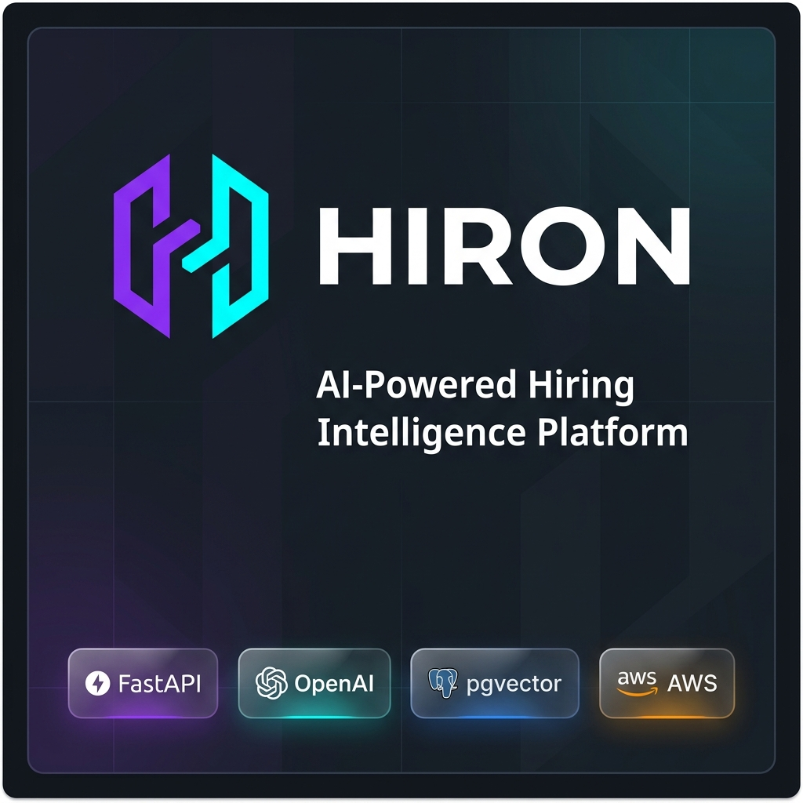
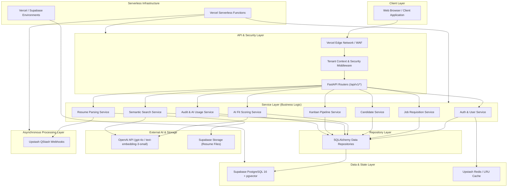

# Hiron — AI-Powered Hiring Intelligence Platform

[](https://github.com/anurag-jaiswal-aj/hiron/actions)
[](LICENSE)
[](https://www.python.org/)
[](https://www.typescriptlang.org/)

Hiron is a production-grade AI-powered Hiring Intelligence Platform that helps recruiters evaluate candidates using NLP, semantic vector search, explainable AI fit scoring, and automated pipeline workflows.

---

## 🖼️ Repository Preview



_The official preview representing the Hiron AI-Powered Hiring Intelligence Platform built with FastAPI, OpenAI, pgvector, and Vercel/Supabase._

---

## ✨ Key Features

- **Multi-Tenant Architecture**: Context-scoped isolation (`TenantIsolationMiddleware`) and database Row Level Security (RLS) policies across entities.
- **Resume Parsing**: Multi-format document upload (PDF/DOCX), spaCy NLP entity extraction, and automated candidate profile enrichment.
- **AI Candidate Scoring**: Multi-dimensional candidate fit scoring engine (`gpt-4o-2024-08-06`) generating scores (0–100), explanations, and recommendation bands.
- **Semantic Search**: High-performance 1536-dimensional vector similarity search backed by `pgvector` (`text-embedding-3-small`) and hybrid filtering.
- **Recruitment Pipeline**: Interactive Kanban board view, candidate stage movement transitions, and stage history auditing (`CandidateStageHistory`).
- **Dashboard & Analytics**: Recruitment overview counters, funnel stage conversion stats, score distribution metrics, and real-time activity feeds.
- **Audit Logging**: Immutable `AuditLog` records tracking user actions, target entity types, IP addresses, and state changes.
- **AI Usage Monitoring**: `AIUsageLog` tracking LLM prompt/completion token consumption, operation breakdown, and USD cost accounting.
- **Production Infrastructure**: Vercel Serverless, Supabase PostgreSQL/Storage, Upstash QStash, and automated GitHub Actions CI/CD workflows (AWS infrastructure decommissioned).

---

## 🏗️ High-Level Architecture



---

## 🚀 Latest Release

- **Version**: [v1.0.0](docs/releases/v1.0.0.md)
- **Release Date**: July 31, 2026
- **Stability**: Initial Stable Release

Hiron v1.0.0 delivers a production-ready AI hiring intelligence platform featuring multi-tenant data isolation, spaCy NLP resume parsing, 3-dimensional AI candidate fit scoring, pgvector semantic search, Kanban pipelines, audit logging, and Vercel/Supabase/Upstash serverless infrastructure.

For detailed release information, view the [v1.0.0 Release Notes](docs/releases/v1.0.0.md) or the [CHANGELOG.md](CHANGELOG.md).

---

## 📚 Governing Architecture & Specifications

All architectural and engineering decisions in this repository are strictly governed by specification documents in [`docs/`](./docs/):

1. **Engineering Guidelines**: Coding standards, Python/TypeScript style guides, security rules, and AI standards ([`docs/ENGINEERING_GUIDELINES.md`](./docs/ENGINEERING_GUIDELINES.md))
2. **Database Design**: Production PostgreSQL + `pgvector` multi-tenant database design ([`docs/DATABASE_DESIGN.md`](./docs/DATABASE_DESIGN.md))
3. **API Contract**: REST API endpoints, schemas, status codes, and security contracts ([`docs/API_CONTRACT.md`](./docs/API_CONTRACT.md))
4. **UI/UX Design Specification**: Design tokens, component hierarchy, accessibility, and 17 screen wireframes ([`docs/UI_UX_DESIGN.md`](./docs/UI_UX_DESIGN.md))
5. **Implementation Roadmap**: 20-phase execution plan and sprint schedule ([`docs/IMPLEMENTATION_ROADMAP.md`](./docs/IMPLEMENTATION_ROADMAP.md))
6. **Operations Runbook**: Production deployment, zero-downtime database migrations, and incident response ([`docs/RUNBOOK.md`](./docs/RUNBOOK.md))
7. **Maintenance & LTS Manual**: Routine database vacuuming, LRU cache flushing, and AI prompt tuning ([`docs/MAINTENANCE_AND_LTS.md`](./docs/MAINTENANCE_AND_LTS.md))
8. **Versioned Release Notes**: Release notes for tag v1.0.0 ([`docs/releases/v1.0.0.md`](./docs/releases/v1.0.0.md))
9. **Changelog History**: Chronological release history ([`CHANGELOG.md`](./CHANGELOG.md))

---

## 🏗️ Repository Monorepo Structure

```
hiron/
├── apps/
│   ├── api/                    # FastAPI Core API backend application
│   └── web/                    # Next.js 15 App Router frontend
├── packages/
│   ├── shared-types/           # Shared TypeScript interfaces & API contracts
│   ├── ui/                     # Shared UI component primitives (shadcn/ui base)
│   ├── config/                 # Shared linting & configuration templates
│   └── utils/                  # Shared helper functions & formatters
├── services/
│   └── ai/                     # Standalone FastAPI AI Microservice (spaCy/OpenAI)
├── workers/
│   └── celery/                 # Celery background workers for async processing
├── infra/
│   └── docker/                 # Container Dockerfiles & docker-compose manifests
├── docs/                       # Frozen Architecture & Design Documents
├── scripts/                    # Development automation & database scripts
└── .github/
    └── workflows/              # GitHub Actions CI/CD automation pipelines
```

---

## 🔑 Environment Configuration

Hiron manages configuration using environment files and Pydantic BaseSettings:

- **Local Development (`.env.local`)**: Initialized via `make setup` for local Docker Compose development.
- **Production Template (`.env.production.example`)**: Template for production settings including database URLs, Redis URLs, OpenAI API keys, and JWT RSA keypair paths.
- **Secret Management**: Production secrets, database credentials, and RSA private keys should be stored in Vercel Environment Variables.

---

## ⚙️ Prerequisites

- **Python**: 3.12+ (managed with `uv` or `pip`)
- **Node.js**: 20.x LTS+
- **pnpm**: 9.x+
- **Docker & Docker Compose**: 24+

---

## 🚀 Getting Started

1. **Clone the repository**:

   ```bash
   git clone https://github.com/anurag-jaiswal-aj/hiron.git
   cd hiron
   ```

2. **Initialize local environment file (`.env.local`)**:

   > ⚠️ **IMPORTANT**: You MUST run `make setup` before running `docker compose up` because `.env.local` is required by the container environment.

   ```bash
   make setup
   ```

3. **Start local development containers**:

   ```bash
   make dev
   ```

4. **Development Command Reference**:
   - Run test suite:
     ```bash
     uv run pytest
     ```
   - Run type checks across monorepo:
     ```bash
     make type-check
     ```
   - Run linters:
     ```bash
     make lint
     ```
   - Code formatting:
     ```bash
     make format
     ```

---

## 🤝 Contributing

We welcome contributions to Hiron! Please follow these guidelines:

1. **Branch Strategy**: Create feature branches from `main` (e.g. `feat/feature-name` or `fix/bug-fix`).
2. **Quality Verification**: Ensure all checks pass before submitting a Pull Request:
   - Run PyTest: `uv run pytest`
   - Run Ruff linter & formatter: `uv run ruff check . && uv run ruff format --check .`
   - Run MyPy strict type checker: `uv run mypy apps/api`
   - Run Prettier check: `npx prettier --check "**/*.{json,yaml,yml,md}"`
3. **Pull Requests**: Submit PRs against `main` with a concise summary of changes and reference any related issues.

---

## 📄 License

Distributed under the Apache 2.0 License. See [`LICENSE`](./LICENSE) for details.
