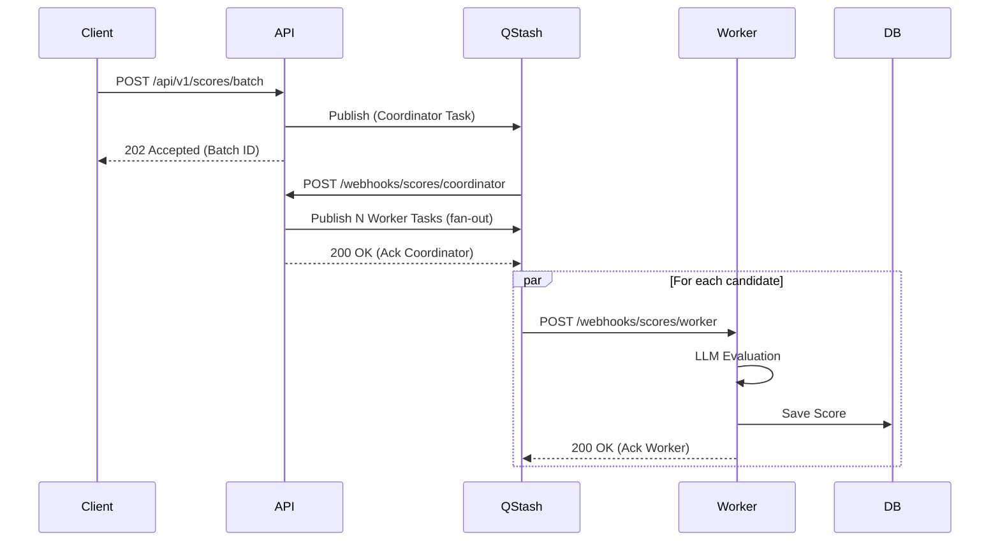

# Hiron

Hiron is a production-grade, AI-powered Hiring Intelligence Platform built to automate and enhance modern recruitment workflows at scale.

By combining traditional Applicant Tracking System (ATS) features with cutting-edge natural language processing (NLP) and explainable AI, Hiron enables recruitment teams to move beyond basic keyword matching. It automatically parses resumes, semantically searches candidate pools using 1536-dimensional embeddings, and generates multi-dimensional fit scores using state-of-the-art LLMs.

Built for modern serverless infrastructure, Hiron utilizes a unique architecture that completely bypasses legacy background workers (like Celery) in favor of asynchronous HTTP webhooks via Upstash QStash. It enforces defense-in-depth security, utilizing both FastAPI application-level middleware and strict PostgreSQL Row Level Security (RLS) to guarantee complete data isolation across organizations.

## Badges

[](https://github.com/anurag-jaiswal-aj/hiron/actions)
[](LICENSE)
[](https://www.python.org/)
[](https://www.typescriptlang.org/)

## Table of Contents

- [Overview](#overview)
- [Core Features](#core-features)
- [System Architecture](#system-architecture)
- [Request & Data Flows](#request--data-flows)
- [AI Architecture](#ai-architecture)
- [Multi-Tenant Security](#multi-tenant-security)
- [Serverless Task Architecture](#serverless-task-architecture)
- [Data Architecture](#data-architecture)
- [Observability](#observability)
- [Performance & Reliability](#performance--reliability)
- [Testing & Quality](#testing--quality)
- [Tech Stack](#tech-stack)
- [Project Structure](#project-structure)
- [Local Development](#local-development)
- [Production Architecture](#production-architecture)
- [Environment Variables](#environment-variables)
- [API](#api)
- [Documentation](#documentation)
- [Security](#security)
- [Contributing](#contributing)
- [License](#license)
- [Project Status](#project-status)

## Overview

Hiron empowers HR and recruiting teams to handle high volumes of applicants without sacrificing qualitative evaluation. The platform’s core workflow is designed for maximum efficiency:

**Recruiter**
→ Creates organizational jobs and configures scoring parameters
→ Uploads candidate resumes (PDF/DOCX)
→ *Hiron automatically parses text via spaCy and generates AI embeddings*
→ Semantically searches the candidate pool for nuanced job fits
→ Triggers AI-assisted batch scoring for top candidates
→ Reviews explainable AI fit scores and recommendation bands
→ Moves candidates through a customizable Kanban hiring pipeline
→ Records structured notes, tags, and interview feedback
→ Audits recruiter activity via immutable system logs

## Core Features

### Recruitment & ATS
- **Job Requisition Management:** Define jobs, departments, and custom hiring pipelines.
- **Candidate Tracking:** End-to-end candidate lifecycle management with an interactive Kanban pipeline.
- **Resume Management:** Secure upload and storage for PDF and DOCX files.
- **Notes & Tags:** Collaborative structured feedback tied directly to candidate profiles.

### AI & Recruitment Intelligence
- **Intelligent Parsing:** Multi-format document parsing combined with spaCy NLP entity extraction.
- **Semantic Vector Search:** 1536-dimensional candidate-to-job matching backed by `pgvector`.
- **Explainable AI Scoring:** Multi-dimensional fit scoring engine generating scores (0–100) and actionable reasoning.
- **AI Usage Tracking:** Granular logging of LLM prompt/completion tokens and API costs per tenant.

### Administration & Collaboration
- **Multi-Tenancy:** Secure tenant environments with strict data isolation.
- **Access Control:** Role-based access and organizational invitations.
- **Audit Logging:** Immutable tracking of user actions, state changes, and IP addresses.

## System Architecture

Hiron is architected for a modern Vercel-based serverless deployment, decoupling the client, API, and heavy machine learning workloads.

```mermaid
graph TD
    subgraph Client["Frontend"]
        NextJS["Next.js 14 App Router"]
    end

    subgraph API["Core API (Vercel Serverless)"]
        FastAPI["FastAPI Core App"]
        Middleware["Tenant Context & Security"]
        Routers["REST Endpoints (/api/v1)"]
    end

    subgraph Worker["ML Worker (Vercel Serverless)"]
        WorkerApp["FastAPI Worker App"]
        NLP["spaCy NLP Extraction"]
        QStashWebhooks["QStash Webhook Handlers"]
    end

    subgraph Data["State & Storage"]
        Supabase["Supabase PostgreSQL 16 + pgvector"]
        S3["Supabase Storage"]
        UpstashRedis["Upstash Redis (LRU Cache)"]
    end

    subgraph Async["Asynchronous Broker"]
        QStash["Upstash QStash (Serverless Message Queue)"]
    end

    subgraph External["External Services"]
        Gemini["Google GenAI (LLMs & Embeddings)"]
    end

    %% Flow
    NextJS -->|REST (JWT)| API
    API --> Middleware
    Middleware --> Routers

    Routers <--> Supabase
    Routers <--> UpstashRedis
    Routers -->|Publish Task| QStash

    QStash -->|HTTP POST (Signed)| Worker
    Worker --> Supabase
    Worker --> S3
    Worker <--> Gemini
```

### Components
1. **Next.js Frontend:** A highly interactive, responsive UI powered by React, Tailwind CSS, and shadcn/ui.
2. **FastAPI Core API:** Handles authentication, CRUD operations, database transactions, and coordinates asynchronous task fan-out.
3. **FastAPI ML Worker:** A dedicated serverless application for heavy synchronous workloads (spaCy parsing) and AI interactions.
4. **Supabase & Upstash:** Fully managed PostgreSQL, blob storage, Redis caching, and serverless messaging (QStash).

## Request & Data Flows

### Serverless Task Fan-out (QStash)
Hiron uses a coordinator-worker fan-out pattern for batch AI scoring.



## AI Architecture

Hiron delegates cognitive reasoning and semantic understanding to state-of-the-art models via Google GenAI (Gemini) while maintaining strict architectural boundaries.

- **Embeddings:** Generates `text-embedding-3-small` equivalent 1536-dimensional vectors for both job descriptions and parsed candidate resumes.
- **Vector Storage:** Embeddings are persisted in PostgreSQL using the `pgvector` extension, indexed using Hierarchical Navigable Small World (HNSW) graphs for sub-millisecond retrieval.
- **Explainable Scoring:** The batch scoring pipeline feeds parsed resumes and job contexts into a large language model to generate structured JSON output. The model is constrained to return a numerical fit score, recommendation band, and human-readable reasoning.
- **Resume Parsing:** Uses standard PDF/DOCX text extraction routed through `spaCy` NLP pipelines in the serverless worker to identify structured entities.
- **Usage & Cost Tracking:** Every AI invocation is intercepted to log token counts and compute USD cost, tying expenditure directly to the invoking tenant.

## Multi-Tenant Security

Hiron operates a defense-in-depth strategy to guarantee complete data isolation across organizations:

1. **Authentication:** Secure, short-lived JWT access tokens and HTTP-only refresh tokens.
2. **Application Middleware:** `TenantIsolationMiddleware` extracts the organizational context from the JWT and injects it securely into the request state.
3. **Database Context Hooks:** SQLAlchemy event listeners intercept database connections to execute `SET LOCAL app.current_tenant_id = '...'` before any queries run.
4. **PostgreSQL Row Level Security (RLS):** Every tenant-scoped table is protected by `FORCE ROW LEVEL SECURITY`. Queries attempting to read or write data outside the active `app.current_tenant_id` context fail at the database kernel level.
5. **Application-Level Filtering:** Repositories explicitly filter by `tenant_id`, acting as an additional safety net above RLS.
6. **Webhook Security:** All asynchronous QStash endpoints require cryptographic validation of the `Upstash-Signature` header to prevent spoofing.

## Serverless Task Architecture

Hiron replaces traditional, always-on polling workers (like Celery) with **Upstash QStash**, a serverless HTTP-based message broker.

- **Task Publication:** The API publishes JSON payloads to QStash REST endpoints.
- **Webhook Delivery:** QStash delivers tasks via HTTP POST to our public Vercel worker endpoints.
- **Retry Semantics:** Failures are managed entirely via HTTP status codes. `200 OK` acknowledges and drops the message. `429`, `500`, `503` trigger exponential backoff retries. Fatal application errors (e.g., malformed payloads) are gracefully caught and return `200 OK` to prevent infinite loops.
- **Idempotency:** Unique deduplication IDs prevent double-processing of tasks during retries.
- **Batch Fan-out:** A single coordinator webhook dynamically spawns hundreds of independent worker tasks for massive parallel candidate scoring.

## Data Architecture

- **Primary Datastore:** PostgreSQL 16 (via Supabase).
- **Schema Management:** Alembic migrations with strict transactional boundaries.
- **Vector Storage:** `pgvector` columns (`vector(1536)`) heavily utilized for semantic similarity matching.
- **Entity Relationships:** Strict foreign-key constraints enforcing referential integrity (e.g., cascading deletes from Tenant -> Jobs -> Candidates).
- **Caching:** Upstash Redis handles high-throughput transient state, rate-limiting counters, and session revocation checks.

## Observability

Hiron implements production-grade telemetry for constant operational awareness:

### Sentry
- Traces API requests, async webhook executions, and frontend errors.
- Automatically strips Personally Identifiable Information (PII) before transmission.
- Correlates frontend UI exceptions with backend trace IDs.

### OpenTelemetry
- Emits custom counter and histogram metrics for API requests (`hiron.api.requests`, `hiron.api.request.duration`).
- Tracks external AI attempts and failures via dedicated telemetry (`hiron.ai.requests`, `hiron.ai.errors`).

### Health & Readiness
- `/api/v1/health`: Lightweight liveness probe.
- `/api/v1/health/ready`: Deep readiness probe verifying database connectivity, Redis ping, and AI provider availability.

## Performance & Reliability

- **Database Optimization:** Strategic B-Tree indexes on foreign keys, `created_at` timestamps, and tenant identifiers. HNSW indexes on vector columns for O(log N) semantic searches.
- **Pagination:** Cursor-based pagination implemented on high-volume endpoints (e.g., Audit Logs) to guarantee constant-time queries regardless of offset depth.
- **Frontend Optimization:** Next.js Server Components and dynamic imports reduce client-side bundle size. Optimistic UI updates ensure immediate perceived responsiveness.
- **Graceful Degradation:** AI provider failures gracefully fall back without taking down core ATS functionalities.

## Testing & Quality

Hiron maintains a rigorous quality assurance pipeline enforced via GitHub Actions:

- **Unit & Integration:** 586+ automated Pytest tests validating business logic, database transactions, and tenant isolation policies.
- **E2E Testing:** Playwright suites verifying critical path recruitment workflows on the Next.js frontend.
- **Type Checking:** Strict `mypy` configuration on the backend and comprehensive `tsc` checking on the frontend.
- **Linting:** Enforced via Ruff (Python) and ESLint (TypeScript).

## Tech Stack

| Layer | Technology | Purpose |
|---|---|---|
| **Frontend** | Next.js 14, React 18, Tailwind CSS | UI application, server-side rendering, and styling |
| **Backend API** | FastAPI, Python 3.12, Pydantic | High-performance async REST API and validation |
| **Database** | PostgreSQL 16, SQLAlchemy 2.0 | Relational state and ORM |
| **Cache & Queue** | Upstash Redis, Upstash QStash | LRU caching, rate limiting, and serverless webhooks |
| **AI / NLP** | Google GenAI, spaCy | Embeddings, scoring LLMs, and entity extraction |
| **Vector Search** | pgvector | 1536-dimensional semantic similarity matching |
| **Observability** | Sentry, OpenTelemetry | Exception tracking, tracing, and metrics |
| **CI/CD** | GitHub Actions | Automated linting, testing, and deployments |
| **Hosting** | Vercel, Supabase | Serverless edge execution and managed database |

## Project Structure

```text
hiron/
├── apps/
│   ├── api/                    # Core FastAPI Backend
│   ├── web/                    # Next.js 14 Frontend Application
│   └── worker/                 # FastAPI ML Worker (spaCy / QStash)
├── packages/                   # Monorepo Shared Libraries
│   ├── shared-types/           # TypeScript API interfaces
│   ├── ui/                     # shadcn/ui React components
│   ├── config/                 # Shared ESLint/Prettier configs
│   └── utils/                  # Common TypeScript helpers
├── infra/                      # Local Docker Compose infrastructure
├── docs/                       # Canonical Engineering Documentation
├── scripts/                    # Database seeding and automation
└── .github/workflows/          # CI/CD Pipelines
```

---

## Local Development

### Prerequisites
- Python 3.12+ (managed via `uv`)
- Node.js 20.x+
- `pnpm` 9.x+
- Docker & Docker Compose
- `cloudflared` (for local QStash webhook tunneling)

### 1. Installation

```bash
git clone https://github.com/anurag-jaiswal-aj/hiron.git
cd hiron

# Generate local .env.local
make setup

# Install all workspace dependencies
uv sync --all-extras
pnpm install

# Generate local RSA JWT keys
mkdir -p keys
openssl genpkey -algorithm RSA -out keys/jwt_private.pem -pkeyopt rsa_keygen_bits:4096
openssl rsa -in keys/jwt_private.pem -pubout -out keys/jwt_public.pem
```

### 2. Database Setup

```bash
# Start Postgres and Redis containers
docker compose up -d

# Initialize database, extensions, and run Alembic migrations
make db-init
make db-upgrade

# Seed initial Tenant and Admin user
uv run python scripts/seed.py
```

### 3. Start Development Servers

Run these in separate terminal windows:

```bash
# Start Core API (http://localhost:8000)
export PYTHONPATH=apps/api:$PYTHONPATH
uv run uvicorn hiron.main:app --reload --port 8000

# Start ML Worker (http://localhost:8001)
export PYTHONPATH=apps/worker:$PYTHONPATH
uv run uvicorn src.main:app --reload --port 8001

# Start Next.js Frontend (http://localhost:3000)
pnpm --filter @hiron/web dev
```

### 4. QStash Local Webhooks

To test serverless webhooks locally, expose your local API via Cloudflare tunnels:

```bash
cloudflared tunnel --url http://localhost:8000
# Copy the generated URL (e.g., https://<random>.trycloudflare.com)
```

Update your `.env.local` with the new URL and your Upstash keys:
```env
BACKGROUND_TASK_ENGINE=qstash
QSTASH_WEBHOOK_URL=https://<random>.trycloudflare.com
QSTASH_TOKEN="<your-qstash-token>"
QSTASH_CURRENT_SIGNING_KEY="<your-current-signing-key>"
QSTASH_NEXT_SIGNING_KEY="<your-next-signing-key>"
```

### Verification
Run the backend test suite to verify your environment:
```bash
uv run pytest
```

---

## Production Architecture

Hiron operates a 100% serverless production infrastructure:

- **Vercel:** Hosts the Next.js frontend, Core API backend, and ML Worker as independently scaling Serverless Functions.
- **Supabase:** Hosts the highly-available PostgreSQL 16 database, handling automatic backups, point-in-time recovery, and `pgvector` indexing. Supabase Storage handles secure candidate resume assets.
- **Upstash:** Provides Serverless Redis for distributed caching/rate-limiting, and QStash for managing the asynchronous task queue with guaranteed delivery and retry logic.
- **Sentry & Grafana:** Provides real-time application monitoring, unhandled exception alerting, and operational dashboards.

## Environment Variables

| Variable | Required | Used By | Purpose |
| -------- | -------- | ------- | ------- |
| `DATABASE_URL` | Yes (All) | API / Worker | PostgreSQL connection string |
| `REDIS_URL` | Yes (All) | API | Upstash Redis connection string |
| `JWT_PRIVATE_KEY_PATH` | Yes (All) | API | Path to RSA private key for JWT signing |
| `JWT_PUBLIC_KEY_PATH` | Yes (All) | API | Path to RSA public key for JWT validation |
| `QSTASH_TOKEN` | Yes (All) | API | Token to publish tasks to QStash |
| `QSTASH_CURRENT_SIGNING_KEY` | Yes (All) | API / Worker | Validates inbound QStash webhook signatures |
| `GEMINI_API_KEY` | Yes (All) | API / Worker | Authenticates with Google GenAI API |
| `SENTRY_DSN` | Optional | Web / API / Worker | DSN for Sentry telemetry routing |

*Values for these variables must be securely injected via Vercel Environment Variables. Never commit secrets to the repository.*

## API

The backend exposes a highly structured REST API mapped to standard HTTP verbs. Complete documentation, schema definitions, and internal Serverless Webhook payload contracts can be found in the canonical [API Contract](docs/API_CONTRACT.md).

Interactive OpenAPI documentation is available during local development at `http://localhost:8000/docs`.

## Documentation

Comprehensive engineering specifications govern the Hiron architecture.

**Canonical Documentation:**
- [API Contract](docs/API_CONTRACT.md)
- [Database Design](docs/DATABASE_DESIGN.md)
- [Engineering Guidelines](docs/ENGINEERING_GUIDELINES.md)
- [Local Setup Guide](LOCAL_SETUP.md)
- [Operations Runbook](docs/RUNBOOK.md)
- [Maintenance & LTS](docs/MAINTENANCE_AND_LTS.md)
- [UI/UX Design Spec](docs/UI_UX_DESIGN.md)
- [QStash Architecture](docs/architecture/qstash/)

## Security

Hiron employs rigorous security protocols to protect PII and tenant data:
- Complete cryptographic separation of JWT signing (RSA 4096-bit).
- PostgreSQL Row Level Security (RLS) guaranteeing tenant isolation at the database kernel level.
- Argon2id password hashing parameters calibrated to OWASP recommendations.
- Cryptographic validation of all serverless webhook traffic (`Upstash-Signature`).
- Comprehensive parameter validation and injection prevention via SQLAlchemy 2.0.

## Contributing

We welcome contributions to Hiron:

1. **Branch Strategy:** Create feature branches from `main` (e.g. `feat/feature-name` or `fix/bug-fix`).
2. **Quality Verification:** Ensure all checks pass before submitting a Pull Request:
   - Run PyTest: `uv run pytest`
   - Run Ruff linter & formatter: `uv run ruff check . && uv run ruff format --check .`
   - Run MyPy strict type checker: `uv run mypy apps/api`
   - Run Prettier check: `pnpm run format`
3. **Pull Requests:** Submit PRs against `main` with a concise summary of changes and reference any related issues.

## License

Distributed under the Apache 2.0 License. See [`LICENSE`](./LICENSE) for details.

## Project Status

**Initial Stable Release (v1.0.0)**

Hiron is currently in active development but stable for production deployments leveraging Vercel and Supabase. The core ATS workflows, serverless QStash asynchronous tasks, and AI parsing/scoring pipelines are fully implemented and verified by automated end-to-end tests.

## Final Project Snapshot

- **Full-stack Applicant Tracking System** (Next.js + FastAPI + Postgres)
- **Multi-tenant architecture** (Strict RLS data isolation)
- **AI-assisted recruitment intelligence** (Google GenAI / spaCy)
- **Semantic vector search** (1536-dim pgvector HNSW indexing)
- **Serverless asynchronous processing** (Upstash QStash webhooks)
- **Production observability** (Sentry + OpenTelemetry)
- **Automated testing and CI/CD** (586+ verified test cases)
