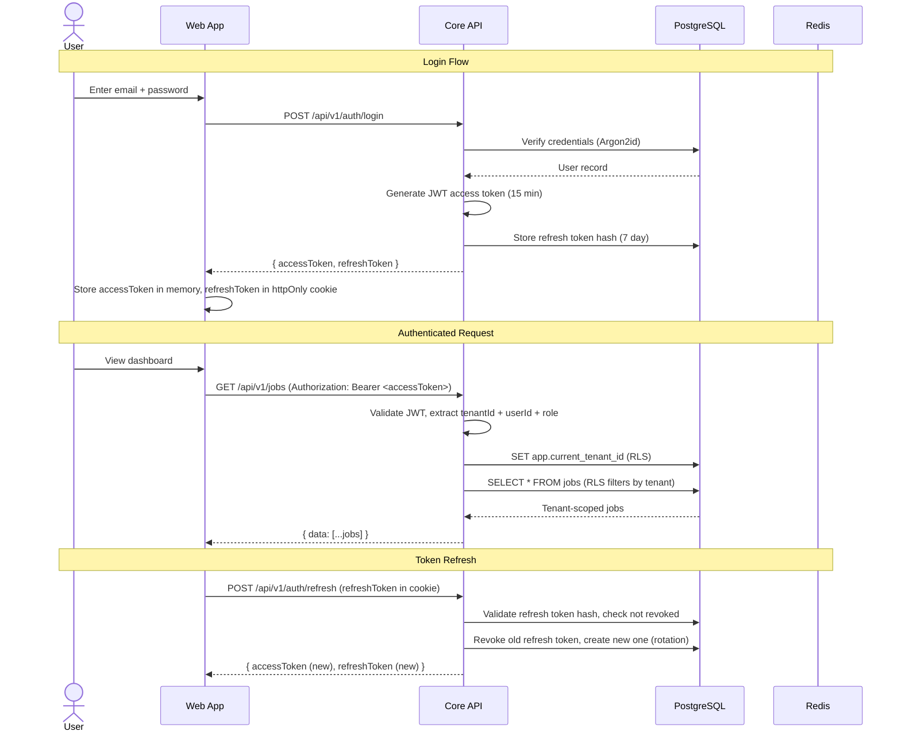
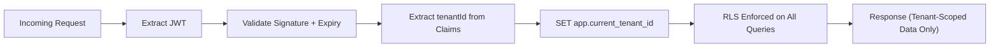
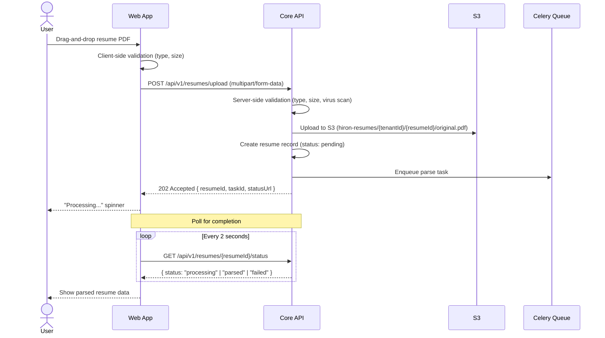
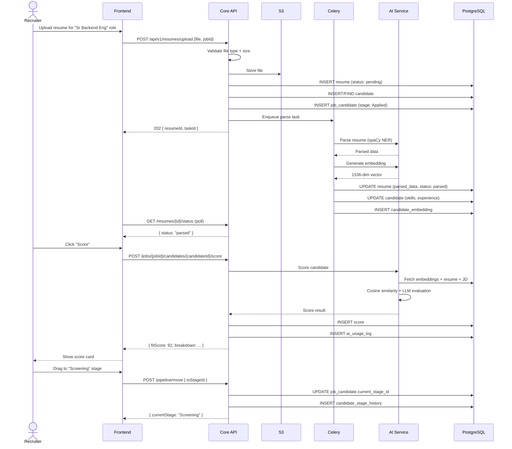

# Hiron API Contract

> **Document Type**: REST API Specification  
> **Version**: 1.0  
> **Date**: July 28, 2026  
> **Status**: Draft — Awaiting Founder Review  
> **Base URL**: `https://api.hiron.ai/api/v1`  
> **Governing Documents**: Frozen Architecture Document, Frozen Engineering Guidelines, Frozen Database Design

---

## 1. API Overview

The Hiron API is a RESTful JSON API that serves as the backend for the Hiron web application and future third-party integrations. It is the single point of entry for all data operations.

### Architecture Mapping

| Component | API Responsibility |
|---|---|
| **Core API** (FastAPI) | All CRUD, pipeline, search, and user management endpoints |
| **AI Service** (FastAPI, internal) | Resume parsing, embedding generation, scoring — called by Core API, never directly by clients |
| **Celery Workers** | Async task execution — triggered by Core API, status polled by clients |

### API Surface

| Domain | Endpoints | Auth Required | Description |
|---|---|---|---|
| Authentication | 4 | Partial | Login, logout, token refresh, current user |
| Tenants | 3 | Yes | Tenant profile and settings |
| Users | 6 | Yes | Team management, invitations, roles |
| Jobs | 7 | Yes | Job CRUD, archive, search |
| Candidates | 7 | Yes | Candidate CRUD, upload, search |
| Resumes | 4 | Yes | Upload, parsing status, retry |
| AI Scoring | 5 | Yes | Score, re-score, history, explanation |
| Embeddings | 3 | Yes | Generate, regenerate, status |
| Pipeline | 4 | Yes | Move candidate, stage history, shortlist, reject |
| Notes | 4 | Yes | Candidate note CRUD |
| Tags | 3 | Yes | Candidate tag CRUD |
| Saved Searches | 4 | Yes | CRUD for saved searches (Phase 2) |
| Audit Logs | 2 | Yes | Query audit trail |
| AI Usage | 2 | Yes | Cost and usage analytics |
| Health & Metrics | 2 | No | Health check, readiness probe |

**Total: 60 endpoints**

---

## 2. API Design Principles

| # | Principle | Implementation |
|---|---|---|
| 1 | **Resources, not actions** | URLs are nouns (`/jobs`), HTTP methods are verbs (`POST`, `PATCH`). No `/createJob` or `/getCandidate`. |
| 2 | **Consistent envelope** | Every response wraps data in `{ "data": ... }` or `{ "error": ... }`. No bare arrays or objects. |
| 3 | **camelCase JSON** | All request/response JSON keys use camelCase. Internal Python uses snake_case with Pydantic alias generation. |
| 4 | **Cursor-based pagination** | All list endpoints use opaque cursor tokens, never offset/page numbers. |
| 5 | **Explicit over implicit** | No magic query parameters, no hidden defaults. Every behavior is documented. |
| 6 | **Tenant isolation by default** | Every authenticated request is scoped to a tenant. You cannot access another tenant's data. |
| 7 | **Async for slow operations** | Operations > 5 seconds return `202 Accepted` with a task ID for polling. |
| 8 | **Idempotency for mutations** | All POST/PUT operations accept an `Idempotency-Key` header to prevent duplicate processing. |
| 9 | **Fail with useful errors** | Errors include a machine-readable code, human-readable message, and field-level details. |
| 10 | **Log everything, expose nothing** | Internal state (tenant_id, SQL queries) is logged server-side but never exposed in API responses. |

---

## 3. Versioning Strategy

### URL Path Versioning

```
/api/v1/jobs
/api/v2/jobs    (future)
```

**Rule**: Only the **major** version appears in the URL. Minor and patch changes are backward-compatible and do not change the URL.

| Change Type | Version Impact | Example |
|---|---|---|
| Add optional field to response | No version change | Adding `department` to job response |
| Add optional query parameter | No version change | Adding `?department=engineering` filter |
| Remove a field from response | **Major version bump** | Removing `legacyScore` from score response |
| Change field type | **Major version bump** | Changing `score` from `int` to `float` |
| Change URL structure | **Major version bump** | Moving `/candidates/{id}/scores` to `/scores?candidateId={id}` |

### Deprecation Policy

1. Announce deprecation 6 months before removal
2. Return `Deprecation` header on deprecated endpoints
3. Old and new versions run in parallel during transition
4. Provide migration guide in API documentation

---

## 4. Authentication & Authorization

### Authentication Flow



### JWT Access Token Claims

```json
{
    "sub": "550e8400-e29b-41d4-a716-446655440000",
    "tenantId": "660e8400-e29b-41d4-a716-446655440000",
    "email": "jane@acme.com",
    "role": "recruiter",
    "iat": 1722160800,
    "exp": 1722161700
}
```

### Authorization Matrix

| Role | Jobs | Candidates | Pipeline | Scoring | Users | Tenant Settings | Audit Logs |
|---|---|---|---|---|---|---|---|
| **org_admin** | CRUD | CRUD | Full | Full | CRUD | CRUD | Read |
| **recruiter** | CRUD | CRUD | Full | Full | Read (self) | Read | Read (own) |
| **hiring_manager** | Read | Read (shortlisted) | Read + Feedback | Read | Read (self) | — | — |

---

## 5. Multi-Tenant Request Flow

Every authenticated request follows this flow:



**Rules**:
- The `tenantId` is NEVER accepted from the request body or query parameters — it always comes from the JWT
- No endpoint allows cross-tenant queries except super admin endpoints (not in public API)
- If an entity's `tenant_id` doesn't match the JWT's `tenantId`, the API returns `404 Not Found` (not `403`) to avoid leaking the existence of resources in other tenants

---

## 6. Standard Request Headers

| Header | Required | Description | Example |
|---|---|---|---|
| `Authorization` | Yes (except public) | Bearer JWT access token | `Bearer eyJhbGciOi...` |
| `Content-Type` | Yes (for bodies) | Request body MIME type | `application/json` |
| `Accept` | Optional | Desired response format | `application/json` |
| `Idempotency-Key` | Recommended (POST/PUT) | UUID to prevent duplicate processing | `550e8400-e29b-...` |
| `X-Request-ID` | Optional | Client-generated trace ID for debugging | `req-abc123` |

---

## 7. Standard Response Format

### Success Response (Single Resource)

```json
{
    "data": {
        "id": "550e8400-e29b-41d4-a716-446655440000",
        "title": "Senior Backend Engineer",
        "status": "open",
        "createdAt": "2026-07-28T12:00:00Z"
    }
}
```

### Success Response (List)

```json
{
    "data": [
        { "id": "...", "title": "Senior Backend Engineer" },
        { "id": "...", "title": "Product Manager" }
    ],
    "pagination": {
        "hasMore": true,
        "nextCursor": "eyJpZCI6IjU1MGU4NDAw...",
        "totalCount": 47
    }
}
```

### Success Response (Async Operation)

```json
{
    "data": {
        "taskId": "task-550e8400-e29b-41d4-a716-446655440000",
        "status": "processing",
        "estimatedCompletionSeconds": 30,
        "statusUrl": "/api/v1/tasks/task-550e8400-e29b-41d4-a716-446655440000"
    }
}
```

### Empty Success (204 No Content)

No response body. Used for DELETE operations.

---

## 8. Error Response Format

```json
{
    "error": {
        "code": "VALIDATION_ERROR",
        "message": "Request validation failed",
        "details": [
            {
                "field": "experienceYearsMin",
                "message": "Value must be between 0 and 50",
                "value": -1
            },
            {
                "field": "title",
                "message": "This field is required",
                "value": null
            }
        ],
        "requestId": "req-abc123"
    }
}
```

### Error Code Catalog

| Code | HTTP Status | Description | When Used |
|---|---|---|---|
| `VALIDATION_ERROR` | 422 | Request body/params failed validation | Missing required fields, type mismatches, range violations |
| `AUTHENTICATION_REQUIRED` | 401 | No valid access token provided | Missing/expired/malformed JWT |
| `INSUFFICIENT_PERMISSIONS` | 403 | User lacks required role | Hiring manager trying to create a job |
| `RESOURCE_NOT_FOUND` | 404 | Entity does not exist (or is in another tenant) | Invalid UUID, archived entity, wrong tenant |
| `RESOURCE_CONFLICT` | 409 | Duplicate resource | Creating a user with an existing email |
| `RATE_LIMIT_EXCEEDED` | 429 | Too many requests | Exceeding per-minute/per-hour limits |
| `RESUME_PARSE_FAILED` | 422 | Resume file could not be parsed | Corrupted PDF, unsupported format, encrypted file |
| `AI_SERVICE_UNAVAILABLE` | 503 | AI service is down or overloaded | OpenAI API outage, model timeout |
| `AI_SCORING_FAILED` | 500 | AI scoring produced invalid output after retries | LLM output validation failure after max retries |
| `FILE_TOO_LARGE` | 413 | Uploaded file exceeds size limit | File > 10 MB |
| `UNSUPPORTED_FILE_TYPE` | 415 | Uploaded file type not accepted | File is not PDF, DOCX, or TXT |
| `TASK_NOT_FOUND` | 404 | Async task ID not found | Invalid task ID for status polling |
| `IDEMPOTENCY_CONFLICT` | 409 | Idempotency key already used with different payload | Same key, different body |
| `TENANT_INACTIVE` | 403 | Tenant account has been deactivated | Churned customer trying to access |
| `INTERNAL_ERROR` | 500 | Unexpected server error | Unhandled exception (details logged, not exposed) |

---

## 9. Pagination Strategy

### Cursor-Based Pagination

All list endpoints use opaque cursor-based pagination per Engineering Guidelines §7.3.

**Request**:
```
GET /api/v1/candidates?limit=20&cursor=eyJpZCI6IjU1MGU4NDAwLWUyOWItNDFkNC1hNzE2LTQ0NjY1NTQ0MDAwMCJ9
```

**Parameters**:
| Parameter | Type | Default | Max | Description |
|---|---|---|---|---|
| `limit` | integer | 20 | 100 | Number of items per page |
| `cursor` | string | null | — | Opaque cursor from previous response's `pagination.nextCursor` |

**Response**:
```json
{
    "data": [...],
    "pagination": {
        "hasMore": true,
        "nextCursor": "eyJpZCI6IjY2MGU4NDAw...",
        "totalCount": 1250
    }
}
```

**Implementation Details**:
- Cursor encodes the last item's sort key (base64-encoded JSON)
- Default sort is `created_at DESC` (newest first)
- `totalCount` is computed via a parallel `COUNT(*)` query — only returned on the first page request when `cursor` is null. Subsequent pages return `totalCount: null` to avoid the cost.
- Maximum `limit` is 100. Requests above 100 are silently capped.

---

## 10. Filtering Strategy

### Query Parameter Filters

List endpoints support filtering via query parameters:

```
GET /api/v1/candidates?skills=Python,PostgreSQL&location=San Francisco&experienceMin=5&experienceMax=10
```

**Filter Conventions**:

| Pattern | Description | Example |
|---|---|---|
| `field=value` | Exact match | `status=open` |
| `field=val1,val2` | Match any (OR) | `status=open,paused` |
| `fieldMin=N` | Greater than or equal | `experienceMin=5` |
| `fieldMax=N` | Less than or equal | `experienceMax=10` |
| `field=true/false` | Boolean filter | `isShortlisted=true` |
| `q=text` | Full-text search across default fields | `q=backend engineer` |

**Rules**:
- Unknown filter parameters are silently ignored (forward-compatible)
- Empty filter values are treated as "no filter" (same as omitting the parameter)
- Multiple filter parameters are combined with AND logic
- Array filters (comma-separated) use OR within the same field

---

## 11. Sorting Strategy

### Sort Query Parameter

```
GET /api/v1/candidates?sort=fitScore:desc,createdAt:asc
```

**Format**: `sort=field1:direction,field2:direction`

**Directions**: `asc`, `desc`

**Default Sort**: `createdAt:desc` (newest first) unless otherwise specified per endpoint.

**Sortable Fields per Endpoint** (documented in each endpoint spec below):
- Jobs: `title`, `status`, `createdAt`, `openedAt`
- Candidates: `fullName`, `createdAt`, `totalExperienceYears`
- Scores: `fitScore`, `confidence`, `createdAt`
- Pipeline: `stagePosition`, `createdAt`

**Rules**:
- Maximum 2 sort fields per request
- Unknown sort fields return `422 VALIDATION_ERROR`
- Sort direction defaults to `asc` if omitted

---

## 12. Search Strategy

Hiron supports two complementary search modes:

### Full-Text Search (Keyword)

```
GET /api/v1/candidates?q=Python+PostgreSQL
```

Uses PostgreSQL `tsvector` + GIN indexes. Matches keywords against `full_name`, `skills`, `current_title`, `current_company`.

### Semantic Search (Natural Language)

```
POST /api/v1/search/candidates
{
    "query": "Senior backend engineers with fintech experience who know Python",
    "filters": {
        "experienceMin": 5,
        "location": "San Francisco"
    },
    "limit": 20
}
```

Uses pgvector embeddings. The query is embedded via the AI service and compared against `candidate_embeddings` using cosine similarity.

### When to Use Which

| Query Type | Engine | Endpoint |
|---|---|---|
| "Jane Smith" | Full-text (`q=`) | `GET /api/v1/candidates?q=Jane+Smith` |
| "Python PostgreSQL Docker" | Full-text (`q=`) | `GET /api/v1/candidates?q=Python+PostgreSQL+Docker` |
| "Find me experienced backend engineers who have scaled distributed systems" | Semantic | `POST /api/v1/search/candidates` |

---

## 13. Rate Limiting

### Limits by Tier

| Plan | Requests/min | AI Scoring/hour | Bulk Upload/day | Semantic Search/min |
|---|---|---|---|---|
| **Starter** | 60 | 100 | 500 | 20 |
| **Professional** | 200 | 500 | 2,000 | 60 |
| **Enterprise** | 600 | 2,000 | 10,000 | 200 |

### Rate Limit Headers

Every response includes:

```
X-RateLimit-Limit: 60
X-RateLimit-Remaining: 45
X-RateLimit-Reset: 1722161700
```

### Rate Limit Exceeded Response

```
HTTP/1.1 429 Too Many Requests
Retry-After: 30

{
    "error": {
        "code": "RATE_LIMIT_EXCEEDED",
        "message": "Rate limit exceeded. Try again in 30 seconds.",
        "details": [
            {
                "field": "limit",
                "message": "60 requests per minute",
                "value": 61
            }
        ]
    }
}
```

---

## 14. Idempotency Rules

### Rule

All `POST` and `PUT` requests SHOULD include an `Idempotency-Key` header. The server stores the key → response mapping for 24 hours.

### Behavior

| Scenario | Response |
|---|---|
| First request with key | Process normally, cache response |
| Same key + same body | Return cached response (no re-processing) |
| Same key + different body | Return `409 IDEMPOTENCY_CONFLICT` |
| No idempotency key | Process normally (no replay protection) |

### Endpoints Requiring Idempotency

| Endpoint | Why |
|---|---|
| `POST /api/v1/candidates` | Prevent duplicate candidate creation |
| `POST /api/v1/resumes/upload` | Prevent duplicate file upload |
| `POST /api/v1/jobs/{jobId}/candidates/{candidateId}/score` | Prevent duplicate AI spending |
| `POST /api/v1/pipeline/move` | Prevent double stage transitions |

---

## 15. File Upload Strategy

### Upload Flow



### File Constraints

| Constraint | Value | Source |
|---|---|---|
| Max file size | 10 MB | Engineering Guidelines §15.2 |
| Allowed types | `application/pdf`, `application/vnd.openxmlformats-officedocument.wordprocessingml.document`, `text/plain` | Database Design §5.7 |
| Max bulk upload | 500 files per request | Architecture FR-1.4 |
| S3 key pattern | `{tenantId}/{resumeId}/original.{ext}` | Tenant-isolated storage |

### Multipart Request Format

```
POST /api/v1/resumes/upload
Content-Type: multipart/form-data; boundary=----FormBoundary

------FormBoundary
Content-Disposition: form-data; name="file"; filename="jane_smith_resume.pdf"
Content-Type: application/pdf

<binary file data>
------FormBoundary
Content-Disposition: form-data; name="candidateId"

550e8400-e29b-41d4-a716-446655440000
------FormBoundary--
```

---

## 16. Webhook Strategy

### Phase 2 Feature

Webhooks are not in MVP scope. When implemented, they will follow this design:

| Event | Payload | Trigger |
|---|---|---|
| `candidate.scored` | Score result with breakdown | AI scoring completes |
| `candidate.stage_changed` | Old stage → new stage | Pipeline transition |
| `resume.parsed` | Parsed data summary | Resume parsing completes |
| `job.closed` | Job summary | Job status changed to closed |

### Webhook Security (Phase 2)

- All payloads signed with HMAC-SHA256 using a per-tenant webhook secret
- Webhooks retry 3 times with exponential backoff on non-2xx responses
- Events delivered within 30 seconds of occurrence

---

## 17. API Security Standards

| Standard | Implementation | Source |
|---|---|---|
| **Transport** | TLS 1.3 only. No HTTP. HSTS header on all responses. | Architecture §14 |
| **Authentication** | JWT access tokens (15-min TTL) + refresh tokens (7-day TTL, httpOnly cookie) | Engineering Guidelines §16 |
| **Password hashing** | Argon2id | Engineering Guidelines §16 |
| **Input validation** | Pydantic v2 on all request bodies. No raw `dict` access. | Engineering Guidelines §15 |
| **SQL injection** | SQLAlchemy parameterized queries. No raw SQL string formatting. | Engineering Guidelines §16 |
| **CORS** | Allow only `https://app.hiron.ai` and `https://*.hiron.ai` origins | Architecture §14 |
| **Rate limiting** | Per-tenant, per-endpoint (see §13) | Architecture §14 |
| **PII in responses** | Never return `password_hash`, `token_hash`, `tenant_id`, or internal IDs | Engineering Guidelines §12 |
| **Error messages** | Never expose stack traces, SQL errors, or internal paths in API responses | Engineering Guidelines §14 |
| **Request size** | Max 10 MB for file uploads, 1 MB for JSON bodies | Engineering Guidelines §15 |

---

## 18. Validation Rules

### Validation Layers (per Engineering Guidelines §15)

```
Layer 1: Frontend ──▶ Layer 2: API (Pydantic) ──▶ Layer 3: Service ──▶ Layer 4: Database (CHECK)
```

All four layers validate independently. The API layer (Pydantic) is the primary enforcement point.

### Common Validation Patterns

| Field Type | Validation | Example |
|---|---|---|
| Email | RFC-compliant format, max 320 chars | `jane@example.com` |
| UUID | UUIDv4 format | `550e8400-e29b-41d4-a716-446655440000` |
| Name | 1–200 chars, no HTML/script tags | `Jane Smith` |
| URL | Valid URL format, max 500 chars, HTTPS only | `https://linkedin.com/in/jane` |
| Score | Integer 0–100 | `85` |
| Confidence | Float 0.0–1.0 | `0.87` |
| Status (enum) | Must be one of allowed values | `open`, `closed`, `draft` |
| Skills array | Array of strings, each 1–100 chars, max 50 items | `["Python", "PostgreSQL"]` |
| Text (description) | Max 10,000 chars | Job description body |
| Pagination limit | Integer 1–100, default 20 | `20` |

---

## 19. HTTP Status Code Standards

Per Engineering Guidelines §7.4:

| Status | Usage in Hiron | Methods |
|---|---|---|
| `200 OK` | Successful read or update | GET, PATCH |
| `201 Created` | Successful resource creation | POST |
| `202 Accepted` | Async operation started (parsing, scoring) | POST |
| `204 No Content` | Successful deletion | DELETE |
| `400 Bad Request` | Malformed JSON, invalid content type | Any |
| `401 Unauthorized` | Missing or invalid access token | Any |
| `403 Forbidden` | Valid token but insufficient role | Any |
| `404 Not Found` | Resource doesn't exist or wrong tenant | GET, PATCH, DELETE |
| `409 Conflict` | Duplicate resource or idempotency conflict | POST, PUT |
| `413 Payload Too Large` | File exceeds 10 MB | POST (upload) |
| `415 Unsupported Media Type` | Invalid file type | POST (upload) |
| `422 Unprocessable Entity` | Validation error in request body | POST, PATCH |
| `429 Too Many Requests` | Rate limit exceeded | Any |
| `500 Internal Server Error` | Unexpected server error | Any |
| `503 Service Unavailable` | AI service down | POST (scoring, parsing) |

---

## 20. API Naming Conventions

Per Engineering Guidelines §7.1:

| Convention | Rule | Example |
|---|---|---|
| URL path | `/api/{version}/{resource}` | `/api/v1/jobs` |
| Resource names | Plural nouns, kebab-case | `/candidates`, `/pipeline-stages` |
| Path params | snake_case with descriptive names | `{job_id}`, `{candidate_id}` |
| Query params | camelCase | `?experienceMin=5&isShortlisted=true` |
| JSON keys | camelCase | `{ "fitScore": 85, "createdAt": "..." }` |
| Timestamps | ISO 8601 with UTC timezone | `2026-07-28T12:00:00Z` |
| IDs | UUIDv4 | `550e8400-e29b-41d4-a716-446655440000` |
| Boolean params | `is` prefix in response, plain in query | Response: `"isArchived"`, Query: `?isShortlisted=true` |
| No verbs in URLs | HTTP method IS the verb | `POST /jobs` not `POST /createJob` |
| Max nesting | 2 levels | `/jobs/{id}/candidates` ✅, `/jobs/{id}/candidates/{id}/scores/{id}` ❌ |

---

# Endpoint Specifications

---

## Domain: Authentication

---

### AUTH-1: Login

| Field | Value |
|---|---|
| **Endpoint** | `POST /api/v1/auth/login` |
| **Purpose** | Authenticate a user with email and password, return JWT access token and refresh token |
| **Auth Required** | No |
| **Authorization** | Public |

**Request Headers**:
| Header | Required | Value |
|---|---|---|
| `Content-Type` | Yes | `application/json` |

**Request Body**:
```json
{
    "email": "jane@acme.com",
    "password": "securePassword123!"
}
```

**Validation Rules**:
- `email`: Required, valid email format, max 320 chars
- `password`: Required, non-empty string

**Success Response** (`200 OK`):
```json
{
    "data": {
        "accessToken": "eyJhbGciOiJSUzI1NiIs...",
        "tokenType": "Bearer",
        "expiresIn": 900,
        "user": {
            "id": "550e8400-e29b-41d4-a716-446655440000",
            "email": "jane@acme.com",
            "fullName": "Jane Smith",
            "role": "recruiter",
            "tenantId": "660e8400-e29b-41d4-a716-446655440000",
            "avatarUrl": "https://..."
        }
    }
}
```

The refresh token is set as an `httpOnly`, `Secure`, `SameSite=Strict` cookie — never returned in the JSON body.

**Error Codes**:
| Code | Status | When |
|---|---|---|
| `AUTHENTICATION_REQUIRED` | 401 | Invalid email/password combination |
| `VALIDATION_ERROR` | 422 | Missing email or password field |
| `TENANT_INACTIVE` | 403 | User's tenant has been deactivated |
| `RATE_LIMIT_EXCEEDED` | 429 | > 10 login attempts per minute per IP |

**DB Tables**: `users`, `tenants`, `refresh_tokens`
**Expected Performance**: < 300ms (Argon2id verification is intentionally slow at ~200ms)
**Idempotency**: Not applicable (login is inherently non-idempotent)
**Audit Logging**: Log `action: login_success` or `action: login_failed` with IP address (no password logged)
**Rate Limits**: 10 requests/minute per IP address (brute-force protection)

---

### AUTH-2: Logout

| Field | Value |
|---|---|
| **Endpoint** | `POST /api/v1/auth/logout` |
| **Purpose** | Revoke the current refresh token, invalidating the session |
| **Auth Required** | Yes |
| **Authorization** | Any authenticated user |

**Request Headers**:
| Header | Required | Value |
|---|---|---|
| `Authorization` | Yes | `Bearer <accessToken>` |

Refresh token is read from the `httpOnly` cookie.

**Request Body**: None

**Success Response** (`204 No Content`): No body. Refresh token cookie is cleared.

**Error Codes**:
| Code | Status | When |
|---|---|---|
| `AUTHENTICATION_REQUIRED` | 401 | No valid access token |

**DB Tables**: `refresh_tokens`
**Expected Performance**: < 50ms
**Idempotency**: Inherently idempotent (logging out twice is safe)
**Audit Logging**: `action: logout`
**Rate Limits**: Standard (60/min)

---

### AUTH-3: Refresh Token

| Field | Value |
|---|---|
| **Endpoint** | `POST /api/v1/auth/refresh` |
| **Purpose** | Exchange a valid refresh token for a new access token + refresh token pair (rotation) |
| **Auth Required** | No (uses refresh token cookie) |
| **Authorization** | Must have valid, non-revoked refresh token |

**Request Body**: None. Refresh token is read from `httpOnly` cookie.

**Success Response** (`200 OK`):
```json
{
    "data": {
        "accessToken": "eyJhbGciOiJSUzI1NiIs...",
        "tokenType": "Bearer",
        "expiresIn": 900
    }
}
```

New refresh token set as `httpOnly` cookie. Old refresh token is revoked (single-use rotation).

**Error Codes**:
| Code | Status | When |
|---|---|---|
| `AUTHENTICATION_REQUIRED` | 401 | No refresh token cookie, expired token, revoked token |

**DB Tables**: `refresh_tokens`, `users`
**Expected Performance**: < 100ms
**Idempotency**: No — each refresh token is single-use
**Audit Logging**: `action: token_refreshed`
**Rate Limits**: 10 requests/minute per user

---

### AUTH-4: Get Current User

| Field | Value |
|---|---|
| **Endpoint** | `GET /api/v1/auth/me` |
| **Purpose** | Return the currently authenticated user's profile |
| **Auth Required** | Yes |
| **Authorization** | Any authenticated user |

**Success Response** (`200 OK`):
```json
{
    "data": {
        "id": "550e8400-e29b-41d4-a716-446655440000",
        "email": "jane@acme.com",
        "fullName": "Jane Smith",
        "role": "recruiter",
        "avatarUrl": "https://...",
        "isEmailVerified": true,
        "lastLoginAt": "2026-07-28T12:00:00Z",
        "tenant": {
            "id": "660e8400-e29b-41d4-a716-446655440000",
            "name": "Acme Corp",
            "slug": "acme-corp",
            "plan": "professional"
        },
        "createdAt": "2026-06-15T09:30:00Z"
    }
}
```

**DB Tables**: `users`, `tenants`
**Expected Performance**: < 50ms
**Audit Logging**: None (read-only, high frequency)
**Rate Limits**: Standard (60/min)

---

## Domain: Tenants

---

### TENANT-1: Get Tenant Profile

| Field | Value |
|---|---|
| **Endpoint** | `GET /api/v1/tenant` |
| **Purpose** | Get the current tenant's profile and plan details |
| **Auth Required** | Yes |
| **Authorization** | Any authenticated user |

**Success Response** (`200 OK`):
```json
{
    "data": {
        "id": "660e8400-e29b-41d4-a716-446655440000",
        "name": "Acme Corp",
        "slug": "acme-corp",
        "plan": "professional",
        "isActive": true,
        "settings": {
            "maxSeats": 10,
            "features": {
                "aiScoringEnabled": true,
                "semanticSearchEnabled": true,
                "bulkUploadEnabled": true
            },
            "defaults": {
                "pipelineStages": ["Applied", "Screening", "Interview", "Offer", "Hired"]
            }
        },
        "createdAt": "2026-05-01T00:00:00Z"
    }
}
```

**DB Tables**: `tenants`
**Expected Performance**: < 50ms
**Audit Logging**: None (read-only)
**Rate Limits**: Standard

---

### TENANT-2: Update Tenant Profile

| Field | Value |
|---|---|
| **Endpoint** | `PATCH /api/v1/tenant` |
| **Purpose** | Update the tenant's display name or branding |
| **Auth Required** | Yes |
| **Authorization** | `org_admin` only |

**Request Body**:
```json
{
    "name": "Acme Corporation"
}
```

**Validation Rules**:
- `name`: Optional, 1–200 chars

**Success Response** (`200 OK`): Updated tenant object (same shape as TENANT-1)

**Error Codes**:
| Code | Status | When |
|---|---|---|
| `INSUFFICIENT_PERMISSIONS` | 403 | Non-admin user |
| `VALIDATION_ERROR` | 422 | Name too long or empty |

**DB Tables**: `tenants`
**Expected Performance**: < 100ms
**Idempotency**: Recommended
**Audit Logging**: `action: updated, entity_type: tenant, changes: {before, after}`
**Rate Limits**: Standard

---

### TENANT-3: Update Tenant Settings

| Field | Value |
|---|---|
| **Endpoint** | `PATCH /api/v1/tenant/settings` |
| **Purpose** | Update tenant-level settings (pipeline defaults, feature toggles) |
| **Auth Required** | Yes |
| **Authorization** | `org_admin` only |

**Request Body**:
```json
{
    "defaults": {
        "pipelineStages": ["Applied", "Phone Screen", "Technical", "Onsite", "Offer", "Hired"]
    }
}
```

**Validation Rules**:
- `defaults.pipelineStages`: Array of strings, 2–20 items, each 1–100 chars
- Only admin-editable settings can be changed. Plan-gated features (e.g., `bulkUploadEnabled`) are managed by super admins, not org admins.

**Success Response** (`200 OK`): Updated settings object

**DB Tables**: `tenants`
**Expected Performance**: < 100ms
**Idempotency**: Recommended
**Audit Logging**: `action: updated, entity_type: tenant_settings`
**Rate Limits**: Standard

---

## Domain: Users

---

### USER-1: List Users

| Field | Value |
|---|---|
| **Endpoint** | `GET /api/v1/users` |
| **Purpose** | List all users in the current tenant |
| **Auth Required** | Yes |
| **Authorization** | `org_admin` (full list), `recruiter`/`hiring_manager` (read-only) |

**Query Parameters**:
| Param | Type | Default | Description |
|---|---|---|---|
| `role` | string | — | Filter by role: `org_admin`, `recruiter`, `hiring_manager` |
| `isActive` | boolean | `true` | Filter active/deactivated users |
| `limit` | integer | 20 | Items per page (max 100) |
| `cursor` | string | — | Pagination cursor |

**Success Response** (`200 OK`): Paginated list of user objects (excluding `passwordHash`)

**DB Tables**: `users`
**Expected Performance**: < 100ms
**Audit Logging**: None (read-only)
**Rate Limits**: Standard
**Sortable Fields**: `fullName`, `email`, `role`, `createdAt`, `lastLoginAt`

---

### USER-2: Get User

| Field | Value |
|---|---|
| **Endpoint** | `GET /api/v1/users/{user_id}` |
| **Purpose** | Get a specific user's profile |
| **Auth Required** | Yes |
| **Authorization** | `org_admin` (any user), others (self only) |

**Path Parameters**:
| Param | Type | Description |
|---|---|---|
| `user_id` | UUID | User ID |

**Success Response** (`200 OK`): User object

**Error Codes**:
| Code | Status | When |
|---|---|---|
| `RESOURCE_NOT_FOUND` | 404 | User doesn't exist in this tenant |
| `INSUFFICIENT_PERMISSIONS` | 403 | Non-admin requesting another user's profile |

**DB Tables**: `users`
**Expected Performance**: < 50ms

---

### USER-3: Invite User

| Field | Value |
|---|---|
| **Endpoint** | `POST /api/v1/users/invite` |
| **Purpose** | Invite a new user to the tenant by email |
| **Auth Required** | Yes |
| **Authorization** | `org_admin` only |

**Request Body**:
```json
{
    "email": "bob@acme.com",
    "fullName": "Bob Johnson",
    "role": "recruiter"
}
```

**Validation Rules**:
- `email`: Required, valid email, max 320 chars
- `fullName`: Required, 1–200 chars
- `role`: Required, one of `org_admin`, `recruiter`, `hiring_manager`

**Success Response** (`201 Created`):
```json
{
    "data": {
        "id": "770e8400-e29b-41d4-a716-446655440000",
        "email": "bob@acme.com",
        "fullName": "Bob Johnson",
        "role": "recruiter",
        "isActive": true,
        "isEmailVerified": false,
        "createdAt": "2026-07-28T12:00:00Z"
    }
}
```

**Error Codes**:
| Code | Status | When |
|---|---|---|
| `RESOURCE_CONFLICT` | 409 | Email already exists in this tenant |
| `INSUFFICIENT_PERMISSIONS` | 403 | Non-admin user |
| `VALIDATION_ERROR` | 422 | Invalid email, missing fields |

**DB Tables**: `users`
**Expected Performance**: < 200ms
**Idempotency**: Required (prevent duplicate invites)
**Audit Logging**: `action: created, entity_type: user`
**Rate Limits**: 20/hour (prevent spam invites)

---

### USER-4: Update User

| Field | Value |
|---|---|
| **Endpoint** | `PATCH /api/v1/users/{user_id}` |
| **Purpose** | Update a user's profile or role |
| **Auth Required** | Yes |
| **Authorization** | `org_admin` (any user + role changes), others (self, profile only) |

**Request Body**:
```json
{
    "fullName": "Jane M. Smith",
    "role": "org_admin"
}
```

**Validation Rules**:
- `fullName`: Optional, 1–200 chars
- `role`: Optional, one of allowed values. Only `org_admin` can change roles.
- An org_admin cannot demote themselves if they are the last org_admin.

**Success Response** (`200 OK`): Updated user object

**DB Tables**: `users`
**Expected Performance**: < 100ms
**Idempotency**: Recommended
**Audit Logging**: `action: updated, entity_type: user, changes: {before, after}`

---

### USER-5: Deactivate User

| Field | Value |
|---|---|
| **Endpoint** | `POST /api/v1/users/{user_id}/deactivate` |
| **Purpose** | Deactivate a user (soft delete — sets `is_active = FALSE`) |
| **Auth Required** | Yes |
| **Authorization** | `org_admin` only. Cannot deactivate self if last admin. |

**Success Response** (`200 OK`): Updated user object with `isActive: false`

**Error Codes**:
| Code | Status | When |
|---|---|---|
| `RESOURCE_CONFLICT` | 409 | Attempting to deactivate the last org_admin |

**DB Tables**: `users`, `refresh_tokens` (revoke all sessions)
**Expected Performance**: < 100ms
**Audit Logging**: `action: deactivated, entity_type: user`

---

### USER-6: Reactivate User

| Field | Value |
|---|---|
| **Endpoint** | `POST /api/v1/users/{user_id}/reactivate` |
| **Purpose** | Reactivate a previously deactivated user |
| **Auth Required** | Yes |
| **Authorization** | `org_admin` only |

**Success Response** (`200 OK`): Updated user object with `isActive: true`

**DB Tables**: `users`
**Expected Performance**: < 100ms
**Audit Logging**: `action: reactivated, entity_type: user`

---

## Domain: Jobs

---

### JOB-1: List Jobs

| Field | Value |
|---|---|
| **Endpoint** | `GET /api/v1/jobs` |
| **Purpose** | List jobs for the current tenant with filtering and pagination |
| **Auth Required** | Yes |
| **Authorization** | All roles |

**Query Parameters**:
| Param | Type | Default | Description |
|---|---|---|---|
| `status` | string | — | Filter: `draft`, `open`, `paused`, `closed` (comma-separated for multiple) |
| `department` | string | — | Filter by department |
| `q` | string | — | Full-text search on title + description |
| `sort` | string | `createdAt:desc` | Sort field and direction |
| `limit` | integer | 20 | Items per page |
| `cursor` | string | — | Pagination cursor |

**Success Response** (`200 OK`):
```json
{
    "data": [
        {
            "id": "550e8400-...",
            "title": "Senior Backend Engineer",
            "department": "Engineering",
            "location": "Remote",
            "status": "open",
            "employmentType": "full_time",
            "candidateCount": 47,
            "openedAt": "2026-07-20T10:00:00Z",
            "createdAt": "2026-07-15T09:00:00Z"
        }
    ],
    "pagination": {
        "hasMore": true,
        "nextCursor": "eyJpZCI6...",
        "totalCount": 12
    }
}
```

**DB Tables**: `jobs`, `job_candidates` (for `candidateCount`)
**Expected Performance**: < 200ms
**Sortable Fields**: `title`, `status`, `createdAt`, `openedAt`, `candidateCount`

---

### JOB-2: Get Job

| Field | Value |
|---|---|
| **Endpoint** | `GET /api/v1/jobs/{job_id}` |
| **Purpose** | Get full job details including pipeline stages and AI-extracted requirements |
| **Auth Required** | Yes |
| **Authorization** | All roles |

**Success Response** (`200 OK`):
```json
{
    "data": {
        "id": "550e8400-...",
        "title": "Senior Backend Engineer",
        "description": "We are looking for...",
        "department": "Engineering",
        "location": "Remote",
        "employmentType": "full_time",
        "experienceYearsMin": 5,
        "experienceYearsMax": 10,
        "requiredSkills": ["Python", "FastAPI", "PostgreSQL"],
        "preferredSkills": ["Docker", "Kubernetes"],
        "extractedRequirements": {
            "skills": ["Python", "FastAPI"],
            "education": "Bachelor's in CS or equivalent",
            "experienceSummary": "5+ years backend development"
        },
        "status": "open",
        "candidateCount": 47,
        "pipelineStages": [
            { "id": "...", "name": "Applied", "position": 1, "candidateCount": 20 },
            { "id": "...", "name": "Screening", "position": 2, "candidateCount": 15 },
            { "id": "...", "name": "Interview", "position": 3, "candidateCount": 8 },
            { "id": "...", "name": "Offer", "position": 4, "candidateCount": 3 },
            { "id": "...", "name": "Hired", "position": 5, "candidateCount": 1 }
        ],
        "createdBy": {
            "id": "...",
            "fullName": "Jane Smith"
        },
        "openedAt": "2026-07-20T10:00:00Z",
        "createdAt": "2026-07-15T09:00:00Z",
        "updatedAt": "2026-07-25T14:30:00Z"
    }
}
```

**DB Tables**: `jobs`, `pipeline_stages`, `job_candidates`, `users`
**Expected Performance**: < 150ms

---

### JOB-3: Create Job

| Field | Value |
|---|---|
| **Endpoint** | `POST /api/v1/jobs` |
| **Purpose** | Create a new job description. Auto-creates default pipeline stages from tenant settings. |
| **Auth Required** | Yes |
| **Authorization** | `org_admin`, `recruiter` |

**Request Body**:
```json
{
    "title": "Senior Backend Engineer",
    "description": "We are looking for a senior backend engineer...",
    "department": "Engineering",
    "location": "Remote",
    "employmentType": "full_time",
    "experienceYearsMin": 5,
    "experienceYearsMax": 10,
    "requiredSkills": ["Python", "FastAPI", "PostgreSQL"],
    "preferredSkills": ["Docker", "Kubernetes"]
}
```

**Validation Rules**:
- `title`: Required, 1–200 chars
- `description`: Required, 1–10,000 chars
- `department`: Optional, 1–100 chars
- `location`: Optional, 1–200 chars
- `employmentType`: Optional, one of `full_time`, `part_time`, `contract`, `internship`
- `experienceYearsMin`: Optional, integer 0–50
- `experienceYearsMax`: Optional, integer 0–50, must be >= `experienceYearsMin`
- `requiredSkills`: Optional, array of strings, each 1–100 chars, max 50 items
- `preferredSkills`: Optional, array of strings, each 1–100 chars, max 50 items

**Success Response** (`201 Created`): Full job object with auto-created pipeline stages

**Side Effects**:
1. Creates default pipeline stages from tenant settings
2. Enqueues JD embedding generation (async)
3. If `status` not specified, defaults to `draft`

**DB Tables**: `jobs`, `pipeline_stages`, `tenants` (for default stages)
**Expected Performance**: < 200ms
**Idempotency**: Required
**Audit Logging**: `action: created, entity_type: job`

---

### JOB-4: Update Job

| Field | Value |
|---|---|
| **Endpoint** | `PATCH /api/v1/jobs/{job_id}` |
| **Purpose** | Update job fields. Triggers re-embedding if description changes. |
| **Auth Required** | Yes |
| **Authorization** | `org_admin`, `recruiter` |

**Request Body**: Same fields as JOB-3, all optional (partial update)

**Side Effects**:
- If `description` or `requiredSkills` change → enqueue JD re-embedding
- If `description` changes → mark existing scores as `is_current = FALSE` (scores were computed against old JD)

**Success Response** (`200 OK`): Updated job object

**DB Tables**: `jobs`, `job_embeddings`, `scores`
**Expected Performance**: < 150ms
**Idempotency**: Recommended
**Audit Logging**: `action: updated, entity_type: job, changes: {before, after}`

---

### JOB-5: Archive Job

| Field | Value |
|---|---|
| **Endpoint** | `POST /api/v1/jobs/{job_id}/archive` |
| **Purpose** | Soft-delete (archive) a job. Preserves all data for historical reference. |
| **Auth Required** | Yes |
| **Authorization** | `org_admin`, `recruiter` |

**Success Response** (`200 OK`): Job object with `isArchived: true`

**DB Tables**: `jobs`
**Expected Performance**: < 100ms
**Idempotency**: Inherently idempotent (archiving twice is safe)
**Audit Logging**: `action: archived, entity_type: job`

---

### JOB-6: Open Job

| Field | Value |
|---|---|
| **Endpoint** | `POST /api/v1/jobs/{job_id}/open` |
| **Purpose** | Transition a job from `draft`/`paused` to `open` status. Sets `openedAt`. |
| **Auth Required** | Yes |
| **Authorization** | `org_admin`, `recruiter` |

**Validation Rules**:
- Job must be in `draft` or `paused` status
- Job must have a `title` and `description`

**Success Response** (`200 OK`): Updated job with `status: "open"` and `openedAt` timestamp

**Error Codes**:
| Code | Status | When |
|---|---|---|
| `VALIDATION_ERROR` | 422 | Job already open, or missing required fields |

**DB Tables**: `jobs`
**Expected Performance**: < 100ms
**Audit Logging**: `action: opened, entity_type: job`

---

### JOB-7: Close Job

| Field | Value |
|---|---|
| **Endpoint** | `POST /api/v1/jobs/{job_id}/close` |
| **Purpose** | Close a job (no longer accepting candidates). Sets `closedAt`. |
| **Auth Required** | Yes |
| **Authorization** | `org_admin`, `recruiter` |

**Request Body** (optional):
```json
{
    "reason": "Position filled"
}
```

**Success Response** (`200 OK`): Updated job with `status: "closed"` and `closedAt` timestamp

**DB Tables**: `jobs`
**Expected Performance**: < 100ms
**Audit Logging**: `action: closed, entity_type: job`

---

## Domain: Candidates

---

### CAND-1: List Candidates

| Field | Value |
|---|---|
| **Endpoint** | `GET /api/v1/candidates` |
| **Purpose** | List candidates in the tenant's pool with filtering |
| **Auth Required** | Yes |
| **Authorization** | `org_admin`, `recruiter`. `hiring_manager` sees only shortlisted candidates. |

**Query Parameters**:
| Param | Type | Default | Description |
|---|---|---|---|
| `q` | string | — | Full-text search on name, skills, title, company |
| `skills` | string | — | Comma-separated skill filter (AND logic) |
| `location` | string | — | Location filter |
| `experienceMin` | integer | — | Minimum years of experience |
| `experienceMax` | integer | — | Maximum years of experience |
| `source` | string | — | Filter: `upload`, `bulk_upload`, `api`, `ats_sync` |
| `tag` | string | — | Filter by tag name |
| `sort` | string | `createdAt:desc` | Sort field and direction |
| `limit` | integer | 20 | Items per page |
| `cursor` | string | — | Pagination cursor |

**Success Response** (`200 OK`):
```json
{
    "data": [
        {
            "id": "550e8400-...",
            "fullName": "Jane Smith",
            "email": "jane@example.com",
            "currentTitle": "Senior Software Engineer",
            "currentCompany": "Stripe",
            "location": "San Francisco, CA",
            "totalExperienceYears": 8,
            "skills": ["Python", "Go", "PostgreSQL", "Kubernetes"],
            "source": "upload",
            "tags": ["strong-hire", "backend"],
            "hasResume": true,
            "createdAt": "2026-07-20T10:00:00Z"
        }
    ],
    "pagination": { "hasMore": true, "nextCursor": "...", "totalCount": 1250 }
}
```

**DB Tables**: `candidates`, `candidate_tags`
**Expected Performance**: < 200ms (full-text), < 500ms (with skill filters)
**Sortable Fields**: `fullName`, `createdAt`, `totalExperienceYears`, `currentTitle`

---

### CAND-2: Get Candidate

| Field | Value |
|---|---|
| **Endpoint** | `GET /api/v1/candidates/{candidate_id}` |
| **Purpose** | Get full candidate profile including resume data, tags, and job associations |
| **Auth Required** | Yes |
| **Authorization** | `org_admin`, `recruiter`. `hiring_manager` (if candidate is shortlisted for their job). |

**Success Response** (`200 OK`):
```json
{
    "data": {
        "id": "550e8400-...",
        "fullName": "Jane Smith",
        "email": "jane@example.com",
        "phone": "+1-555-0123",
        "location": "San Francisco, CA",
        "linkedinUrl": "https://linkedin.com/in/janesmith",
        "summary": "Senior backend engineer with 8 years...",
        "skills": ["Python", "Go", "PostgreSQL", "Kubernetes"],
        "totalExperienceYears": 8,
        "currentTitle": "Senior Software Engineer",
        "currentCompany": "Stripe",
        "source": "upload",
        "tags": ["strong-hire", "backend"],
        "resume": {
            "id": "770e8400-...",
            "status": "parsed",
            "parseConfidence": 0.94,
            "parsedData": {
                "experience": [...],
                "education": [...],
                "certifications": [...]
            },
            "createdAt": "2026-07-20T10:00:00Z"
        },
        "jobs": [
            {
                "jobId": "880e8400-...",
                "jobTitle": "Senior Backend Engineer",
                "currentStage": "Interview",
                "fitScore": 92,
                "confidence": 0.87,
                "isShortlisted": true
            }
        ],
        "createdAt": "2026-07-20T10:00:00Z",
        "updatedAt": "2026-07-25T14:30:00Z"
    }
}
```

**DB Tables**: `candidates`, `resumes`, `candidate_tags`, `job_candidates`, `scores`, `jobs`, `pipeline_stages`
**Expected Performance**: < 200ms

---

### CAND-3: Create Candidate

| Field | Value |
|---|---|
| **Endpoint** | `POST /api/v1/candidates` |
| **Purpose** | Create a candidate manually (without resume upload) |
| **Auth Required** | Yes |
| **Authorization** | `org_admin`, `recruiter` |

**Request Body**:
```json
{
    "fullName": "Jane Smith",
    "email": "jane@example.com",
    "phone": "+1-555-0123",
    "location": "San Francisco, CA",
    "linkedinUrl": "https://linkedin.com/in/janesmith",
    "currentTitle": "Senior Software Engineer",
    "currentCompany": "Stripe",
    "skills": ["Python", "Go", "PostgreSQL"],
    "totalExperienceYears": 8
}
```

**Validation Rules**:
- `fullName`: Required, 1–200 chars
- `email`: Optional, valid email, max 320 chars, unique within tenant
- `phone`: Optional, max 30 chars
- `skills`: Optional, array of strings, each 1–100 chars, max 50 items
- `totalExperienceYears`: Optional, integer 0–70

**Error Codes**:
| Code | Status | When |
|---|---|---|
| `RESOURCE_CONFLICT` | 409 | Email already exists in this tenant |

**DB Tables**: `candidates`
**Expected Performance**: < 100ms
**Idempotency**: Required
**Audit Logging**: `action: created, entity_type: candidate`

---

### CAND-4: Update Candidate

| Field | Value |
|---|---|
| **Endpoint** | `PATCH /api/v1/candidates/{candidate_id}` |
| **Purpose** | Update candidate profile fields |
| **Auth Required** | Yes |
| **Authorization** | `org_admin`, `recruiter` |

**Request Body**: Same fields as CAND-3, all optional

**Side Effects**:
- If skills or experience change → mark existing embeddings as stale (source_text_hash mismatch triggers re-embedding)

**DB Tables**: `candidates`
**Expected Performance**: < 100ms
**Audit Logging**: `action: updated, entity_type: candidate, changes: {before, after}`

---

### CAND-5: Archive Candidate

| Field | Value |
|---|---|
| **Endpoint** | `POST /api/v1/candidates/{candidate_id}/archive` |
| **Purpose** | Soft-delete a candidate |
| **Auth Required** | Yes |
| **Authorization** | `org_admin`, `recruiter` |

**DB Tables**: `candidates`
**Expected Performance**: < 100ms
**Audit Logging**: `action: archived, entity_type: candidate`

---

### CAND-6: Add Candidate to Job

| Field | Value |
|---|---|
| **Endpoint** | `POST /api/v1/jobs/{job_id}/candidates` |
| **Purpose** | Associate a candidate with a job and place them in the first pipeline stage |
| **Auth Required** | Yes |
| **Authorization** | `org_admin`, `recruiter` |

**Request Body**:
```json
{
    "candidateId": "550e8400-e29b-41d4-a716-446655440000"
}
```

**Success Response** (`201 Created`):
```json
{
    "data": {
        "id": "990e8400-...",
        "jobId": "880e8400-...",
        "candidateId": "550e8400-...",
        "currentStage": {
            "id": "...",
            "name": "Applied",
            "position": 1
        },
        "isShortlisted": false,
        "createdAt": "2026-07-28T12:00:00Z"
    }
}
```

**Error Codes**:
| Code | Status | When |
|---|---|---|
| `RESOURCE_CONFLICT` | 409 | Candidate already associated with this job |
| `RESOURCE_NOT_FOUND` | 404 | Candidate or job doesn't exist |

**DB Tables**: `job_candidates`, `pipeline_stages`, `candidate_stage_history`
**Expected Performance**: < 150ms
**Idempotency**: Required
**Audit Logging**: `action: created, entity_type: job_candidate`

---

### CAND-7: Semantic Search Candidates

| Field | Value |
|---|---|
| **Endpoint** | `POST /api/v1/search/candidates` |
| **Purpose** | Semantic (natural language) search across the candidate pool using vector embeddings |
| **Auth Required** | Yes |
| **Authorization** | `org_admin`, `recruiter` |

**Request Body**:
```json
{
    "query": "Senior backend engineers with fintech experience who know Python and have led teams",
    "filters": {
        "experienceMin": 5,
        "location": "San Francisco",
        "skills": ["Python"]
    },
    "limit": 20
}
```

**Validation Rules**:
- `query`: Required, 3–500 chars
- `filters`: Optional object with standard filter fields
- `limit`: Optional, integer 1–100, default 20

**Success Response** (`200 OK`):
```json
{
    "data": [
        {
            "candidate": {
                "id": "550e8400-...",
                "fullName": "Jane Smith",
                "currentTitle": "Senior Software Engineer",
                "skills": ["Python", "Go", "PostgreSQL"],
                "totalExperienceYears": 8
            },
            "relevanceScore": 0.94,
            "highlights": ["8 years backend", "fintech at Stripe", "Python expertise"]
        }
    ],
    "pagination": {
        "hasMore": false,
        "totalCount": 15
    }
}
```

**DB Tables**: `candidate_embeddings`, `candidates`
**Expected Performance**: < 2,000ms (Architecture NFR: < 2 seconds for 100K pool)
**Audit Logging**: `action: searched, entity_type: candidate, details: {query}`
**Rate Limits**: Per plan (see §13)

---

## Domain: Resumes

---

### RES-1: Upload Resume

| Field | Value |
|---|---|
| **Endpoint** | `POST /api/v1/resumes/upload` |
| **Purpose** | Upload a resume file, create/find the candidate, and trigger async parsing |
| **Auth Required** | Yes |
| **Authorization** | `org_admin`, `recruiter` |

**Request**: `multipart/form-data`

| Part | Type | Required | Description |
|---|---|---|---|
| `file` | binary | Yes | Resume file (PDF, DOCX, TXT) |
| `candidateId` | string | No | Existing candidate UUID. If omitted, a new candidate is created from parsed data. |
| `jobId` | string | No | If provided, automatically associates the candidate with this job. |

**Validation Rules**:
- File max size: 10 MB
- Allowed types: `application/pdf`, `application/vnd.openxmlformats-officedocument.wordprocessingml.document`, `text/plain`
- `candidateId`: If provided, must be a valid UUID of an existing candidate in this tenant

**Success Response** (`202 Accepted`):
```json
{
    "data": {
        "resumeId": "770e8400-...",
        "candidateId": "550e8400-...",
        "taskId": "task-880e8400-...",
        "status": "pending",
        "statusUrl": "/api/v1/resumes/770e8400-.../status"
    }
}
```

**Error Codes**:
| Code | Status | When |
|---|---|---|
| `FILE_TOO_LARGE` | 413 | File > 10 MB |
| `UNSUPPORTED_FILE_TYPE` | 415 | Not PDF/DOCX/TXT |
| `RESOURCE_NOT_FOUND` | 404 | `candidateId` doesn't exist |

**Side Effects**:
1. File uploaded to S3 (`{tenantId}/{resumeId}/original.{ext}`)
2. Resume record created with `status: pending`
3. Celery task enqueued for parsing
4. On parse completion: candidate profile updated with extracted data, embedding generated

**DB Tables**: `resumes`, `resume_files`, `candidates`
**Expected Performance**: < 500ms (upload + enqueue, not parsing)
**Idempotency**: Required (prevent duplicate uploads)
**Audit Logging**: `action: created, entity_type: resume`
**Rate Limits**: 500/day per tenant (bulk upload limit)

---

### RES-2: Bulk Upload Resumes

| Field | Value |
|---|---|
| **Endpoint** | `POST /api/v1/resumes/bulk-upload` |
| **Purpose** | Upload up to 500 resumes in a single request |
| **Auth Required** | Yes |
| **Authorization** | `org_admin`, `recruiter` |

**Request**: `multipart/form-data` with multiple `file` parts

| Part | Type | Required | Description |
|---|---|---|---|
| `files` | binary[] | Yes | Up to 500 resume files |
| `jobId` | string | No | Auto-associate all candidates with this job |

**Success Response** (`202 Accepted`):
```json
{
    "data": {
        "taskId": "task-990e8400-...",
        "totalFiles": 47,
        "accepted": 45,
        "rejected": 2,
        "rejections": [
            { "filename": "photo.jpg", "reason": "Unsupported file type" },
            { "filename": "huge.pdf", "reason": "File exceeds 10 MB limit" }
        ],
        "statusUrl": "/api/v1/tasks/task-990e8400-..."
    }
}
```

**DB Tables**: `resumes`, `resume_files`, `candidates`
**Expected Performance**: < 5,000ms for upload acceptance
**Idempotency**: Required

---

### RES-3: Get Resume Parsing Status

| Field | Value |
|---|---|
| **Endpoint** | `GET /api/v1/resumes/{resume_id}/status` |
| **Purpose** | Poll for resume parsing completion |
| **Auth Required** | Yes |
| **Authorization** | All roles |

**Success Response** (`200 OK`):
```json
{
    "data": {
        "resumeId": "770e8400-...",
        "status": "parsed",
        "parseConfidence": 0.94,
        "parsedData": {
            "fullName": "Jane Smith",
            "email": "jane@example.com",
            "skills": ["Python", "Go", "PostgreSQL"]
        },
        "parserModelVersion": "en_core_web_trf-3.7.3",
        "createdAt": "2026-07-28T12:00:00Z"
    }
}
```

Status values: `pending`, `processing`, `parsed`, `failed`

If `failed`:
```json
{
    "data": {
        "resumeId": "770e8400-...",
        "status": "failed",
        "parseError": "Unable to extract text from encrypted PDF"
    }
}
```

**DB Tables**: `resumes`
**Expected Performance**: < 50ms

---

### RES-4: Retry Resume Parsing

| Field | Value |
|---|---|
| **Endpoint** | `POST /api/v1/resumes/{resume_id}/retry` |
| **Purpose** | Retry parsing for a failed resume |
| **Auth Required** | Yes |
| **Authorization** | `org_admin`, `recruiter` |

**Validation**: Resume must be in `failed` status

**Success Response** (`202 Accepted`): Same shape as RES-1

**DB Tables**: `resumes`
**Expected Performance**: < 200ms
**Audit Logging**: `action: retry_parse, entity_type: resume`

---

## Domain: AI Scoring

---

### SCORE-1: Score Candidate for Job

| Field | Value |
|---|---|
| **Endpoint** | `POST /api/v1/jobs/{job_id}/candidates/{candidate_id}/score` |
| **Purpose** | Trigger AI scoring of a candidate against a job description |
| **Auth Required** | Yes |
| **Authorization** | `org_admin`, `recruiter` |

**Request Body**: None (all inputs derived from the candidate's resume and job's description)

**Validation Rules**:
- Candidate must have a parsed resume (`status: parsed`)
- Job must have a description
- Both candidate and job must have embeddings generated

**Success Response** (`200 OK`) — for synchronous scoring (single candidate):
```json
{
    "data": {
        "id": "aa0e8400-...",
        "fitScore": 92,
        "confidence": 0.87,
        "breakdown": {
            "skills": { "score": 88, "weight": 0.40, "details": "12/14 required skills matched" },
            "experience": { "score": 95, "weight": 0.35, "details": "8 years backend, fintech aligns" },
            "education": { "score": 90, "weight": 0.25, "details": "B.S. CS from UC Berkeley" }
        },
        "explanation": "Jane Smith is a strong match for this role. Her 8 years of backend experience...",
        "skillsMatched": ["Python", "PostgreSQL", "Docker", "Kubernetes"],
        "skillsMissing": ["FastAPI", "Redis"],
        "warnings": [],
        "promptVersion": "2.0.0",
        "modelVersion": "gpt-4o-2024-08-06",
        "isCurrent": true,
        "createdAt": "2026-07-28T12:00:00Z"
    }
}
```

**Error Codes**:
| Code | Status | When |
|---|---|---|
| `VALIDATION_ERROR` | 422 | Candidate has no parsed resume or job has no description |
| `AI_SERVICE_UNAVAILABLE` | 503 | OpenAI API is down |
| `AI_SCORING_FAILED` | 500 | Scoring failed after retries |

**DB Tables**: `scores`, `job_candidates`, `resumes`, `jobs`, `candidate_embeddings`, `job_embeddings`, `ai_usage_logs`
**Expected Performance**: < 5,000ms (Architecture NFR)
**Idempotency**: Required (same candidate + job = return cached score within 24h if inputs haven't changed)
**Audit Logging**: `action: scored, entity_type: score`
**Rate Limits**: Per plan (see §13)

---

### SCORE-2: Batch Score Candidates

| Field | Value |
|---|---|
| **Endpoint** | `POST /api/v1/jobs/{job_id}/score-batch` |
| **Purpose** | Score all unscored candidates for a job (async batch operation) |
| **Auth Required** | Yes |
| **Authorization** | `org_admin`, `recruiter` |

**Request Body** (optional):
```json
{
    "candidateIds": ["550e8400-...", "660e8400-..."],
    "forceRescore": false
}
```

If `candidateIds` is omitted, scores ALL unscored candidates for the job.
If `forceRescore` is `true`, re-scores even candidates with existing current scores.

**Success Response** (`202 Accepted`):
```json
{
    "data": {
        "taskId": "task-bb0e8400-...",
        "candidatesQueued": 47,
        "estimatedCompletionSeconds": 235,
        "statusUrl": "/api/v1/tasks/task-bb0e8400-..."
    }
}
```

**DB Tables**: `scores`, `job_candidates`, `ai_usage_logs`
**Expected Performance**: < 500ms (enqueue, not scoring)
**Idempotency**: Required
**Audit Logging**: `action: batch_scored, entity_type: job`

---

### SCORE-3: Get Score

| Field | Value |
|---|---|
| **Endpoint** | `GET /api/v1/jobs/{job_id}/candidates/{candidate_id}/score` |
| **Purpose** | Get the current AI score for a candidate-job pair |
| **Auth Required** | Yes |
| **Authorization** | All roles |

**Success Response** (`200 OK`): Same shape as SCORE-1 response

**Error Codes**:
| Code | Status | When |
|---|---|---|
| `RESOURCE_NOT_FOUND` | 404 | No score exists for this pair |

**DB Tables**: `scores`, `job_candidates`
**Expected Performance**: < 100ms

---

### SCORE-4: Get Score History

| Field | Value |
|---|---|
| **Endpoint** | `GET /api/v1/jobs/{job_id}/candidates/{candidate_id}/scores/history` |
| **Purpose** | Get all historical scores for a candidate-job pair (including superseded scores) |
| **Auth Required** | Yes |
| **Authorization** | `org_admin`, `recruiter` |

**Success Response** (`200 OK`):
```json
{
    "data": [
        { "id": "...", "fitScore": 92, "promptVersion": "2.0.0", "isCurrent": true, "createdAt": "..." },
        { "id": "...", "fitScore": 85, "promptVersion": "1.1.0", "isCurrent": false, "createdAt": "..." }
    ]
}
```

**DB Tables**: `scores`
**Expected Performance**: < 100ms

---

### SCORE-5: Get Score Explanation

| Field | Value |
|---|---|
| **Endpoint** | `GET /api/v1/scores/{score_id}/explanation` |
| **Purpose** | Get the full AI-generated explanation for a score |
| **Auth Required** | Yes |
| **Authorization** | All roles |

**Success Response** (`200 OK`):
```json
{
    "data": {
        "scoreId": "aa0e8400-...",
        "fitScore": 92,
        "explanation": "Jane Smith is a strong match for this Senior Backend Engineer role...",
        "breakdown": { ... },
        "skillsMatched": [...],
        "skillsMissing": [...],
        "warnings": [],
        "confidence": 0.87,
        "confidenceFactors": {
            "resumeCompleteness": 0.95,
            "outputConsistency": 0.90,
            "explanationQuality": 0.85,
            "sanityCheckPassed": true
        }
    }
}
```

**DB Tables**: `scores`
**Expected Performance**: < 50ms

---

## Domain: Embeddings

---

### EMBED-1: Generate Candidate Embedding

| Field | Value |
|---|---|
| **Endpoint** | `POST /api/v1/candidates/{candidate_id}/embedding` |
| **Purpose** | Generate (or regenerate) the vector embedding for a candidate's resume |
| **Auth Required** | Yes |
| **Authorization** | `org_admin`, `recruiter` |

**Success Response** (`202 Accepted`):
```json
{
    "data": {
        "candidateId": "550e8400-...",
        "taskId": "task-cc0e8400-...",
        "status": "processing",
        "modelVersion": "text-embedding-3-small"
    }
}
```

**DB Tables**: `candidate_embeddings`, `resumes`
**Expected Performance**: < 200ms (enqueue)
**Audit Logging**: `action: embedding_generated, entity_type: candidate`

---

### EMBED-2: Generate Job Embedding

| Field | Value |
|---|---|
| **Endpoint** | `POST /api/v1/jobs/{job_id}/embedding` |
| **Purpose** | Generate (or regenerate) the vector embedding for a job description |
| **Auth Required** | Yes |
| **Authorization** | `org_admin`, `recruiter` |

**Success Response** (`202 Accepted`): Same shape as EMBED-1

**DB Tables**: `job_embeddings`, `jobs`
**Expected Performance**: < 200ms

---

### EMBED-3: Get Embedding Status

| Field | Value |
|---|---|
| **Endpoint** | `GET /api/v1/embeddings/status` |
| **Purpose** | Check embedding coverage for the tenant (how many candidates/jobs have up-to-date embeddings) |
| **Auth Required** | Yes |
| **Authorization** | `org_admin`, `recruiter` |

**Success Response** (`200 OK`):
```json
{
    "data": {
        "candidates": {
            "total": 1250,
            "withEmbedding": 1230,
            "stale": 5,
            "missing": 15,
            "modelVersion": "text-embedding-3-small"
        },
        "jobs": {
            "total": 12,
            "withEmbedding": 12,
            "stale": 0,
            "missing": 0,
            "modelVersion": "text-embedding-3-small"
        }
    }
}
```

**DB Tables**: `candidate_embeddings`, `job_embeddings`, `candidates`, `jobs`
**Expected Performance**: < 500ms

---

## Domain: Pipeline

---

### PIPE-1: Move Candidate Stage

| Field | Value |
|---|---|
| **Endpoint** | `POST /api/v1/pipeline/move` |
| **Purpose** | Move a candidate to a different stage in their job pipeline (the Kanban drag-and-drop action) |
| **Auth Required** | Yes |
| **Authorization** | `org_admin`, `recruiter` |

**Request Body**:
```json
{
    "jobCandidateId": "990e8400-...",
    "toStageId": "aa0e8400-...",
    "note": "Passed phone screen. Scheduling technical interview."
}
```

**Validation Rules**:
- `jobCandidateId`: Required, valid UUID
- `toStageId`: Required, valid UUID, must belong to the same job
- `note`: Optional, max 2,000 chars
- Cannot move to the same stage (no-op protection)

**Success Response** (`200 OK`):
```json
{
    "data": {
        "jobCandidateId": "990e8400-...",
        "previousStage": { "id": "...", "name": "Screening", "position": 2 },
        "currentStage": { "id": "...", "name": "Interview", "position": 3 },
        "movedBy": { "id": "...", "fullName": "Jane Smith" },
        "note": "Passed phone screen. Scheduling technical interview.",
        "movedAt": "2026-07-28T12:00:00Z"
    }
}
```

**Side Effects**:
1. Updates `job_candidates.current_stage_id`
2. Inserts row into `candidate_stage_history`

**Error Codes**:
| Code | Status | When |
|---|---|---|
| `VALIDATION_ERROR` | 422 | Same stage, stage not in this job |

**DB Tables**: `job_candidates`, `pipeline_stages`, `candidate_stage_history`
**Expected Performance**: < 150ms
**Idempotency**: Required (prevent double-move on network retry)
**Audit Logging**: `action: stage_changed, entity_type: job_candidate`

---

### PIPE-2: Get Stage History

| Field | Value |
|---|---|
| **Endpoint** | `GET /api/v1/jobs/{job_id}/candidates/{candidate_id}/stage-history` |
| **Purpose** | Get the complete stage transition history (timeline) for a candidate in a job |
| **Auth Required** | Yes |
| **Authorization** | All roles |

**Success Response** (`200 OK`):
```json
{
    "data": [
        {
            "id": "...",
            "fromStage": null,
            "toStage": { "id": "...", "name": "Applied", "position": 1 },
            "movedBy": { "id": "...", "fullName": "Jane Smith" },
            "note": null,
            "createdAt": "2026-07-20T10:00:00Z"
        },
        {
            "id": "...",
            "fromStage": { "id": "...", "name": "Applied", "position": 1 },
            "toStage": { "id": "...", "name": "Screening", "position": 2 },
            "movedBy": { "id": "...", "fullName": "Jane Smith" },
            "note": "Strong resume. Moving to phone screen.",
            "createdAt": "2026-07-22T14:30:00Z"
        }
    ]
}
```

**DB Tables**: `candidate_stage_history`, `pipeline_stages`, `users`
**Expected Performance**: < 100ms

---

### PIPE-3: Shortlist Candidate

| Field | Value |
|---|---|
| **Endpoint** | `POST /api/v1/jobs/{job_id}/candidates/{candidate_id}/shortlist` |
| **Purpose** | Mark a candidate as shortlisted for hiring manager review |
| **Auth Required** | Yes |
| **Authorization** | `org_admin`, `recruiter` |

**Success Response** (`200 OK`):
```json
{
    "data": {
        "jobCandidateId": "990e8400-...",
        "isShortlisted": true,
        "shortlistedAt": "2026-07-28T12:00:00Z"
    }
}
```

**DB Tables**: `job_candidates`
**Expected Performance**: < 100ms
**Audit Logging**: `action: shortlisted, entity_type: job_candidate`

---

### PIPE-4: Reject Candidate

| Field | Value |
|---|---|
| **Endpoint** | `POST /api/v1/jobs/{job_id}/candidates/{candidate_id}/reject` |
| **Purpose** | Move a candidate to the rejected stage with a reason |
| **Auth Required** | Yes |
| **Authorization** | `org_admin`, `recruiter` |

**Request Body**:
```json
{
    "reason": "Insufficient experience with distributed systems"
}
```

**Validation Rules**:
- `reason`: Optional, max 500 chars

**Side Effects**:
1. Moves candidate to the `rejected` terminal stage
2. Stores `rejection_reason` on `job_candidates`
3. Inserts `candidate_stage_history` record

**DB Tables**: `job_candidates`, `pipeline_stages`, `candidate_stage_history`
**Expected Performance**: < 150ms
**Audit Logging**: `action: rejected, entity_type: job_candidate`

---

## Domain: Candidate Notes

---

### NOTE-1: List Notes for Candidate

| Field | Value |
|---|---|
| **Endpoint** | `GET /api/v1/candidates/{candidate_id}/notes` |
| **Purpose** | Get all notes on a candidate, newest first |
| **Auth Required** | Yes |
| **Authorization** | All roles (private notes visible only to author) |

**Query Parameters**:
| Param | Type | Default | Description |
|---|---|---|---|
| `jobId` | UUID | — | Filter notes for a specific job |
| `limit` | integer | 20 | Items per page |
| `cursor` | string | — | Pagination cursor |

**Success Response** (`200 OK`): Paginated list of note objects with author info

**DB Tables**: `candidate_notes`, `users`
**Expected Performance**: < 100ms

---

### NOTE-2: Create Note

| Field | Value |
|---|---|
| **Endpoint** | `POST /api/v1/candidates/{candidate_id}/notes` |
| **Purpose** | Add a note to a candidate |
| **Auth Required** | Yes |
| **Authorization** | `org_admin`, `recruiter`, `hiring_manager` |

**Request Body**:
```json
{
    "content": "Strong communication skills. @660e8400 recommended moving to technical interview.",
    "jobId": "880e8400-...",
    "isPrivate": false
}
```

**Validation Rules**:
- `content`: Required, 1–5,000 chars
- `jobId`: Optional, valid UUID
- `isPrivate`: Optional, boolean, default `false`

**Success Response** (`201 Created`): Note object

**DB Tables**: `candidate_notes`
**Expected Performance**: < 100ms
**Idempotency**: Recommended
**Audit Logging**: `action: created, entity_type: note`

---

### NOTE-3: Update Note

| Field | Value |
|---|---|
| **Endpoint** | `PATCH /api/v1/candidates/{candidate_id}/notes/{note_id}` |
| **Purpose** | Edit a note (author only) |
| **Auth Required** | Yes |
| **Authorization** | Note author only |

**DB Tables**: `candidate_notes`
**Expected Performance**: < 100ms
**Audit Logging**: `action: updated, entity_type: note`

---

### NOTE-4: Archive Note

| Field | Value |
|---|---|
| **Endpoint** | `DELETE /api/v1/candidates/{candidate_id}/notes/{note_id}` |
| **Purpose** | Soft-delete a note (author or org_admin) |
| **Auth Required** | Yes |
| **Authorization** | Note author or `org_admin` |

**Success Response** (`204 No Content`)

**DB Tables**: `candidate_notes`
**Expected Performance**: < 100ms
**Audit Logging**: `action: archived, entity_type: note`

---

## Domain: Candidate Tags

---

### TAG-1: List Tags for Candidate

| Field | Value |
|---|---|
| **Endpoint** | `GET /api/v1/candidates/{candidate_id}/tags` |
| **Purpose** | Get all tags on a candidate |
| **Auth Required** | Yes |
| **Authorization** | All roles |

**Success Response** (`200 OK`):
```json
{
    "data": [
        { "id": "...", "tagName": "strong-hire", "taggedBy": { "id": "...", "fullName": "Jane Smith" }, "createdAt": "..." },
        { "id": "...", "tagName": "backend", "taggedBy": { "id": "...", "fullName": "Bob Johnson" }, "createdAt": "..." }
    ]
}
```

**DB Tables**: `candidate_tags`, `users`
**Expected Performance**: < 50ms

---

### TAG-2: Add Tag

| Field | Value |
|---|---|
| **Endpoint** | `POST /api/v1/candidates/{candidate_id}/tags` |
| **Purpose** | Add a tag to a candidate |
| **Auth Required** | Yes |
| **Authorization** | `org_admin`, `recruiter` |

**Request Body**:
```json
{
    "tagName": "strong-hire"
}
```

**Validation Rules**:
- `tagName`: Required, 1–50 chars, automatically normalized to lowercase and trimmed

**Error Codes**:
| Code | Status | When |
|---|---|---|
| `RESOURCE_CONFLICT` | 409 | Tag already exists on this candidate |

**DB Tables**: `candidate_tags`
**Expected Performance**: < 100ms
**Audit Logging**: `action: tagged, entity_type: candidate`

---

### TAG-3: Remove Tag

| Field | Value |
|---|---|
| **Endpoint** | `DELETE /api/v1/candidates/{candidate_id}/tags/{tag_id}` |
| **Purpose** | Remove a tag from a candidate (hard delete) |
| **Auth Required** | Yes |
| **Authorization** | `org_admin`, `recruiter` |

**Success Response** (`204 No Content`)

**DB Tables**: `candidate_tags`
**Expected Performance**: < 50ms
**Audit Logging**: `action: untagged, entity_type: candidate`

---

## Domain: Saved Searches (Phase 2)

---

### SEARCH-1: List Saved Searches

| Field | Value |
|---|---|
| **Endpoint** | `GET /api/v1/saved-searches` |
| **Purpose** | List saved search queries for the current user (and shared team searches) |
| **Auth Required** | Yes |
| **Authorization** | `org_admin`, `recruiter` |

**DB Tables**: `saved_searches`

---

### SEARCH-2: Create Saved Search

| Field | Value |
|---|---|
| **Endpoint** | `POST /api/v1/saved-searches` |
| **Purpose** | Save a semantic search query for reuse |
| **Auth Required** | Yes |
| **Authorization** | `org_admin`, `recruiter` |

**Request Body**:
```json
{
    "name": "Backend engineers with fintech experience",
    "queryText": "Senior backend engineers with fintech experience who know Python",
    "filters": { "experienceMin": 5 },
    "isShared": false
}
```

**DB Tables**: `saved_searches`

---

### SEARCH-3: Update Saved Search

| Field | Value |
|---|---|
| **Endpoint** | `PATCH /api/v1/saved-searches/{search_id}` |
| **Auth Required** | Yes |
| **Authorization** | Search owner or `org_admin` |

---

### SEARCH-4: Delete Saved Search

| Field | Value |
|---|---|
| **Endpoint** | `DELETE /api/v1/saved-searches/{search_id}` |
| **Auth Required** | Yes |
| **Authorization** | Search owner or `org_admin` |

---

## Domain: Audit Logs

---

### AUDIT-1: List Audit Logs

| Field | Value |
|---|---|
| **Endpoint** | `GET /api/v1/audit-logs` |
| **Purpose** | Query the immutable audit trail |
| **Auth Required** | Yes |
| **Authorization** | `org_admin` (full), `recruiter` (own actions only) |

**Query Parameters**:
| Param | Type | Default | Description |
|---|---|---|---|
| `entityType` | string | — | Filter: `candidate`, `job`, `score`, `user`, `note` |
| `entityId` | UUID | — | Filter: specific entity |
| `actorId` | UUID | — | Filter: specific user |
| `action` | string | — | Filter: `created`, `updated`, `archived`, `scored` |
| `startDate` | ISO 8601 | — | Start of date range |
| `endDate` | ISO 8601 | — | End of date range |
| `limit` | integer | 20 | Items per page |
| `cursor` | string | — | Pagination cursor |

**Success Response** (`200 OK`):
```json
{
    "data": [
        {
            "id": "...",
            "action": "stage_changed",
            "entityType": "job_candidate",
            "entityId": "990e8400-...",
            "actor": { "id": "...", "fullName": "Jane Smith" },
            "changes": {
                "before": { "currentStage": "Screening" },
                "after": { "currentStage": "Interview" }
            },
            "ipAddress": "203.0.113.42",
            "createdAt": "2026-07-28T12:00:00Z"
        }
    ],
    "pagination": { "hasMore": true, "nextCursor": "...", "totalCount": null }
}
```

**DB Tables**: `audit_logs`, `users`
**Expected Performance**: < 300ms
**Rate Limits**: Standard

---

### AUDIT-2: Get Audit Log for Entity

| Field | Value |
|---|---|
| **Endpoint** | `GET /api/v1/audit-logs/entity/{entity_type}/{entity_id}` |
| **Purpose** | Get the complete audit trail for a specific entity |
| **Auth Required** | Yes |
| **Authorization** | `org_admin`, `recruiter` |

**DB Tables**: `audit_logs`, `users`
**Expected Performance**: < 200ms

---

## Domain: AI Usage Logs

---

### USAGE-1: Get AI Usage Summary

| Field | Value |
|---|---|
| **Endpoint** | `GET /api/v1/ai-usage/summary` |
| **Purpose** | Get aggregated AI usage and cost data for the tenant |
| **Auth Required** | Yes |
| **Authorization** | `org_admin` |

**Query Parameters**:
| Param | Type | Default | Description |
|---|---|---|---|
| `period` | string | `30d` | Time period: `7d`, `30d`, `90d` |
| `groupBy` | string | `day` | Aggregation: `day`, `week`, `operation` |

**Success Response** (`200 OK`):
```json
{
    "data": {
        "totalCostUsd": 45.67,
        "totalTokens": 1523400,
        "totalOperations": 3420,
        "cacheHitRate": 0.38,
        "byOperation": [
            { "operation": "candidate_scoring", "count": 2100, "costUsd": 35.40, "avgLatencyMs": 3200 },
            { "operation": "embedding_generation", "count": 1200, "costUsd": 2.40, "avgLatencyMs": 450 },
            { "operation": "resume_parsing", "count": 120, "costUsd": 7.87, "avgLatencyMs": 2800 }
        ],
        "byDay": [
            { "date": "2026-07-28", "costUsd": 3.45, "operations": 156 },
            { "date": "2026-07-27", "costUsd": 2.89, "operations": 134 }
        ]
    }
}
```

**DB Tables**: `ai_usage_logs`
**Expected Performance**: < 500ms
**Rate Limits**: 10/min (expensive aggregation query)

---

### USAGE-2: Get AI Usage Details

| Field | Value |
|---|---|
| **Endpoint** | `GET /api/v1/ai-usage/logs` |
| **Purpose** | List individual AI operation records |
| **Auth Required** | Yes |
| **Authorization** | `org_admin` |

**Query Parameters**:
| Param | Type | Default | Description |
|---|---|---|---|
| `operation` | string | — | Filter by operation type |
| `status` | string | — | Filter: `success`, `error`, `timeout` |
| `startDate` | ISO 8601 | — | Start of date range |
| `endDate` | ISO 8601 | — | End of date range |
| `limit` | integer | 20 | Items per page |
| `cursor` | string | — | Pagination cursor |

**DB Tables**: `ai_usage_logs`
**Expected Performance**: < 300ms

---

## Domain: Health & Metrics

---

### HEALTH-1: Health Check

| Field | Value |
|---|---|
| **Endpoint** | `GET /api/v1/health` |
| **Purpose** | Application liveness probe (for load balancer / container orchestrator) |
| **Auth Required** | No |
| **Authorization** | Public |

**Success Response** (`200 OK`):
```json
{
    "status": "healthy",
    "version": "1.2.3",
    "timestamp": "2026-07-28T12:00:00Z"
}
```

**Expected Performance**: < 10ms
**Rate Limits**: None

---

### HEALTH-2: Readiness Check

| Field | Value |
|---|---|
| **Endpoint** | `GET /api/v1/health/ready` |
| **Purpose** | Readiness probe — checks database and Redis connectivity |
| **Auth Required** | No |
| **Authorization** | Public |

**Success Response** (`200 OK`):
```json
{
    "status": "ready",
    "checks": {
        "database": { "status": "up", "latencyMs": 5 },
        "redis": { "status": "up", "latencyMs": 2 },
        "aiService": { "status": "up", "latencyMs": 150 }
    }
}
```

**Failure Response** (`503 Service Unavailable`):
```json
{
    "status": "not_ready",
    "checks": {
        "database": { "status": "up", "latencyMs": 5 },
        "redis": { "status": "down", "error": "Connection refused" },
        "aiService": { "status": "up", "latencyMs": 150 }
    }
}
```

**Expected Performance**: < 500ms

---

## Async Task Polling

All `202 Accepted` responses include a `statusUrl`. The universal task status endpoint:

### TASK-1: Get Task Status

| Field | Value |
|---|---|
| **Endpoint** | `GET /api/v1/tasks/{task_id}` |
| **Purpose** | Poll for completion of async operations (parsing, batch scoring, embedding) |
| **Auth Required** | Yes |
| **Authorization** | Task owner (user who triggered the operation) |

**Success Response** (`200 OK`):
```json
{
    "data": {
        "taskId": "task-bb0e8400-...",
        "status": "progress",
        "progress": {
            "current": 23,
            "total": 47,
            "percent": 48.9
        },
        "createdAt": "2026-07-28T12:00:00Z"
    }
}
```

**Status Values**: `pending`, `progress`, `completed`, `failed`

On `completed`:
```json
{
    "data": {
        "taskId": "...",
        "status": "completed",
        "result": { ... },
        "completedAt": "..."
    }
}
```

On `failed`:
```json
{
    "data": {
        "taskId": "...",
        "status": "failed",
        "error": {
            "code": "AI_SCORING_FAILED",
            "message": "Scoring failed after 3 retries"
        },
        "failedAt": "..."
    }
}
```

---

## Appendix A: Major Workflow Sequence Diagrams

### Resume Upload → Parse → Score → Pipeline



---

## Appendix B: OpenAPI Design Conventions

| Convention | Rule |
|---|---|
| **Operation IDs** | `{domain}_{action}` in camelCase: `jobs_list`, `candidates_create`, `scores_get` |
| **Tags** | One tag per domain: `Jobs`, `Candidates`, `Scoring`, `Pipeline` |
| **Schema naming** | `{Entity}{Action}{Request|Response}`: `JobCreateRequest`, `CandidateListResponse` |
| **Reusable schemas** | `PaginationResponse`, `ErrorResponse`, `TaskStatusResponse` defined once, referenced everywhere |
| **Security schemes** | `BearerAuth` (JWT) defined globally, applied per endpoint |
| **Examples** | Every schema includes at least one example value |
| **Descriptions** | Every endpoint, parameter, and schema has a description |

---

## Appendix C: API Lifecycle Example

### Creating and Scoring a Candidate — Complete API Sequence

```
1. POST   /api/v1/auth/login                              → Get access token
2. POST   /api/v1/jobs                                     → Create job (returns jobId)
3. POST   /api/v1/resumes/upload  {file, jobId}            → Upload resume (returns resumeId, taskId)
4. GET    /api/v1/resumes/{resumeId}/status                → Poll until "parsed"
5. GET    /api/v1/candidates/{candidateId}                  → View parsed candidate profile
6. POST   /api/v1/jobs/{jobId}/candidates/{candidateId}/score  → Score candidate
7. GET    /api/v1/jobs/{jobId}/candidates/{candidateId}/score  → View score + explanation
8. POST   /api/v1/pipeline/move  {toStageId}               → Move to next stage
9. POST   /api/v1/candidates/{candidateId}/notes            → Add a note
10. POST  /api/v1/jobs/{jobId}/candidates/{candidateId}/shortlist  → Shortlist for HM review
```
