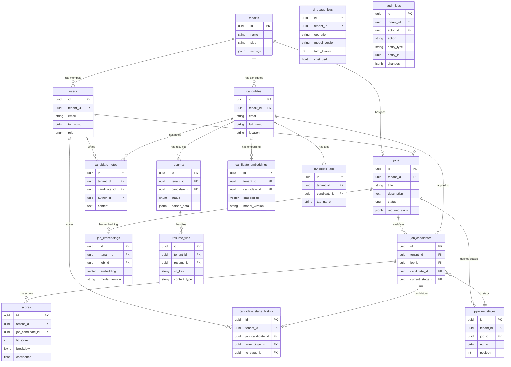
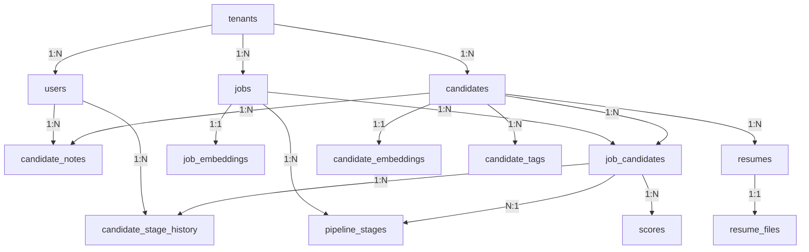

# Hiron Database Design Document

> **Document Type**: Database Schema Design  
> **Version**: 1.0  
> **Date**: July 28, 2026  
> **Status**: Draft — Awaiting Founder Review  
> **Database**: PostgreSQL 16 + pgvector extension  
> **Governing Documents**: Frozen Architecture Document, Frozen Engineering Guidelines

---

## 1. Database Overview

Hiron uses a single **PostgreSQL 16** instance as the primary database, extended with **pgvector** for semantic search capabilities. This is a deliberate architectural decision from the frozen architecture document — one database to manage, one backup strategy, one failure mode.

### What Lives in PostgreSQL

| Data Type | Storage | Rationale |
|---|---|---|
| Relational data (users, jobs, candidates, pipeline) | PostgreSQL tables | Core OLTP workload — transactional consistency required |
| Semi-structured data (parsed resumes, AI outputs) | JSONB columns | Flexible schema within ACID transactions |
| Vector embeddings (candidate/JD embeddings) | pgvector columns | Semantic search without a separate vector database |
| Full-text search indexes | tsvector + GIN indexes | Keyword search complement to semantic search |
| Audit logs | PostgreSQL tables | Compliance requirement — immutable, queryable audit trail |

### What Does NOT Live in PostgreSQL

| Data Type | Storage | Rationale |
|---|---|---|
| Resume files (PDF, DOCX) | Amazon S3 | Binary files don't belong in a database — S3 provides 11-nines durability |
| Session data | Redis | Ephemeral, high-read frequency — Redis is purpose-built for this |
| Cache data | Redis | Short TTL, high throughput — Redis is 100x faster than PostgreSQL for key-value lookups |
| Task queue state | Redis (Celery broker) | Celery's native broker — no reason to use PostgreSQL |

---

## 2. Design Principles

These principles derive directly from the frozen Engineering Guidelines and Architecture Document.

| # | Principle | Implementation |
|---|---|---|
| 1 | **Every table has a tenant_id** | Multi-tenant isolation at the data layer. No exceptions except the `tenants` table itself and platform-level tables. |
| 2 | **UUIDs for all primary keys** | No auto-increment integers. UUIDs prevent ID enumeration and enable distributed ID generation. |
| 3 | **snake_case everywhere** | Tables plural, columns singular, indexes prefixed. Per Engineering Guidelines §8. |
| 4 | **Audit fields on every table** | `id`, `created_at`, `updated_at` on every table. `created_by` where user attribution matters. |
| 5 | **Soft delete via is_archived** | No hard deletes of business data. Archived records are excluded from queries but preserved for compliance. |
| 6 | **JSONB for semi-structured data** | Parsed resume data, AI score breakdowns, and metadata use JSONB with documented schemas. |
| 7 | **Explicit NOT NULL** | Every column is `NOT NULL` unless there's a documented reason for nullability. |
| 8 | **Named constraints and indexes** | No auto-generated names. Every index, unique constraint, and check constraint has a meaningful name. |
| 9 | **Foreign keys with explicit cascade behavior** | Every FK relationship has documented ON DELETE behavior. No implicit cascades. |
| 10 | **Indexes justify their existence** | Every index maps to a specific query pattern. No speculative indexes. |

---

## 3. Entity Relationship Diagram



---

## 4. Complete Table List

### Organized by Domain

| Domain | Table | Purpose | MVP? |
|---|---|---|---|
| **Platform** | `tenants` | Customer organizations | ✅ |
| **Platform** | `users` | All user accounts across tenants | ✅ |
| **Platform** | `refresh_tokens` | JWT refresh token tracking | ✅ |
| **Hiring** | `jobs` | Job descriptions | ✅ |
| **Hiring** | `candidates` | Candidate profiles | ✅ |
| **Hiring** | `resumes` | Parsed resume data | ✅ |
| **Hiring** | `resume_files` | Original resume file references (S3) | ✅ |
| **AI/ML** | `scores` | AI fit scores with breakdowns | ✅ |
| **AI/ML** | `candidate_embeddings` | Candidate resume vector embeddings | ✅ |
| **AI/ML** | `job_embeddings` | Job description vector embeddings | ✅ |
| **Pipeline** | `pipeline_stages` | Configurable pipeline stages per job | ✅ |
| **Pipeline** | `job_candidates` | Junction: candidate ↔ job with current stage | ✅ |
| **Pipeline** | `candidate_stage_history` | Audit trail of stage transitions | ✅ |
| **Collaboration** | `candidate_notes` | Recruiter/HM notes on candidates | ✅ |
| **Collaboration** | `candidate_tags` | Tags/labels on candidates | ✅ |
| **Observability** | `ai_usage_logs` | Token usage and cost tracking per AI call | ✅ |
| **Observability** | `audit_logs` | Immutable audit trail of all mutations | ✅ |
| **Observability** | `saved_searches` | Saved semantic search queries | Phase 2 |

**Total: 18 tables** (17 MVP + 1 Phase 2)

---

## 5. Detailed Table Specifications

---

### 5.1 `tenants`

**Purpose**: Represents a customer organization. Every piece of business data in Hiron belongs to exactly one tenant. This is the root entity for multi-tenant isolation.

**Expected Growth**: ~10 at MVP launch, ~500 by Year 2. Very slow growth — this table will never be large.

**Expected Queries**:
- Lookup by `id` (on every authenticated request for RLS context)
- Lookup by `slug` (for subdomain-based routing, e.g., `acme.hiron.ai`)

| Column | Type | Nullable | Default | Description |
|---|---|---|---|---|
| `id` | `UUID` | NO | `gen_random_uuid()` | Primary key |
| `name` | `VARCHAR(200)` | NO | — | Display name ("Acme Corp") |
| `slug` | `VARCHAR(63)` | NO | — | URL-safe identifier ("acme-corp"). Used for subdomains. |
| `plan` | `VARCHAR(20)` | NO | `'starter'` | Subscription plan: `starter`, `professional`, `enterprise` |
| `settings` | `JSONB` | NO | `'{}'` | Tenant-level configuration (feature flags, branding, defaults) |
| `is_active` | `BOOLEAN` | NO | `TRUE` | Whether the tenant account is active. Deactivated on churn. |
| `created_at` | `TIMESTAMPTZ` | NO | `NOW()` | When the tenant was created |
| `updated_at` | `TIMESTAMPTZ` | NO | `NOW()` | Last update timestamp |

**Primary Key**: `id`

**Unique Constraints**:
- `uq_tenants_slug` ON (`slug`) — slugs must be globally unique for subdomain routing

**Check Constraints**:
- `ck_tenants_plan` CHECK (`plan` IN (`'starter'`, `'professional'`, `'enterprise'`))
- `ck_tenants_slug_format` CHECK (`slug` ~ `'^[a-z0-9]([a-z0-9-]*[a-z0-9])?$'`) — lowercase alphanumeric + hyphens, no leading/trailing hyphens

**Indexes**:
- `ix_tenants_slug` ON (`slug`) — fast lookup for subdomain routing
- `ix_tenants_is_active` ON (`is_active`) WHERE `is_active = TRUE` — partial index for active tenants

**Why This Table Exists**: Multi-tenancy is a core architectural requirement. Every query in the system filters by `tenant_id`. This table is the source of truth for "who are our customers."

**Why Each Field Exists**:
- `slug`: Enables subdomain-based routing (`acme.hiron.ai`) without exposing UUIDs in URLs
- `plan`: Gates feature access (e.g., enterprise features, API limits, seat limits)
- `settings`: Extensible JSON for tenant-specific configuration without schema migrations. Documented JSONB schema below.
- `is_active`: Soft deactivation — preserves data for reactivation, billing disputes, and compliance

**`settings` JSONB Schema**:
```json
{
    "max_seats": 10,
    "features": {
        "ai_scoring_enabled": true,
        "semantic_search_enabled": true,
        "bulk_upload_enabled": false
    },
    "branding": {
        "logo_url": null,
        "primary_color": null
    },
    "defaults": {
        "pipeline_stages": ["Applied", "Screening", "Interview", "Offer", "Hired"]
    }
}
```

---

### 5.2 `users`

**Purpose**: Represents all human users across all tenants. Includes recruiters, hiring managers, and org admins. Super admins are a special case (see notes below).

**Expected Growth**: ~50 at launch (5 per tenant × 10 tenants), ~5,000 by Year 2. Moderate growth.

**Expected Queries**:
- Lookup by `id` + `tenant_id` (authentication context)
- Lookup by `email` + `tenant_id` (login)
- List by `tenant_id` (team management page)
- Filter by `role` + `tenant_id` (role-based queries)

| Column | Type | Nullable | Default | Description |
|---|---|---|---|---|
| `id` | `UUID` | NO | `gen_random_uuid()` | Primary key |
| `tenant_id` | `UUID` | NO | — | FK → `tenants.id` |
| `email` | `VARCHAR(320)` | NO | — | User's email. 320 chars per RFC 5321. |
| `full_name` | `VARCHAR(200)` | NO | — | Display name |
| `password_hash` | `VARCHAR(256)` | YES | `NULL` | Argon2id hash. NULL for OAuth-only users. |
| `role` | `VARCHAR(20)` | NO | — | One of: `org_admin`, `recruiter`, `hiring_manager` |
| `avatar_url` | `VARCHAR(500)` | YES | `NULL` | Profile picture URL (from OAuth or uploaded) |
| `is_active` | `BOOLEAN` | NO | `TRUE` | Deactivated users can't log in but data is preserved |
| `is_email_verified` | `BOOLEAN` | NO | `FALSE` | Email verification status |
| `last_login_at` | `TIMESTAMPTZ` | YES | `NULL` | Tracks user engagement |
| `created_at` | `TIMESTAMPTZ` | NO | `NOW()` | Account creation time |
| `updated_at` | `TIMESTAMPTZ` | NO | `NOW()` | Last profile update |

**Primary Key**: `id`

**Foreign Keys**:
- `fk_users_tenant` → `tenants(id)` ON DELETE CASCADE

**Unique Constraints**:
- `uq_users_tenant_email` ON (`tenant_id`, `email`) — email must be unique within a tenant, but the same person can exist in multiple tenants

**Check Constraints**:
- `ck_users_role` CHECK (`role` IN (`'org_admin'`, `'recruiter'`, `'hiring_manager'`))
- `ck_users_email_format` CHECK (`email` ~* `'^[^@]+@[^@]+\.[^@]+$'`)

**Indexes**:
- `ix_users_tenant_id` ON (`tenant_id`) — list users per tenant
- `ix_users_tenant_email` ON (`tenant_id`, `email`) — login lookup
- `ix_users_tenant_role` ON (`tenant_id`, `role`) — filter users by role

**Why `password_hash` is Nullable**: Users who sign up via Google OAuth don't have a password. They authenticate entirely through the OAuth flow. If they later want to add a password (for backup access), we update this field.

**Super Admin Note**: Super admins (Hiron platform operators) are NOT stored in this table. They exist in a separate, platform-level admin system outside the tenant model. This prevents a compromised tenant database row from granting super admin access.

---

### 5.3 `refresh_tokens`

**Purpose**: Tracks active JWT refresh tokens. Enables single-use rotation (each refresh token can only be used once) and session revocation (password change invalidates all tokens).

**Expected Growth**: Proportional to active sessions. ~5x active users (multiple devices/browsers). Heavily pruned — expired tokens are deleted daily.

**Expected Queries**:
- Lookup by `token_hash` (token refresh flow)
- Delete by `user_id` (session revocation on password change)
- Delete WHERE `expires_at < NOW()` (cleanup job)

| Column | Type | Nullable | Default | Description |
|---|---|---|---|---|
| `id` | `UUID` | NO | `gen_random_uuid()` | Primary key |
| `user_id` | `UUID` | NO | — | FK → `users.id` |
| `tenant_id` | `UUID` | NO | — | FK → `tenants.id`. Denormalized for RLS. |
| `token_hash` | `VARCHAR(64)` | NO | — | SHA-256 hash of the refresh token. Never store the raw token. |
| `expires_at` | `TIMESTAMPTZ` | NO | — | Token expiration (7 days from issue per Engineering Guidelines §16.1) |
| `is_revoked` | `BOOLEAN` | NO | `FALSE` | Explicitly revoked (password change, logout) |
| `user_agent` | `VARCHAR(500)` | YES | `NULL` | Browser/device info for session management UI |
| `ip_address` | `INET` | YES | `NULL` | IP at time of token issue. For security audit. |
| `created_at` | `TIMESTAMPTZ` | NO | `NOW()` | When the token was issued |

**Primary Key**: `id`

**Foreign Keys**:
- `fk_refresh_tokens_user` → `users(id)` ON DELETE CASCADE
- `fk_refresh_tokens_tenant` → `tenants(id)` ON DELETE CASCADE

**Unique Constraints**:
- `uq_refresh_tokens_token_hash` ON (`token_hash`) — each token hash is globally unique

**Indexes**:
- `ix_refresh_tokens_token_hash` ON (`token_hash`) — fast lookup during token refresh
- `ix_refresh_tokens_user_id` ON (`user_id`) — revoke all sessions for a user
- `ix_refresh_tokens_expires_at` ON (`expires_at`) — cleanup job efficiency

**Why `token_hash` Not `token`**: Per Engineering Guidelines §16.1, we never store raw tokens. If the database is compromised, the attacker gets hashes, not usable tokens.

**Why `tenant_id` is Denormalized**: RLS policies filter by `tenant_id`. Without it on this table, RLS would require a join to `users` on every token validation — adding latency to the most frequent security operation.

---

### 5.4 `jobs`

**Purpose**: Represents a job description / open role. The primary entity that candidates are evaluated against. Jobs are the central organizing concept in Hiron — recruiters create jobs, upload candidates to them, and the AI scores candidates against them.

**Expected Growth**: ~5–20 per tenant (active jobs), ~100–500 per tenant (including archived). ~50K total by Year 2.

**Expected Queries**:
- List by `tenant_id` + `status` (dashboard: show active jobs)
- Get by `id` + `tenant_id` (job detail page)
- Full-text search on `title` + `description` (search within jobs)
- Count by `tenant_id` + `status` (dashboard metrics)

| Column | Type | Nullable | Default | Description |
|---|---|---|---|---|
| `id` | `UUID` | NO | `gen_random_uuid()` | Primary key |
| `tenant_id` | `UUID` | NO | — | FK → `tenants.id` |
| `created_by` | `UUID` | NO | — | FK → `users.id`. The recruiter who created this job. |
| `title` | `VARCHAR(200)` | NO | — | Job title ("Senior Backend Engineer") |
| `description` | `TEXT` | NO | — | Full job description text |
| `department` | `VARCHAR(100)` | YES | `NULL` | Optional department ("Engineering", "Marketing") |
| `location` | `VARCHAR(200)` | YES | `NULL` | Location ("Remote", "San Francisco, CA") |
| `employment_type` | `VARCHAR(20)` | YES | `NULL` | `full_time`, `part_time`, `contract`, `internship` |
| `experience_years_min` | `SMALLINT` | YES | `NULL` | Minimum years of experience required |
| `experience_years_max` | `SMALLINT` | YES | `NULL` | Maximum years of experience |
| `required_skills` | `JSONB` | NO | `'[]'` | Array of required skill strings |
| `preferred_skills` | `JSONB` | NO | `'[]'` | Array of nice-to-have skill strings |
| `extracted_requirements` | `JSONB` | YES | `NULL` | AI-extracted structured requirements from the JD text |
| `status` | `VARCHAR(20)` | NO | `'draft'` | `draft`, `open`, `paused`, `closed`, `archived` |
| `is_archived` | `BOOLEAN` | NO | `FALSE` | Soft delete flag |
| `search_vector` | `TSVECTOR` | YES | `NULL` | Full-text search index on title + description |
| `opened_at` | `TIMESTAMPTZ` | YES | `NULL` | When the job was moved to `open` status |
| `closed_at` | `TIMESTAMPTZ` | YES | `NULL` | When the job was closed |
| `created_at` | `TIMESTAMPTZ` | NO | `NOW()` | Record creation |
| `updated_at` | `TIMESTAMPTZ` | NO | `NOW()` | Last update |

**Primary Key**: `id`

**Foreign Keys**:
- `fk_jobs_tenant` → `tenants(id)` ON DELETE CASCADE
- `fk_jobs_created_by` → `users(id)` ON DELETE SET NULL

**Check Constraints**:
- `ck_jobs_status` CHECK (`status` IN (`'draft'`, `'open'`, `'paused'`, `'closed'`, `'archived'`))
- `ck_jobs_employment_type` CHECK (`employment_type` IN (`'full_time'`, `'part_time'`, `'contract'`, `'internship'`) OR `employment_type` IS NULL)
- `ck_jobs_experience_range` CHECK (`experience_years_max` >= `experience_years_min` OR `experience_years_max` IS NULL OR `experience_years_min` IS NULL)
- `ck_jobs_experience_min_range` CHECK (`experience_years_min` >= 0 AND `experience_years_min` <= 50)
- `ck_jobs_experience_max_range` CHECK (`experience_years_max` >= 0 AND `experience_years_max` <= 50)

**Indexes**:
- `ix_jobs_tenant_id` ON (`tenant_id`) — base filter for all job queries
- `ix_jobs_tenant_status` ON (`tenant_id`, `status`) — dashboard: "show me all open jobs"
- `ix_jobs_tenant_archived` ON (`tenant_id`) WHERE `is_archived = FALSE` — partial index excluding archived
- `ix_jobs_search_vector` USING GIN (`search_vector`) — full-text search
- `ix_jobs_created_at` ON (`tenant_id`, `created_at` DESC) — recent jobs first

**`required_skills` JSONB Schema**:
```json
["Python", "FastAPI", "PostgreSQL", "Docker"]
```

**`extracted_requirements` JSONB Schema**:
```json
{
    "skills": ["Python", "FastAPI", "PostgreSQL"],
    "education": "Bachelor's in Computer Science or equivalent",
    "experience_summary": "5+ years backend development",
    "certifications": ["AWS Solutions Architect"],
    "extraction_model_version": "gpt-4o-2024-08-06",
    "extraction_prompt_version": "1.0.0",
    "extracted_at": "2026-08-01T12:00:00Z"
}
```

**Why `search_vector` is a Column, Not Computed on the Fly**: Generating tsvector at query time on a TEXT column is expensive. Storing it as a materialized column with a GIN index makes full-text search sub-millisecond. We update it via a trigger on INSERT/UPDATE.

---

### 5.5 `candidates`

**Purpose**: Represents a unique person in the candidate pool. A candidate exists independently of any specific job — they may be evaluated against multiple jobs over time. This is the core entity for Hiron's talent pool.

**Expected Growth**: ~50K at launch, ~1M by Year 1, ~10M by Year 2. **This is the fastest-growing table.** Partitioning considerations apply (see §16).

**Expected Queries**:
- Lookup by `id` + `tenant_id` (candidate detail page)
- Lookup by `email` + `tenant_id` (duplicate detection on upload)
- List by `tenant_id` with pagination (candidate pool browser)
- Filter by skills, location, experience range (pool filtering)
- Semantic search via embeddings table (see `candidate_embeddings`)

| Column | Type | Nullable | Default | Description |
|---|---|---|---|---|
| `id` | `UUID` | NO | `gen_random_uuid()` | Primary key |
| `tenant_id` | `UUID` | NO | — | FK → `tenants.id` |
| `email` | `VARCHAR(320)` | YES | `NULL` | Candidate's email. Nullable because some resumes don't include email. |
| `full_name` | `VARCHAR(200)` | NO | — | Full name extracted from resume |
| `phone` | `VARCHAR(30)` | YES | `NULL` | Phone number (extracted from resume) |
| `location` | `VARCHAR(200)` | YES | `NULL` | Location ("San Francisco, CA", "Remote") |
| `linkedin_url` | `VARCHAR(500)` | YES | `NULL` | LinkedIn profile URL |
| `summary` | `TEXT` | YES | `NULL` | Professional summary extracted from resume |
| `skills` | `JSONB` | NO | `'[]'` | Array of skill strings extracted from resume |
| `total_experience_years` | `SMALLINT` | YES | `NULL` | Estimated total years of experience |
| `current_title` | `VARCHAR(200)` | YES | `NULL` | Most recent job title |
| `current_company` | `VARCHAR(200)` | YES | `NULL` | Most recent employer |
| `source` | `VARCHAR(50)` | NO | `'upload'` | How this candidate entered the system: `upload`, `bulk_upload`, `api`, `ats_sync` |
| `is_archived` | `BOOLEAN` | NO | `FALSE` | Soft delete flag |
| `search_vector` | `TSVECTOR` | YES | `NULL` | Full-text search on name + skills + title + company |
| `created_at` | `TIMESTAMPTZ` | NO | `NOW()` | When the candidate record was created |
| `updated_at` | `TIMESTAMPTZ` | NO | `NOW()` | Last update |

**Primary Key**: `id`

**Foreign Keys**:
- `fk_candidates_tenant` → `tenants(id)` ON DELETE CASCADE

**Unique Constraints**:
- `uq_candidates_tenant_email` ON (`tenant_id`, `email`) WHERE `email IS NOT NULL` — unique email per tenant, but only when email exists. Partial unique index.

**Check Constraints**:
- `ck_candidates_source` CHECK (`source` IN (`'upload'`, `'bulk_upload'`, `'api'`, `'ats_sync'`))
- `ck_candidates_experience_range` CHECK (`total_experience_years` >= 0 AND `total_experience_years` <= 70)

**Indexes**:
- `ix_candidates_tenant_id` ON (`tenant_id`) — base filter
- `ix_candidates_tenant_email` ON (`tenant_id`, `email`) — duplicate detection
- `ix_candidates_tenant_name` ON (`tenant_id`, `full_name`) — name search
- `ix_candidates_tenant_archived` ON (`tenant_id`) WHERE `is_archived = FALSE` — exclude archived
- `ix_candidates_search_vector` USING GIN (`search_vector`) — full-text search
- `ix_candidates_skills` USING GIN (`skills`) — JSONB containment queries (`skills @> '["Python"]'`)
- `ix_candidates_created_at` ON (`tenant_id`, `created_at` DESC) — recent candidates first

**Why `email` is Nullable**: Not all resumes contain an email address. We'd rather import the candidate without an email than reject the resume entirely. Duplicate detection falls back to name fuzzy matching when email is absent.

**Why `skills` is on Both `candidates` and `jobs`**: Skills on `candidates` are what the person HAS. Skills on `jobs` are what the role REQUIRES. The AI scoring engine compares these two lists. They're denormalized from the parsed resume/JD for fast filtering without JSON path traversal.

---

### 5.6 `resumes`

**Purpose**: Stores the parsed, structured representation of a resume. A candidate can have multiple resumes (different versions, updates over time). The most recent resume is the "active" one used for scoring.

**Expected Growth**: 1:1 with candidates initially, ~1.2:1 over time (some candidates update resumes).

**Expected Queries**:
- Get latest resume for a candidate: `candidate_id` + `tenant_id` ORDER BY `created_at` DESC LIMIT 1
- Get by `id` + `tenant_id` (resume detail)
- Filter by `status` + `tenant_id` (find failed/pending parses)

| Column | Type | Nullable | Default | Description |
|---|---|---|---|---|
| `id` | `UUID` | NO | `gen_random_uuid()` | Primary key |
| `tenant_id` | `UUID` | NO | — | FK → `tenants.id` |
| `candidate_id` | `UUID` | NO | — | FK → `candidates.id` |
| `status` | `VARCHAR(20)` | NO | `'pending'` | Parse status: `pending`, `processing`, `parsed`, `failed` |
| `parsed_data` | `JSONB` | YES | `NULL` | Structured data extracted by the AI parser. NULL until parsing completes. |
| `parse_error` | `TEXT` | YES | `NULL` | Error message if parsing failed |
| `parser_model_version` | `VARCHAR(100)` | YES | `NULL` | spaCy/NER model version used for parsing |
| `parse_confidence` | `REAL` | YES | `NULL` | Parser's confidence score (0.0–1.0) |
| `raw_text` | `TEXT` | YES | `NULL` | Plain text extracted from the resume file. Used as input for embedding generation. |
| `raw_text_hash` | `VARCHAR(64)` | YES | `NULL` | SHA-256 of `raw_text`. Used to detect duplicate content and stale embeddings. |
| `is_primary` | `BOOLEAN` | NO | `FALSE` | Whether this is the candidate's primary/active resume |
| `created_at` | `TIMESTAMPTZ` | NO | `NOW()` | Upload time |
| `updated_at` | `TIMESTAMPTZ` | NO | `NOW()` | Last update (e.g., parse completion) |

**Primary Key**: `id`

**Foreign Keys**:
- `fk_resumes_tenant` → `tenants(id)` ON DELETE CASCADE
- `fk_resumes_candidate` → `candidates(id)` ON DELETE CASCADE

**Unique Constraints**:
- `uq_resumes_candidate_primary` ON (`candidate_id`) WHERE `is_primary = TRUE` — only one primary resume per candidate (partial unique)

**Check Constraints**:
- `ck_resumes_status` CHECK (`status` IN (`'pending'`, `'processing'`, `'parsed'`, `'failed'`))
- `ck_resumes_confidence_range` CHECK (`parse_confidence` >= 0.0 AND `parse_confidence` <= 1.0)

**Indexes**:
- `ix_resumes_tenant_id` ON (`tenant_id`)
- `ix_resumes_candidate_id` ON (`candidate_id`) — get resumes for a candidate
- `ix_resumes_tenant_status` ON (`tenant_id`, `status`) — find pending/failed parses
- `ix_resumes_raw_text_hash` ON (`tenant_id`, `raw_text_hash`) — duplicate content detection

**`parsed_data` JSONB Schema**:
```json
{
    "full_name": "Jane Smith",
    "email": "jane@example.com",
    "phone": "+1-555-0123",
    "location": "San Francisco, CA",
    "linkedin_url": "https://linkedin.com/in/janesmith",
    "summary": "Senior backend engineer with 8 years of experience...",
    "skills": ["Python", "Go", "PostgreSQL", "Kubernetes", "gRPC"],
    "experience": [
        {
            "title": "Senior Software Engineer",
            "company": "Stripe",
            "location": "San Francisco, CA",
            "start_date": "2022-03",
            "end_date": null,
            "is_current": true,
            "description": "Led the payments infrastructure team..."
        },
        {
            "title": "Software Engineer",
            "company": "Datadog",
            "location": "New York, NY",
            "start_date": "2019-06",
            "end_date": "2022-02",
            "is_current": false,
            "description": "Built real-time metrics pipeline..."
        }
    ],
    "education": [
        {
            "degree": "B.S. Computer Science",
            "institution": "UC Berkeley",
            "graduation_year": 2019
        }
    ],
    "certifications": ["AWS Solutions Architect Associate"],
    "languages": ["English", "Spanish"]
}
```

**Why `raw_text` is Stored**: The raw text serves dual purposes: (1) input for embedding generation, and (2) input for LLM scoring prompts. Storing it avoids re-extracting text from the PDF on every operation.

**Why `raw_text_hash`**: Per Engineering Guidelines Appendix A.3, embeddings must be invalidated when source text changes. The hash enables efficient staleness detection without comparing full text.

---

### 5.7 `resume_files`

**Purpose**: Tracks the original uploaded resume files stored in S3. Separated from `resumes` because a resume record can exist without a file (e.g., text-pasted input) and to support multiple file versions.

**Expected Growth**: 1:1 with resumes.

**Expected Queries**:
- Get file for a resume: `resume_id`
- Generate pre-signed S3 URL for download

| Column | Type | Nullable | Default | Description |
|---|---|---|---|---|
| `id` | `UUID` | NO | `gen_random_uuid()` | Primary key |
| `tenant_id` | `UUID` | NO | — | FK → `tenants.id` |
| `resume_id` | `UUID` | NO | — | FK → `resumes.id` |
| `s3_bucket` | `VARCHAR(100)` | NO | — | S3 bucket name |
| `s3_key` | `VARCHAR(500)` | NO | — | S3 object key (path) |
| `original_filename` | `VARCHAR(255)` | NO | — | Original filename as uploaded by the user (sanitized) |
| `content_type` | `VARCHAR(100)` | NO | — | MIME type: `application/pdf`, etc. |
| `file_size_bytes` | `INTEGER` | NO | — | File size in bytes |
| `checksum_sha256` | `VARCHAR(64)` | NO | — | SHA-256 checksum for integrity verification |
| `created_at` | `TIMESTAMPTZ` | NO | `NOW()` | Upload time |

**Primary Key**: `id`

**Foreign Keys**:
- `fk_resume_files_tenant` → `tenants(id)` ON DELETE CASCADE
- `fk_resume_files_resume` → `resumes(id)` ON DELETE CASCADE

**Check Constraints**:
- `ck_resume_files_content_type` CHECK (`content_type` IN (`'application/pdf'`, `'application/vnd.openxmlformats-officedocument.wordprocessingml.document'`, `'text/plain'`))
- `ck_resume_files_size` CHECK (`file_size_bytes` > 0 AND `file_size_bytes` <= 10485760) — max 10 MB per Engineering Guidelines §15.2

**Indexes**:
- `ix_resume_files_resume_id` ON (`resume_id`) — get file for a resume
- `ix_resume_files_tenant_id` ON (`tenant_id`)

**Why This Is a Separate Table**: Resume files live in S3. This table is metadata about those files — not the files themselves. Separating it from `resumes` follows the single-responsibility principle: `resumes` holds parsed data (frequently queried), `resume_files` holds file metadata (rarely queried, used for downloads).

---

### 5.8 `pipeline_stages`

**Purpose**: Defines the stages in a job's hiring pipeline. Each job has its own ordered set of stages, allowing customization (e.g., one job has "Technical Interview" and another has "Design Challenge"). Default stages are created from tenant settings when a job is opened.

**Expected Growth**: ~5–8 stages per job. ~250K by Year 2.

**Expected Queries**:
- List stages for a job: `job_id` + `tenant_id` ORDER BY `position`
- Lookup by `id` (stage transition operations)

| Column | Type | Nullable | Default | Description |
|---|---|---|---|---|
| `id` | `UUID` | NO | `gen_random_uuid()` | Primary key |
| `tenant_id` | `UUID` | NO | — | FK → `tenants.id` |
| `job_id` | `UUID` | NO | — | FK → `jobs.id` |
| `name` | `VARCHAR(100)` | NO | — | Stage name ("Applied", "Screening", "Interview", "Offer", "Hired") |
| `position` | `SMALLINT` | NO | — | Sort order (1, 2, 3...) |
| `is_terminal` | `BOOLEAN` | NO | `FALSE` | Whether this is a terminal stage ("Hired", "Rejected") |
| `stage_type` | `VARCHAR(20)` | NO | `'active'` | `active`, `hired`, `rejected` — semantic meaning for analytics |
| `created_at` | `TIMESTAMPTZ` | NO | `NOW()` | Record creation |
| `updated_at` | `TIMESTAMPTZ` | NO | `NOW()` | Last update |

**Primary Key**: `id`

**Foreign Keys**:
- `fk_pipeline_stages_tenant` → `tenants(id)` ON DELETE CASCADE
- `fk_pipeline_stages_job` → `jobs(id)` ON DELETE CASCADE

**Unique Constraints**:
- `uq_pipeline_stages_job_position` ON (`job_id`, `position`) — no two stages can share the same position within a job
- `uq_pipeline_stages_job_name` ON (`job_id`, `name`) — no duplicate stage names within a job

**Check Constraints**:
- `ck_pipeline_stages_position` CHECK (`position` >= 1 AND `position` <= 20)
- `ck_pipeline_stages_stage_type` CHECK (`stage_type` IN (`'active'`, `'hired'`, `'rejected'`))

**Indexes**:
- `ix_pipeline_stages_job_id` ON (`job_id`, `position`) — ordered stage listing
- `ix_pipeline_stages_tenant_id` ON (`tenant_id`)

---

### 5.9 `job_candidates`

**Purpose**: Junction table connecting candidates to jobs. Represents "this candidate is being considered for this job." Holds the candidate's current stage in the pipeline. This is the core operational table for the Kanban board.

**Expected Growth**: One row per candidate-job pair. ~500K by Year 2. Grows with scoring volume.

**Expected Queries**:
- List candidates for a job grouped by stage: `job_id` + `tenant_id` (Kanban view)
- Get candidate-job pair: `job_id` + `candidate_id` + `tenant_id`
- Count candidates per stage per job: `job_id` + `current_stage_id` (pipeline metrics)
- List all jobs a candidate is in: `candidate_id` + `tenant_id`

| Column | Type | Nullable | Default | Description |
|---|---|---|---|---|
| `id` | `UUID` | NO | `gen_random_uuid()` | Primary key |
| `tenant_id` | `UUID` | NO | — | FK → `tenants.id` |
| `job_id` | `UUID` | NO | — | FK → `jobs.id` |
| `candidate_id` | `UUID` | NO | — | FK → `candidates.id` |
| `current_stage_id` | `UUID` | NO | — | FK → `pipeline_stages.id`. The candidate's current stage. |
| `added_by` | `UUID` | YES | `NULL` | FK → `users.id`. Who added this candidate to this job. |
| `is_shortlisted` | `BOOLEAN` | NO | `FALSE` | Whether the candidate has been shortlisted for HM review |
| `rejection_reason` | `VARCHAR(500)` | YES | `NULL` | Reason for rejection (when moved to rejected stage) |
| `is_archived` | `BOOLEAN` | NO | `FALSE` | Soft delete |
| `created_at` | `TIMESTAMPTZ` | NO | `NOW()` | When the candidate was added to this job |
| `updated_at` | `TIMESTAMPTZ` | NO | `NOW()` | Last update (stage change, shortlist toggle) |

**Primary Key**: `id`

**Foreign Keys**:
- `fk_job_candidates_tenant` → `tenants(id)` ON DELETE CASCADE
- `fk_job_candidates_job` → `jobs(id)` ON DELETE CASCADE
- `fk_job_candidates_candidate` → `candidates(id)` ON DELETE CASCADE
- `fk_job_candidates_stage` → `pipeline_stages(id)` ON DELETE RESTRICT
- `fk_job_candidates_added_by` → `users(id)` ON DELETE SET NULL

**Unique Constraints**:
- `uq_job_candidates_job_candidate` ON (`job_id`, `candidate_id`) — a candidate can only be in a job once

**Indexes**:
- `ix_job_candidates_tenant_id` ON (`tenant_id`)
- `ix_job_candidates_job_id` ON (`job_id`) — list candidates for a job
- `ix_job_candidates_candidate_id` ON (`candidate_id`) — list jobs for a candidate
- `ix_job_candidates_job_stage` ON (`job_id`, `current_stage_id`) — Kanban: group by stage
- `ix_job_candidates_shortlisted` ON (`job_id`) WHERE `is_shortlisted = TRUE` — HM review page

---

### 5.10 `scores`

**Purpose**: Stores AI-generated fit scores for a candidate-job pair. Each score includes the total score, per-dimension breakdown, explanation, and full provenance (model version, prompt version, confidence).

**Expected Growth**: One score per job_candidate row. May have multiple if re-scored after prompt/model update. ~500K by Year 2.

**Expected Queries**:
- Get latest score for a job_candidate: `job_candidate_id` ORDER BY `created_at` DESC LIMIT 1
- Rank candidates for a job by score: JOIN `job_candidates` ORDER BY `fit_score` DESC
- Score distribution per job: `job_candidate_id` via job (analytics)

| Column | Type | Nullable | Default | Description |
|---|---|---|---|---|
| `id` | `UUID` | NO | `gen_random_uuid()` | Primary key |
| `tenant_id` | `UUID` | NO | — | FK → `tenants.id` |
| `job_candidate_id` | `UUID` | NO | — | FK → `job_candidates.id` |
| `fit_score` | `SMALLINT` | NO | — | Overall fit score (0–100) |
| `confidence` | `REAL` | NO | — | Confidence level (0.0–1.0). Per Appendix A.14. |
| `breakdown` | `JSONB` | NO | — | Per-dimension scores |
| `explanation` | `TEXT` | NO | — | LLM-generated human-readable explanation |
| `skills_matched` | `JSONB` | NO | `'[]'` | Array of skills found in both resume and JD |
| `skills_missing` | `JSONB` | NO | `'[]'` | Array of required skills not found in resume |
| `prompt_name` | `VARCHAR(100)` | NO | — | Prompt template used (per Appendix A.1) |
| `prompt_version` | `VARCHAR(20)` | NO | — | Prompt version (per Appendix A.1) |
| `model_version` | `VARCHAR(100)` | NO | — | LLM model version (per Appendix A.2) |
| `input_tokens` | `INTEGER` | NO | — | Tokens sent to the LLM |
| `output_tokens` | `INTEGER` | NO | — | Tokens received from the LLM |
| `latency_ms` | `INTEGER` | NO | — | End-to-end scoring latency |
| `warnings` | `JSONB` | NO | `'[]'` | Hallucination/consistency warnings (per Appendix A.12) |
| `is_current` | `BOOLEAN` | NO | `TRUE` | Whether this is the current active score |
| `created_at` | `TIMESTAMPTZ` | NO | `NOW()` | When the score was generated |

**Primary Key**: `id`

**Foreign Keys**:
- `fk_scores_tenant` → `tenants(id)` ON DELETE CASCADE
- `fk_scores_job_candidate` → `job_candidates(id)` ON DELETE CASCADE

**Unique Constraints**:
- `uq_scores_job_candidate_current` ON (`job_candidate_id`) WHERE `is_current = TRUE` — only one current score per job_candidate (partial unique)

**Check Constraints**:
- `ck_scores_fit_score_range` CHECK (`fit_score` >= 0 AND `fit_score` <= 100)
- `ck_scores_confidence_range` CHECK (`confidence` >= 0.0 AND `confidence` <= 1.0)
- `ck_scores_tokens_positive` CHECK (`input_tokens` >= 0 AND `output_tokens` >= 0)
- `ck_scores_latency_positive` CHECK (`latency_ms` >= 0)

**Indexes**:
- `ix_scores_tenant_id` ON (`tenant_id`)
- `ix_scores_job_candidate_id` ON (`job_candidate_id`) — get scores for a job_candidate
- `ix_scores_current` ON (`job_candidate_id`) WHERE `is_current = TRUE` — fast lookup of active score
- `ix_scores_fit_score` ON (`tenant_id`, `fit_score` DESC) — ranking queries

**`breakdown` JSONB Schema**:
```json
{
    "skills": {
        "score": 85,
        "weight": 0.40,
        "details": "12/14 required skills matched"
    },
    "experience": {
        "score": 78,
        "weight": 0.35,
        "details": "8 years backend, fintech experience aligns"
    },
    "education": {
        "score": 90,
        "weight": 0.25,
        "details": "B.S. CS from UC Berkeley meets requirement"
    }
}
```

**Why Full Provenance is Stored**: Per the AI Engineering Standards (Appendix A), every AI output must be traceable to the exact prompt and model that produced it. This enables debugging ("why did this candidate get a 45?"), regression detection, and compliance audits.

---

### 5.11 `candidate_embeddings`

**Purpose**: Stores vector embeddings generated from candidate resume text. Used for semantic search ("find backend engineers with fintech experience"). Per Appendix A.3, every embedding includes its model version.

**Expected Growth**: 1:1 with candidates. ~10M by Year 2. **This table drives semantic search performance.**

**Expected Queries**:
- Vector similarity search: ORDER BY `embedding <=> query_vector` LIMIT K (semantic search)
- Lookup by `candidate_id` + `model_version` (staleness check)

| Column | Type | Nullable | Default | Description |
|---|---|---|---|---|
| `id` | `UUID` | NO | `gen_random_uuid()` | Primary key |
| `tenant_id` | `UUID` | NO | — | FK → `tenants.id` |
| `candidate_id` | `UUID` | NO | — | FK → `candidates.id` |
| `embedding` | `VECTOR(1536)` | NO | — | 1536-dim vector from `text-embedding-3-small` |
| `model_version` | `VARCHAR(100)` | NO | — | Embedding model version (per Appendix A.3) |
| `source_text_hash` | `VARCHAR(64)` | NO | — | SHA-256 of the input text (staleness detection) |
| `created_at` | `TIMESTAMPTZ` | NO | `NOW()` | When the embedding was generated |

**Primary Key**: `id`

**Foreign Keys**:
- `fk_candidate_embeddings_tenant` → `tenants(id)` ON DELETE CASCADE
- `fk_candidate_embeddings_candidate` → `candidates(id)` ON DELETE CASCADE

**Unique Constraints**:
- `uq_candidate_embeddings_candidate_model` ON (`candidate_id`, `model_version`) — one embedding per candidate per model version

**Indexes**:
- `ix_candidate_embeddings_tenant_id` ON (`tenant_id`)
- `ix_candidate_embeddings_vector` USING hnsw (`embedding` vector_cosine_ops) — HNSW index for approximate nearest neighbor search. See §13.
- `ix_candidate_embeddings_candidate_model` ON (`candidate_id`, `model_version`) — staleness check

**Vector Index Configuration**:
- Index type: **HNSW** (Hierarchical Navigable Small World)
- Distance function: **cosine** (standard for text embeddings)
- `m = 16` (connections per node — balanced recall vs. memory)
- `ef_construction = 64` (build quality — higher = better index, slower build)

**Why HNSW Over IVFFlat**: HNSW provides better recall at comparable speed, doesn't require periodic re-training (unlike IVFFlat), and supports concurrent inserts without rebuilding. The tradeoff is higher memory usage, which is acceptable at our scale.

---

### 5.12 `job_embeddings`

**Purpose**: Stores vector embeddings generated from job descriptions. Used to compute similarity between JDs and candidate resumes (the core of the scoring engine). Structure mirrors `candidate_embeddings`.

**Expected Growth**: 1:1 with jobs. Much smaller than candidate_embeddings. ~50K by Year 2.

| Column | Type | Nullable | Default | Description |
|---|---|---|---|---|
| `id` | `UUID` | NO | `gen_random_uuid()` | Primary key |
| `tenant_id` | `UUID` | NO | — | FK → `tenants.id` |
| `job_id` | `UUID` | NO | — | FK → `jobs.id` |
| `embedding` | `VECTOR(1536)` | NO | — | 1536-dim vector |
| `model_version` | `VARCHAR(100)` | NO | — | Embedding model version |
| `source_text_hash` | `VARCHAR(64)` | NO | — | SHA-256 of JD text |
| `created_at` | `TIMESTAMPTZ` | NO | `NOW()` | Generation time |

**Primary Key**: `id`

**Foreign Keys**:
- `fk_job_embeddings_tenant` → `tenants(id)` ON DELETE CASCADE
- `fk_job_embeddings_job` → `jobs(id)` ON DELETE CASCADE

**Unique Constraints**:
- `uq_job_embeddings_job_model` ON (`job_id`, `model_version`)

**Indexes**:
- `ix_job_embeddings_tenant_id` ON (`tenant_id`)
- `ix_job_embeddings_job_model` ON (`job_id`, `model_version`)

**No HNSW Index**: Job embeddings are not searched by similarity (we search candidates, not jobs). They're fetched by `job_id` for comparison. A regular B-tree index suffices.

---

### 5.13 `candidate_stage_history`

**Purpose**: Immutable audit log of every stage transition in a candidate's pipeline journey. When a recruiter moves a candidate from "Screening" to "Interview," a row is inserted here. This powers the timeline view, analytics (time-in-stage), and compliance audit trail.

**Expected Growth**: ~3–5 rows per job_candidate (average number of stage transitions). ~2M by Year 2.

| Column | Type | Nullable | Default | Description |
|---|---|---|---|---|
| `id` | `UUID` | NO | `gen_random_uuid()` | Primary key |
| `tenant_id` | `UUID` | NO | — | FK → `tenants.id` |
| `job_candidate_id` | `UUID` | NO | — | FK → `job_candidates.id` |
| `from_stage_id` | `UUID` | YES | `NULL` | FK → `pipeline_stages.id`. NULL for initial placement. |
| `to_stage_id` | `UUID` | NO | — | FK → `pipeline_stages.id` |
| `moved_by` | `UUID` | NO | — | FK → `users.id`. Who performed the action. |
| `note` | `TEXT` | YES | `NULL` | Optional note explaining the transition |
| `created_at` | `TIMESTAMPTZ` | NO | `NOW()` | When the transition happened |

**Primary Key**: `id`

**Foreign Keys**:
- `fk_csh_tenant` → `tenants(id)` ON DELETE CASCADE
- `fk_csh_job_candidate` → `job_candidates(id)` ON DELETE CASCADE
- `fk_csh_from_stage` → `pipeline_stages(id)` ON DELETE SET NULL
- `fk_csh_to_stage` → `pipeline_stages(id)` ON DELETE RESTRICT
- `fk_csh_moved_by` → `users(id)` ON DELETE SET NULL

**Indexes**:
- `ix_csh_tenant_id` ON (`tenant_id`)
- `ix_csh_job_candidate_id` ON (`job_candidate_id`, `created_at` DESC) — timeline view
- `ix_csh_created_at` ON (`tenant_id`, `created_at`) — analytics: transitions over time

**Why This is Immutable**: History records are INSERT-only, never updated or deleted. This ensures a tamper-proof audit trail of hiring decisions — critical for compliance and bias auditing.

---

### 5.14 `candidate_notes`

**Purpose**: Free-text notes that recruiters and hiring managers attach to candidates. Supports @mentions for collaboration. Notes are tied to a candidate, not a specific job (a note about a candidate's communication skills applies across jobs).

**Expected Growth**: ~2–5 notes per candidate. ~1M by Year 2.

| Column | Type | Nullable | Default | Description |
|---|---|---|---|---|
| `id` | `UUID` | NO | `gen_random_uuid()` | Primary key |
| `tenant_id` | `UUID` | NO | — | FK → `tenants.id` |
| `candidate_id` | `UUID` | NO | — | FK → `candidates.id` |
| `author_id` | `UUID` | NO | — | FK → `users.id` |
| `job_id` | `UUID` | YES | `NULL` | FK → `jobs.id`. Optional — note can be job-specific or general. |
| `content` | `TEXT` | NO | — | Note content. May contain @mentions (`@user_id`). |
| `is_private` | `BOOLEAN` | NO | `FALSE` | Private notes are visible only to the author |
| `is_archived` | `BOOLEAN` | NO | `FALSE` | Soft delete |
| `created_at` | `TIMESTAMPTZ` | NO | `NOW()` | When the note was written |
| `updated_at` | `TIMESTAMPTZ` | NO | `NOW()` | Last edit |

**Primary Key**: `id`

**Foreign Keys**:
- `fk_candidate_notes_tenant` → `tenants(id)` ON DELETE CASCADE
- `fk_candidate_notes_candidate` → `candidates(id)` ON DELETE CASCADE
- `fk_candidate_notes_author` → `users(id)` ON DELETE SET NULL
- `fk_candidate_notes_job` → `jobs(id)` ON DELETE SET NULL

**Indexes**:
- `ix_candidate_notes_tenant_id` ON (`tenant_id`)
- `ix_candidate_notes_candidate_id` ON (`candidate_id`, `created_at` DESC) — notes for a candidate
- `ix_candidate_notes_author_id` ON (`author_id`) — "my notes"

---

### 5.15 `candidate_tags`

**Purpose**: Lightweight labels attached to candidates for organization and filtering ("Strong hire", "Culture fit", "Overqualified", "Referred"). Tags are tenant-scoped (each tenant has their own tag vocabulary).

**Expected Growth**: ~2–3 tags per candidate. ~2M by Year 2.

| Column | Type | Nullable | Default | Description |
|---|---|---|---|---|
| `id` | `UUID` | NO | `gen_random_uuid()` | Primary key |
| `tenant_id` | `UUID` | NO | — | FK → `tenants.id` |
| `candidate_id` | `UUID` | NO | — | FK → `candidates.id` |
| `tag_name` | `VARCHAR(50)` | NO | — | Normalized tag name (lowercase, trimmed) |
| `tagged_by` | `UUID` | NO | — | FK → `users.id` |
| `created_at` | `TIMESTAMPTZ` | NO | `NOW()` | When the tag was applied |

**Primary Key**: `id`

**Foreign Keys**:
- `fk_candidate_tags_tenant` → `tenants(id)` ON DELETE CASCADE
- `fk_candidate_tags_candidate` → `candidates(id)` ON DELETE CASCADE
- `fk_candidate_tags_tagged_by` → `users(id)` ON DELETE SET NULL

**Unique Constraints**:
- `uq_candidate_tags_candidate_tag` ON (`candidate_id`, `tag_name`) — no duplicate tags on a candidate

**Indexes**:
- `ix_candidate_tags_tenant_id` ON (`tenant_id`)
- `ix_candidate_tags_candidate_id` ON (`candidate_id`) — get all tags for a candidate
- `ix_candidate_tags_tenant_tag` ON (`tenant_id`, `tag_name`) — "find all candidates tagged 'strong hire'"

**Why Not a Separate `tags` Table**: A normalized tags table would require a many-to-many junction table, adding complexity for minimal benefit. Tag names are stored directly. If we need tag management (rename, merge, colors) in the future, we can add a `tags` lookup table and migrate.

---

### 5.16 `ai_usage_logs`

**Purpose**: Tracks every AI API call for cost monitoring, usage analytics, and tenant billing. Per Appendix A.4, every LLM and embedding call must be recorded with token counts, cost, and tenant attribution.

**Expected Growth**: High volume — one row per AI API call. ~100K/day by Year 2. **Candidate for partitioning** (see §16).

**Expected Queries**:
- Aggregate cost per tenant per day: `tenant_id` + `DATE(created_at)` + SUM(`cost_usd`)
- Aggregate cost per operation type: `operation` + SUM(`cost_usd`)
- Recent usage for a tenant: `tenant_id` ORDER BY `created_at` DESC LIMIT N

| Column | Type | Nullable | Default | Description |
|---|---|---|---|---|
| `id` | `UUID` | NO | `gen_random_uuid()` | Primary key |
| `tenant_id` | `UUID` | NO | — | FK → `tenants.id` |
| `user_id` | `UUID` | YES | `NULL` | FK → `users.id`. NULL for system-triggered operations. |
| `operation` | `VARCHAR(50)` | NO | — | `candidate_scoring`, `embedding_generation`, `jd_analysis`, `resume_parsing` |
| `model_version` | `VARCHAR(100)` | NO | — | Model used |
| `prompt_name` | `VARCHAR(100)` | YES | `NULL` | Prompt template (for LLM calls) |
| `prompt_version` | `VARCHAR(20)` | YES | `NULL` | Prompt version |
| `input_tokens` | `INTEGER` | NO | — | Input token count |
| `output_tokens` | `INTEGER` | NO | — | Output token count |
| `total_tokens` | `INTEGER` | NO | — | Total token count |
| `cost_usd` | `NUMERIC(10, 6)` | NO | — | Estimated cost in USD (6 decimal places for micro-costs) |
| `latency_ms` | `INTEGER` | NO | — | Operation latency |
| `status` | `VARCHAR(20)` | NO | — | `success`, `error`, `timeout`, `rate_limited` |
| `error_type` | `VARCHAR(100)` | YES | `NULL` | Exception class if failed |
| `is_cache_hit` | `BOOLEAN` | NO | `FALSE` | Whether the result was served from cache |
| `created_at` | `TIMESTAMPTZ` | NO | `NOW()` | When the operation occurred |

**Primary Key**: `id`

**Foreign Keys**:
- `fk_ai_usage_logs_tenant` → `tenants(id)` ON DELETE CASCADE
- `fk_ai_usage_logs_user` → `users(id)` ON DELETE SET NULL

**Check Constraints**:
- `ck_ai_usage_logs_tokens` CHECK (`input_tokens` >= 0 AND `output_tokens` >= 0 AND `total_tokens` >= 0)
- `ck_ai_usage_logs_cost` CHECK (`cost_usd` >= 0)
- `ck_ai_usage_logs_status` CHECK (`status` IN (`'success'`, `'error'`, `'timeout'`, `'rate_limited'`))

**Indexes**:
- `ix_ai_usage_logs_tenant_created` ON (`tenant_id`, `created_at` DESC) — recent usage per tenant
- `ix_ai_usage_logs_created_at` ON (`created_at`) — time-range queries for analytics
- `ix_ai_usage_logs_operation` ON (`operation`, `created_at`) — cost breakdown by operation type

**Partitioning Note**: This table will be the first candidate for range partitioning by `created_at` (monthly partitions) when it exceeds 10M rows. See §16.

---

### 5.17 `audit_logs`

**Purpose**: Immutable record of every data mutation in the system. When a candidate is created, a job is updated, or a stage transition occurs, an audit log entry is recorded. This supports compliance requirements, security investigation, and undo operations.

**Expected Growth**: ~5–10 entries per user per day. ~500K by Year 2. Grows with activity.

| Column | Type | Nullable | Default | Description |
|---|---|---|---|---|
| `id` | `UUID` | NO | `gen_random_uuid()` | Primary key |
| `tenant_id` | `UUID` | NO | — | FK → `tenants.id` |
| `actor_id` | `UUID` | YES | `NULL` | FK → `users.id`. NULL for system actions. |
| `action` | `VARCHAR(50)` | NO | — | `created`, `updated`, `archived`, `restored`, `scored`, `stage_changed` |
| `entity_type` | `VARCHAR(50)` | NO | — | `candidate`, `job`, `resume`, `score`, `job_candidate`, `note` |
| `entity_id` | `UUID` | NO | — | ID of the affected entity |
| `changes` | `JSONB` | YES | `NULL` | Before/after values for updates |
| `ip_address` | `INET` | YES | `NULL` | Actor's IP address |
| `user_agent` | `VARCHAR(500)` | YES | `NULL` | Actor's browser/client info |
| `created_at` | `TIMESTAMPTZ` | NO | `NOW()` | When the action occurred |

**Primary Key**: `id`

**Foreign Keys**:
- `fk_audit_logs_tenant` → `tenants(id)` ON DELETE CASCADE
- `fk_audit_logs_actor` → `users(id)` ON DELETE SET NULL

**Indexes**:
- `ix_audit_logs_tenant_created` ON (`tenant_id`, `created_at` DESC) — recent activity feed
- `ix_audit_logs_entity` ON (`entity_type`, `entity_id`) — "show me all changes to this candidate"
- `ix_audit_logs_actor` ON (`actor_id`, `created_at` DESC) — "show me everything this user did"

**`changes` JSONB Schema**:
```json
{
    "before": {
        "status": "open"
    },
    "after": {
        "status": "closed"
    }
}
```

**Why This Table is Immutable**: Audit logs are INSERT-only. No UPDATE or DELETE operations are ever performed. This table is the compliance backbone of Hiron — it proves what happened, when, and who did it.

---

### 5.18 `saved_searches` (Phase 2)

**Purpose**: Stores saved semantic search queries for reuse. Not in MVP scope, but the schema is designed now to avoid future migration complexity.

| Column | Type | Nullable | Default | Description |
|---|---|---|---|---|
| `id` | `UUID` | NO | `gen_random_uuid()` | Primary key |
| `tenant_id` | `UUID` | NO | — | FK → `tenants.id` |
| `created_by` | `UUID` | NO | — | FK → `users.id` |
| `name` | `VARCHAR(200)` | NO | — | Display name for the saved search |
| `query_text` | `TEXT` | NO | — | The natural language search query |
| `filters` | `JSONB` | NO | `'{}'` | Structured filters applied with the search |
| `is_shared` | `BOOLEAN` | NO | `FALSE` | Whether this search is visible to the whole team |
| `created_at` | `TIMESTAMPTZ` | NO | `NOW()` | When the search was saved |
| `updated_at` | `TIMESTAMPTZ` | NO | `NOW()` | Last update |

---

## 6. Relationship Explanations



| Relationship | Cardinality | Description |
|---|---|---|
| `tenants` → `users` | 1:N | A tenant has many users (team members) |
| `tenants` → `jobs` | 1:N | A tenant has many job openings |
| `tenants` → `candidates` | 1:N | A tenant has many candidates in their pool |
| `jobs` → `pipeline_stages` | 1:N | A job has an ordered list of pipeline stages |
| `jobs` → `job_candidates` | 1:N | A job has many candidate applications |
| `jobs` → `job_embeddings` | 1:1 per model | A job has one embedding per model version |
| `candidates` → `resumes` | 1:N | A candidate can have multiple resume versions |
| `candidates` → `candidate_embeddings` | 1:1 per model | A candidate has one embedding per model version |
| `candidates` → `job_candidates` | 1:N | A candidate can be considered for multiple jobs |
| `job_candidates` → `scores` | 1:N | A candidate-job pair can have multiple scores (re-scoring) |
| `job_candidates` → `pipeline_stages` | N:1 | A candidate-job pair is in exactly one stage at a time |
| `job_candidates` → `candidate_stage_history` | 1:N | Each stage transition creates a history record |
| `resumes` → `resume_files` | 1:1 | Each resume has at most one source file |
| `candidates` → `candidate_notes` | 1:N | A candidate has many notes |
| `candidates` → `candidate_tags` | 1:N | A candidate has many tags |

---

## 7. Cascade Rules

| Parent | Child | ON DELETE | Rationale |
|---|---|---|---|
| `tenants` | All child tables | `CASCADE` | Deleting a tenant removes ALL their data. This is the nuclear option — used only for complete tenant teardown (GDPR right-to-erasure). |
| `users` | `job_candidates.added_by` | `SET NULL` | Deactivated users shouldn't cascade-delete candidate-job associations |
| `users` | `candidate_notes.author_id` | `SET NULL` | Notes remain after user deactivation |
| `users` | `candidate_stage_history.moved_by` | `SET NULL` | History preserved after user deactivation |
| `users` | `refresh_tokens` | `CASCADE` | Delete all sessions when user is deleted |
| `jobs` | `pipeline_stages` | `CASCADE` | Stages are intrinsic to a job |
| `jobs` | `job_candidates` | `CASCADE` | Removing a job removes all candidate associations (job_candidates, not candidates themselves) |
| `jobs` | `job_embeddings` | `CASCADE` | Embedding is derived from the job |
| `candidates` | `resumes` | `CASCADE` | Resumes are intrinsic to a candidate |
| `candidates` | `candidate_embeddings` | `CASCADE` | Embedding is derived from the candidate |
| `candidates` | `candidate_notes` | `CASCADE` | Notes about a candidate go with them |
| `candidates` | `candidate_tags` | `CASCADE` | Tags on a candidate go with them |
| `resumes` | `resume_files` | `CASCADE` | File metadata goes with the resume |
| `job_candidates` | `scores` | `CASCADE` | Scores are specific to a candidate-job pair |
| `job_candidates` | `candidate_stage_history` | `CASCADE` | History belongs to the candidate-job pair |
| `pipeline_stages` | `job_candidates.current_stage_id` | `RESTRICT` | Cannot delete a stage that has candidates in it |

---

## 8. Soft Delete Strategy

**Rule**: Business entities use **soft delete** via the `is_archived` column. Infrastructure/system tables use **hard delete**.

| Table | Delete Strategy | Rationale |
|---|---|---|
| `tenants` | Hard delete (rare, admin-only, GDPR) | Full data erasure for tenant teardown |
| `users` | Soft delete (`is_active = FALSE`) | Preserve data attribution, prevent cascading data loss |
| `jobs` | Soft delete (`is_archived`) | Archived jobs remain for analytics and historical reference |
| `candidates` | Soft delete (`is_archived`) | Candidates may return; data needed for compliance |
| `job_candidates` | Soft delete (`is_archived`) | Historical record of evaluations |
| `resumes` | No soft delete — use `is_primary` flag | Old resumes are superseded, not deleted |
| `candidate_notes` | Soft delete (`is_archived`) | Notes may be retracted but must be audit-trailable |
| `candidate_tags` | Hard delete | Tags are lightweight; no compliance need to preserve removed tags |
| `refresh_tokens` | Hard delete | Expired/revoked tokens have no value |
| `pipeline_stages` | Protected by RESTRICT FK | Cannot delete stages with active candidates |
| `scores` | No delete — use `is_current` flag | Old scores are superseded, never deleted |
| `audit_logs` | Never deleted | Immutable by design |
| `ai_usage_logs` | Hard delete after retention period (13 months) | Cost data has a finite usefulness window |

**Query Convention**: All queries for business entities must include `WHERE is_archived = FALSE` unless explicitly requesting archived data. This is enforced by partial indexes that exclude archived records.

---

## 9. Audit Fields

Every table in Hiron includes these standard columns:

| Field | Type | Present On | Purpose |
|---|---|---|---|
| `id` | `UUID` | All tables | Globally unique identifier |
| `tenant_id` | `UUID` | All tenant-scoped tables | Multi-tenant isolation |
| `created_at` | `TIMESTAMPTZ` | All tables | Record creation timestamp (UTC) |
| `updated_at` | `TIMESTAMPTZ` | All mutable tables | Last modification timestamp (UTC) |
| `is_archived` | `BOOLEAN` | Business entities | Soft delete flag |

**Timestamp Convention**: All timestamps are stored in `TIMESTAMPTZ` (timestamp with time zone). The application always writes and reads in UTC. Timezone conversion happens exclusively in the frontend.

**`updated_at` Automation**: This field is automatically updated via an `ON UPDATE` trigger or SQLAlchemy's `onupdate=func.now()`. It is never set manually by application code.

---

## 10. Multi-Tenant Strategy

### Approach: Shared Schema with Row-Level Security

Per the frozen Architecture Document, Hiron uses a **shared database, shared schema** multi-tenancy model. Every tenant's data lives in the same tables, isolated by the `tenant_id` column and enforced by PostgreSQL Row-Level Security (RLS).

### Why Shared Schema Over Database-per-Tenant

| Factor | Shared Schema | DB per Tenant |
|---|---|---|
| **Operational complexity** | ✅ One database to manage | ❌ Hundreds of databases |
| **Connection pooling** | ✅ One pool | ❌ One pool per tenant |
| **Migrations** | ✅ Run once | ❌ Run N times |
| **Cost** | ✅ One RDS instance | ❌ One instance per tenant (or complex routing) |
| **Cross-tenant queries** | ✅ Possible (admin analytics) | ❌ Requires federation |
| **Isolation guarantee** | ⚠️ RLS-dependent | ✅ Physical isolation |

**Risk Mitigation**: The isolation risk is mitigated by RLS policies enforced at the database level (see §15), not just in application code. Even a bug in the API layer cannot cause data leakage because the database itself enforces tenant boundaries.

### Implementation Pattern

1. Every authenticated request extracts `tenant_id` from the JWT
2. The database session sets `app.current_tenant_id` at the start of every transaction
3. RLS policies on every table filter rows by `current_setting('app.current_tenant_id')`
4. Integration tests verify isolation by running the same query with different tenant contexts

---

## 11. UUID Strategy

### Format: UUIDv4 (Random)

**Rule**: All primary keys use `gen_random_uuid()` which generates UUIDv4.

**Rationale per Engineering Guidelines §3.7**:
- UUIDs prevent ID enumeration attacks (guessing `candidate/123`, `candidate/124`)
- UUIDs can be generated by the application layer without database coordination (useful for distributed systems)
- UUIDs are globally unique — no collision risk across tables or services

### Why Not UUIDv7

UUIDv7 (time-ordered) would provide better B-tree index performance due to sequential insertion. However:
1. PostgreSQL's `gen_random_uuid()` natively generates UUIDv4
2. UUIDv7 requires application-side generation or a custom function
3. At our scale (< 10M rows), the B-tree fragmentation from random UUIDs is negligible
4. We can migrate to UUIDv7 when we hit performance bottlenecks

### Size Consideration

UUIDs are 16 bytes vs. 4 bytes for INT. For 10M rows, this adds ~120 MB of storage for PKs + FKs — negligible on modern hardware. The security benefit outweighs the storage cost.

---

## 12. JSONB Usage

### When to Use JSONB

| Use Case | Example | Why JSONB |
|---|---|---|
| **Semi-structured parsed data** | `resumes.parsed_data` | Resume structure varies widely; a fixed schema would require constant migrations |
| **AI output breakdowns** | `scores.breakdown` | Scoring dimensions may evolve; JSONB absorbs schema changes |
| **Tenant configuration** | `tenants.settings` | Feature flags and settings change frequently |
| **Skill arrays** | `candidates.skills`, `jobs.required_skills` | Simple arrays with GIN indexing for containment queries |
| **Audit diffs** | `audit_logs.changes` | Before/after snapshots have arbitrary structure |

### When NOT to Use JSONB

| Anti-Pattern | Why Not |
|---|---|
| Storing data you JOIN on frequently | JSONB joins are slow — promote to a column |
| Storing data you WHERE on frequently | JSONB path queries are slower than column queries — promote to a column |
| Storing data that has a fixed, known schema | Use regular columns — they're typed, indexed, and self-documenting |

### JSONB Indexing

Skills arrays use GIN indexes for containment queries:

```
-- "Find candidates who have Python AND PostgreSQL"
WHERE skills @> '["Python", "PostgreSQL"]'
```

The `ix_candidates_skills` GIN index makes this query efficient even on millions of rows.

### Schema Documentation

Every JSONB column has its expected schema documented in this document (see individual table specs). While PostgreSQL doesn't enforce JSONB schemas, Pydantic models in the application layer validate all JSONB data on read and write.

---

## 13. pgvector Usage

### Configuration

- **Extension**: `pgvector` (enabled via `CREATE EXTENSION vector`)
- **Vector dimensions**: 1536 (matching `text-embedding-3-small` output)
- **Distance function**: Cosine distance (`<=>` operator)
- **Index type**: HNSW (Hierarchical Navigable Small World)

### Tables Using pgvector

| Table | Column | Dimensions | Index | Purpose |
|---|---|---|---|---|
| `candidate_embeddings` | `embedding` | 1536 | HNSW (cosine) | Semantic search across candidate pool |
| `job_embeddings` | `embedding` | 1536 | None (B-tree on FK) | JD similarity in scoring pipeline |

### Why HNSW Over IVFFlat

| Factor | HNSW | IVFFlat |
|---|---|---|
| **Recall** | Higher (~99% at reasonable ef_search) | Lower (depends on nprobe) |
| **Insert performance** | Good (no rebuild needed) | Poor (requires periodic re-training) |
| **Memory usage** | Higher | Lower |
| **Concurrent writes** | Supported | Limited during rebuilds |

At our scale (< 10M vectors in Year 2), HNSW's memory overhead is acceptable. The no-rebuild advantage is critical for a system that continuously ingests new candidates.

### Query Pattern

Semantic search always includes `tenant_id` and `model_version` filters:

```
-- Pseudocode: semantic search for candidates
SELECT candidate_id, embedding <=> query_vector AS distance
FROM candidate_embeddings
WHERE tenant_id = :tenant_id
  AND model_version = :current_model_version
ORDER BY embedding <=> query_vector
LIMIT :k
```

### Future: Dimension Changes

If we switch embedding models (e.g., to a 3072-dim model), we:
1. Create new embeddings with the new dimension
2. Store them alongside old ones (unique on `candidate_id` + `model_version`)
3. Search queries target the new `model_version`
4. Old embeddings are cleaned up after migration completes

The `model_version` column on embedding tables makes this migration seamless — per Appendix A.3.

---

## 14. Full-Text Search Strategy

### Approach: tsvector + GIN Indexes

Semantic search (via pgvector) handles natural language queries. Full-text search (via tsvector) handles keyword/structured queries — "find the candidate named Jane Smith" or "all jobs with PostgreSQL in the description."

### Tables with Full-Text Search

| Table | `search_vector` Composition | Example Query |
|---|---|---|
| `candidates` | `full_name` + `skills` (as text) + `current_title` + `current_company` | "Jane Smith PostgreSQL" |
| `jobs` | `title` + `description` | "Backend Engineer Python" |

### Update Strategy

The `search_vector` column is updated via a database trigger on INSERT and UPDATE:

```
-- Pseudocode: trigger function
search_vector = 
    setweight(to_tsvector('english', coalesce(title, '')), 'A') ||
    setweight(to_tsvector('english', coalesce(description, '')), 'B')
```

Weights ensure that matches in the title (`A`) rank higher than matches in the description (`B`).

### Complementary to Semantic Search

Full-text search and semantic search serve different use cases:

| Query Type | Engine | Example |
|---|---|---|
| "Find candidates named Jane Smith" | Full-text search | Exact/fuzzy name match |
| "Find senior backend engineers with fintech experience" | Semantic search | Meaning-based match |
| "Python PostgreSQL Docker" | Full-text search | Keyword match |
| "Someone who can build scalable APIs" | Semantic search | Concept match |

The frontend intelligently routes queries to the appropriate engine, or combines results.

---

## 15. Row-Level Security Considerations

### Policy Design

Every tenant-scoped table gets an RLS policy that restricts access to rows matching the current tenant:

```
-- Pseudocode: RLS policy pattern
CREATE POLICY tenant_isolation ON <table>
    USING (tenant_id = current_setting('app.current_tenant_id')::UUID);
```

### Enforcement

| Layer | Mechanism |
|---|---|
| **Database (RLS)** | PostgreSQL enforces `tenant_id` filter on every query. Even raw SQL bypasses can't leak data. |
| **Application (middleware)** | FastAPI middleware sets `app.current_tenant_id` at the start of each request. |
| **ORM (SQLAlchemy)** | Base query class automatically adds `tenant_id` filter. Defense in depth. |
| **Tests** | Integration tests verify that queries with Tenant A's context return zero rows from Tenant B. |

### Tables Exempt from RLS

| Table | Why |
|---|---|
| `tenants` | This IS the tenant table — it's queried to resolve tenant context |

### Super Admin Bypass

Super admin operations (platform management, cross-tenant analytics) use a separate database role that bypasses RLS. This role is never used by the application API — only by internal admin tools.

---

## 16. Partitioning Strategy (Future)

### Current State: No Partitioning

At MVP scale (< 1M rows in the largest table), partitioning adds complexity without benefit. PostgreSQL handles single-table queries efficiently up to ~50M rows with proper indexing.

### Phase 3 Partitioning Plan

When tables cross the 10M-row threshold, we partition:

| Table | Partition Key | Partition Type | Trigger | Benefit |
|---|---|---|---|---|
| `ai_usage_logs` | `created_at` | Range (monthly) | > 10M rows | Efficient pruning of old data, faster time-range queries |
| `audit_logs` | `created_at` | Range (monthly) | > 10M rows | Same as above |
| `candidate_embeddings` | `tenant_id` | Hash | > 10M rows | Parallel index scans per tenant |
| `candidates` | `tenant_id` | Hash | > 10M rows | Parallel scans for large tenants |

### Migration Path

Partitioning existing tables requires:
1. Create the partitioned table with the same schema
2. Migrate data in batches (using `pg_partman` or custom scripts)
3. Swap the old table for the new one (using `ALTER TABLE ... RENAME`)
4. Rebuild indexes on each partition
5. Verify query performance with `EXPLAIN ANALYZE`

This is a well-understood operation. The schema is designed to be partition-friendly: all tables have `created_at` and `tenant_id` columns that serve as natural partition keys.

---

## 17. Backup and Recovery Considerations

### Automated Backups (RDS)

| Feature | Configuration |
|---|---|
| **Automated backups** | Enabled, 35-day retention (max for RDS) |
| **Backup window** | 02:00–03:00 UTC (low-traffic period) |
| **Point-in-time recovery (PITR)** | Enabled — restore to any second within the retention window |
| **Multi-AZ** | Enabled for production — synchronous standby for failover |
| **Read replicas** | Phase 2 — async replication for read-heavy analytics queries |

### Backup Testing

- **Monthly**: Restore a backup to a staging environment and verify data integrity
- **Quarterly**: Full disaster recovery drill — restore from backup, run the application, verify functionality

### Data Retention

| Data Category | Retention | Rationale |
|---|---|---|
| Business data (candidates, jobs, scores) | Indefinite (soft delete) | Customers expect historical access |
| AI usage logs | 13 months | Cost analytics + one full fiscal year |
| Audit logs | 7 years | Compliance (matches SOC 2 expectations) |
| Refresh tokens (expired) | 30 days post-expiry | Security audit trail |
| Resume files (S3) | Follows candidate lifecycle | Deleted with candidate hard delete (GDPR) |

---

## 18. Migration Strategy

### Tool: Alembic

Per the frozen Architecture Document, database migrations use **Alembic** (the standard migration tool for SQLAlchemy).

### Naming Convention (per Engineering Guidelines §8.3)

```
YYYY_MM_DD_HHMM_<description>.py
```

Example: `2026_08_01_1430_create_candidates_table.py`

### Migration Rules

| Rule | Rationale |
|---|---|
| Every migration must have a `downgrade()` | Rollback capability for failed deployments |
| Never modify a deployed migration | Create a new migration instead |
| One logical change per migration | Easier to review, easier to rollback |
| Review auto-generated migrations | Alembic autogenerate can include unrelated changes |
| Test migrations against a copy of production data | Catch edge cases before deployment |
| Migrations must be idempotent where possible | Safe to re-run in case of partial failures |
| No data migrations in schema migrations | Separate Alembic runs for schema vs. data changes |

### Deployment Order

1. Run migrations BEFORE deploying new application code
2. New code must be backward-compatible with both old and new schema (during rolling deployment)
3. Destructive changes (column removal) are deployed in two phases: (1) stop using the column, deploy, (2) remove the column in a subsequent migration

---

## 19. Performance Considerations

### Index Strategy Summary

| Purpose | Index Type | Tables |
|---|---|---|
| Primary key lookups | B-tree (default) | All tables |
| Multi-tenant filtering | B-tree on (`tenant_id`, ...) | All tenant-scoped tables |
| Full-text search | GIN on tsvector | `candidates`, `jobs` |
| JSONB containment | GIN on JSONB | `candidates.skills`, `jobs.required_skills` |
| Vector similarity | HNSW | `candidate_embeddings.embedding` |
| Partial indexes (active records) | B-tree WHERE `is_archived = FALSE` | `candidates`, `jobs`, `job_candidates` |

### Connection Pooling

- **SQLAlchemy**: `pool_size=10`, `max_overflow=20`, `pool_timeout=30`
- **Production consideration**: Evaluate PgBouncer at 100+ concurrent connections (Phase 2)

### Query Optimization Rules (per Engineering Guidelines §17.2)

1. Every query in an API handler must have `EXPLAIN ANALYZE` reviewed
2. All `WHERE` clause columns must be indexed
3. Multi-tenant queries always have `tenant_id` as the first column in composite indexes
4. N+1 queries are prevented via SQLAlchemy eager loading (`selectinload`, `joinedload`)
5. Cursor-based pagination on all list endpoints (no OFFSET)

### Estimated Table Sizes at Year 2

| Table | Rows | Estimated Size | Notes |
|---|---|---|---|
| `candidates` | 10M | ~5 GB | Largest business table |
| `candidate_embeddings` | 10M | ~30 GB | 1536 × 4 bytes × 10M = ~61 GB (vectors) + index |
| `resumes` | 12M | ~8 GB | JSONB parsed_data is the bulk |
| `scores` | 500K | ~500 MB | Moderate growth |
| `ai_usage_logs` | 30M+ | ~3 GB | High-volume, partition candidate |
| `audit_logs` | 5M | ~2 GB | Append-only |
| All other tables | < 1M each | < 500 MB each | Small |

---

## 20. Future Extensibility

### Tables Planned for Phase 2+

| Table | Phase | Purpose |
|---|---|---|
| `saved_searches` | Phase 2 | Saved and shared semantic search queries (schema defined in §5.18) |
| `notifications` | Phase 2 | In-app notifications (stage transitions, mentions, review requests) |
| `integrations` | Phase 2 | ATS integration configurations (OAuth tokens, sync state) |
| `ats_sync_logs` | Phase 2 | Bidirectional ATS sync history |
| `interview_schedules` | Phase 3 | Interview calendar integration |
| `scoring_model_configs` | Phase 3 | Custom scoring weight configurations per tenant |
| `api_keys` | Phase 3 | Public API authentication tokens |

### Schema Extension Principles

1. **New tables, not wider tables**: Add new tables for new features instead of adding columns to existing tables
2. **JSONB for experimentation**: Use JSONB columns for rapidly changing data, promote to columns when the schema stabilizes
3. **Migration-friendly design**: All additions are backward-compatible (new tables, nullable new columns)
4. **Feature flags over schema changes**: Gate new features behind tenant settings before building new tables

---

## Appendix: Table Quick Reference

| # | Table | PK | Tenant-Scoped | Soft Delete | Audit Fields | Estimated Year 2 Rows |
|---|---|---|---|---|---|---|
| 1 | `tenants` | `id` | No (IS tenant) | `is_active` | `created_at`, `updated_at` | 500 |
| 2 | `users` | `id` | Yes | `is_active` | `created_at`, `updated_at` | 5K |
| 3 | `refresh_tokens` | `id` | Yes | Hard delete | `created_at` | 25K |
| 4 | `jobs` | `id` | Yes | `is_archived` | `created_at`, `updated_at` | 50K |
| 5 | `candidates` | `id` | Yes | `is_archived` | `created_at`, `updated_at` | 10M |
| 6 | `resumes` | `id` | Yes | No (use `is_primary`) | `created_at`, `updated_at` | 12M |
| 7 | `resume_files` | `id` | Yes | Cascade from `resumes` | `created_at` | 12M |
| 8 | `pipeline_stages` | `id` | Yes | RESTRICT FK | `created_at`, `updated_at` | 250K |
| 9 | `job_candidates` | `id` | Yes | `is_archived` | `created_at`, `updated_at` | 500K |
| 10 | `scores` | `id` | Yes | No (use `is_current`) | `created_at` | 500K |
| 11 | `candidate_embeddings` | `id` | Yes | Cascade from `candidates` | `created_at` | 10M |
| 12 | `job_embeddings` | `id` | Yes | Cascade from `jobs` | `created_at` | 50K |
| 13 | `candidate_stage_history` | `id` | Yes | Never (immutable) | `created_at` | 2M |
| 14 | `candidate_notes` | `id` | Yes | `is_archived` | `created_at`, `updated_at` | 1M |
| 15 | `candidate_tags` | `id` | Yes | Hard delete | `created_at` | 2M |
| 16 | `ai_usage_logs` | `id` | Yes | Hard delete (retention) | `created_at` | 30M+ |
| 17 | `audit_logs` | `id` | Yes | Never (immutable) | `created_at` | 5M |
| 18 | `saved_searches` | `id` | Yes | Hard delete | `created_at`, `updated_at` | Phase 2 |
