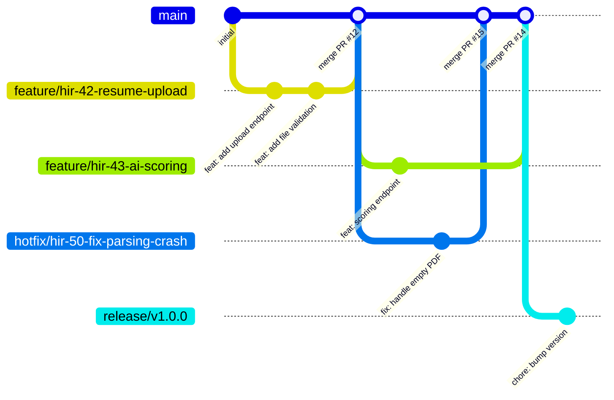
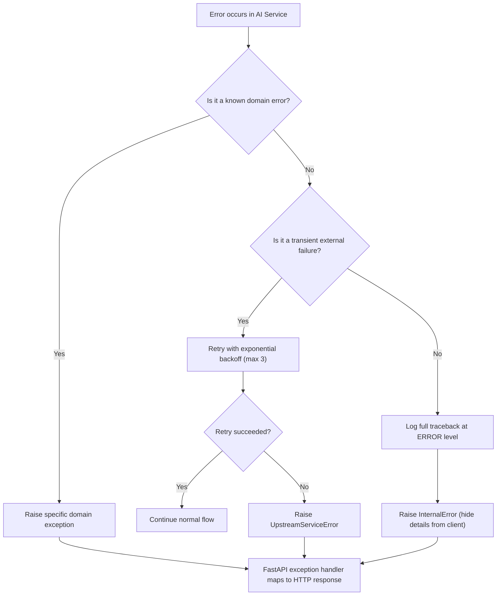
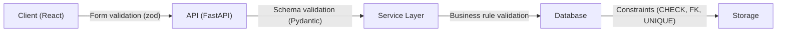
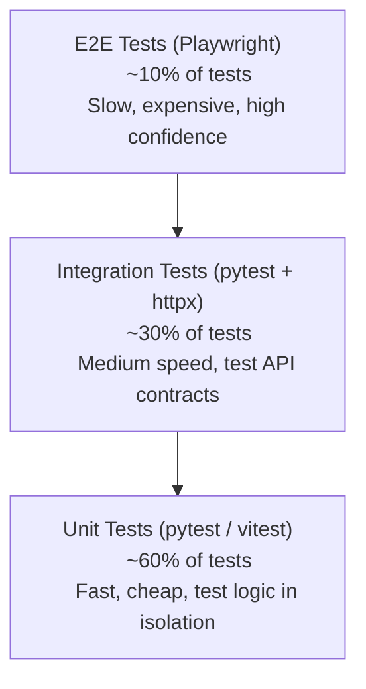

# Hiron Engineering Guidelines

> **Document Type**: Engineering Handbook  
> **Version**: 1.0  
> **Date**: July 28, 2026  
> **Status**: Governing Document — All Contributors Must Follow  
> **Scope**: Applies to all code, documentation, and processes in the Hiron project

---

## How to Read This Document

Every guideline follows this structure:

- **Rule**: The specific, enforceable standard
- **Rationale**: Why this rule exists — the engineering reasoning
- **Good Example**: What compliance looks like
- **Bad Example**: What violations look like
- **Common Mistakes**: Pitfalls that even experienced engineers hit

Rules marked with 🔴 are **blocking** — PRs that violate them will be rejected. Rules marked with 🟡 are **advisory** — violations should be discussed but won't block merges.

---

## 1. Engineering Principles

These seven principles govern every technical decision at Hiron. When in doubt, refer back to these.

### Principle 1: Clarity Over Cleverness 🔴

**Rule**: Write code that a new team member can understand in under 30 seconds. No clever one-liners, no implicit behavior, no magic.

**Rationale**: Hiron is a startup. Engineers will join mid-sprint with zero context. Code that requires tribal knowledge to understand is a liability. The time saved writing "clever" code is paid back 10x in debugging and onboarding costs.

**Good Example**:
```python
def calculate_fit_score(resume: ParsedResume, job: JobDescription) -> FitScore:
    skill_score = compute_skill_match(resume.skills, job.required_skills)
    experience_score = compute_experience_relevance(resume.experience, job.requirements)
    education_score = compute_education_fit(resume.education, job.education_requirements)

    weighted_score = (
        skill_score * SKILL_WEIGHT
        + experience_score * EXPERIENCE_WEIGHT
        + education_score * EDUCATION_WEIGHT
    )

    return FitScore(
        total=weighted_score,
        breakdown=ScoreBreakdown(
            skills=skill_score,
            experience=experience_score,
            education=education_score,
        ),
    )
```

**Bad Example**:
```python
def score(r, j):
    return sum(w * f(r, j) for w, f in zip(W, [sk, ex, ed]))
```

**Common Mistakes**:
- Using single-letter variable names outside of loop indices or lambdas
- Relying on Python's `__dunder__` methods for business logic instead of explicit method names
- Writing "self-documenting code" that actually requires a PhD to parse

---

### Principle 2: Explicit Over Implicit 🔴

**Rule**: Make dependencies, side effects, and data flow visible. No hidden state mutations, no global singletons for business logic, no action-at-a-distance.

**Rationale**: Implicit behavior creates bugs that are invisible in code review and only manifest in production. In an AI system like Hiron, where data flows through parsing → embedding → scoring → storage, every transformation must be traceable.

**Good Example**:
```python
# Dependencies are explicit via function parameters
async def score_candidate(
    resume: ParsedResume,
    job: JobDescription,
    llm_client: LLMClient,
    embedding_service: EmbeddingService,
) -> CandidateScore:
    ...
```

**Bad Example**:
```python
# Hidden dependency on global state
async def score_candidate(resume_id: int, job_id: int):
    # Where does db come from? What is llm? Who initialized these?
    resume = db.get(resume_id)
    score = llm.score(resume)
    ...
```

**Common Mistakes**:
- Using module-level mutable state (global dicts, lists) for caching or config
- Importing side-effectful modules that run code on import
- FastAPI dependency injection that hides 5 layers of indirection

---

### Principle 3: Fail Fast, Fail Loud 🔴

**Rule**: Validate inputs at boundaries. Raise exceptions immediately when invariants are violated. Never silently swallow errors or return default values for error cases.

**Rationale**: Silent failures in an AI scoring system are catastrophic. If a resume fails to parse and we silently return a score of 0, the recruiter makes a bad hiring decision. We'd rather show an error than show wrong data.

**Good Example**:
```python
def parse_resume(file: UploadFile) -> ParsedResume:
    if file.content_type not in ALLOWED_CONTENT_TYPES:
        raise InvalidFileTypeError(
            f"Unsupported file type: {file.content_type}. "
            f"Allowed: {', '.join(ALLOWED_CONTENT_TYPES)}"
        )

    content = extract_text(file)
    if not content.strip():
        raise EmptyResumeError("Resume file contains no extractable text.")

    return run_parser(content)
```

**Bad Example**:
```python
def parse_resume(file):
    try:
        return run_parser(file)
    except Exception:
        return None  # Caller has no idea what went wrong
```

**Common Mistakes**:
- Catching `Exception` or `BaseException` without re-raising or logging
- Returning `None` instead of raising — forces every caller to null-check
- Using boolean return values for operations that can fail in multiple ways

---

### Principle 4: Design for Testability 🟡

**Rule**: Every function should be testable in isolation. Use dependency injection, avoid hard-coded external calls, and separate pure logic from I/O.

**Rationale**: Untestable code is untrustworthy code. If you can't write a unit test for it, you can't verify it works, and you can't refactor it safely.

**Good Example**:
```python
# Pure function — easy to test
def compute_skill_match(
    candidate_skills: list[str],
    required_skills: list[str],
) -> float:
    if not required_skills:
        return 1.0
    matched = set(normalize(s) for s in candidate_skills) & set(normalize(s) for s in required_skills)
    return len(matched) / len(required_skills)
```

**Bad Example**:
```python
# Impossible to test without mocking the database AND the AI service
def compute_skill_match(candidate_id: int, job_id: int) -> float:
    candidate = db.query(Candidate).get(candidate_id)
    job = db.query(Job).get(job_id)
    embedding = openai.embed(candidate.skills)
    ...
```

**Common Mistakes**:
- Mixing business logic with database queries in the same function
- Hard-coding API URLs inside functions instead of injecting clients
- Writing "integration tests" and calling them "unit tests"

---

### Principle 5: Optimize for Change, Not for Perfection 🟡

**Rule**: Write code that's easy to modify, not code that's "perfect." Prefer simple, slightly repetitive code over deeply abstracted code. Create abstractions only when you've seen the same pattern three times.

**Rationale**: Hiron is a startup. Requirements will change weekly. The codebase that survives is the one that can be changed in hours, not days. Premature abstraction is the root of all evil in startup engineering.

**Good Example**:
```python
# Two similar but not identical handlers — keep them separate
@router.post("/resumes/{resume_id}/score")
async def score_single_resume(...): ...

@router.post("/jobs/{job_id}/score-all")
async def score_all_candidates_for_job(...): ...
```

**Bad Example**:
```python
# Over-abstracted "generic scorer" that handles 5 different cases
# with flags and conditional logic
@router.post("/score")
async def universal_score(
    mode: Literal["single", "batch", "rerank", "compare", "explain"],
    ...
): ...
```

**Common Mistakes**:
- Building plugin systems before you have 2 plugins
- Creating abstract base classes with one implementation
- Spending 2 days on a "generic solution" for a problem you've seen once

---

### Principle 6: Own Your Dependencies 🟡

**Rule**: Minimize external dependencies. For every new dependency, ask: "Can we write this in 50 lines?" If yes, write it. If no, vet the dependency (maintenance status, bundle size, security history) before adding it.

**Rationale**: Every dependency is a risk — it can be abandoned, compromised, or introduce breaking changes. In a security-sensitive application handling PII (resumes), supply chain attacks are a real threat.

**Good Example**:
```
# Adding a dependency — document why in the PR
# PR Description:
# Adding `python-multipart` (v0.0.9) — required by FastAPI for
# file upload handling. Maintained by the Encode team (same as
# Starlette). 2.3M monthly downloads. No known CVEs.
```

**Bad Example**:
```
# package.json with 47 dependencies for a dashboard page
# including: moment.js (use date-fns or Intl), lodash (use native
# JS), classnames (use template literals), uuid (use crypto.randomUUID())
```

**Common Mistakes**:
- Adding a library for one utility function (e.g., `lodash` just for `_.debounce`)
- Not pinning dependency versions in lockfiles
- Ignoring Dependabot alerts for weeks

---

### Principle 7: Observability Is Not Optional 🔴

**Rule**: Every service must emit structured logs, metrics, and traces. If it's not observable, it doesn't exist in production.

**Rationale**: Hiron's AI pipeline is a black box by nature (LLM calls, embedding generation, scoring). Without observability, debugging production issues becomes guesswork. We must know: what went in, what came out, how long it took, and whether it succeeded.

**Good Example**:
```python
logger.info(
    "candidate_scored",
    extra={
        "resume_id": resume.id,
        "job_id": job.id,
        "score": result.total,
        "model_version": "gpt-4o-2024-08-06",
        "latency_ms": elapsed_ms,
        "tenant_id": context.tenant_id,
    },
)
```

**Bad Example**:
```python
print(f"scored {resume_id}")  # No structure, no context, lost in stdout
```

**Common Mistakes**:
- Logging PII (candidate names, emails) in plain text
- Using `print()` instead of structured logging
- Not including `tenant_id` in logs (makes multi-tenant debugging impossible)

---

## 2. Coding Standards (Universal)

These rules apply to ALL code in the Hiron project, regardless of language.

### 2.1 Maximum Line Length 🔴

**Rule**: 100 characters for code, 120 characters for comments and docstrings.

**Rationale**: Readable on a single monitor without horizontal scrolling. Accommodates side-by-side diff views in code review.

**Common Mistakes**:
- Breaking lines in the middle of a string literal — use implicit string concatenation or parentheses
- Using `\` line continuation in Python — use parentheses instead

---

### 2.2 Maximum Function Length 🟡

**Rule**: Functions should be ≤ 30 lines of logic (excluding docstrings, blank lines, and type annotations). If a function exceeds 30 lines, extract helper functions.

**Rationale**: Long functions have high cognitive load, are hard to test, and tend to accumulate responsibilities. 30 lines is roughly one "screen" of code.

**Good Example**:
```python
async def process_resume_upload(file: UploadFile, tenant_id: str) -> ResumeResponse:
    validated_file = validate_upload(file)
    stored_path = await store_file(validated_file, tenant_id)
    resume_record = await create_resume_record(stored_path, tenant_id)
    await enqueue_parse_task(resume_record.id)
    return ResumeResponse.from_record(resume_record)
```

**Bad Example**: A 150-line function that validates, stores, parses, scores, and emails — all in one function body.

**Common Mistakes**:
- Extracting functions that are only called once AND have no reuse potential — sometimes inline is clearer
- Creating `_helper1()`, `_helper2()` with meaningless names

---

### 2.3 No Magic Numbers or Strings 🔴

**Rule**: All literal values that carry domain meaning must be named constants or configuration values.

**Rationale**: Magic numbers make code unreadable and unmaintainable. "What does 0.7 mean?" is a question no one should have to ask during code review.

**Good Example**:
```python
SKILL_MATCH_WEIGHT = 0.4
EXPERIENCE_WEIGHT = 0.35
EDUCATION_WEIGHT = 0.25

MINIMUM_FIT_SCORE_FOR_SHORTLIST = 70
```

**Bad Example**:
```python
if score > 0.7:
    move_to_stage(candidate, 3)  # What is 0.7? What is stage 3?
```

**Common Mistakes**:
- Defining constants but putting them in a random `utils.py` instead of a domain-specific constants module
- Over-extracting: `HTTP_STATUS_OK = 200` is unnecessary — everyone knows 200

---

### 2.4 No Dead Code 🔴

**Rule**: Do not commit commented-out code, unused imports, unused variables, or unreachable branches. Delete them. Git preserves history.

**Rationale**: Dead code is confusing. Readers waste time wondering if it's intentional, if it's needed for a future feature, or if it's a bug.

**Good Example**: Delete the old implementation. Reference the git commit in a comment if needed.
```python
# Previous scoring algorithm removed in commit abc123.
# See ADR-007 for migration rationale.
```

**Bad Example**:
```python
# def old_score_algorithm(resume):
#     # TODO: maybe use this later?
#     score = 0
#     for skill in resume.skills:
#         score += 1
#     return score
```

**Common Mistakes**:
- Keeping "backup" code in comments "just in case"
- Leaving unused imports that the formatter didn't catch

---

### 2.5 TODO Discipline 🟡

**Rule**: Every `TODO` comment must include: the author's name, a ticket ID (or "NO-TICKET" if pre-tracker), and a one-line description. TODOs without tickets must be filed within one sprint.

**Rationale**: TODOs without ownership are permanent. They accumulate until the codebase is a graveyard of good intentions.

**Good Example**:
```python
# TODO(anurag, HIR-142): Add retry logic for OpenAI rate limits
```

**Bad Example**:
```python
# TODO: fix this later
# FIXME: doesn't work sometimes
# HACK: temporary workaround
```

**Common Mistakes**:
- Writing TODOs during a PR and never creating the corresponding ticket
- Using `FIXME` and `HACK` without any tracking — these are TODOs with extra anxiety

---

## 3. Python Style Guide

**Applies to**: Backend (FastAPI), AI Service, Celery Workers

**Baseline**: PEP 8 + PEP 257, enforced by `ruff` (linter + formatter)

### 3.1 Tooling 🔴

**Rule**: All Python code must pass the following tools with zero warnings:

| Tool | Purpose | Config Location |
|---|---|---|
| `ruff` | Linting + formatting (replaces black, isort, flake8) | `pyproject.toml` |
| `mypy` (strict mode) | Static type checking | `pyproject.toml` |
| `bandit` | Security linting | `pyproject.toml` |

**Rationale**: Automated formatting eliminates style debates in code review. Type checking catches bugs before tests. Security linting catches vulnerabilities before production.

**Common Mistakes**:
- Adding `# type: ignore` without a comment explaining why
- Disabling ruff rules per-file without team approval

---

### 3.2 Type Annotations 🔴

**Rule**: All function signatures must have complete type annotations — parameters AND return type. No `Any` unless interfacing with an untyped library (and document why).

**Rationale**: Hiron's AI pipeline passes complex data structures (resumes, scores, embeddings) through many layers. Type annotations are the contract between layers. Without them, a refactor in the AI service can silently break the API layer.

**Good Example**:
```python
async def get_candidates_for_job(
    job_id: uuid.UUID,
    tenant_id: uuid.UUID,
    *,
    limit: int = 50,
    offset: int = 0,
    min_score: float | None = None,
) -> PaginatedResponse[CandidateWithScore]:
    ...
```

**Bad Example**:
```python
async def get_candidates(job_id, tenant_id, **kwargs):
    ...
```

**Common Mistakes**:
- Using `dict` instead of a TypedDict or Pydantic model for structured data
- Using `list` without element type: `list` vs `list[CandidateScore]`
- Annotating with `Optional[X]` instead of `X | None` (use the modern union syntax)

---

### 3.3 Pydantic Models 🔴

**Rule**: All API request/response bodies, configuration objects, and inter-service DTOs must be Pydantic `BaseModel` subclasses. Use `model_validator` and `field_validator` for business rules. Never pass raw dicts across function boundaries.

**Rationale**: Pydantic gives us runtime validation, serialization, and documentation (OpenAPI schema) in one place. Raw dicts are invisible contracts — they break silently.

**Good Example**:
```python
class CreateJobRequest(BaseModel):
    title: str = Field(..., min_length=3, max_length=200)
    description: str = Field(..., min_length=50)
    required_skills: list[str] = Field(..., min_length=1)
    experience_years_min: int = Field(..., ge=0, le=50)
    experience_years_max: int = Field(..., ge=0, le=50)
    location: str | None = None

    @model_validator(mode="after")
    def validate_experience_range(self) -> "CreateJobRequest":
        if self.experience_years_max < self.experience_years_min:
            raise ValueError("experience_years_max must be >= experience_years_min")
        return self
```

**Bad Example**:
```python
@router.post("/jobs")
async def create_job(request: dict):  # No validation, no docs
    title = request.get("title", "")  # Silent default on missing field
    ...
```

**Common Mistakes**:
- Using `model_config = ConfigDict(extra="allow")` — this defeats the purpose of validation
- Putting presentation logic (formatting, localization) in Pydantic models
- Creating deeply nested model hierarchies instead of flat, purpose-specific models

---

### 3.4 Async/Await Discipline 🔴

**Rule**: Use `async def` for all I/O-bound operations (database, HTTP, file system). Use regular `def` for CPU-bound pure functions. Never call blocking I/O inside an `async` function without wrapping it in `asyncio.to_thread()`.

**Rationale**: A single blocking call in an async handler blocks the entire event loop, degrading performance for all concurrent requests. This is the #1 performance bug in FastAPI applications.

**Good Example**:
```python
# I/O-bound — use async
async def fetch_resume(resume_id: uuid.UUID, db: AsyncSession) -> Resume:
    result = await db.execute(select(Resume).where(Resume.id == resume_id))
    return result.scalar_one_or_none()

# CPU-bound — use sync, run in thread pool
def extract_text_from_pdf(pdf_bytes: bytes) -> str:
    # This is CPU-bound (PDF parsing), not I/O-bound
    return pdfplumber.open(io.BytesIO(pdf_bytes)).extract_text()

# Calling CPU-bound from async context
async def handle_resume_parse(pdf_bytes: bytes) -> str:
    return await asyncio.to_thread(extract_text_from_pdf, pdf_bytes)
```

**Bad Example**:
```python
async def fetch_resume(resume_id):
    # BLOCKS THE EVENT LOOP — requests.get is synchronous!
    response = requests.get(f"{AI_SERVICE_URL}/parse/{resume_id}")
    return response.json()
```

**Common Mistakes**:
- Using `requests` library in async code — use `httpx` with `AsyncClient` instead
- Calling synchronous SQLAlchemy session methods in async handlers
- Using `time.sleep()` instead of `asyncio.sleep()` in async functions

---

### 3.5 Import Organization 🔴

**Rule**: Imports must be organized in this order, separated by blank lines:
1. Standard library
2. Third-party packages
3. Local application imports

Within each group, sort alphabetically. `ruff` enforces this automatically.

**Good Example**:
```python
import asyncio
import uuid
from datetime import datetime, timezone

from fastapi import APIRouter, Depends, HTTPException, status
from pydantic import BaseModel, Field
from sqlalchemy.ext.asyncio import AsyncSession

from hiron.core.auth import get_current_user
from hiron.core.database import get_db
from hiron.models.candidate import Candidate
```

**Bad Example**:
```python
from hiron.core.auth import get_current_user
import uuid
from fastapi import *
from sqlalchemy.ext.asyncio import AsyncSession
import asyncio
from hiron.models.candidate import Candidate
from pydantic import BaseModel
```

**Common Mistakes**:
- Using wildcard imports (`from module import *`) — these pollute the namespace and break static analysis
- Circular imports caused by importing models at module level — use `TYPE_CHECKING` guard

---

### 3.6 Exception Classes 🔴

**Rule**: Define domain-specific exception classes in a dedicated `exceptions.py` module per package. Never raise generic `Exception`, `ValueError`, or `RuntimeError` for business logic errors.

**Rationale**: Domain exceptions carry semantic meaning. They can be caught selectively, mapped to specific HTTP status codes, and documented in API specs.

**Good Example**:
```python
# hiron/core/exceptions.py
class HironError(Exception):
    """Base exception for all Hiron domain errors."""

class ResumeParsingError(HironError):
    """Raised when a resume cannot be parsed."""

class CandidateNotFoundError(HironError):
    """Raised when a candidate does not exist or is not accessible."""

class TenantAccessDeniedError(HironError):
    """Raised when a user attempts to access another tenant's data."""
```

**Bad Example**:
```python
raise Exception("resume not found")
raise ValueError("bad input")  # What input? What was bad about it?
```

**Common Mistakes**:
- Creating too many exception classes — keep it to one per failure mode, not one per function
- Not including the base `HironError` class — makes it impossible to catch "all domain errors"

---

### 3.7 SQLAlchemy Model Conventions 🔴

**Rule**: All SQLAlchemy models must:
- Inherit from a `Base` class with common columns (`id`, `tenant_id`, `created_at`, `updated_at`)
- Use `Mapped` type annotations (SQLAlchemy 2.0 style)
- Define `__tablename__` explicitly
- Include `__repr__` for debugging

**Good Example**:
```python
class Candidate(TenantBase):
    __tablename__ = "candidates"

    id: Mapped[uuid.UUID] = mapped_column(
        UUID(as_uuid=True), primary_key=True, default=uuid.uuid4
    )
    tenant_id: Mapped[uuid.UUID] = mapped_column(
        UUID(as_uuid=True), ForeignKey("tenants.id"), index=True
    )
    email: Mapped[str] = mapped_column(String(320), index=True)
    full_name: Mapped[str] = mapped_column(String(200))
    status: Mapped[CandidateStatus] = mapped_column(
        SAEnum(CandidateStatus), default=CandidateStatus.ACTIVE
    )
    parsed_data: Mapped[dict | None] = mapped_column(JSONB, nullable=True)
    created_at: Mapped[datetime] = mapped_column(default=func.now())
    updated_at: Mapped[datetime] = mapped_column(default=func.now(), onupdate=func.now())

    def __repr__(self) -> str:
        return f"<Candidate(id={self.id}, email={self.email})>"
```

**Bad Example**:
```python
class Candidate(Base):
    # Old SQLAlchemy 1.x style — no type safety
    id = Column(Integer, primary_key=True, autoincrement=True)  # Integer IDs are guessable
    name = Column(String)  # No length constraint
    data = Column(JSON)  # No indication of what's inside
```

**Common Mistakes**:
- Using integer auto-increment IDs — use UUIDs for security (IDs shouldn't be guessable/enumerable)
- Forgetting `index=True` on columns used in WHERE clauses
- Not setting `nullable` explicitly — SQLAlchemy's default is `nullable=True`, which is often not what you want

---

## 4. TypeScript Style Guide

**Applies to**: Frontend (Next.js), any shared packages

**Baseline**: ESLint (strict config) + Prettier, enforced in CI

### 4.1 Tooling 🔴

**Rule**: All TypeScript code must pass:

| Tool | Purpose | Config Location |
|---|---|---|
| `eslint` | Linting (Next.js config + strict TypeScript rules) | `.eslintrc.json` |
| `prettier` | Formatting | `.prettierrc` |
| `tsc --noEmit` | Type checking (strict mode) | `tsconfig.json` |

**Common Mistakes**:
- Disabling `@typescript-eslint/no-explicit-any` globally — fix the types instead
- Using `prettier-ignore` to avoid reformatting — your code isn't special

---

### 4.2 Strict TypeScript Configuration 🔴

**Rule**: `tsconfig.json` must enable `strict: true`. This includes `noImplicitAny`, `strictNullChecks`, `strictFunctionTypes`, and all other strict flags. No exceptions.

**Rationale**: `strict: true` catches an entire class of bugs at compile time — null dereferences, implicit any types, incorrect function signatures. Disabling it "temporarily" always becomes permanent.

**Good Example**:
```json
{
  "compilerOptions": {
    "strict": true,
    "noUncheckedIndexedAccess": true,
    "noUnusedLocals": true,
    "noUnusedParameters": true
  }
}
```

**Bad Example**:
```json
{
  "compilerOptions": {
    "strict": false,
    "noImplicitAny": false
  }
}
```

**Common Mistakes**:
- Adding `as any` to silence type errors — this hides bugs
- Using `!` (non-null assertion) without verifying the value exists

---

### 4.3 Component Structure 🔴

**Rule**: React components must follow this structure:
1. Type/interface definitions (Props)
2. Component function (named export, not default export)
3. Helper functions (below the component or in a separate file)

Use function declarations, not arrow functions, for components.

**Rationale**: Named exports are refactor-friendly (rename propagates everywhere). Function declarations are hoisted and appear clearly in stack traces.

**Good Example**:
```tsx
// candidate-score-card.tsx

interface CandidateScoreCardProps {
  candidate: CandidateWithScore;
  onStageChange: (candidateId: string, stage: PipelineStage) => void;
}

export function CandidateScoreCard({ candidate, onStageChange }: CandidateScoreCardProps) {
  const { total, breakdown } = candidate.score;

  return (
    <Card>
      <CardHeader>
        <h3>{candidate.fullName}</h3>
        <ScoreBadge score={total} />
      </CardHeader>
      <CardContent>
        <ScoreBreakdown breakdown={breakdown} />
      </CardContent>
    </Card>
  );
}
```

**Bad Example**:
```tsx
// Bad: default export with arrow function
const Card = (props: any) => {
  return <div>{props.children}</div>;
};

export default Card;
```

**Common Mistakes**:
- Using `React.FC` — it adds an implicit `children` prop and has been discouraged by the React team
- Defining Props inline instead of as a named interface
- Default exports make imports inconsistent across the codebase

---

### 4.4 State Management 🔴

**Rule**: Follow this hierarchy for state:
1. **Local state** (`useState`) — for UI-only state (modals, form inputs)
2. **Server state** (`TanStack Query`) — for all data fetched from the API
3. **Global client state** (`Zustand`) — only for truly cross-cutting client state (theme, sidebar open/closed, current tenant)

Never use Zustand for server-fetched data. Never use `useEffect` to "sync" server data into local state.

**Rationale**: The #1 bug source in React apps is stale state from manual caching of server data. TanStack Query handles caching, revalidation, and optimistic updates correctly. Using it for all server state eliminates an entire class of bugs.

**Good Example**:
```tsx
// Server data — TanStack Query
function useCandidates(jobId: string) {
  return useQuery({
    queryKey: ["candidates", jobId],
    queryFn: () => api.getCandidates(jobId),
  });
}

// Global client state — Zustand (rare)
const useUIStore = create<UIState>((set) => ({
  sidebarOpen: true,
  toggleSidebar: () => set((state) => ({ sidebarOpen: !state.sidebarOpen })),
}));
```

**Bad Example**:
```tsx
// ANTI-PATTERN: Fetching in useEffect and storing in useState
const [candidates, setCandidates] = useState([]);
useEffect(() => {
  fetch(`/api/candidates/${jobId}`)
    .then((res) => res.json())
    .then(setCandidates);
}, [jobId]); // No loading state, no error handling, stale on refocus
```

**Common Mistakes**:
- Creating a Zustand store for every feature — most features only need TanStack Query
- Using `useEffect` for data fetching — this is what TanStack Query is for
- Not setting `staleTime` in TanStack Query — default of 0 causes excessive refetching

---

### 4.5 API Client Layer 🔴

**Rule**: All API calls must go through a typed API client. Never call `fetch()` directly from components. The API client handles: base URL, auth headers, error transformation, and response typing.

**Good Example**:
```typescript
// lib/api/candidates.ts
export const candidatesApi = {
  list: async (jobId: string, params?: ListParams): Promise<PaginatedResponse<Candidate>> => {
    return httpClient.get(`/api/v1/jobs/${jobId}/candidates`, { params });
  },

  getScore: async (candidateId: string, jobId: string): Promise<CandidateScore> => {
    return httpClient.get(`/api/v1/candidates/${candidateId}/scores/${jobId}`);
  },

  updateStage: async (candidateId: string, stage: PipelineStage): Promise<Candidate> => {
    return httpClient.patch(`/api/v1/candidates/${candidateId}`, { stage });
  },
};
```

**Bad Example**:
```tsx
// Directly in a component — no typing, no error handling, no auth
const res = await fetch("/api/v1/candidates/" + id);
const data = await res.json();
```

**Common Mistakes**:
- Duplicating fetch logic across components
- Not handling non-2xx responses (fetch doesn't throw on 4xx/5xx)
- Hard-coding the API base URL in multiple places

---

## 5. Folder Naming Conventions

### 5.1 Monorepo Structure 🔴

**Rule**: The project follows a monorepo structure with clear top-level separation:

```
hiron/
├── apps/
│   ├── web/                    # Next.js frontend
│   └── api/                    # FastAPI backend
├── packages/
│   └── shared-types/           # Shared TypeScript types (if needed)
├── services/
│   └── ai/                     # AI Service (FastAPI)
├── workers/
│   └── celery/                 # Celery worker definitions
├── infra/
│   ├── terraform/              # Infrastructure as Code
│   └── docker/                 # Dockerfiles and compose files
├── docs/                       # Architecture Decision Records, runbooks
├── scripts/                    # Development and deployment scripts
└── .github/
    └── workflows/              # CI/CD pipeline definitions
```

**Rationale**: The monorepo keeps all related code in one place, enables atomic cross-service changes, and simplifies dependency management. The top-level directories map directly to our architectural components from the approved design.

---

### 5.2 Folder Naming Rules 🔴

**Rule**:
- All folders use **kebab-case** (lowercase with hyphens): `score-engine/`, `api-client/`
- No abbreviations unless universally understood: `auth/` ✅, `authn/` ❌, `db/` ✅, `dbase/` ❌
- Singular nouns for modules, plural for collections: `model/` (the model layer), `models/` (contains many model files)

**Good Example**:
```
apps/api/
├── hiron/
│   ├── auth/
│   ├── candidates/
│   ├── jobs/
│   ├── pipeline/
│   ├── scoring/
│   ├── search/
│   ├── core/
│   │   ├── database/
│   │   ├── middleware/
│   │   └── config/
│   └── common/
│       ├── exceptions/
│       └── types/
```

**Bad Example**:
```
API/
├── Src/
│   ├── Controllers/           # Not a Python pattern
│   ├── Helpers/               # Vague
│   ├── Misc/                  # Meaningless
│   └── stuff/                 # Unacceptable
```

**Common Mistakes**:
- Mixing camelCase and kebab-case in the same project
- Creating a `utils/` or `helpers/` catch-all folder — break utilities into domain-specific modules
- Nesting more than 4 levels deep — flat is better than nested

---

### 5.3 Frontend Folder Structure (Next.js App Router) 🔴

**Rule**:
```
apps/web/
├── src/
│   ├── app/                    # Next.js App Router pages and layouts
│   │   ├── (auth)/             # Route group for auth pages
│   │   │   ├── login/
│   │   │   └── register/
│   │   ├── (dashboard)/        # Route group for authenticated pages
│   │   │   ├── jobs/
│   │   │   ├── candidates/
│   │   │   ├── pipeline/
│   │   │   └── settings/
│   │   ├── layout.tsx
│   │   └── page.tsx
│   ├── components/
│   │   ├── ui/                 # shadcn/ui primitives (Button, Card, etc.)
│   │   ├── candidates/         # Candidate-specific components
│   │   ├── jobs/               # Job-specific components
│   │   ├── pipeline/           # Pipeline-specific components
│   │   └── layout/             # Shell, sidebar, header
│   ├── hooks/                  # Custom React hooks
│   ├── lib/                    # Utilities, API client, helpers
│   │   ├── api/                # Typed API client functions
│   │   ├── utils/              # Pure utility functions
│   │   └── constants/          # App-wide constants
│   ├── stores/                 # Zustand stores (minimal)
│   └── types/                  # TypeScript type definitions
├── public/                     # Static assets
├── next.config.ts
├── tailwind.config.ts
└── tsconfig.json
```

**Rationale**: Components are organized by domain (candidates, jobs, pipeline), not by type (buttons, forms, tables). This keeps related code together and makes it easy to find everything related to a feature.

**Common Mistakes**:
- Putting all components in a flat `components/` folder — doesn't scale past 20 components
- Creating `components/common/` as a dumping ground — use `components/ui/` for primitives

---

## 6. File Naming Conventions

### 6.1 Python Files 🔴

**Rule**: All Python files use **snake_case**: `candidate_service.py`, `fit_score.py`, `test_scoring.py`

| File Type | Pattern | Example |
|---|---|---|
| Module | `<domain>_<purpose>.py` | `candidate_service.py` |
| Model | `<entity>.py` | `candidate.py`, `job.py` |
| Schema (Pydantic) | `<entity>_schema.py` | `candidate_schema.py` |
| Router | `<domain>_router.py` | `candidate_router.py` |
| Tests | `test_<module>.py` | `test_candidate_service.py` |
| Exceptions | `exceptions.py` | One per package |
| Constants | `constants.py` | One per package |
| Config | `config.py` | One at app level |

**Good Example**: `apps/api/hiron/scoring/score_calculator.py`

**Bad Example**: `apps/api/hiron/scoring/ScoreCalculator.py` (PascalCase is for classes, not files)

---

### 6.2 TypeScript/React Files 🔴

**Rule**: All TypeScript files use **kebab-case**: `candidate-score-card.tsx`, `use-candidates.ts`

| File Type | Pattern | Example |
|---|---|---|
| Component | `<component-name>.tsx` | `candidate-score-card.tsx` |
| Hook | `use-<name>.ts` | `use-candidates.ts` |
| Utility | `<purpose>.ts` | `format-date.ts` |
| Type definitions | `<domain>.types.ts` | `candidate.types.ts` |
| API client | `<domain>.api.ts` | `candidates.api.ts` |
| Constants | `<domain>.constants.ts` | `pipeline.constants.ts` |
| Tests | `<module>.test.ts(x)` | `candidate-score-card.test.tsx` |
| Storybook | `<component>.stories.tsx` | `candidate-score-card.stories.tsx` |

**Good Example**: `src/components/candidates/candidate-score-card.tsx`

**Bad Example**: `src/components/candidates/CandidateScoreCard.tsx` (PascalCase filenames cause issues on case-insensitive file systems like macOS)

**Common Mistakes**:
- Using PascalCase for filenames — works on Linux, breaks on macOS/Windows
- Putting the test file far from the source file — colocate: `button.tsx` and `button.test.tsx` in the same folder

---

### 6.3 Configuration and Infrastructure Files 🔴

| File Type | Convention | Example |
|---|---|---|
| Docker | `Dockerfile.<target>` | `Dockerfile.api`, `Dockerfile.worker` |
| Docker Compose | `docker-compose.<env>.yml` | `docker-compose.dev.yml` |
| Terraform | `<resource>.tf` | `ecs.tf`, `rds.tf`, `iam.tf` |
| Environment | `.env.<environment>` | `.env.local`, `.env.staging` |
| GitHub Actions | `<purpose>.yml` | `ci.yml`, `deploy-staging.yml` |

---

## 7. API Naming Conventions

### 7.1 URL Structure 🔴

**Rule**: All API endpoints follow this pattern:

```
/{version}/{resource}/{id}/{sub-resource}/{sub-id}
```

- Version: `v1`, `v2` (major version only)
- Resources: plural nouns, kebab-case
- IDs: UUID format
- No verbs in URLs — use HTTP methods for actions

**Good Example**:
```
GET    /api/v1/jobs                           # List jobs
POST   /api/v1/jobs                           # Create job
GET    /api/v1/jobs/{job_id}                   # Get job
PATCH  /api/v1/jobs/{job_id}                   # Update job
DELETE /api/v1/jobs/{job_id}                   # Delete job
GET    /api/v1/jobs/{job_id}/candidates        # List candidates for job
POST   /api/v1/jobs/{job_id}/candidates/score  # Score candidates for job
GET    /api/v1/candidates/{candidate_id}/scores # Get all scores for candidate
```

**Bad Example**:
```
POST   /api/v1/getJobs                 # Verb in URL
GET    /api/v1/job/list                 # Singular resource, redundant "list"
POST   /api/v1/candidates/scoreAll     # camelCase, verb in URL
GET    /api/v1/get-candidate-by-id/123 # Verb in URL, integer ID
```

**Common Mistakes**:
- Using verbs in URLs — the HTTP method IS the verb
- Inconsistent pluralization — pick plural and stick with it
- Nesting more than 2 levels deep — flatten with query params instead

---

### 7.2 Request/Response Conventions 🔴

**Rule**:
- Request bodies use **camelCase** keys (JSON convention for frontend consumption)
- Response bodies use **camelCase** keys
- Pydantic models use snake_case internally with `alias_generator = to_camel` for serialization
- All responses wrap data in a consistent envelope

**Good Example**:
```json
// POST /api/v1/jobs — Request
{
  "title": "Senior Backend Engineer",
  "description": "We are looking for...",
  "requiredSkills": ["Python", "FastAPI", "PostgreSQL"],
  "experienceYearsMin": 5
}

// 201 Created — Response
{
  "data": {
    "id": "550e8400-e29b-41d4-a716-446655440000",
    "title": "Senior Backend Engineer",
    "requiredSkills": ["Python", "FastAPI", "PostgreSQL"],
    "createdAt": "2026-07-28T12:00:00Z"
  }
}

// Error Response
{
  "error": {
    "code": "VALIDATION_ERROR",
    "message": "experienceYearsMin must be >= 0",
    "details": [
      {
        "field": "experienceYearsMin",
        "message": "Value must be greater than or equal to 0",
        "value": -1
      }
    ]
  }
}
```

**Bad Example**:
```json
// Inconsistent casing, no envelope
{
  "job_title": "Engineer",
  "RequiredSkills": ["Python"],
  "created": "2026-07-28"
}
```

**Common Mistakes**:
- Returning raw database objects that expose internal fields (`tenant_id`, `_sa_instance_state`)
- Inconsistent date formats — always use ISO 8601 with UTC timezone
- Returning `null` for missing fields vs. omitting them — pick one strategy and be consistent (we omit optional null fields)

---

### 7.3 Pagination 🔴

**Rule**: All list endpoints must support cursor-based pagination with a consistent interface:

```
GET /api/v1/jobs?limit=20&cursor=eyJpZCI6MTAwfQ==
```

**Response**:
```json
{
  "data": [...],
  "pagination": {
    "hasMore": true,
    "nextCursor": "eyJpZCI6MTIwfQ==",
    "totalCount": 350
  }
}
```

**Rationale**: Offset-based pagination (`?page=5&limit=20`) is broken for real-time data — inserts/deletes shift pages. Cursor-based pagination is stable and performant (uses indexed columns, not OFFSET which scans rows).

**Common Mistakes**:
- Using OFFSET for pagination — O(n) performance degradation as page number increases
- Not including `totalCount` — frontend needs it for "Showing 1–20 of 350"
- Using sequential integer cursors — they leak information about data volume

---

### 7.4 HTTP Status Codes 🔴

**Rule**: Use the correct HTTP status code for every response. No "200 OK with error in body" pattern.

| Scenario | Status Code |
|---|---|
| Successful read | `200 OK` |
| Successful create | `201 Created` |
| Successful async operation started | `202 Accepted` |
| Successful delete (no body) | `204 No Content` |
| Invalid request data | `400 Bad Request` |
| Not authenticated | `401 Unauthorized` |
| Authenticated but not authorized | `403 Forbidden` |
| Resource not found | `404 Not Found` |
| Duplicate resource (e.g., email already exists) | `409 Conflict` |
| Validation error | `422 Unprocessable Entity` |
| Rate limited | `429 Too Many Requests` |
| Server error | `500 Internal Server Error` |

**Common Mistakes**:
- Returning `200` with `{ "success": false, "error": "..." }` — this breaks HTTP client error handling
- Using `404` for authorization failures — use `403` (or `404` if you want to hide resource existence)
- Returning `500` for validation errors — these are client errors (`4xx`)

---

## 8. Database Naming Conventions

### 8.1 General Rules 🔴

**Rule**:
- All identifiers use **snake_case**
- Table names are **plural**: `candidates`, `jobs`, `pipeline_stages`
- Column names are **singular**: `email`, `full_name`, `created_at`
- Boolean columns are prefixed with `is_` or `has_`: `is_active`, `has_resume`
- Timestamp columns use `_at` suffix: `created_at`, `updated_at`, `scored_at`
- Foreign keys use `<referenced_table_singular>_id`: `candidate_id`, `job_id`

**Good Example**:
```sql
CREATE TABLE candidates (
    id              UUID PRIMARY KEY DEFAULT gen_random_uuid(),
    tenant_id       UUID NOT NULL REFERENCES tenants(id),
    email           VARCHAR(320) NOT NULL,
    full_name       VARCHAR(200) NOT NULL,
    is_active       BOOLEAN NOT NULL DEFAULT TRUE,
    has_resume      BOOLEAN NOT NULL DEFAULT FALSE,
    parsed_data     JSONB,
    created_at      TIMESTAMPTZ NOT NULL DEFAULT NOW(),
    updated_at      TIMESTAMPTZ NOT NULL DEFAULT NOW()
);
```

**Bad Example**:
```sql
CREATE TABLE Candidate (
    CandidateID     INT AUTO_INCREMENT,  -- PascalCase, integer ID
    candidateEmail  VARCHAR(255),         -- camelCase
    Name            VARCHAR(50),          -- Ambiguous, too short
    active          BIT,                  -- Missing is_ prefix
    data            TEXT,                 -- Meaningless name
    ts              TIMESTAMP             -- Abbreviated
);
```

---

### 8.2 Index Naming 🔴

**Rule**: Indexes follow the pattern `ix_<table>_<column(s)>`. Unique indexes use `uq_`. Check constraints use `ck_`.

```sql
CREATE INDEX ix_candidates_tenant_id ON candidates(tenant_id);
CREATE INDEX ix_candidates_email ON candidates(email);
CREATE UNIQUE INDEX uq_candidates_tenant_email ON candidates(tenant_id, email);
ALTER TABLE candidates ADD CONSTRAINT ck_candidates_email_format CHECK (email ~* '^.+@.+\..+$');
```

**Common Mistakes**:
- Letting the ORM auto-generate index names — they're unreadable (`ix_candidates_3a7b2c`)
- Forgetting composite indexes for multi-tenant queries (always include `tenant_id` first)

---

### 8.3 Migration Naming 🔴

**Rule**: Alembic migration files follow the pattern:
```
YYYY_MM_DD_HHMM_<description>.py
```

**Good Example**: `2026_07_28_1430_add_scoring_tables.py`

**Bad Example**: `migration_001.py`, `fix_stuff.py`

**Common Mistakes**:
- Autogenerated migrations that include unrelated changes — review and split them
- Migrations that are not reversible — always implement `downgrade()`

---

## 9. Git Branch Strategy

### 9.1 Branch Model: Trunk-Based Development with Short-Lived Feature Branches 🔴



### 9.2 Branch Naming 🔴

**Rule**:
```
<type>/<ticket-id>-<short-description>
```

| Type | Usage | Example |
|---|---|---|
| `feature/` | New functionality | `feature/hir-42-resume-upload` |
| `fix/` | Bug fixes | `fix/hir-50-parsing-crash` |
| `hotfix/` | Production emergency fixes | `hotfix/hir-51-auth-bypass` |
| `chore/` | Non-functional changes (deps, CI, docs) | `chore/hir-55-upgrade-fastapi` |
| `refactor/` | Code restructuring without behavior change | `refactor/hir-60-extract-scoring-module` |
| `release/` | Release preparation | `release/v1.0.0` |

**Bad Example**: `my-branch`, `fix-stuff`, `wip`, `test123`

**Common Mistakes**:
- Long-lived feature branches (> 3 days) — break work into smaller PRs
- Not including the ticket ID — makes it impossible to trace changes back to requirements

---

### 9.3 Branch Rules 🔴

| Rule | Rationale |
|---|---|
| `main` is always deployable | Broken `main` = blocked team |
| Feature branches merge via PR only (no direct push to `main`) | Enforces code review |
| Feature branches must be ≤ 3 days old | Long branches = painful merges |
| Squash merge to `main` | Clean linear history |
| Delete branch after merge | Avoid branch sprawl |
| No force-push to `main` or `release/*` | History must be immutable |

---

## 10. Commit Message Convention

### 10.1 Format: Conventional Commits 🔴

**Rule**: All commit messages follow the [Conventional Commits](https://www.conventionalcommits.org/) specification:

```
<type>(<scope>): <description>

[optional body]

[optional footer(s)]
```

### 10.2 Types 🔴

| Type | When to Use | Example |
|---|---|---|
| `feat` | New feature | `feat(scoring): add skill gap detection` |
| `fix` | Bug fix | `fix(parser): handle multi-page PDFs correctly` |
| `docs` | Documentation only | `docs(api): add OpenAPI examples for /jobs` |
| `style` | Formatting, whitespace (no logic change) | `style(api): run ruff formatter` |
| `refactor` | Code restructuring (no behavior change) | `refactor(auth): extract JWT validation into middleware` |
| `test` | Adding or updating tests | `test(scoring): add edge case for empty skills list` |
| `chore` | Build, CI, dependencies | `chore(deps): upgrade pydantic to 2.8` |
| `perf` | Performance improvement | `perf(search): add index on candidate embeddings` |
| `ci` | CI/CD changes | `ci: add staging deployment step` |
| `revert` | Revert a previous commit | `revert: feat(scoring): add skill gap detection` |

### 10.3 Scopes 🟡

Scopes map to Hiron's architectural components:

| Scope | Component |
|---|---|
| `auth` | Authentication and authorization |
| `candidates` | Candidate management |
| `jobs` | Job description management |
| `scoring` | AI scoring engine |
| `search` | Semantic search |
| `pipeline` | Candidate pipeline/workflow |
| `parser` | Resume parsing |
| `api` | API layer (general) |
| `web` | Frontend (Next.js) |
| `db` | Database/migrations |
| `infra` | Infrastructure/deployment |
| `deps` | Dependencies |

### 10.4 Rules 🔴

| Rule | Good | Bad |
|---|---|---|
| Description starts lowercase | `feat: add resume upload` | `feat: Add Resume Upload` |
| Description is imperative mood | `fix: handle null scores` | `fix: handled null scores` |
| No period at end | `feat: add search` | `feat: add search.` |
| ≤ 72 chars for subject line | Short and clear | A sentence that wraps three times and tells your life story |
| Breaking changes use `!` | `feat(api)!: change score response format` | buried in body text |
| Body explains **why**, not **what** | See example below | Repeats the code diff in English |

**Good Example (with body)**:
```
feat(scoring): add confidence level to fit scores

Recruiters reported that some AI scores felt unreliable, especially
for incomplete resumes. Adding a confidence level (low/medium/high)
based on the completeness of parsed data helps recruiters calibrate
their trust in the score.

Closes HIR-87
```

**Bad Example**:
```
updated stuff
```
```
fixed the thing
```
```
WIP
```

**Common Mistakes**:
- Committing `WIP` to a PR — squash your work-in-progress commits before requesting review
- Writing "what" instead of "why" in the body — the diff shows what changed, the body should explain why
- Forgetting the ticket reference in the footer

---

## 11. Pull Request Checklist

### 11.1 PR Template 🔴

Every PR must include the following sections. This should be configured as `.github/PULL_REQUEST_TEMPLATE.md`:

```markdown
## Summary
<!-- What does this PR do? Link to the ticket. -->

Closes HIR-XXX

## Changes
<!-- Bullet list of the key changes. -->

## Why
<!-- Why was this approach chosen? What alternatives were considered? -->

## Testing
<!-- How was this tested? Include test commands or screenshots. -->

## Checklist
- [ ] Code follows the Hiron Engineering Guidelines
- [ ] Type annotations are complete (Python: mypy passes, TS: tsc --noEmit passes)
- [ ] Unit tests added/updated for new logic
- [ ] Integration tests added/updated for new API endpoints
- [ ] No new warnings from linters (ruff, eslint)
- [ ] No new `Any` types or `type: ignore` without justification
- [ ] Database migrations are reversible (downgrade works)
- [ ] API changes are backward-compatible (or breaking change is documented)
- [ ] Logging added for new operations (structured, no PII)
- [ ] Error cases return appropriate HTTP status codes
- [ ] Documentation updated (API docs, ADRs if architectural)
- [ ] Tested locally with Docker Compose
```

### 11.2 PR Rules 🔴

| Rule | Rationale |
|---|---|
| PRs must be ≤ 400 lines of code (excluding tests and generated files) | Large PRs get rubber-stamped, not reviewed |
| PRs must have at least 1 approval before merge | Prevents unreviewed code in production |
| PRs must pass CI (lint, type check, tests) before review | Don't waste reviewer time on broken code |
| PRs must link to a ticket | Traceability |
| Draft PRs are for early feedback — don't request review on drafts | Respect reviewer's time |
| Review turnaround target: < 4 hours during business hours | Unreviewed PRs block progress |

**Common Mistakes**:
- Opening a 1,500-line PR and wondering why review takes 3 days — break it up
- Requesting review before CI passes — fix the build first
- Not responding to review comments within 24 hours — stale PRs are everyone's problem

---

## 12. Documentation Standards

### 12.1 Code Documentation (Python) 🔴

**Rule**: All public functions, classes, and modules must have Google-style docstrings. Private functions need docstrings only if non-obvious.

**Good Example**:
```python
async def score_candidate(
    resume: ParsedResume,
    job: JobDescription,
    llm_client: LLMClient,
) -> CandidateScore:
    """Score a candidate's resume against a job description.

    Uses a combination of semantic similarity (embeddings) and LLM-based
    evaluation to produce a fit score with explainable breakdown.

    Args:
        resume: The parsed and structured resume data.
        job: The job description to evaluate against.
        llm_client: Client for LLM API calls (injected for testability).

    Returns:
        A CandidateScore containing the total score (0-100) and
        per-dimension breakdown.

    Raises:
        ScoringError: If the LLM call fails after retries.
        InvalidResumeError: If the resume has insufficient data for scoring.
    """
```

**Bad Example**:
```python
def score(r, j):
    """Scores stuff."""
```

**Common Mistakes**:
- Docstrings that restate the function name: `def get_user(): """Gets the user."""` — add value or skip it
- Not documenting exceptions that callers need to handle
- Writing docstrings for trivial getters/setters — these add noise, not value

---

### 12.2 Code Documentation (TypeScript) 🔴

**Rule**: All exported functions, types, and components must have TSDoc comments. Use `@param`, `@returns`, `@throws`, and `@example` tags.

**Good Example**:
```typescript
/**
 * Displays a candidate's AI-generated fit score with an explainable breakdown.
 *
 * The score card shows the total score prominently and expands to reveal
 * per-dimension scores (skills, experience, education) on click.
 *
 * @param candidate - The candidate with their computed score data.
 * @param onStageChange - Callback fired when the recruiter changes the candidate's pipeline stage.
 *
 * @example
 * ```tsx
 * <CandidateScoreCard
 *   candidate={candidateWithScore}
 *   onStageChange={(id, stage) => updateStage(id, stage)}
 * />
 * ```
 */
export function CandidateScoreCard({ candidate, onStageChange }: CandidateScoreCardProps) {
```

---

### 12.3 Architecture Decision Records (ADRs) 🔴

**Rule**: Any architectural decision that affects more than one component must be documented as an ADR in `docs/adrs/`. ADRs are numbered sequentially and are immutable once accepted (superseded, not edited).

**Format**:
```markdown
# ADR-{number}: {Title}

## Status
Proposed | Accepted | Deprecated | Superseded by ADR-XXX

## Context
What is the problem? What forces are at play?

## Decision
What did we decide? Be specific.

## Consequences
What are the positive and negative outcomes of this decision?

## Alternatives Considered
What other options were evaluated and why were they rejected?
```

**Good Example**: `docs/adrs/001-use-pgvector-over-pinecone.md`

**Common Mistakes**:
- Making architectural decisions in Slack and not writing them down
- Editing accepted ADRs — write a new ADR that supersedes the old one
- ADRs without "Alternatives Considered" — decisions without alternatives aren't decisions

---

### 12.4 API Documentation 🔴

**Rule**: API documentation is auto-generated from FastAPI's OpenAPI spec (Pydantic models + route docstrings). Every endpoint must have:
- Summary (one line)
- Description (detailed, with examples)
- Request body example
- Response examples (success + each error case)

**Common Mistakes**:
- Manually maintaining API docs separately from code — they'll drift
- Not providing error response examples — clients need to know what `422` looks like

---

## 13. Logging Standards

### 13.1 Format: Structured JSON 🔴

**Rule**: All log output must be structured JSON. Use Python's `structlog` library. No `print()` statements. No f-string log messages (use structured key-value pairs).

**Rationale**: Structured logs can be queried, aggregated, and alerted on in Datadog. Unstructured text logs ("something went wrong") are unsearchable and useless for debugging.

**Good Example**:
```python
import structlog

logger = structlog.get_logger()

logger.info(
    "resume_parsed",
    resume_id=str(resume.id),
    tenant_id=str(tenant_id),
    skills_found=len(parsed.skills),
    experience_entries=len(parsed.experience),
    parse_duration_ms=elapsed_ms,
)
```

**Output**:
```json
{
  "event": "resume_parsed",
  "resume_id": "550e8400-...",
  "tenant_id": "7c9e6679-...",
  "skills_found": 12,
  "experience_entries": 4,
  "parse_duration_ms": 1823,
  "timestamp": "2026-07-28T12:00:00Z",
  "level": "info"
}
```

**Bad Example**:
```python
print(f"Parsed resume {resume.id}, found {len(skills)} skills")
logging.info("Resume parsed successfully!")
```

---

### 13.2 Log Levels 🔴

| Level | When to Use | Example |
|---|---|---|
| `DEBUG` | Detailed diagnostic info (disabled in production) | `logger.debug("embedding_generated", dimensions=1536)` |
| `INFO` | Normal operations, business events | `logger.info("candidate_scored", score=85)` |
| `WARNING` | Unexpected but recoverable situations | `logger.warning("openai_rate_limited", retry_after_s=30)` |
| `ERROR` | Operation failed, requires investigation | `logger.error("resume_parse_failed", error=str(e))` |
| `CRITICAL` | System is unusable, immediate action needed | `logger.critical("database_connection_lost")` |

**Rules**:
- `INFO` is the production default level
- `DEBUG` is enabled only in local/staging or temporarily via feature flag
- `ERROR` and `CRITICAL` must trigger alerts in Datadog
- Never log at `ERROR` for expected cases (e.g., validation failures are `WARNING`, not `ERROR`)

**Common Mistakes**:
- Logging every request at `INFO` — use middleware for request logging, don't duplicate
- Logging at `ERROR` for user input validation — this floods error alerts and hides real errors
- Not including enough context — a log without `tenant_id` or `request_id` is undebuggable in production

---

### 13.3 PII in Logs 🔴

**Rule**: NEVER log PII (personally identifiable information) in plain text. This includes:
- Candidate names
- Email addresses
- Phone numbers
- Resume content
- Any data that can identify a person

If you must reference a candidate, log their `candidate_id` (UUID), never their name or email.

**Good Example**:
```python
logger.info("candidate_stage_updated", candidate_id=str(candidate.id), new_stage="interview")
```

**Bad Example**:
```python
logger.info(f"Moved {candidate.name} ({candidate.email}) to interview stage")
```

---

## 14. Error Handling Strategy

### 14.1 Error Taxonomy 🔴

All errors in Hiron fall into one of these categories:

| Category | HTTP Status | Retryable | Example |
|---|---|---|---|
| **Validation Error** | 400 / 422 | No | Invalid file type, missing required field |
| **Authentication Error** | 401 | No | Expired token, invalid credentials |
| **Authorization Error** | 403 | No | Recruiter tries to access admin endpoint |
| **Not Found** | 404 | No | Candidate ID doesn't exist |
| **Conflict** | 409 | No | Duplicate email in same tenant |
| **Rate Limited** | 429 | Yes (after backoff) | Too many API requests |
| **Upstream Error** | 502 | Yes (with circuit breaker) | OpenAI API down |
| **Internal Error** | 500 | Maybe | Unhandled exception, bug |

---

### 14.2 Error Propagation Rules 🔴



**Rules**:
1. **Catch specific, not generic**: Catch `openai.RateLimitError`, not `Exception`
2. **Transform at boundaries**: Convert library-specific exceptions to domain exceptions at service boundaries
3. **Never expose internals**: Error responses to clients must not include stack traces, SQL queries, or file paths
4. **Always log before transforming**: Log the original error with full context before converting to a client-facing error

**Good Example**:
```python
# In AI Service
async def generate_score(resume: ParsedResume, job: JobDescription) -> FitScore:
    try:
        response = await self.llm_client.chat(prompt)
    except openai.RateLimitError as e:
        logger.warning("openai_rate_limited", retry_after=e.retry_after)
        raise UpstreamRateLimitError("AI scoring temporarily unavailable") from e
    except openai.APIError as e:
        logger.error("openai_api_error", status=e.status_code, message=str(e))
        raise UpstreamServiceError("AI scoring service error") from e

# In FastAPI exception handler
@app.exception_handler(UpstreamServiceError)
async def handle_upstream_error(request: Request, exc: UpstreamServiceError):
    return JSONResponse(
        status_code=502,
        content={"error": {"code": "UPSTREAM_ERROR", "message": str(exc)}},
    )
```

**Bad Example**:
```python
try:
    score = await generate_score(resume, job)
except Exception as e:
    return {"error": str(e)}  # Leaks internals, wrong status code (200!)
```

**Common Mistakes**:
- Catching `Exception` in a route handler — let FastAPI's exception handlers do the mapping
- Returning `200 OK` with error body — use proper HTTP status codes
- Not chaining exceptions with `from e` — this loses the original traceback

---

### 14.3 Retry Policy 🔴

**Rule**: Retries are ONLY for transient failures. Never retry validation errors, auth errors, or data errors.

| Operation | Max Retries | Backoff | Circuit Breaker |
|---|---|---|---|
| OpenAI API call | 3 | Exponential (1s, 2s, 4s) | Open after 5 failures in 60s |
| Database query (connection error) | 2 | Fixed 500ms | Open after 10 failures in 60s |
| S3 upload | 3 | Exponential (1s, 2s, 4s) | None (S3 is highly available) |
| Resume parsing (spaCy) | 0 | N/A | N/A (local, deterministic) |

---

## 15. Validation Rules

### 15.1 Validate at Every Boundary 🔴

**Rule**: Input validation happens at three layers:



| Layer | Validation Type | Example |
|---|---|---|
| **Frontend** | UX-level: field format, required fields | "Email must contain @", "Skills cannot be empty" |
| **API** | Schema-level: types, ranges, formats | Pydantic model validates `experienceYearsMin >= 0` |
| **Service** | Business-level: domain rules | "Cannot score a candidate who hasn't been parsed" |
| **Database** | Integrity-level: constraints | `UNIQUE(tenant_id, email)`, `CHECK(score BETWEEN 0 AND 100)` |

**Rationale**: Defense in depth. The frontend catches obvious errors for UX. The API catches malformed requests. The service layer enforces business rules. The database is the last line of defense.

**Common Mistakes**:
- Relying only on frontend validation — the API is publicly accessible, the frontend is bypassable
- Relying only on database constraints — error messages are cryptic (`duplicate key violates unique constraint "uq_..."`)
- Validating the same thing differently at two layers — keep validation logic DRY where possible (shared Zod/Pydantic schemas)

---

### 15.2 File Upload Validation 🔴

**Rule**: Resume file uploads must be validated for:

| Check | Rule | Rationale |
|---|---|---|
| File type | Allowlist: `application/pdf`, `application/vnd.openxmlformats-officedocument.wordprocessingml.document`, `text/plain` | Prevent upload of executables, scripts |
| File size | Max 10 MB | Prevent storage abuse, DoS |
| File content | Verify magic bytes match declared content type | Prevent extension spoofing (`.pdf` that's actually `.exe`) |
| Filename | Sanitize — strip path separators, limit to 255 chars | Prevent path traversal attacks |
| Virus scan | Future: integrate ClamAV for malware scanning | Defense in depth |

**Common Mistakes**:
- Checking only the file extension — trivially bypassed
- Not limiting upload size at the reverse proxy level (ALB) — one large upload can OOM the application

---

## 16. Security Guidelines

### 16.1 Authentication Rules 🔴

| Rule | Implementation |
|---|---|
| Passwords hashed with Argon2id | Never MD5, SHA-256, or bcrypt (Argon2id is the current OWASP recommendation) |
| JWT access tokens: 15-minute TTL | Short-lived to limit blast radius of token theft |
| Refresh tokens: 7-day TTL, single-use, rotated | Prevents replay attacks |
| Failed login: constant-time comparison | Prevents timing attacks that reveal valid usernames |
| Account lockout: 5 failed attempts → 15-min lock | Brute force protection |
| Session invalidation on password change | Revoke all existing sessions |

**Common Mistakes**:
- Storing JWTs in localStorage — vulnerable to XSS; use httpOnly cookies
- Not validating JWT `aud` (audience) and `iss` (issuer) claims
- Long-lived access tokens (> 1 hour) — use short access tokens + refresh tokens

---

### 16.2 Data Protection Rules 🔴

| Rule | Rationale |
|---|---|
| Never log PII | Logs are often less protected than databases |
| Never return `tenant_id` in API responses | Internal identifier, not client-facing |
| Never expose database IDs in error messages | Information disclosure |
| Sanitize all user input before storage | XSS, injection prevention |
| Use parameterized queries (SQLAlchemy) | SQL injection prevention |
| Validate Content-Type headers on all endpoints | Prevents content-type confusion attacks |

---

### 16.3 Secrets Management 🔴

| Rule | Good | Bad |
|---|---|---|
| Store secrets in AWS Secrets Manager | `secret_arn = "arn:aws:secretsmanager:..."` | `OPENAI_API_KEY=sk-abc123` in `.env` |
| Never commit secrets to Git | Use `.env.example` with placeholders | Actual API keys in `.env` checked into Git |
| Rotate secrets every 90 days | Automated rotation via Secrets Manager | Same API key for 2 years |
| Different secrets per environment | Staging and production use different keys | Same database password in staging and production |

**Common Mistakes**:
- Adding `.env` to `.gitignore` but still committing it once accidentally — use `git-secrets` pre-commit hook
- Hard-coding secrets in Docker Compose files — use environment variable references
- Sharing secrets via Slack/email — use a secrets manager or 1Password team vault

---

### 16.4 Dependency Security 🔴

| Rule | Tool | Frequency |
|---|---|---|
| Scan Python dependencies for CVEs | `pip audit` | Every CI run |
| Scan Node dependencies for CVEs | `npm audit` | Every CI run |
| Auto-update dependencies | Dependabot | Weekly PRs |
| Review transitive dependencies | `pipdeptree`, `npm ls` | Monthly |
| Pin all dependency versions | Lockfiles (`poetry.lock`, `package-lock.json`) | Always |

---

## 17. Performance Guidelines

### 17.1 Latency Budgets 🔴

**Rule**: Every API endpoint has a latency budget. If an endpoint exceeds its budget, it's a bug.

| Endpoint Category | P50 Target | P99 Target | Example |
|---|---|---|---|
| Read (single resource) | < 50ms | < 200ms | `GET /api/v1/candidates/{id}` |
| Read (list with pagination) | < 100ms | < 500ms | `GET /api/v1/jobs/{id}/candidates` |
| Write (create/update) | < 100ms | < 300ms | `POST /api/v1/jobs` |
| Search (semantic) | < 500ms | < 2000ms | `POST /api/v1/search` |
| AI scoring (single) | < 3000ms | < 5000ms | `POST /api/v1/candidates/{id}/score` |
| File upload (accept) | < 200ms | < 500ms | `POST /api/v1/resumes` (just acceptance, not parsing) |

**Rationale**: Latency budgets are from the approved architecture design. They are non-negotiable targets that inform caching, indexing, and scaling decisions.

---

### 17.2 Database Performance Rules 🔴

| Rule | Rationale |
|---|---|
| Every query used in an API handler must have an `EXPLAIN ANALYZE` reviewed during development | Catch full table scans before they hit production |
| No N+1 queries — use `joinedload()` or `selectinload()` in SQLAlchemy | N+1 is the #1 performance killer in ORM-based apps |
| All WHERE clause columns must be indexed | Unindexed lookups degrade linearly with data growth |
| Multi-tenant queries must have `tenant_id` as the first column in composite indexes | PostgreSQL's query planner uses leftmost prefix matching |
| Use connection pooling (via SQLAlchemy `pool_size` + `max_overflow`) | Prevents connection exhaustion under load |

**Good Example**:
```python
# Eager load related data to avoid N+1
stmt = (
    select(Candidate)
    .where(Candidate.tenant_id == tenant_id)
    .options(selectinload(Candidate.scores))
    .limit(limit)
    .offset(offset)
)
```

**Bad Example**:
```python
# N+1: one query per candidate to get scores
candidates = await db.execute(select(Candidate).where(...))
for candidate in candidates:
    scores = await db.execute(select(Score).where(Score.candidate_id == candidate.id))
    candidate.scores = scores  # This runs N additional queries!
```

---

### 17.3 Frontend Performance Rules 🔴

| Rule | Rationale |
|---|---|
| Largest Contentful Paint (LCP) < 2.5s | Core Web Vitals threshold |
| First Input Delay (FID) < 100ms | Core Web Vitals threshold |
| Cumulative Layout Shift (CLS) < 0.1 | Core Web Vitals threshold |
| Bundle size per route < 200KB (gzipped) | Prevents slow loads on mobile |
| Images must use Next.js `<Image>` component | Automatic lazy loading, WebP conversion, responsive sizing |
| Lists > 50 items must use virtualization (`@tanstack/react-virtual`) | Prevents DOM bloat and layout thrashing |

**Common Mistakes**:
- Importing entire icon libraries — use tree-shakeable imports
- Not code-splitting routes — use Next.js dynamic imports for heavy components
- Re-rendering entire lists on single item change — use React.memo and stable keys

---

## 18. Testing Strategy

### 18.1 Testing Pyramid 🔴



### 18.2 Coverage Targets 🔴

| Component | Minimum Coverage | Focus |
|---|---|---|
| **AI scoring logic** | 90% | This is our core IP — must be rock solid |
| **API endpoints** | 85% | Every endpoint has at least a happy path + one error case test |
| **Data access layer** | 80% | Test queries against a real PostgreSQL (Docker) |
| **Frontend components** | 70% | Test user interactions, not implementation details |
| **Utility functions** | 95% | Pure functions are trivial to test — no excuse for gaps |
| **Infrastructure code** | N/A | Terraform is validated via `terraform plan` + staging deploy |

---

### 18.3 Test Naming Convention 🔴

**Rule**: Test names must describe the scenario and expected outcome:

```
test_<what>_<condition>_<expected_result>
```

**Good Example**:
```python
def test_score_candidate_with_matching_skills_returns_high_score():
    ...

def test_score_candidate_with_empty_resume_raises_invalid_resume_error():
    ...

def test_parse_resume_with_multi_page_pdf_extracts_all_pages():
    ...
```

**Bad Example**:
```python
def test_score():
    ...

def test_1():
    ...

def test_it_works():
    ...
```

---

### 18.4 Test Independence 🔴

**Rule**: Every test must be independent and idempotent. Tests must not depend on execution order, shared state, or data from other tests.

| Rule | Implementation |
|---|---|
| Each test gets a fresh database transaction (rolled back after test) | Use `pytest` fixtures with `db_session` that rolls back |
| Each test creates its own test data | Use factory functions, not shared fixtures with mutable state |
| Tests never call external services | Mock OpenAI, S3, Redis in unit tests |
| Integration tests use real databases (PostgreSQL in Docker) | `docker-compose.test.yml` spins up test dependencies |

**Common Mistakes**:
- Tests that pass individually but fail when run together — shared mutable state
- Tests that depend on database seed data — create your own data in the test
- Tests that call the real OpenAI API — these are slow, flaky, and expensive

---

### 18.5 Test File Organization 🔴

**Rule**: Test files mirror the source file structure:

```
# Python (backend)
apps/api/hiron/scoring/score_calculator.py
apps/api/tests/scoring/test_score_calculator.py

# TypeScript (frontend) — colocated
apps/web/src/components/candidates/candidate-score-card.tsx
apps/web/src/components/candidates/candidate-score-card.test.tsx
```

**Rationale**: Python convention is to separate tests into a `tests/` directory (avoids shipping test code in production packages). Frontend convention is to colocate tests (easier to find, encourages testing).

---

## 19. Code Review Checklist

### 19.1 Reviewer Responsibilities 🔴

When reviewing a PR, verify the following in this order:

**1. Correctness**
- [ ] Does the code do what the PR description claims?
- [ ] Are edge cases handled (nulls, empty lists, boundary values)?
- [ ] Are error cases handled appropriately (not swallowed)?

**2. Security**
- [ ] No PII in logs
- [ ] No secrets in code
- [ ] Input validation present on all new endpoints
- [ ] SQL injection impossible (parameterized queries)
- [ ] Tenant isolation maintained (tenant_id in all queries)

**3. Architecture**
- [ ] Follows the approved Hiron architecture
- [ ] No new technologies introduced without ADR
- [ ] Dependencies between modules flow in the correct direction
- [ ] No circular imports

**4. Quality**
- [ ] Types are complete (no `Any`, no `as unknown as X`)
- [ ] Functions are ≤ 30 lines
- [ ] No dead code, no commented-out code
- [ ] Naming is clear and consistent

**5. Testing**
- [ ] New logic has unit tests
- [ ] New endpoints have integration tests
- [ ] Tests cover at least one happy path and one error path
- [ ] Tests are independent and don't rely on execution order

**6. Performance**
- [ ] No N+1 queries
- [ ] New database queries have appropriate indexes
- [ ] No blocking I/O in async functions

**7. Observability**
- [ ] New operations have structured log entries
- [ ] Error cases are logged with sufficient context
- [ ] Latency-sensitive operations include timing logs

---

### 19.2 Review Etiquette 🟡

| Rule | Rationale |
|---|---|
| Review the code, not the person | "This function could be simplified" not "You wrote this wrong" |
| Prefix comments with severity: `nit:`, `suggestion:`, `blocker:` | Author knows what must be fixed vs. what's optional |
| Offer alternatives, not just criticism | "Consider using X because Y" not "This is wrong" |
| Approve with nits — don't block on style preferences | Distinguish blocking issues from preferences |
| Respond to all review comments before re-requesting review | Shows you've considered the feedback |

---

## 20. Definition of Done

### 20.1 A Feature Is "Done" When 🔴

- [ ] **Code is merged** to `main` via approved PR
- [ ] **All tests pass** in CI (unit, integration, lint, type check)
- [ ] **Coverage targets met** for the affected components
- [ ] **API documentation updated** (Pydantic models generate OpenAPI spec automatically)
- [ ] **Database migrations** are reversible and tested
- [ ] **Feature works end-to-end** in staging environment
- [ ] **Logging is in place** for all new operations (structured, no PII)
- [ ] **Error handling** covers all failure modes with appropriate HTTP status codes
- [ ] **Security checklist** verified (auth, validation, tenant isolation)
- [ ] **Performance verified** against latency budgets (manual or load test)
- [ ] **No TODO/FIXME** without a linked ticket
- [ ] **ADR written** if the feature involved an architectural decision
- [ ] **Product owner has verified** the feature meets requirements (for user-facing features)
- [ ] **Monitoring/alerting** configured for new critical paths
- [ ] **Runbook updated** if the feature introduces new operational procedures

### 20.2 A Bug Fix Is "Done" When 🔴

- [ ] Root cause identified and documented in the PR description
- [ ] Fix is merged with a regression test that would have caught the bug
- [ ] The regression test fails on the old code and passes on the new code
- [ ] Related code paths reviewed for similar bugs (pattern analysis)
- [ ] Postmortem written for P0/P1 production bugs

### 20.3 What "Done" Does NOT Mean

- ❌ "It works on my machine" — it must work in staging
- ❌ "Tests pass locally" — CI must pass
- ❌ "I tested the happy path" — error paths must be tested
- ❌ "The PR is merged" — documentation, logging, and monitoring must also be in place

---

## Appendix: Quick Reference Card

| Area | Standard |
|---|---|
| Python formatter | `ruff format` |
| Python linter | `ruff check` |
| Python types | `mypy --strict` |
| TS/JS formatter | `prettier` |
| TS/JS linter | `eslint` |
| TS types | `tsc --noEmit` (strict) |
| Python files | `snake_case.py` |
| TS/React files | `kebab-case.tsx` |
| DB tables | `snake_case`, plural |
| DB columns | `snake_case`, singular |
| API URLs | `/api/v1/kebab-case` |
| JSON keys | `camelCase` |
| Git branches | `type/ticket-id-description` |
| Commits | `type(scope): description` |
| Test names | `test_what_condition_expected` |
| Log format | Structured JSON via `structlog` |
| Max line length | 100 chars code, 120 chars comments |
| Max function length | 30 lines of logic |
| PR size limit | 400 lines (excluding tests) |
| Review turnaround | < 4 hours (business hours) |

---

## Appendix A — AI Engineering Standards

> This appendix governs all AI/ML code in Hiron: the AI Service, scoring engine, embedding pipelines, LLM integrations, and Celery workers that interact with AI models. These standards are **mandatory** and complement the main Engineering Guidelines above.

---

### A.1 Prompt Versioning 🔴

**Rule**: Every prompt used in production must be:
1. Stored as a named, versioned template in a dedicated `prompts/` directory — never inline in application code
2. Versioned with semantic versioning: `MAJOR.MINOR.PATCH`
3. Logged with every LLM call so that any AI output can be traced back to the exact prompt that produced it

**Version bumping rules**:
- **PATCH** (e.g., 1.0.0 → 1.0.1): Typo fixes, whitespace changes, clarification of wording with no behavioral intent change
- **MINOR** (e.g., 1.0.1 → 1.1.0): Added instructions, new output fields, refined scoring criteria
- **MAJOR** (e.g., 1.1.0 → 2.0.0): Structural overhaul, changed output schema, fundamentally different evaluation logic

**Rationale**: Prompts are code. They directly determine Hiron's scoring accuracy — the core value proposition. Without versioning, we can't reproduce past results, can't debug regressions, and can't A/B test improvements. A prompt change can silently shift every candidate's score.

**Good Example**:
```
services/ai/prompts/
├── candidate_scoring/
│   ├── v1.0.0.txt
│   ├── v1.1.0.txt
│   ├── v2.0.0.txt
│   └── metadata.json       # Active version, changelog, author
├── jd_analysis/
│   ├── v1.0.0.txt
│   └── metadata.json
└── skill_extraction/
    ├── v1.0.0.txt
    └── metadata.json
```

```python
# prompts/candidate_scoring/metadata.json
{
    "name": "candidate_scoring",
    "active_version": "2.0.0",
    "changelog": [
        {
            "version": "2.0.0",
            "date": "2026-09-15",
            "author": "anurag",
            "change": "Restructured to use role-specific evaluation criteria",
            "ticket": "HIR-203"
        },
        {
            "version": "1.1.0",
            "date": "2026-08-20",
            "author": "anurag",
            "change": "Added skill gap detection instructions",
            "ticket": "HIR-156"
        }
    ]
}
```

```python
# Loading and using a versioned prompt
class PromptRegistry:
    def get_prompt(self, name: str, version: str | None = None) -> PromptTemplate:
        """Load a prompt template by name and version.

        Args:
            name: The prompt name (e.g., "candidate_scoring").
            version: Specific version to load. Defaults to active version.

        Returns:
            The prompt template with its version metadata.
        """
        version = version or self._get_active_version(name)
        template_path = self.base_path / name / f"v{version}.txt"
        return PromptTemplate(
            name=name,
            version=version,
            template=template_path.read_text(),
        )
```

**Bad Example**:
```python
# Prompt buried inline in application code — no versioning, no traceability
async def score_candidate(resume, job):
    response = await llm.chat(
        messages=[{
            "role": "system",
            "content": "You are a hiring expert. Score this resume against the job description. Return a JSON with score and explanation."
        }, {
            "role": "user",
            "content": f"Resume: {resume}\n\nJob: {job}"
        }]
    )
```

**Common Mistakes**:
- Editing prompts in place without bumping the version — makes it impossible to reproduce past scores
- Storing prompts in environment variables or config files — they deserve their own versioned directory
- Not logging the prompt version with every AI call — the output is meaningless without knowing which prompt produced it
- Changing the prompt "just a little" and keeping the same version — any behavioral change requires at least a MINOR bump

---

### A.2 Model Versioning 🔴

**Rule**: Every LLM and ML model used in Hiron must be referenced by its **exact version identifier**, never by an alias that auto-updates. The model version must be logged with every AI operation.

**Rationale**: OpenAI routinely updates models behind aliases (e.g., `gpt-4o` silently points to newer snapshots). A model update can change scoring behavior across your entire candidate pool overnight. Pinning to a specific version (e.g., `gpt-4o-2024-08-06`) ensures reproducibility.

**Good Example**:
```python
# config/ai_models.py
from enum import StrEnum

class ModelVersion(StrEnum):
    """Pinned model versions used in production.

    NEVER use unpinned aliases like 'gpt-4o' or 'gpt-4o-mini'.
    Always use dated snapshot versions.
    """
    SCORING_LLM = "gpt-4o-2024-08-06"
    JD_ANALYSIS_LLM = "gpt-4o-mini-2024-07-18"
    EMBEDDING_MODEL = "text-embedding-3-small"
    SPACY_NER = "en_core_web_trf-3.7.3"

# Usage — model version travels with every score
@dataclass
class ScoringContext:
    prompt_name: str
    prompt_version: str
    model_version: str
    embedding_model_version: str
    timestamp: datetime

logger.info(
    "candidate_scored",
    resume_id=str(resume.id),
    job_id=str(job.id),
    score=result.total,
    model_version=ModelVersion.SCORING_LLM,
    prompt_version=prompt.version,
)
```

**Bad Example**:
```python
# Unpinned alias — will silently change behavior when OpenAI updates the model
response = await client.chat.completions.create(
    model="gpt-4o",  # What exact version is this? Nobody knows.
    messages=messages,
)
```

**Common Mistakes**:
- Using `gpt-4o` instead of `gpt-4o-2024-08-06` — the alias can point to a different model tomorrow
- Not logging the model version with every AI call — you can't debug a scoring regression if you don't know which model produced the score
- Upgrading the model across the entire system at once — upgrade in staging first, run the benchmark suite (see A.6), and compare results before promoting to production
- Not maintaining a model migration plan — when a pinned version is deprecated, you need a tested upgrade path

---

### A.3 Embedding Versioning 🔴

**Rule**: Every embedding stored in the database must include the model version that generated it. When the embedding model changes, all existing embeddings must be re-generated. Never compare embeddings produced by different models.

**Rationale**: Embeddings from different models live in different vector spaces. Comparing `text-embedding-ada-002` vectors against `text-embedding-3-small` vectors produces meaningless similarity scores. This is a silent data corruption bug — the system returns results, but they're wrong.

**Good Example**:
```python
# Database schema — embedding version is stored alongside the vector
class CandidateEmbedding(TenantBase):
    __tablename__ = "candidate_embeddings"

    id: Mapped[uuid.UUID] = mapped_column(UUID, primary_key=True, default=uuid.uuid4)
    candidate_id: Mapped[uuid.UUID] = mapped_column(UUID, ForeignKey("candidates.id"))
    tenant_id: Mapped[uuid.UUID] = mapped_column(UUID, ForeignKey("tenants.id"), index=True)
    embedding: Mapped[list[float]] = mapped_column(Vector(1536))
    model_version: Mapped[str] = mapped_column(String(100))  # e.g., "text-embedding-3-small"
    source_text_hash: Mapped[str] = mapped_column(String(64))  # SHA-256 of input text
    created_at: Mapped[datetime] = mapped_column(default=func.now())

# Query — ALWAYS filter by model version
async def search_similar_candidates(
    query_embedding: list[float],
    model_version: str,
    tenant_id: uuid.UUID,
    limit: int = 20,
) -> list[CandidateMatch]:
    stmt = (
        select(CandidateEmbedding)
        .where(CandidateEmbedding.tenant_id == tenant_id)
        .where(CandidateEmbedding.model_version == model_version)  # Critical filter
        .order_by(CandidateEmbedding.embedding.cosine_distance(query_embedding))
        .limit(limit)
    )
    ...
```

```python
# Embedding migration — re-embed when model changes
async def migrate_embeddings(
    old_model: str,
    new_model: str,
    batch_size: int = 100,
) -> MigrationResult:
    """Re-generate all embeddings using the new model.

    Runs as a background job. Does not delete old embeddings
    until new embeddings are validated.
    """
    ...
```

**Bad Example**:
```python
# No model version stored — impossible to know which model generated this
class CandidateEmbedding(Base):
    id = Column(Integer, primary_key=True)
    embedding = Column(Vector(1536))  # Which model? Who knows.

# Comparing without checking model version — potentially meaningless results
stmt = select(CandidateEmbedding).order_by(
    CandidateEmbedding.embedding.cosine_distance(query_embedding)
)
```

**Common Mistakes**:
- Storing embeddings without the model version — a ticking time bomb for the next model upgrade
- Mixing embeddings from different models in the same search — produces garbage results
- Not storing the source text hash — you can't verify if an embedding is stale after the source text changed
- Re-embedding the entire database in a single synchronous operation — use batched background jobs with progress tracking

---

### A.4 AI Cost Monitoring 🔴

**Rule**: Every LLM and embedding API call must track:
1. **Token usage** (input tokens, output tokens, total)
2. **Cost** (calculated from token count × model pricing)
3. **Tenant attribution** (which customer incurred this cost)

Cost data must be aggregated per tenant, per operation type, per day.

**Rationale**: OpenAI costs can spike unexpectedly. A single bulk scoring operation of 500 resumes can cost $10–50+. Without per-tenant cost tracking, we can't build usage-based pricing, can't detect abuse, and can't optimize our biggest expense.

**Good Example**:
```python
@dataclass
class AIUsageRecord:
    tenant_id: uuid.UUID
    operation: str          # "candidate_scoring", "embedding_generation", "jd_analysis"
    model_version: str
    input_tokens: int
    output_tokens: int
    total_tokens: int
    estimated_cost_usd: float
    latency_ms: int
    timestamp: datetime

# After every LLM call
async def track_usage(response: ChatCompletion, context: AIContext) -> None:
    usage = AIUsageRecord(
        tenant_id=context.tenant_id,
        operation=context.operation,
        model_version=context.model_version,
        input_tokens=response.usage.prompt_tokens,
        output_tokens=response.usage.completion_tokens,
        total_tokens=response.usage.total_tokens,
        estimated_cost_usd=calculate_cost(
            model=context.model_version,
            input_tokens=response.usage.prompt_tokens,
            output_tokens=response.usage.completion_tokens,
        ),
        latency_ms=context.elapsed_ms,
        timestamp=datetime.now(timezone.utc),
    )
    await usage_repository.save(usage)

    logger.info(
        "ai_usage_tracked",
        tenant_id=str(context.tenant_id),
        operation=context.operation,
        total_tokens=usage.total_tokens,
        cost_usd=usage.estimated_cost_usd,
        latency_ms=usage.latency_ms,
    )
```

```python
# Cost calculation with pricing table
MODEL_PRICING: dict[str, dict[str, float]] = {
    "gpt-4o-2024-08-06": {"input_per_1k": 0.0025, "output_per_1k": 0.01},
    "gpt-4o-mini-2024-07-18": {"input_per_1k": 0.00015, "output_per_1k": 0.0006},
    "text-embedding-3-small": {"input_per_1k": 0.00002, "output_per_1k": 0.0},
}

def calculate_cost(model: str, input_tokens: int, output_tokens: int) -> float:
    pricing = MODEL_PRICING[model]
    return (
        (input_tokens / 1000) * pricing["input_per_1k"]
        + (output_tokens / 1000) * pricing["output_per_1k"]
    )
```

**Bad Example**:
```python
# No usage tracking — the monthly OpenAI bill is a surprise every time
response = await client.chat.completions.create(model="gpt-4o", messages=messages)
return response.choices[0].message.content
```

**Common Mistakes**:
- Not attributing costs to tenants — can't build usage-based pricing later
- Tracking total tokens but not input/output split — pricing differs significantly between input and output
- Not setting cost alerts — a prompt bug that causes infinite retries can run up thousands in API costs
- Forgetting to update the pricing table when model prices change

---

### A.5 Prompt Evaluation Strategy 🔴

**Rule**: Every prompt change must be evaluated against a **golden dataset** (see A.6) before deployment. Evaluation must compare:
1. **Accuracy**: Does the output match expected results?
2. **Consistency**: Does the same input produce similar outputs across runs?
3. **Regression**: Did scores for existing test cases change unexpectedly?

Evaluation results must be attached to the PR that changes the prompt.

**Rationale**: Prompts are the most fragile component in Hiron. A word change can shift scoring behavior for every candidate. Without systematic evaluation, prompt changes are untested code changes deployed to production.

**Good Example**:
```python
# Evaluation framework
class PromptEvaluator:
    """Evaluates prompt changes against the golden dataset.

    Run via: python -m hiron.ai.evaluation.run --prompt candidate_scoring --version 2.0.0
    """

    async def evaluate(
        self,
        prompt_name: str,
        prompt_version: str,
        golden_dataset: list[EvalCase],
    ) -> EvalReport:
        results: list[EvalResult] = []

        for case in golden_dataset:
            output = await self.run_prompt(prompt_name, prompt_version, case.input)
            result = EvalResult(
                case_id=case.id,
                expected_score=case.expected_score,
                actual_score=output.score,
                score_delta=abs(output.score - case.expected_score),
                expected_top_skills=case.expected_skills,
                actual_top_skills=output.identified_skills,
                skill_overlap=self.compute_overlap(
                    case.expected_skills, output.identified_skills
                ),
                latency_ms=output.latency_ms,
            )
            results.append(result)

        return EvalReport(
            prompt_name=prompt_name,
            prompt_version=prompt_version,
            total_cases=len(results),
            mean_score_delta=mean(r.score_delta for r in results),
            p95_score_delta=percentile([r.score_delta for r in results], 95),
            mean_skill_overlap=mean(r.skill_overlap for r in results),
            pass_rate=sum(1 for r in results if r.score_delta <= 10) / len(results),
            regressions=[r for r in results if r.score_delta > 15],
        )
```

```markdown
## PR: Update candidate scoring prompt to v2.0.0

### Evaluation Results
| Metric               | v1.1.0 (current) | v2.0.0 (proposed) | Delta  |
|----------------------|-------------------|--------------------|--------|
| Mean score delta     | 6.2               | 4.8                | -1.4 ✅ |
| P95 score delta      | 14.1              | 11.3               | -2.8 ✅ |
| Skill overlap        | 82%               | 88%                | +6% ✅  |
| Pass rate (Δ ≤ 10)   | 87%               | 93%                | +6% ✅  |
| Regressions (Δ > 15) | 4                 | 2                  | -2 ✅   |
| Mean latency         | 2,340ms           | 2,510ms            | +170ms ⚠️ |
```

**Bad Example**:
```
PR Description: "Updated the scoring prompt. Tested with a few resumes, looks good."
```

**Common Mistakes**:
- Evaluating with 3–5 hand-picked examples instead of the full golden dataset
- Not tracking regressions — overall improvement can mask individual case degradation
- Not including evaluation results in the PR — reviewers can't assess prompt changes without data
- Running evaluation against production data instead of a controlled dataset

---

### A.6 AI Benchmark Dataset Policy 🔴

**Rule**: Maintain a **golden dataset** of at least 100 curated evaluation cases. Each case must include:
1. Input (resume text + job description)
2. Expected output (score, skill matches, explanation themes)
3. Human-annotated ground truth (recruiter-validated)
4. Difficulty classification (easy, medium, hard, edge case)

The golden dataset is versioned in Git and updated quarterly.

**Rationale**: Without a benchmark, you can't measure AI quality, can't detect regressions, and can't compare model/prompt changes objectively. The golden dataset is the yardstick for every AI decision in Hiron.

**Good Example**:
```
services/ai/evaluation/
├── golden_dataset/
│   ├── dataset_v1.json
│   ├── README.md                # How cases were selected, annotation guidelines
│   └── cases/
│       ├── easy/
│       │   ├── case_001.json    # Perfect match: senior backend eng + matching JD
│       │   └── case_002.json
│       ├── medium/
│       │   ├── case_030.json    # Career changer: marketing → product management
│       │   └── case_031.json
│       ├── hard/
│       │   ├── case_060.json    # Overqualified PhD for junior role
│       │   └── case_061.json
│       └── edge_cases/
│           ├── case_090.json    # Empty skills section
│           ├── case_091.json    # Non-standard resume format
│           └── case_092.json    # Resume in mixed languages
```

```json
// Single evaluation case
{
    "case_id": "case_042",
    "difficulty": "medium",
    "description": "Backend engineer with Go experience applying for Python role",
    "input": {
        "resume_text": "...",
        "job_description": "..."
    },
    "expected": {
        "score_range": [55, 75],
        "must_identify_skills": ["Go", "Kubernetes", "PostgreSQL"],
        "must_identify_gaps": ["Python", "FastAPI"],
        "explanation_must_mention": ["transferable backend experience", "language gap"]
    },
    "annotated_by": "recruiter_jane",
    "annotation_date": "2026-08-15",
    "notes": "Go → Python is a reasonable transition. Should score medium, not low."
}
```

**Bad Example**:
```python
# "Test data" created by engineers, not recruiters, with no structure
test_resume = "John Doe, 5 years Python, worked at Google"
test_jd = "Looking for a Python developer"
assert score(test_resume, test_jd) > 80  # Based on what? Says who?
```

**Common Mistakes**:
- Building the dataset from synthetic data only — real resumes have messiness that synthetic data doesn't capture
- Not involving recruiters in annotation — engineers' intuition about "good fit" differs from recruiters'
- Never updating the dataset — it becomes stale as you handle new resume formats and job types
- Using the golden dataset for training/fine-tuning — it must remain a held-out evaluation set

---

### A.7 Prompt Testing 🔴

**Rule**: Prompts must have three levels of automated tests:

| Level | What It Tests | When It Runs | Speed |
|---|---|---|---|
| **Schema test** | Output conforms to expected JSON schema | Every CI run | Fast (mocked LLM) |
| **Snapshot test** | Output for fixed inputs hasn't changed unexpectedly | Every CI run | Fast (cached responses) |
| **Quality test** | Output quality meets thresholds on golden dataset | Pre-merge (for prompt PRs) | Slow (real LLM calls) |

**Rationale**: Schema tests catch structural regressions (e.g., a prompt change that drops a field from the JSON output). Snapshot tests catch unintended behavioral changes. Quality tests verify that scoring accuracy meets the bar.

**Good Example**:
```python
# Schema test — runs in CI, fast, uses mocked LLM response
def test_scoring_prompt_output_schema():
    """Verify that the scoring prompt output conforms to the expected schema."""
    mock_output = load_fixture("scoring_output_v2.json")
    parsed = CandidateScore.model_validate_json(mock_output)

    assert 0 <= parsed.total <= 100
    assert parsed.breakdown is not None
    assert parsed.breakdown.skills is not None
    assert parsed.breakdown.experience is not None
    assert parsed.breakdown.education is not None
    assert isinstance(parsed.explanation, str)
    assert len(parsed.explanation) > 20

# Snapshot test — detects unintended output changes
def test_scoring_prompt_snapshot(snapshot):
    """Verify scoring output hasn't changed for fixed inputs."""
    result = run_prompt_with_cached_response(
        prompt="candidate_scoring",
        version="2.0.0",
        input_fixture="senior_backend_eng",
    )
    # snapshot library auto-generates the first time, fails on drift
    assert result == snapshot

# Quality test — runs real LLM, gated on prompt-change PRs
@pytest.mark.slow
@pytest.mark.ai_quality
async def test_scoring_quality_on_golden_dataset():
    """Verify scoring accuracy meets minimum thresholds."""
    evaluator = PromptEvaluator()
    report = await evaluator.evaluate(
        prompt_name="candidate_scoring",
        prompt_version="2.0.0",
        golden_dataset=load_golden_dataset(),
    )
    assert report.pass_rate >= 0.85, f"Pass rate {report.pass_rate} below 85% threshold"
    assert report.mean_score_delta <= 10, f"Mean delta {report.mean_score_delta} exceeds threshold"
    assert len(report.regressions) <= 5, f"Too many regressions: {len(report.regressions)}"
```

**Bad Example**:
```python
def test_scoring():
    result = score(some_resume, some_job)
    assert result is not None  # Proves nothing about quality
```

**Common Mistakes**:
- Running real LLM calls in every CI run — slow and expensive; use mocks for schema/snapshot tests
- Not testing the output schema — a prompt change can silently break JSON parsing
- Snapshot tests without a mechanism to update snapshots when changes are intentional
- No quality threshold — "the test passes if the LLM returns anything" is not a test

---

### A.8 AI Observability 🔴

**Rule**: Every AI operation must emit a structured trace containing:

| Field | Type | Description |
|---|---|---|
| `trace_id` | UUID | Unique identifier for the entire operation |
| `tenant_id` | UUID | Customer attribution |
| `operation` | string | `candidate_scoring`, `embedding_generation`, `semantic_search`, `resume_parsing` |
| `prompt_name` | string | Name of the prompt template used |
| `prompt_version` | string | Version of the prompt template |
| `model_version` | string | Exact model identifier |
| `input_tokens` | int | Tokens sent to the model |
| `output_tokens` | int | Tokens received from the model |
| `latency_ms` | int | End-to-end operation time |
| `status` | string | `success`, `error`, `timeout`, `rate_limited` |
| `error_type` | string? | Exception class name if failed |
| `cache_hit` | bool | Whether a cached result was used |
| `confidence` | float? | Confidence score of the output (see A.14) |

**Rationale**: AI operations are the most opaque part of Hiron. When a recruiter reports "this score doesn't make sense," the observability data is the only way to diagnose whether the issue is the prompt, the model, the input data, or a parsing error.

**Good Example**:
```python
@dataclass
class AITrace:
    trace_id: uuid.UUID
    tenant_id: uuid.UUID
    operation: str
    prompt_name: str
    prompt_version: str
    model_version: str
    input_tokens: int
    output_tokens: int
    latency_ms: int
    status: str
    error_type: str | None = None
    cache_hit: bool = False
    confidence: float | None = None

# Context manager for automatic tracing
@asynccontextmanager
async def ai_trace(operation: str, tenant_id: uuid.UUID):
    trace = AITrace(
        trace_id=uuid.uuid4(),
        tenant_id=tenant_id,
        operation=operation,
        prompt_name="",
        prompt_version="",
        model_version="",
        input_tokens=0,
        output_tokens=0,
        latency_ms=0,
        status="pending",
    )
    start = time.monotonic()
    try:
        yield trace
        trace.status = "success"
    except Exception as e:
        trace.status = "error"
        trace.error_type = type(e).__name__
        raise
    finally:
        trace.latency_ms = int((time.monotonic() - start) * 1000)
        logger.info("ai_operation_completed", **asdict(trace))
        await metrics.emit_ai_trace(trace)

# Usage
async with ai_trace("candidate_scoring", tenant_id) as trace:
    trace.prompt_name = "candidate_scoring"
    trace.prompt_version = "2.0.0"
    trace.model_version = ModelVersion.SCORING_LLM
    result = await score_candidate(resume, job)
    trace.input_tokens = result.usage.input_tokens
    trace.output_tokens = result.usage.output_tokens
    trace.confidence = result.confidence
```

**Bad Example**:
```python
# Only logging success — errors, latency, and tokens are invisible
result = await llm.chat(messages)
logger.info("scoring done")
```

**Common Mistakes**:
- Not logging failed AI calls — failures are more important than successes for debugging
- Not including `trace_id` — can't correlate AI operations with the API request that triggered them
- Logging input/output text in production — these contain resume PII; log tokens and hashes, not content
- Not tracking cache hits — you can't optimize caching if you don't know the hit rate

---

### A.9 Caching Strategy 🔴

**Rule**: AI outputs must be cached at two levels:

| Level | What's Cached | Cache Key | TTL | Invalidation |
|---|---|---|---|---|
| **Embedding cache** | Generated embeddings | `hash(source_text + model_version)` | Indefinite (stored in DB) | On source text change |
| **Score cache** | Candidate-JD score results | `hash(resume_id + job_id + prompt_version + model_version)` | 24 hours | On resume edit, JD edit, prompt version change, model version change |

Never cache across prompt or model version boundaries.

**Rationale**: LLM calls are expensive and slow. A single candidate scoring call costs ~$0.01–0.05 and takes 2–5 seconds. Caching avoids recomputing scores when nothing has changed, saving both cost and latency. But stale cache is worse than no cache — a cached score from an old prompt version misleads recruiters.

**Good Example**:
```python
def build_score_cache_key(
    resume_id: uuid.UUID,
    job_id: uuid.UUID,
    prompt_version: str,
    model_version: str,
) -> str:
    """Build a cache key that includes all inputs that affect the output.

    If ANY of these change, the cache must be invalidated.
    """
    key_data = f"{resume_id}:{job_id}:{prompt_version}:{model_version}"
    return f"score:{hashlib.sha256(key_data.encode()).hexdigest()}"

async def get_or_compute_score(
    resume: ParsedResume,
    job: JobDescription,
    prompt_version: str,
    model_version: str,
) -> CandidateScore:
    cache_key = build_score_cache_key(
        resume.id, job.id, prompt_version, model_version
    )
    cached = await redis.get(cache_key)
    if cached:
        logger.info("score_cache_hit", resume_id=str(resume.id), job_id=str(job.id))
        return CandidateScore.model_validate_json(cached)

    logger.info("score_cache_miss", resume_id=str(resume.id), job_id=str(job.id))
    score = await compute_score(resume, job, prompt_version, model_version)
    await redis.set(cache_key, score.model_dump_json(), ex=86400)  # 24h TTL
    return score
```

**Bad Example**:
```python
# Cache key doesn't include model or prompt version — serves stale scores
cache_key = f"score:{resume_id}:{job_id}"
```

**Common Mistakes**:
- Caching without model version in the key — model upgrades serve stale results
- Setting TTL too long — JD edits don't propagate for days
- Not tracking cache hit rates — you can't optimize what you don't measure
- Caching raw LLM text instead of parsed/validated output — risks serving unparseable cached data

---

### A.10 Background Job Rules 🔴

**Rule**: All AI operations that exceed 5 seconds or process multiple items must run as Celery background tasks. Background jobs must follow these rules:

| Rule | Implementation |
|---|---|
| Every job must be **idempotent** | Running the same job twice produces the same result, not duplicates |
| Every job must have a **timeout** | Max execution time per task (default: 5 minutes for single ops, 30 minutes for batch) |
| Every job must emit **progress updates** | Report items processed / total items for batch operations |
| Every job must have **dead letter handling** | Failed jobs are retried with backoff, then moved to a dead letter queue for investigation |
| Every job must be **tenant-scoped** | The tenant_id must be passed in the task arguments, never inferred |

**Rationale**: AI operations are slow and resource-intensive. Running them synchronously in API handlers blocks the event loop and degrades performance for all users. Background jobs provide reliability (retries), observability (progress tracking), and fairness (queue prevents one tenant from starving others).

**Good Example**:
```python
@celery_app.task(
    bind=True,
    max_retries=3,
    default_retry_delay=60,
    soft_time_limit=300,       # 5 min soft limit — raises SoftTimeLimitExceeded
    time_limit=360,            # 6 min hard kill
    acks_late=True,            # Only ack after successful completion
    reject_on_worker_lost=True, # Re-queue if worker dies mid-task
)
def score_candidates_batch(
    self: Task,
    tenant_id: str,
    job_id: str,
    candidate_ids: list[str],
) -> BatchScoringResult:
    """Score a batch of candidates against a job description.

    Idempotent: re-running with the same inputs overwrites existing scores
    rather than creating duplicates.
    """
    total = len(candidate_ids)

    for i, candidate_id in enumerate(candidate_ids):
        try:
            score_single_candidate(tenant_id, candidate_id, job_id)
        except SoftTimeLimitExceeded:
            logger.warning(
                "batch_scoring_timeout",
                tenant_id=tenant_id,
                processed=i,
                total=total,
            )
            raise
        except OpenAIRateLimitError as exc:
            raise self.retry(exc=exc, countdown=exc.retry_after or 60)

        # Progress update
        self.update_state(
            state="PROGRESS",
            meta={"current": i + 1, "total": total, "percent": (i + 1) / total * 100},
        )

    return BatchScoringResult(processed=total, failed=0)
```

**Bad Example**:
```python
# No timeout, no retries, no progress tracking, not idempotent
@celery_app.task
def score_all(job_id):
    candidates = db.query(Candidate).all()  # Which tenant? ALL of them?
    for c in candidates:
        score(c, job_id)  # If this fails halfway, partial results are invisible
```

**Common Mistakes**:
- No timeout — a stuck LLM call hangs the worker forever
- No idempotency — re-running a failed batch creates duplicate scores
- Not passing `tenant_id` explicitly — relying on "current context" in async workers is a data leak vector
- Not using `acks_late` — if the worker crashes, the task is lost forever
- Processing an entire batch before reporting progress — the user sees "processing" for 10 minutes with no feedback

---

### A.11 LLM Output Validation 🔴

**Rule**: Every LLM response must be validated against a Pydantic schema before use. Never trust LLM output. Treat it as **untrusted external input** — same as user input from the internet.

**Rationale**: LLMs produce malformed JSON, hallucinate fields, omit required fields, and return unexpected types. A score of `"excellent"` instead of `85` will crash the application or corrupt data. Validation is the contract between the AI layer and the business logic.

**Good Example**:
```python
# Define the exact schema the LLM must produce
class LLMScoringOutput(BaseModel):
    """Schema for LLM scoring output. Used to validate raw LLM responses."""

    fit_score: int = Field(..., ge=0, le=100)
    confidence: float = Field(..., ge=0.0, le=1.0)
    skills_matched: list[str] = Field(..., min_length=0)
    skills_missing: list[str] = Field(..., min_length=0)
    experience_relevance: str = Field(..., pattern=r"^(high|medium|low)$")
    explanation: str = Field(..., min_length=20, max_length=2000)

async def parse_llm_scoring_response(raw_response: str) -> LLMScoringOutput:
    """Parse and validate LLM output with fallback handling.

    Args:
        raw_response: Raw text output from the LLM.

    Returns:
        Validated scoring output.

    Raises:
        LLMOutputValidationError: If the output cannot be parsed or validated.
    """
    # Step 1: Extract JSON from response (LLMs sometimes wrap in markdown)
    json_str = extract_json_block(raw_response)
    if json_str is None:
        raise LLMOutputValidationError(
            "No JSON block found in LLM response",
            raw_output=raw_response,
        )

    # Step 2: Parse JSON
    try:
        data = json.loads(json_str)
    except json.JSONDecodeError as e:
        raise LLMOutputValidationError(
            f"Invalid JSON in LLM response: {e}",
            raw_output=raw_response,
        ) from e

    # Step 3: Validate against schema
    try:
        return LLMScoringOutput.model_validate(data)
    except ValidationError as e:
        raise LLMOutputValidationError(
            f"LLM output failed schema validation: {e}",
            raw_output=raw_response,
            validation_errors=e.errors(),
        ) from e
```

**Bad Example**:
```python
response = await llm.chat(messages)
data = json.loads(response.content)  # Crashes on malformed JSON
score = data["score"]               # KeyError if field is missing
return score                        # No type validation — could be "great" instead of 85
```

**Common Mistakes**:
- Using `json.loads()` without a try/except — LLMs produce invalid JSON regularly
- Not handling markdown-wrapped JSON (` ```json ... ``` `) — LLMs love to wrap output in markdown
- Trusting LLM-generated field values without range validation — a score of 150 or -10 breaks downstream logic
- Not logging the raw output on validation failure — you need it for debugging and prompt improvement

---

### A.12 Hallucination Mitigation 🔴

**Rule**: Implement these safeguards against LLM hallucinations in Hiron:

| Safeguard | Implementation | Protects Against |
|---|---|---|
| **Grounded scoring** | Prompt instructs: "Only reference information present in the resume. Do not infer or assume." | LLM inventing skills or experience the candidate doesn't have |
| **Quote extraction** | Prompt requires: "For each identified skill, quote the exact text from the resume." | LLM claiming skills that aren't in the source document |
| **Closed output schema** | Use Pydantic validation with strict field types and allowed values | LLM generating unexpected response structures |
| **Score sanity checks** | Post-processing: flag scores that contradict simple heuristics (e.g., score > 80 but 0 skill matches) | LLM producing numerically inconsistent outputs |
| **No dynamic code execution** | Never `eval()` or `exec()` LLM output | Prompt injection leading to code execution |
| **Input sanitization** | Strip potentially adversarial instructions from resume text before sending to LLM | Prompt injection via crafted resume content |

**Rationale**: LLMs hallucinate. This is not a bug — it's a fundamental property of the technology. In hiring, a hallucinated skill match can lead to a bad hire. Our mitigation strategy doesn't eliminate hallucinations but detects and flags them.

**Good Example**:
```python
# Post-processing sanity check
def validate_score_consistency(score: LLMScoringOutput) -> list[str]:
    """Detect inconsistencies in AI scoring output.

    Returns a list of warning messages for review.
    """
    warnings: list[str] = []

    # High score but no skills matched
    if score.fit_score > 80 and len(score.skills_matched) == 0:
        warnings.append(
            f"Score is {score.fit_score} but no skills were matched. "
            "Possible hallucination."
        )

    # Low score but all skills matched
    if score.fit_score < 30 and len(score.skills_missing) == 0:
        warnings.append(
            f"Score is {score.fit_score} but no skills are missing. "
            "Score may be unreliable."
        )

    # Explanation mentions skills not in matched or missing lists
    all_mentioned = set(score.skills_matched + score.skills_missing)
    explanation_skills = extract_skills_from_text(score.explanation)
    phantom_skills = explanation_skills - all_mentioned
    if phantom_skills:
        warnings.append(
            f"Explanation mentions skills not found in analysis: {phantom_skills}. "
            "Possible hallucination."
        )

    return warnings

# Input sanitization — strip adversarial instructions from resume text
def sanitize_resume_for_llm(resume_text: str) -> str:
    """Remove potential prompt injection patterns from resume text.

    Does NOT modify legitimate resume content. Only strips patterns
    that look like LLM instructions.
    """
    injection_patterns = [
        r"ignore\s+(all\s+)?previous\s+instructions",
        r"you\s+are\s+now\s+a",
        r"system:\s*",
        r"<\|.*?\|>",
        r"\[INST\]",
    ]
    sanitized = resume_text
    for pattern in injection_patterns:
        sanitized = re.sub(pattern, "[REDACTED]", sanitized, flags=re.IGNORECASE)
    return sanitized
```

**Bad Example**:
```python
# Blindly trusting LLM output without any verification
result = await llm.chat(messages)
score = json.loads(result.content)
save_to_database(score)  # Hallucinated data goes straight to DB
```

**Common Mistakes**:
- Trusting that the LLM "just won't hallucinate" because the prompt says "be accurate"
- Not sanitizing resume text before sending to the LLM — resumes can be crafted with prompt injection attacks
- Using `eval()` or `exec()` on any LLM output — this is a code execution vulnerability
- Not flagging inconsistent scores for human review — the system should surface suspicion, not suppress it

---

### A.13 Retry Strategy 🔴

**Rule**: AI service calls must implement a layered retry strategy:

| Failure Type | Retry? | Strategy | Max Retries |
|---|---|---|---|
| **Rate limit** (429) | Yes | Wait for `retry-after` header, then retry | 3 |
| **Server error** (500, 502, 503) | Yes | Exponential backoff: 1s → 2s → 4s | 3 |
| **Timeout** | Yes | Retry once with 1.5x timeout | 1 |
| **Malformed output** | Yes | Retry with same prompt (LLM may produce valid output on next attempt) | 2 |
| **Validation error** (400) | No | Log and raise — our input is wrong | 0 |
| **Auth error** (401, 403) | No | Log and alert — credential issue | 0 |
| **Content filter** (policy violation) | No | Log, flag the input, return graceful error | 0 |

**Rationale**: LLM APIs are inherently unreliable — rate limits, transient server errors, and non-deterministic output quality are normal. A robust retry strategy is the difference between "our AI is flaky" and "our AI is reliable."

**Good Example**:
```python
class LLMClient:
    async def chat_with_retry(
        self,
        messages: list[dict],
        model: str,
        response_schema: type[BaseModel],
        max_retries: int = 3,
    ) -> BaseModel:
        """Call the LLM with intelligent retry logic.

        Retries on transient failures and malformed output.
        Does NOT retry on auth errors or content policy violations.
        """
        last_exception: Exception | None = None

        for attempt in range(max_retries + 1):
            try:
                response = await self._call_llm(messages, model)
                parsed = self._parse_response(response, response_schema)
                return parsed

            except openai.RateLimitError as e:
                wait_time = e.retry_after or (2 ** attempt)
                logger.warning(
                    "llm_rate_limited",
                    attempt=attempt,
                    wait_seconds=wait_time,
                )
                await asyncio.sleep(wait_time)
                last_exception = e

            except (openai.APIConnectionError, openai.InternalServerError) as e:
                wait_time = 2 ** attempt  # 1s, 2s, 4s
                logger.warning(
                    "llm_transient_error",
                    attempt=attempt,
                    error=str(e),
                    wait_seconds=wait_time,
                )
                await asyncio.sleep(wait_time)
                last_exception = e

            except LLMOutputValidationError as e:
                if attempt < 2:  # Retry malformed output up to 2 times
                    logger.warning(
                        "llm_output_malformed",
                        attempt=attempt,
                        error=str(e),
                    )
                    last_exception = e
                    continue
                raise

            except openai.AuthenticationError:
                logger.critical("llm_auth_failure")
                raise  # Never retry auth errors

            except openai.BadRequestError:
                logger.error("llm_bad_request", messages_hash=hash_messages(messages))
                raise  # Never retry — our input is wrong

        raise LLMExhaustedRetriesError(
            f"LLM call failed after {max_retries + 1} attempts"
        ) from last_exception
```

**Bad Example**:
```python
# Retry everything the same way — including errors that will never succeed
for i in range(10):
    try:
        return await llm.chat(messages)
    except Exception:
        time.sleep(1)  # Blocks the event loop! Uses time.sleep, not asyncio.sleep!
```

**Common Mistakes**:
- Retrying auth errors — they will never succeed until the credential is fixed
- Using `time.sleep()` in async code — blocks the event loop (use `asyncio.sleep()`)
- Fixed delay instead of exponential backoff — hammers the API during outages
- No maximum retry count — infinite retries on a persistent failure burn API quota and cost money
- Not respecting the `retry-after` header — the API tells you exactly when to retry

---

### A.14 Confidence Scoring 🔴

**Rule**: Every AI-generated score must include a **confidence level** that reflects the reliability of the output. Confidence is determined by input completeness and output consistency, NOT by the LLM's self-reported confidence.

**Confidence levels**:

| Level | Range | Meaning | UI Treatment |
|---|---|---|---|
| **High** | 0.8–1.0 | Complete resume, well-defined JD, consistent scoring output | Show score normally |
| **Medium** | 0.5–0.79 | Partial resume data or ambiguous JD | Show score with "⚠️ Limited data" badge |
| **Low** | 0.0–0.49 | Minimal resume, missing key sections, inconsistent AI output | Show score with "⚠️ Low confidence — review manually" warning |

**Rationale**: Not all AI scores are equally reliable. A score based on a 3-page detailed resume is more trustworthy than a score based on a 1-paragraph summary. Displaying confidence helps recruiters calibrate their trust in the AI's recommendations.

**Good Example**:
```python
def calculate_confidence(
    resume: ParsedResume,
    scoring_output: LLMScoringOutput,
    consistency_scores: list[float] | None = None,
) -> float:
    """Calculate confidence score based on input completeness and output quality.

    Does NOT use the LLM's self-reported confidence — LLMs are poorly
    calibrated and tend to express high confidence regardless of accuracy.

    Args:
        resume: The parsed resume data.
        scoring_output: The validated LLM output.
        consistency_scores: Optional list of scores from multiple runs
                          (for consistency check).

    Returns:
        Confidence score between 0.0 and 1.0.
    """
    factors: list[float] = []

    # Factor 1: Resume completeness (0.0–1.0)
    completeness = compute_resume_completeness(resume)
    factors.append(completeness)

    # Factor 2: Scoring output consistency (0.0–1.0)
    if consistency_scores and len(consistency_scores) >= 2:
        score_variance = statistics.variance(consistency_scores)
        # Low variance = high consistency = high confidence
        consistency = max(0.0, 1.0 - (score_variance / 100))
        factors.append(consistency)

    # Factor 3: Explanation quality (0.0–1.0)
    explanation_score = assess_explanation_quality(scoring_output.explanation)
    factors.append(explanation_score)

    # Factor 4: Sanity check pass rate (0.0 or 1.0)
    warnings = validate_score_consistency(scoring_output)
    sanity = 1.0 if len(warnings) == 0 else 0.3
    factors.append(sanity)

    return sum(factors) / len(factors)


def compute_resume_completeness(resume: ParsedResume) -> float:
    """Score how complete the resume data is.

    Each section contributes to the completeness score.
    """
    weights = {
        "has_name": 0.05,
        "has_email": 0.05,
        "has_skills": 0.25,
        "has_experience": 0.30,
        "has_education": 0.15,
        "has_summary": 0.10,
        "skills_count_gte_3": 0.05,
        "experience_count_gte_1": 0.05,
    }
    score = 0.0
    if resume.full_name:
        score += weights["has_name"]
    if resume.email:
        score += weights["has_email"]
    if resume.skills:
        score += weights["has_skills"]
    if resume.experience:
        score += weights["has_experience"]
    if resume.education:
        score += weights["has_education"]
    if resume.summary:
        score += weights["has_summary"]
    if len(resume.skills or []) >= 3:
        score += weights["skills_count_gte_3"]
    if len(resume.experience or []) >= 1:
        score += weights["experience_count_gte_1"]
    return score
```

**Bad Example**:
```python
# Asking the LLM how confident it is — LLMs are not calibrated for this
prompt = "...Also rate your confidence from 0 to 1."
# LLM: "My confidence is 0.95" (regardless of how sparse the input is)
```

**Common Mistakes**:
- Using the LLM's self-reported confidence — LLMs almost always say they're highly confident
- Not displaying confidence in the UI — recruiters need to know when to double-check
- Binary confidence (confident/not confident) — a gradient is more useful
- Not factoring in data completeness — an incomplete resume should always produce lower confidence

---

### A.15 AI Performance Metrics 🔴

**Rule**: Track and dashboard these metrics for every AI operation in production:

#### Operational Metrics (Datadog)

| Metric | Description | Alert Threshold |
|---|---|---|
| `ai.scoring.latency_p50` | Median scoring latency | > 3,000ms |
| `ai.scoring.latency_p99` | 99th percentile scoring latency | > 8,000ms |
| `ai.scoring.error_rate` | % of scoring calls that fail | > 5% |
| `ai.scoring.timeout_rate` | % of calls that hit timeout | > 2% |
| `ai.embedding.latency_p50` | Median embedding generation time | > 500ms |
| `ai.search.latency_p50` | Median semantic search time | > 1,000ms |
| `ai.cache.hit_rate` | % of requests served from cache | < 30% (investigate if too low) |
| `ai.cost.daily_usd` | Total daily AI API spend | > $50 (early stage) |
| `ai.cost.per_score_usd` | Average cost per candidate score | > $0.05 |
| `ai.llm.rate_limit_count` | Number of rate limit errors per hour | > 10 |

#### Quality Metrics (Weekly Report)

| Metric | Description | Target | Measurement |
|---|---|---|---|
| `scoring.accuracy` | Golden dataset pass rate | ≥ 85% | Automated weekly eval run |
| `scoring.consistency` | Same input → same output variance | σ ≤ 5 points | 3-run test on 20 random cases |
| `scoring.regression_count` | Cases where score changed > 15 pts from last week | 0 | Diff against previous eval run |
| `parsing.field_accuracy` | % of fields correctly extracted | ≥ 90% | Monthly manual audit of 50 resumes |
| `search.relevance` | Top-10 recall against human-judged relevance | ≥ 70% | Monthly manual eval of 20 queries |
| `confidence.calibration` | High-confidence scores should be more accurate than low | Monotonic | Bucketed accuracy by confidence tier |

**Rationale**: You can't improve what you don't measure. Operational metrics catch outages and cost spikes. Quality metrics catch accuracy regressions before customers notice. Together, they ensure Hiron's AI remains reliable, accurate, and cost-effective.

**Good Example**:
```python
# Emitting operational metrics
from datadog import statsd

async def score_candidate_with_metrics(
    resume: ParsedResume,
    job: JobDescription,
) -> CandidateScore:
    start = time.monotonic()
    tags = [
        f"tenant:{tenant_id}",
        f"model:{ModelVersion.SCORING_LLM}",
        f"prompt_version:{prompt.version}",
    ]

    try:
        score = await compute_score(resume, job)
        statsd.increment("ai.scoring.success", tags=tags)
        statsd.histogram(
            "ai.scoring.score_value",
            score.total,
            tags=tags,
        )
        return score

    except LLMExhaustedRetriesError:
        statsd.increment("ai.scoring.error", tags=[*tags, "error:retries_exhausted"])
        raise

    except asyncio.TimeoutError:
        statsd.increment("ai.scoring.timeout", tags=tags)
        raise

    finally:
        elapsed_ms = (time.monotonic() - start) * 1000
        statsd.histogram("ai.scoring.latency_ms", elapsed_ms, tags=tags)
```

```python
# Weekly quality report — runs as a scheduled Celery task
@celery_app.task
def run_weekly_ai_quality_report():
    """Run the AI quality evaluation suite and publish results.

    Triggered by: Celery Beat schedule, every Sunday at 02:00 UTC.
    """
    golden_dataset = load_golden_dataset()
    evaluator = PromptEvaluator()

    report = evaluator.evaluate(
        prompt_name="candidate_scoring",
        prompt_version=get_active_prompt_version("candidate_scoring"),
        golden_dataset=golden_dataset,
    )

    # Compare against last week's report
    last_report = load_last_report("candidate_scoring")
    regressions = detect_regressions(report, last_report, threshold=15)

    if regressions:
        alert_team(
            f"AI Quality Regression: {len(regressions)} cases regressed. "
            f"Pass rate: {report.pass_rate:.1%} (was {last_report.pass_rate:.1%})"
        )

    save_report(report)
    publish_to_dashboard(report)
```

**Bad Example**:
```python
# No metrics — AI quality is invisible until a customer complains
result = await score(resume, job)
return result
```

**Common Mistakes**:
- Tracking only latency but not accuracy — fast wrong answers are worse than slow right answers
- Not setting alerts on cost metrics — a prompt bug that increases token usage 10x can cost thousands before anyone notices
- Running quality evaluations manually and infrequently — automate on a weekly schedule
- Not tracking per-tenant costs — one tenant's bulk operation can dominate your AI spend
- Ignoring confidence calibration — if high-confidence scores are no more accurate than low-confidence ones, the confidence system is broken
