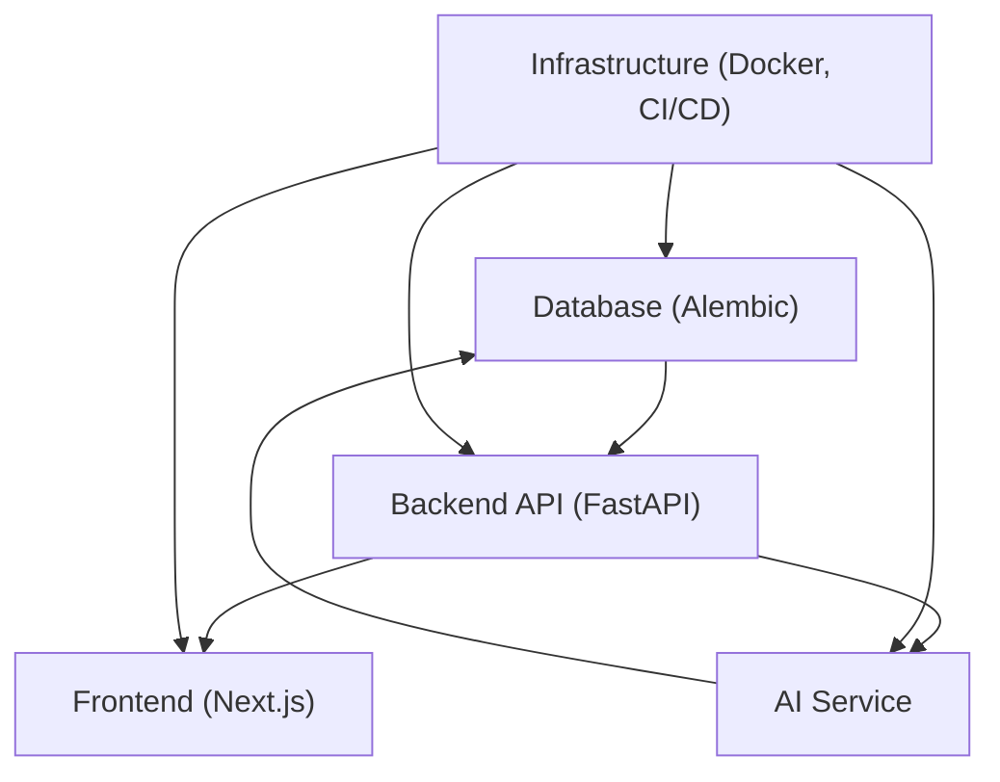
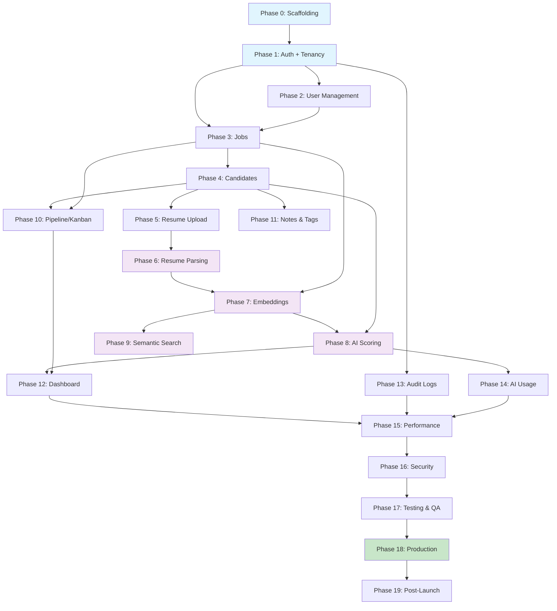

# Hiron Implementation Roadmap

> **Document Type**: Implementation Execution Plan  
> **Version**: 1.0  
> **Date**: July 28, 2026  
> **Status**: Draft — Awaiting Founder Review  
> **Governing Documents**: Frozen Architecture, Engineering Guidelines, Database Design, API Contract, UI/UX Design Specification  
> **Rule**: This document does NOT modify any frozen design document. It converts them into an execution plan.

---

## 1. Overview

### Project Goals

Deliver a production-ready AI-powered Hiring Intelligence Platform that:

1. Allows recruiters to upload resumes, create jobs, and manage hiring pipelines
2. Uses NLP and LLMs to parse resumes, score candidates, and explain fit
3. Provides semantic search across a candidate pool using vector embeddings
4. Enforces multi-tenant data isolation at the database level
5. Meets the performance, security, and accessibility standards defined in the frozen Engineering Guidelines

### Development Philosophy

| Principle                             | Meaning                                                                                                                                                                            |
| ------------------------------------- | ---------------------------------------------------------------------------------------------------------------------------------------------------------------------------------- |
| **Backend-first**                     | Build APIs before UI. Every feature starts with the database migration, then the API endpoint, then the frontend. This prevents frontend teams from blocking on backend decisions. |
| **Vertical slices**                   | Each phase delivers a complete, testable feature — not a "backend phase" followed by a "frontend phase." A phase ships a working feature from database to UI.                      |
| **Continuous testing**                | Tests are written during each phase, not after. No phase is "done" until tests pass. No "testing sprint" at the end.                                                               |
| **Infrastructure early**              | CI/CD, Docker, and deployment are set up in Phase 0. Every subsequent phase deploys to a staging environment. No "big bang" production deployment.                                 |
| **AI is a feature, not a foundation** | The core CRUD and pipeline work without AI. AI scoring, parsing, and search are layered on top. If the AI service goes down, the pipeline still works.                             |

### Definition of Implementation Complete

The project is implementation-complete when:

- [x] All 60 API endpoints from the API Contract are implemented and tested
- [x] All 18 database tables from the Database Design are migrated
- [x] All 17 screens from the UI/UX Design Specification are built
- [x] All test suites pass (unit, integration, E2E)
- [x] The application runs in a production-like environment (staging)
- [x] Performance meets the NFRs from the Architecture Document
- [x] Security audit passes (no critical/high findings)
- [x] Documentation is complete (API docs, runbook, README)

---

## 2. Build Strategy

### Why This Implementation Order

The phases are ordered by **dependency chain** and **risk reduction**:

```
Phase 0: Scaffolding       → Everything depends on this
Phase 1: Auth + Tenancy    → Every feature depends on auth and tenant isolation
Phase 2: Users             → Team management needed before collaboration features
Phase 3: Jobs              → Jobs are the organizing entity for all hiring features
Phase 4: Candidates        → Candidates can't exist without the candidate schema
Phase 5: Resume Upload     → File upload is a prerequisite for parsing
Phase 6: Resume Parsing    → First AI integration — validates the AI pipeline
Phase 7: Embeddings        → Required for scoring and search
Phase 8: AI Scoring        → Core AI feature — highest business value
Phase 9: Semantic Search   → Depends on embeddings being populated
Phase 10: Pipeline/Kanban  → Depends on jobs + candidates + stages
Phase 11: Notes & Tags     → Collaboration features on top of candidates
Phase 12: Dashboard        → Aggregates data from all previous features
Phase 13: Audit Logs       → Cross-cutting — reads from the audit table populated by all phases
Phase 14: AI Usage         → Reads from ai_usage_logs populated during Phases 6–9
Phase 15–18: Hardening     → Performance, security, testing, deployment
Phase 19: Post-Launch      → Iteration based on real usage
```

### Cross-Layer Dependencies



| Layer              | Must Be Ready Before                                              |
| ------------------ | ----------------------------------------------------------------- |
| **Infrastructure** | Everything — Docker, CI/CD, and local dev environment are Phase 0 |
| **Database**       | Each feature's API — migrations run before endpoint code          |
| **Backend API**    | Each feature's frontend — UI consumes API endpoints               |
| **AI Service**     | Scoring (Phase 8), parsing (Phase 6), search (Phase 9)            |
| **Frontend**       | Nothing — frontend is the last layer for each feature             |

### Risk Reduction Strategy

The highest-risk items are tackled early:

| Risk                                        | When Addressed | Why Early                                                                       |
| ------------------------------------------- | -------------- | ------------------------------------------------------------------------------- |
| Multi-tenant isolation (RLS)                | Phase 1        | A bug here leaks data between tenants. Validate immediately.                    |
| AI pipeline (parsing → embedding → scoring) | Phases 6–8     | This is the novel technology. Prove it works before building UI on top.         |
| File upload → S3 → async processing         | Phase 5–6      | Async processing is architecturally complex. Validate the queue pipeline early. |
| Vector search performance                   | Phase 9        | If pgvector can't handle our load, we need to know before launch, not after.    |

---

## 3. Phase Breakdown

---

### Phase 0 — Repository & Project Scaffolding

**Objective**: Set up the monorepo, development environment, CI/CD pipeline, and infrastructure templates so that all subsequent phases can develop, test, and deploy consistently.

**Features**: No user-facing features. Developer tooling only.

**Backend Tasks**:

- Initialize Python project with `pyproject.toml` (Poetry)
- Create FastAPI application skeleton with health endpoints (`GET /api/v1/health`, `GET /api/v1/health/ready`)
- Configure `mypy --strict`, `ruff`
- Set up Pydantic settings management (`config.py`)
- Create base SQLAlchemy models (BaseModel with `id`, `created_at`, `updated_at`)
- Configure structlog for structured logging
- Set up pytest with fixtures for test database, test client

**Frontend Tasks**:

- Initialize Next.js 15 project with App Router and TypeScript
- Install and configure Tailwind CSS + shadcn/ui
- Set up ESLint + Prettier
- Create app shell layout (sidebar, top bar, content area)
- Configure design tokens from UI/UX Design Specification §3–8 (colors, typography, spacing, shadows, radii)
- Set up TanStack Query provider
- Create base API client (`httpClient`) per Engineering Guidelines §4.5

**Database Tasks**:

- Configure Alembic with naming conventions per Engineering Guidelines §8
- Create initial migration: `tenants` table (schema only — populated in Phase 1)
- Set up pgvector extension: `CREATE EXTENSION vector`
- Configure connection pooling (SQLAlchemy `pool_size=10`, `max_overflow=20`)

**AI Tasks**: None

**Infrastructure Tasks**:

- Create monorepo structure per Engineering Guidelines §5.1:
  ```
  hiron/
  ├── apps/web/          # Next.js
  ├── apps/api/          # FastAPI
  ├── services/ai/       # AI Service (OBSOLETE / SUPERSEDED)
  ├── workers/celery/    # Celery workers (OBSOLETE / SUPERSEDED by QStash)
  ├── infra/docker/      # Dockerfiles
  ├── infra/terraform/   # IaC (placeholder) (OBSOLETE / SUPERSEDED)
  ├── docs/              # Frozen design docs
  ├── scripts/           # Dev scripts
  └── .github/workflows/ # CI/CD
  ```
- Create `Dockerfile.api`, `Dockerfile.web`, `Dockerfile.worker`
- Create `docker-compose.dev.yml` with: PostgreSQL 16, Redis, API, Web, Worker, AI Service
- Create GitHub Actions CI pipeline: lint → type-check → test → build
- Create `.env.local.example` with all required environment variables
- Write development `README.md` with setup instructions

**Testing Tasks**:

- Verify `docker-compose up` starts all services
- Verify health endpoints return `200`
- Verify CI pipeline passes on clean repo
- Verify linters and type checkers pass with zero errors

**Documentation Tasks**:

- Development setup guide in `README.md`
- Copy frozen design docs into `docs/`

**Deliverables**:

- Running local development environment with one command (`docker-compose up`)
- Passing CI pipeline
- Health endpoints live
- Zero lint/type errors

**Dependencies**: None (this is the starting point)

**Acceptance Criteria**:

- [x] `docker-compose up` starts PostgreSQL, Redis, API, Web, Worker
- [x] `GET /api/v1/health` returns `200 { "status": "healthy" }`
- [x] `GET /api/v1/health/ready` returns `200` with DB and Redis checks passing
- [x] `mypy --strict` passes with zero errors
- [x] `ruff check` passes with zero errors
- [x] `npm run lint` passes with zero errors
- [x] `tsc --noEmit` passes with zero errors
- [x] GitHub Actions CI pipeline green on `main`
- [x] All frozen design docs present in `docs/`

**Risks**:

- Docker environment inconsistencies across developer machines → Mitigate with `.env.local.example` and setup script
- pgvector extension installation failure → Document PostgreSQL 16 + pgvector Docker image

**Estimated Complexity**: Medium

---

### Phase 1 — Authentication & Multi-Tenancy

**Objective**: Implement the complete authentication system (login, logout, token refresh, password hashing) and multi-tenant isolation (tenant_id extraction, RLS policies). After this phase, every subsequent feature is automatically tenant-isolated.

**Features**:

- Email/password login
- JWT access token (15-min TTL) + refresh token (7-day TTL, httpOnly cookie)
- Refresh token rotation (single-use)
- Logout (revoke refresh token)
- Get current user
- Row-Level Security enforcement on all queries

**Backend Tasks**:

- Implement Argon2id password hashing utility
- Implement JWT creation/validation (RS256)
- Create auth endpoints: `POST /auth/login`, `POST /auth/logout`, `POST /auth/refresh`, `GET /auth/me`
- Create auth middleware: extract JWT → set `app.current_tenant_id` on DB session
- Create tenant context middleware for RLS
- Implement refresh token rotation with single-use enforcement
- Create Pydantic schemas: `LoginRequest`, `LoginResponse`, `TokenResponse`, `UserResponse`
- Create seed script for development: create tenant + admin user

**Frontend Tasks**:

- Build Login page per UI/UX Design §Login
- Build Forgot Password page (email-only flow)
- Implement auth state management (access token in memory, refresh via httpOnly cookie)
- Create `AuthProvider` context with `useCurrentUser()` hook
- Implement automatic token refresh on 401 response
- Create protected route wrapper (redirect to login if unauthenticated)
- Build app shell with sidebar navigation per UI/UX Design §25

**Database Tasks**:

- Migration: `tenants` table (full schema per Database Design §5.1)
- Migration: `users` table (full schema per Database Design §5.2)
- Migration: `refresh_tokens` table (full schema per Database Design §5.3)
- Create RLS policies on `users` and `refresh_tokens`
- Seed: Create default tenant + admin user for development

**AI Tasks**: None

**Infrastructure Tasks**:

- Configure JWT key pair (RS256) generation and storage
- Add secrets management to Docker Compose (JWT keys, DB password)

**Testing Tasks**:

- Unit: password hashing round-trip, JWT creation/validation, token expiry
- Integration: login flow (correct credentials → tokens), login failure (wrong password → 401)
- Integration: refresh token rotation (use → get new tokens → old token rejected)
- Integration: RLS isolation (Tenant A user cannot see Tenant B data)
- Integration: logout → refresh token revoked
- Frontend: Login page renders, form validation, error display, redirect on success

**Documentation Tasks**:

- Auth flow documented in API docs (auto-generated from OpenAPI)

**Deliverables**:

- Working login/logout flow
- Protected routes — unauthenticated users redirect to login
- Multi-tenant RLS verified with two test tenants

**Dependencies**: Phase 0

**Acceptance Criteria**:

- [x] User can log in with email + password
- [x] Access token expires after 15 minutes
- [x] Refresh token successfully rotates (old token rejected)
- [x] Logout revokes refresh token
- [x] `GET /auth/me` returns current user with tenant info
- [x] User in Tenant A sees zero rows from Tenant B (RLS test)
- [x] Login page matches UI/UX Design wireframe
- [x] Password stored as Argon2id hash (never plaintext)
- [x] Rate limiting on login endpoint (10/min per IP)

**Risks**:

- RLS misconfiguration leaks data → Mitigate with dedicated integration tests that assert zero cross-tenant rows
- JWT key management complexity → Use RS256 with key pair stored in environment variables (production: Vercel Environment Variables)

**Estimated Complexity**: Large

---

### Phase 2 — User Management

**Objective**: Enable org admins to manage their team — invite users, change roles, deactivate/reactivate accounts.

**Features**:

- List team members
- Invite user by email
- Update user profile and role
- Deactivate / reactivate user
- Role-based access control enforcement

**Backend Tasks**:

- Implement user endpoints: `GET /users`, `GET /users/{id}`, `POST /users/invite`, `PATCH /users/{id}`, `POST /users/{id}/deactivate`, `POST /users/{id}/reactivate`
- Implement role-based authorization decorator (check `role` claim from JWT)
- Enforce: org_admin can manage all users, recruiters/HMs can only view
- Enforce: cannot deactivate the last org_admin
- Create email invitation flow (generate temporary password or magic link)

**Frontend Tasks**:

- Build User Management page per UI/UX Design §User Management
- Build Invite User modal (email, name, role selection)
- Build role badge component
- Show user status (active/inactive) with visual indicator
- Implement permission-based UI (hide invite/edit buttons for non-admins)

**Database Tasks**:

- Users table already migrated in Phase 1 — no new migrations
- Seed: Add recruiter and hiring_manager users for testing

**AI Tasks**: None

**Infrastructure Tasks**: None

**Testing Tasks**:

- Unit: role authorization logic
- Integration: invite user → user appears in list
- Integration: role change (recruiter → admin)
- Integration: deactivate user → cannot login
- Integration: cannot deactivate last admin (409 error)
- Integration: RBAC — recruiter cannot invite users (403)

**Deliverables**:

- Team management page with invite, role change, deactivate
- RBAC enforcement on all existing endpoints

**Dependencies**: Phase 1

**Acceptance Criteria**:

- [x] Org admin can invite a user with a specific role
- [x] Org admin can change a user's role
- [x] Org admin can deactivate/reactivate users
- [x] Deactivated user cannot log in
- [x] Last org_admin cannot be deactivated
- [x] Non-admin users see read-only team list
- [x] All actions create audit log entries

**Risks**:

- Email delivery for invitations → Use a simple email service (SES) or skip email in MVP and share invite links manually

**Estimated Complexity**: Medium

---

### Phase 3 — Jobs Module

**Objective**: Implement the job lifecycle — create, edit, open, close, archive jobs. Auto-create pipeline stages from tenant settings. First feature that represents core business value.

**Features**:

- Job CRUD (create, read, update, archive)
- Job status transitions (draft → open → paused → closed → archived)
- Auto-creation of default pipeline stages
- Job list with filtering, sorting, pagination
- Full-text search on jobs

**Backend Tasks**:

- Implement job endpoints: `GET /jobs`, `GET /jobs/{id}`, `POST /jobs`, `PATCH /jobs/{id}`, `POST /jobs/{id}/archive`, `POST /jobs/{id}/open`, `POST /jobs/{id}/close`
- Auto-create pipeline stages from `tenants.settings.defaults.pipelineStages` on job creation
- Implement full-text search trigger (update `search_vector` on INSERT/UPDATE)
- Implement cursor-based pagination per API Contract §9
- Implement filtering (status, department) per API Contract §10
- Implement sorting per API Contract §11

**Frontend Tasks**:

- Build Jobs List page per UI/UX Design §Jobs List
- Build Create Job page with live preview per UI/UX Design §Create Job
- Build Job Detail page with tabs per UI/UX Design §Job Detail (Kanban tab deferred to Phase 10)
- Build Edit Job form
- Implement filter bar, sort controls, pagination component
- Build skills input component (tag-style multi-select)

**Database Tasks**:

- Migration: `jobs` table (full schema per Database Design §5.4)
- Migration: `pipeline_stages` table (full schema per Database Design §5.8)
- Migration: Full-text search trigger on `jobs.search_vector`
- Migration: GIN index on `search_vector`

**AI Tasks**: None (JD embedding deferred to Phase 7)

**Infrastructure Tasks**: None

**Testing Tasks**:

- Unit: job status transition validation (draft → open ✓, closed → open ✗)
- Integration: CRUD cycle (create → read → update → archive)
- Integration: pipeline stages auto-created on job creation
- Integration: full-text search returns matching jobs
- Integration: cursor pagination returns correct pages
- Integration: tenant isolation (jobs from Tenant A invisible to Tenant B)
- Frontend: form validation, filter interaction, pagination navigation

**Deliverables**:

- Complete job management with pipeline stages
- Full-text search on jobs
- Paginated, filterable job list

**Dependencies**: Phase 1 (auth), Phase 2 (RBAC)

**Acceptance Criteria**:

- [x] Recruiter can create a job with title, description, skills
- [x] Default pipeline stages auto-created from tenant settings
- [x] Job status transitions enforce valid state machine
- [x] Job list supports filtering by status, sorting by title/date
- [x] Full-text search matches job title and description
- [x] Cursor-based pagination works correctly
- [x] Archived jobs excluded from default list view
- [x] HM can view jobs but not create/edit

**Risks**: None significant — straightforward CRUD

**Estimated Complexity**: Medium

---

### Phase 4 — Candidate Management

**Objective**: Implement candidate pool management — create candidates, view profiles, link candidates to jobs. The candidate pool is the data foundation for all AI features.

**Features**:

- Candidate CRUD
- Candidate profile with parsed resume display
- Add candidate to job (creates `job_candidates` junction record)
- Candidate list with filtering, full-text search, pagination
- Duplicate detection by email

**Backend Tasks**:

- Implement candidate endpoints: `GET /candidates`, `GET /candidates/{id}`, `POST /candidates`, `PATCH /candidates/{id}`, `POST /candidates/{id}/archive`
- Implement `POST /jobs/{jobId}/candidates` (add candidate to job, set initial stage)
- Implement full-text search trigger on `candidates.search_vector`
- Implement GIN index query on `candidates.skills` for skill filtering
- Implement duplicate detection: reject if `(tenant_id, email)` already exists

**Frontend Tasks**:

- Build Candidates List page per UI/UX Design §Candidates List
- Build Candidate Detail page per UI/UX Design §Candidate Detail (Profile tab only, other tabs in later phases)
- Build Create Candidate form
- Build "Add to Job" action (dropdown with job selector)
- Implement filter bar with skills, experience, location, source filters

**Database Tasks**:

- Migration: `candidates` table (full schema per Database Design §5.5)
- Migration: `job_candidates` table (full schema per Database Design §5.9)
- Migration: Full-text search trigger on `candidates.search_vector`
- Migration: GIN indexes on `search_vector` and `skills`

**AI Tasks**: None (resume-based candidate creation deferred to Phase 5–6)

**Infrastructure Tasks**: None

**Testing Tasks**:

- Integration: CRUD cycle for candidates
- Integration: add candidate to job → appears in job's candidate list
- Integration: duplicate email detection → 409 Conflict
- Integration: candidate list filtering by skills (`@>` containment)
- Integration: full-text search on candidate name + skills
- Integration: tenant isolation
- Frontend: form validation, filter interaction, candidate detail navigation

**Deliverables**:

- Complete candidate pool management
- Candidate-to-job association with initial stage placement
- Filterable, searchable candidate list

**Dependencies**: Phase 3 (jobs + pipeline stages)

**Acceptance Criteria**:

- [x] Recruiter can create a candidate manually
- [x] Recruiter can add a candidate to a job (auto-placed in first stage)
- [x] Duplicate email per tenant returns 409
- [x] Candidate list supports skill filtering, full-text search, pagination
- [x] Candidate detail page shows profile info and associated jobs
- [x] Archived candidates excluded from default list

**Risks**: None significant

**Estimated Complexity**: Medium

---

### Phase 5 — Resume Upload

**Objective**: Implement file upload to S3 and the resume record lifecycle. This phase handles the file upload mechanics WITHOUT parsing (parsing is Phase 6).

**Features**:

- Single resume upload (drag-and-drop)
- Bulk resume upload (up to 500 files)
- S3 storage with tenant-isolated key structure
- Resume status tracking (pending → processing → parsed → failed)
- Resume file download via pre-signed URL

**Backend Tasks**:

- Implement `POST /resumes/upload` (multipart/form-data)
- Implement `POST /resumes/bulk-upload`
- Implement `GET /resumes/{id}/status`
- Integrate with S3: upload file, generate pre-signed download URL
- File validation: type (PDF, DOCX, TXT), size (max 10 MB), content sniffing
- Create resume record with `status: pending`
- If `candidateId` not provided, create placeholder candidate (to be enriched by parser)
- If `jobId` provided, create `job_candidates` association
- Implement idempotency (prevent duplicate uploads via `Idempotency-Key`)

**Frontend Tasks**:

- Build Resume Upload page per UI/UX Design §Resume Upload
- Implement react-dropzone with drag-and-drop zone
- Implement client-side validation (file type, size) with immediate feedback
- Build upload progress list (per-file status: uploading → queued → processing → complete)
- Implement status polling (2-second interval on `GET /resumes/{id}/status`)
- Build resume download button (pre-signed URL)

**Database Tasks**:

- Migration: `resumes` table (full schema per Database Design §5.6)
- Migration: `resume_files` table (full schema per Database Design §5.7)

**AI Tasks**: None (parsing in Phase 6)

**Infrastructure Tasks**:

- Create S3 bucket (OBSOLETE / SUPERSEDED by Supabase Storage) with tenant-isolated key structure
- Configure S3 bucket (OBSOLETE / SUPERSEDED by Supabase Storage) policy (no public access)
- Configure pre-signed URL generation (15-minute expiry)

**Testing Tasks**:

- Integration: upload PDF → stored in S3 → resume record created with `status: pending`
- Integration: file type validation (reject `.jpg`, accept `.pdf`)
- Integration: file size validation (reject > 10 MB)
- Integration: bulk upload acceptance (45 accepted, 2 rejected)
- Integration: pre-signed URL generates valid download link
- Integration: idempotency (same key → same response, no duplicate upload)
- Frontend: drag-and-drop interaction, progress display, error handling

**Deliverables**:

- Working file upload to S3
- Resume status tracking
- Bulk upload support

**Dependencies**: Phase 4 (candidates)

**Acceptance Criteria**:

- [x] User can drag-and-drop a PDF/DOCX/TXT resume
- [x] File uploaded to S3 at `{tenantId}/{resumeId}/original.{ext}`
- [x] Resume record created with `status: pending`
- [x] Invalid file types rejected with clear error message
- [x] Files > 10 MB rejected
- [x] Bulk upload accepts up to 500 files
- [x] Download generates valid pre-signed S3 URL
- [x] Idempotency prevents duplicate uploads

**Risks**:

- S3 configuration errors (CORS, bucket policy) → Test in CI with localstack or MinIO
- Large file upload timeouts → Configure appropriate timeouts on ALB and FastAPI

**Estimated Complexity**: Medium

---

### Phase 6 — Resume Parsing

**Objective**: Implement the AI-powered resume parsing pipeline. This is the first AI integration — it validates the entire async processing architecture (Celery queue → Worker → AI Service → database update).

**Features**:

- Async resume parsing via Celery worker (OBSOLETE / SUPERSEDED by QStash)
- spaCy NER extraction (name, email, phone, skills, experience, education)
- Candidate profile auto-enrichment from parsed data
- Parse confidence scoring
- Retry mechanism for failed parsing
- Raw text extraction and hashing

**Backend Tasks**:

- Implement Celery task (OBSOLETE / SUPERSEDED by QStash): `parse_resume`
- Implement text extraction (PDF → text via `pdfplumber`, DOCX → text via `python-docx`)
- Compute `raw_text_hash` (SHA-256) for staleness detection
- Call AI Service for NER extraction
- Update `resumes.parsed_data` with structured JSON
- Update `resumes.status` to `parsed` or `failed`
- Enrich `candidates` table with extracted data (name, email, skills, experience)
- Set `resumes.is_primary = TRUE` for first resume
- Implement `POST /resumes/{id}/retry`
- Log to `ai_usage_logs`

**Frontend Tasks**:

- Update Resume Upload page: show parsed data when complete
- Build resume parsed data display in Candidate Detail (experience timeline, education, skills)
- Show parse confidence badge
- Show retry button for failed parses

**Database Tasks**:

- No new migrations (tables created in Phase 5)
- Seed: sample parsed resume data for development

**AI Tasks**:

- Set up AI Service (FastAPI)
- Implement spaCy NER pipeline for resume parsing
- Create Pydantic models for parsed resume data (per Database Design §5.6 `parsed_data` schema)
- Implement parse confidence calculation
- Version the parser model (`parser_model_version` field)

**Infrastructure Tasks**:

- Configure Celery with Redis (OBSOLETE / SUPERSEDED by QStash with Upstash) broker
- Set up Celery worker (OBSOLETE / SUPERSEDED by QStash) container in Docker Compose
- Configure task retry policy (3 retries, exponential backoff)

**Testing Tasks**:

- Unit: text extraction from sample PDF/DOCX/TXT
- Unit: NER extraction accuracy on 10+ sample resumes
- Integration: upload → queue → parse → candidate enriched (full pipeline)
- Integration: parse failure → `status: failed` → retry → success
- Integration: `ai_usage_logs` record created for each parse operation
- AI evaluation: parser accuracy benchmarks on test dataset

**Deliverables**:

- End-to-end resume parsing pipeline
- Candidate auto-enrichment from parsed data
- Parse confidence scoring
- Retry mechanism for failures

**Dependencies**: Phase 5 (resume upload), Phase 0 (Celery/Redis infrastructure)

**Acceptance Criteria**:

- [x] Uploaded resume is automatically parsed within 30 seconds
- [x] Parsed data includes: name, email, phone, skills, experience, education
- [x] Candidate profile auto-enriched with parsed data
- [x] Parse confidence score between 0.0–1.0
- [x] Failed parses can be retried
- [x] `ai_usage_logs` entry created per parse
- [x] Parser model version recorded on resume record
- [x] Status polling reflects real-time parse progress

**Risks**:

- spaCy model accuracy on diverse resume formats → Start with `en_core_web_trf` (transformer-based), plan to fine-tune
- PDF text extraction failures (scanned PDFs, encrypted files) → Log errors clearly, mark as `failed` with descriptive error message
- Celery worker (OBSOLETE / SUPERSEDED by QStash) stability → Health checks on worker container, auto-restart policy

**Estimated Complexity**: Large

---

### Phase 7 — Embedding Pipeline

**Objective**: Generate vector embeddings for candidates (from resume text) and jobs (from description text). This phase creates the data foundation for scoring (Phase 8) and semantic search (Phase 9).

**Features**:

- Candidate embedding generation (from `resumes.raw_text`)
- Job embedding generation (from `jobs.description`)
- Embedding staleness detection via `source_text_hash`
- Embedding regeneration
- Embedding status dashboard

**Backend Tasks**:

- Implement embedding generation Celery task (OBSOLETE / SUPERSEDED by QStash)
- Call OpenAI `text-embedding-3-small (OBSOLETE / SUPERSEDED by gemini-embedding-2)` API (1536 dimensions)
- Store embedding in `candidate_embeddings` / `job_embeddings`
- Record `model_version` and `source_text_hash`
- Implement `POST /candidates/{id}/embedding` (generate/regenerate)
- Implement `POST /jobs/{id}/embedding` (generate/regenerate)
- Implement `GET /embeddings/status` (coverage report)
- Auto-trigger candidate embedding after successful parse (chain from Phase 6)
- Auto-trigger job embedding after job creation/description update
- Log to `ai_usage_logs`

**Frontend Tasks**:

- Build Embedding Status page per UI/UX Design §Embeddings
- Show embedding status indicators on candidate/job detail pages
- Add "Regenerate Embedding" action to candidate/job menus

**Database Tasks**:

- Migration: `candidate_embeddings` table with HNSW index (per Database Design §5.11)
- Migration: `job_embeddings` table (per Database Design §5.12)
- Configure HNSW index: `m=16`, `ef_construction=64`, cosine distance

**AI Tasks**:

- Implement embedding service in AI Service
- Create embedding request/response models
- Implement batch embedding for efficiency (process multiple texts in one API call)
- Handle OpenAI API (OBSOLETE / SUPERSEDED by Gemini) rate limits with retry and backoff

**Infrastructure Tasks**:

- Configure OpenAI API (OBSOLETE / SUPERSEDED by Gemini) key in environment/secrets

**Testing Tasks**:

- Unit: embedding dimension validation (1536)
- Integration: parse complete → embedding auto-generated
- Integration: job description update → new embedding with updated `source_text_hash`
- Integration: staleness detection (old hash ≠ new hash → flag as stale)
- Integration: `ai_usage_logs` entry created per embedding operation
- Performance: HNSW index build time on 10K sample vectors

**Deliverables**:

- Automatic embedding generation for candidates and jobs
- Staleness detection and regeneration
- Embedding coverage dashboard

**Dependencies**: Phase 6 (parsed resume text), Phase 3 (job descriptions)

**Acceptance Criteria**:

- [x] Candidate embedding auto-generated after resume parsing
- [x] Job embedding auto-generated after job creation
- [x] Embeddings are 1536-dimensional vectors
- [x] `model_version` and `source_text_hash` recorded
- [x] Stale embeddings detectable (hash mismatch)
- [x] Embedding status endpoint reports coverage metrics
- [x] `ai_usage_logs` tracks token usage and cost

**Risks**:

- OpenAI API (OBSOLETE / SUPERSEDED by Gemini) costs at scale → Monitor via `ai_usage_logs`, implement batch processing
- HNSW index build time on large datasets → Acceptable at < 10M vectors per Architecture decision

**Estimated Complexity**: Medium

---

### Phase 8 — AI Scoring

**Objective**: Implement the core AI feature — scoring candidates against job descriptions using LLM evaluation with structured output. This is the highest-value feature in Hiron.

**Features**:

- Score a single candidate against a job (synchronous)
- Batch score all candidates for a job (async)
- Re-score with updated prompts/models
- Score breakdown by dimension (skills, experience, education)
- Score explanation (LLM-generated prose)
- Confidence scoring
- Skills gap analysis (matched vs. missing)
- Score history tracking
- AI provenance (prompt version, model version, token usage)

**Backend Tasks**:

- Implement `POST /jobs/{jobId}/candidates/{candidateId}/score` (single, sync)
- Implement `POST /jobs/{jobId}/score-batch` (async via Celery)
- Implement `GET /jobs/{jobId}/candidates/{candidateId}/score` (current score)
- Implement `GET /jobs/{jobId}/candidates/{candidateId}/scores/history`
- Implement `GET /scores/{scoreId}/explanation`
- Build scoring pipeline: fetch resume + JD → compute cosine similarity → LLM evaluation → parse structured output → store score
- Implement structured output parsing via Pydantic (per Appendix A.11)
- Implement hallucination checks (per Appendix A.12): skill match verification, score consistency
- Implement confidence calculation (per Appendix A.14)
- Implement `is_current` flag management (new score → old score `is_current = FALSE`)
- Implement score caching (idempotent — same inputs within 24h → return cached)
- Log to `ai_usage_logs` with full token breakdown

**Frontend Tasks**:

- Build AI Scoring page per UI/UX Design §AI Scoring
- Build score gauge component (circular progress with color coding)
- Build breakdown bar chart
- Build skills matched/missing display
- Build confidence badge component
- Build AI explanation panel (expandable)
- Build AI provenance footer
- Build score history panel
- Build "Score Now" / "Re-score" buttons with loading state
- Build batch scoring progress indicator

**Database Tasks**:

- Migration: `scores` table (full schema per Database Design §5.10)

**AI Tasks**:

- Design scoring prompt template (version 1.0.0)
- Implement LLM call with structured output (JSON mode)
- Implement scoring pipeline in AI Service:
  1. Fetch embeddings → cosine similarity
  2. Fetch resume parsed data + JD text
  3. Construct prompt with resume + JD + scoring rubric
  4. Call GPT-4o with JSON response format
  5. Parse and validate structured output
  6. Run hallucination checks
  7. Calculate confidence
- Implement retry with fallback (3 retries, exponential backoff)

**Infrastructure Tasks**: None

**Testing Tasks**:

- Unit: cosine similarity calculation
- Unit: structured output parsing (valid JSON → score object)
- Unit: hallucination check (claimed skills not in resume → warning)
- Unit: confidence calculation
- Integration: score candidate → score stored → score retrievable
- Integration: re-score → old score `is_current = FALSE`, new score `is_current = TRUE`
- Integration: batch scoring → all candidates scored → completion callback
- Integration: score caching (same inputs → cached response)
- AI evaluation: run scoring on 50-candidate benchmark dataset, verify score distribution
- AI evaluation: measure prompt latency (target < 5s per score)

**Deliverables**:

- Single and batch candidate scoring
- Score breakdown with explanation
- Confidence scoring and hallucination detection
- Score history with prompt/model provenance

**Dependencies**: Phase 7 (embeddings), Phase 4 (candidates + job_candidates)

**Acceptance Criteria**:

- [x] Single candidate score completes in < 5 seconds
- [x] Score includes: fitScore (0–100), breakdown (skills/experience/education), explanation, confidence
- [x] Skills gap analysis shows matched and missing skills
- [x] Score provenance recorded (prompt version, model version, tokens, latency)
- [x] Re-score creates new record, marks old as not current
- [x] Batch scoring processes all candidates with progress reporting
- [x] Low confidence (< 0.5) triggers warning in UI
- [x] Hallucination checks generate warnings when detected
- [x] `ai_usage_logs` records cost per score

**Risks**:

- LLM output format inconsistency → Enforce JSON mode + Pydantic validation + retry on parse failure
- Scoring latency > 5s → Monitor latency, consider caching aggressive
- OpenAI API (OBSOLETE / SUPERSEDED by Gemini) outages → Implement graceful degradation (show "AI unavailable" banner, pipeline works without scores)

**Estimated Complexity**: Large

---

### Phase 9 — Semantic Search

**Objective**: Implement natural language search across the candidate pool using vector embeddings and pgvector.

**Features**:

- Natural language query → embedding → vector similarity search
- Combined with metadata filters (experience, skills, location)
- Relevance scores on results
- Match highlights
- Save and re-run searches (Phase 2 feature — save endpoint implemented but UI deferred)

**Backend Tasks**:

- Implement `POST /search/candidates`
- Generate query embedding via AI Service
- Execute pgvector similarity search: `ORDER BY embedding <=> query_vector LIMIT K`
- Apply metadata filters (experience range, location, skills) alongside vector search
- Return results with relevance scores
- Implement `POST /saved-searches`, `GET /saved-searches` (data layer only)
- Log to `ai_usage_logs`

**Frontend Tasks**:

- Build Semantic Search page per UI/UX Design §Semantic Search
- Build search input with placeholder examples
- Build filter chips below search
- Build result cards with relevance score, candidate summary, match highlights
- Build "Save this search" button
- Implement search loading state with skeleton cards

**Database Tasks**:

- No new migrations (embedding tables created in Phase 7)
- Migration: `saved_searches` table (Phase 2 feature, per Database Design §5.18)

**AI Tasks**:

- Implement query embedding in AI Service (same model as candidate embeddings)
- Implement relevance score normalization (cosine distance → 0–100% relevance)

**Infrastructure Tasks**: None

**Testing Tasks**:

- Integration: search query → embedding generated → similar candidates returned
- Integration: filters applied alongside vector search
- Integration: empty result set for unrelated query
- Performance: search latency on 10K candidate pool (target < 2s)
- Performance: search latency on 100K candidate pool (target < 2s per NFR)

**Deliverables**:

- Working semantic search with relevance scores
- Combined vector + metadata filtering
- Saved searches (data layer)

**Dependencies**: Phase 7 (populated embeddings)

**Acceptance Criteria**:

- [x] Natural language query returns relevant candidates ranked by similarity
- [x] Relevance scores displayed as percentages
- [x] Filters combine with semantic search (AND logic)
- [x] Search completes in < 2 seconds on 100K pool
- [x] Empty state shown for no-match queries
- [x] Saved search creates record (basic functionality)

**Risks**:

- Search quality depends on embedding coverage → Show warning if < 80% candidates have embeddings
- pgvector performance at scale → Monitor query plans with `EXPLAIN ANALYZE`

**Estimated Complexity**: Medium

---

### Phase 10 — Pipeline / Kanban

**Objective**: Implement the drag-and-drop Kanban board for managing candidate stages within a job. This is the primary operational interface for recruiters.

**Features**:

- Kanban board with draggable candidate cards
- Move candidate between stages (drag-and-drop)
- Stage transition history (timeline)
- Shortlist candidate for HM review
- Reject candidate with reason
- Candidate count per stage

**Backend Tasks**:

- Implement `POST /pipeline/move` (move candidate to stage)
- Implement `GET /jobs/{jobId}/candidates/{candidateId}/stage-history`
- Implement `POST /jobs/{jobId}/candidates/{candidateId}/shortlist`
- Implement `POST /jobs/{jobId}/candidates/{candidateId}/reject`
- Enforce stage validation (stage must belong to same job)
- Create `candidate_stage_history` record on every move
- Update `job_candidates.current_stage_id` atomically

**Frontend Tasks**:

- Build Pipeline/Kanban page per UI/UX Design §Pipeline
- Implement @dnd-kit drag-and-drop with columns per stage
- Build candidate card component (name, title, score badge, confidence indicator)
- Build move confirmation (optional note input)
- Build rejection modal (reason input)
- Build stage history timeline in candidate detail
- Implement optimistic updates (card moves immediately, API call in background)
- Handle mobile: single-column with stage selector dropdown

**Database Tasks**:

- Migration: `candidate_stage_history` table (per Database Design §5.13)
- `pipeline_stages` and `job_candidates` already migrated

**AI Tasks**: None

**Infrastructure Tasks**: None

**Testing Tasks**:

- Integration: move candidate from Applied → Screening → history record created
- Integration: reject candidate → moved to rejected stage + reason stored
- Integration: shortlist → `is_shortlisted = TRUE`
- Integration: invalid stage (wrong job) → 422 error
- Integration: move to same stage → 422 error (no-op protection)
- Frontend: drag-and-drop interaction, optimistic update, error rollback

**Deliverables**:

- Fully functional Kanban pipeline board
- Stage transitions with audit trail
- Shortlist and reject workflows

**Dependencies**: Phase 4 (job_candidates), Phase 3 (pipeline_stages)

**Acceptance Criteria**:

- [x] Kanban board shows all stages with candidate cards
- [x] Drag-and-drop moves candidate between stages
- [x] Move creates stage history record with actor and timestamp
- [x] Shortlist toggles `isShortlisted` flag
- [x] Reject moves to rejected stage with reason
- [x] HM can view pipeline but not move candidates
- [x] Mobile: stage selector dropdown replaces columns
- [x] Cards show score and confidence from Phase 8

**Risks**:

- Drag-and-drop accessibility → Implement keyboard-based move (Space to pick up, arrows to navigate, Enter to drop)
- Optimistic update conflicts (two users moving same candidate) → Implement server-side conflict detection, show toast on conflict

**Estimated Complexity**: Large

---

### Phase 11 — Notes & Tags

**Objective**: Implement collaborative features — notes with @mentions and tagging system for candidate organization.

**Features**:

- Candidate notes CRUD
- @mention other team members in notes
- Private notes (visible only to author)
- Candidate tags CRUD
- Filter candidates by tag

**Backend Tasks**:

- Implement `GET /candidates/{id}/notes`, `POST /candidates/{id}/notes`, `PATCH /candidates/{id}/notes/{noteId}`, `DELETE /candidates/{id}/notes/{noteId}`
- Implement `GET /candidates/{id}/tags`, `POST /candidates/{id}/tags`, `DELETE /candidates/{id}/tags/{tagId}`
- Private note filtering (only author can see `is_private = TRUE` notes)
- Tag name normalization (lowercase, trim whitespace)
- Duplicate tag prevention (409 on existing tag)

**Frontend Tasks**:

- Build Notes tab in Candidate Detail per UI/UX Design §Candidate Notes
- Implement Tiptap rich text editor for notes with @mention support
- Build private note toggle
- Build Tags tab in Candidate Detail
- Build tag input with autocomplete (suggest existing tags from tenant)
- Build tag chips with remove button
- Add tag filter to Candidates List filter bar

**Database Tasks**:

- Migration: `candidate_notes` table (per Database Design §5.14)
- Migration: `candidate_tags` table (per Database Design §5.15)

**AI Tasks**: None

**Testing Tasks**:

- Integration: CRUD cycle for notes and tags
- Integration: private notes invisible to other users
- Integration: duplicate tag returns 409
- Integration: note author can edit, others cannot
- Integration: org_admin can delete any note

**Deliverables**:

- Notes with @mentions and privacy controls
- Tags with autocomplete and filtering

**Dependencies**: Phase 4 (candidates)

**Acceptance Criteria**:

- [x] Users can create, edit, and delete notes
- [x] Private notes visible only to author
- [x] @mentions render as linked user names
- [x] Tags normalize to lowercase
- [x] Duplicate tags rejected
- [x] Candidates filterable by tag
- [x] Org admin can delete any note

**Risks**: None significant

**Estimated Complexity**: Small

---

### Phase 12 — Dashboard & Analytics

**Objective**: Build the dashboard landing page with aggregated metrics, pipeline overview, and recent activity feed.

**Features**:

- Metric cards: open jobs, total candidates, scored candidates, hired count
- Pipeline overview (jobs with candidate counts and progress bars)
- Recent activity feed (from audit logs)
- Onboarding wizard (for new tenants with no data)

**Backend Tasks**:

- Implement dashboard metrics endpoint (or derive from existing endpoints)
- Optimize queries for dashboard aggregation (ensure indexes support COUNT queries)

**Frontend Tasks**:

- Build Dashboard page per UI/UX Design §Dashboard
- Build MetricCard component with trend indicator
- Build PipelineOverview component with mini progress bars
- Build RecentActivity component from audit log data
- Build onboarding wizard for empty state (new tenant)
- Implement Recharts for any chart visualizations

**Database Tasks**: None (reads from existing tables)

**AI Tasks**: None

**Testing Tasks**:

- Integration: dashboard metrics match actual data counts
- Frontend: empty state shows onboarding wizard
- Frontend: metric cards display correct values

**Deliverables**:

- Fully functional dashboard with live metrics
- Onboarding experience for new tenants

**Dependencies**: Phase 3 (jobs), Phase 4 (candidates), Phase 8 (scores), Phase 13 (audit logs)

**Acceptance Criteria**:

- [x] Dashboard shows correct counts for open jobs, candidates, scores, hired
- [x] Pipeline overview shows top 5 open jobs with candidate counts
- [x] Recent activity shows last 10 audit log entries
- [x] New tenants see onboarding wizard instead of empty dashboard
- [x] Dashboard loads in < 500ms

**Risks**: None significant

**Estimated Complexity**: Small

---

### Phase 13 — Audit Logs

**Objective**: Implement the queryable audit log viewer. The audit log TABLE has been populated by all previous phases (each mutation creates an audit entry). This phase builds the UI and API for querying it.

**Features**:

- Filterable, paginated audit log viewer
- Filter by entity type, action, actor, date range
- Entity-specific audit trail

**Backend Tasks**:

- Implement `GET /audit-logs` with query parameters
- Implement `GET /audit-logs/entity/{entity_type}/{entity_id}`
- Ensure audit log middleware is capturing all mutations from Phases 1–12
- Implement org_admin vs. recruiter (own actions only) authorization

**Frontend Tasks**:

- Build Audit Logs page per UI/UX Design §Audit Logs
- Build filter bar (entity type, action, actor, date range)
- Build activity timeline with actor, action, entity, and timestamp
- Build expandable change diff (before/after values)

**Database Tasks**:

- Migration: `audit_logs` table (per Database Design §5.17) — if not already created
- Ensure audit log insertion is happening across all service endpoints

**AI Tasks**: None

**Testing Tasks**:

- Integration: creating a candidate → audit log entry exists
- Integration: updating a job → audit log entry with changes (before/after)
- Integration: recruiter sees only own actions
- Integration: org_admin sees all actions

**Deliverables**:

- Queryable audit log with filtering and pagination
- Per-entity audit trail

**Dependencies**: Phase 1 (auth/tenancy for audit actor tracking)

**Acceptance Criteria**:

- [x] All mutations from Phases 1–12 create audit entries
- [x] Audit log supports filtering by entity type, action, actor, date
- [x] Changes show before/after values for updates
- [x] Recruiter sees only own actions
- [x] Org admin sees all tenant actions
- [x] Audit log is immutable (no edit/delete)

**Risks**: None significant

**Estimated Complexity**: Small

---

### Phase 14 — AI Usage Monitoring

**Objective**: Build the AI cost and usage analytics dashboard for org admins.

**Features**:

- Total cost, tokens, operations metrics
- Daily cost trend chart
- Cost breakdown by operation type
- Cache hit rate
- Average latency per operation

**Backend Tasks**:

- Implement `GET /ai-usage/summary` with period and groupBy parameters
- Implement `GET /ai-usage/logs` with filtering
- Optimize aggregation queries on `ai_usage_logs`

**Frontend Tasks**:

- Build AI Usage Analytics page per UI/UX Design §AI Usage Analytics
- Build metric cards (total cost, tokens, operations, cache rate)
- Build daily cost trend line chart (Recharts)
- Build operation breakdown table
- Implement period selector (7d, 30d, 90d)

**Database Tasks**: None (reads from `ai_usage_logs` populated by Phases 6–9)

**AI Tasks**: None

**Testing Tasks**:

- Integration: aggregation queries return correct sums
- Integration: period filtering works correctly
- Integration: groupBy operation produces per-operation breakdown

**Deliverables**:

- AI cost monitoring dashboard with charts and metrics

**Dependencies**: Phase 6–9 (AI operations populating `ai_usage_logs`)

**Acceptance Criteria**:

- [x] Dashboard shows total cost, tokens, operations for selected period (Backend API Validated in Production)
- [x] Daily trend chart renders correctly (Backend API Validated in Production)
- [x] Per-operation breakdown shows cost and latency (Backend API Validated in Production)
- [x] Cache hit rate calculated correctly (Backend API Validated in Production)
- [x] Only org_admin can access (Backend API Validated in Production)

**Risks**: None significant

**Estimated Complexity**: Small

---

### Phase 15 — Performance Optimization (Vercel/Serverless Architecture)

**Objective**: Profile, benchmark, and optimize the application to meet the NFRs from the Architecture Document, specifically adapted for the Vercel/Supabase serverless architecture.

**Features**: No new features. Performance improvements only.

**A. Baseline Measurement**:
- Measure current performance before optimization. Do not optimize blindly.
- Identify current latency for all major endpoints.

**B. Database Performance Tasks**:
- Profile all API endpoints with `EXPLAIN ANALYZE` on their queries.
- N+1 queries have not been formally measured. Phase 15 must profile representative endpoints and determine whether N+1 queries exist.
- Audit for missing indexes or inefficient joins.
- Measure excessive database round trips and connection pool behavior on Supabase.
- Profile pgvector (HNSW) query performance to ensure search efficiency.

**C. API Performance Tasks (Serverless specific)**:
- Measure p50, p95, p99 latencies.
- Cold-start latency must be measured separately from warm-request latency on Vercel.
- Measure error rate and overall throughput.

**D. Semantic Search Tasks**:
- Measure realistic search latency.
- Determine whether the `<2s` requirement on a 100K pool is actually met before claiming it is a problem.

**E. Frontend Performance Tasks**:
- Measure Lighthouse, LCP, INP, CLS, and bundle size.
- Dashboard performance must be measured first; optimization technique (e.g., dynamic imports or caching) will depend on the measured bottleneck.

**F. Load Testing**:
- Define a realistic load-testing strategy for the actual Vercel architecture.
- Do NOT run the load test yet until the strategy is approved.

**Deliverables**:
- Performance benchmark report (Baseline vs Optimized)
- Load testing strategy document

**Dependencies**: Phases 1–14 (all features implemented)

**Acceptance Criteria**:
- [ ] Baseline performance measurements documented
- [ ] Database queries profiled and N+1 behavior identified/fixed
- [ ] Vercel API cold/warm latency measured and reported
- [ ] Semantic search latency confirmed
- [ ] Frontend performance metrics (Lighthouse/Web Vitals) measured
- [ ] Formal load-testing strategy defined

**Estimated Complexity**: Medium

---

### Phase 16 — Security Hardening (Serverless Architecture)

**Objective**: Security audit and hardening adapted for the Vercel/Supabase architecture.

**Backend Tasks**:
- Rate limiting must be formally implemented and validated for Vercel functions (Upstash Redis ratelimit).
- Add security headers (HSTS, X-Content-Type-Options, X-Frame-Options, CSP).
- Audit all endpoints for proper authorization and RLS context propagation.
- Review secrets handling in Vercel environment variables.
- Implement serverless abuse/cost controls to prevent wallet exhaustion.

**AI Tasks**:
- Prompt injection risks must be evaluated on the Gemini integration.

**Frontend Tasks**:
- CSP compliance verification.
- XSS prevention audit.

**Testing Tasks**:
- Security: OWASP Top 10 checklist review.
- Do not perform any penetration testing now.

**Dependencies**: Phases 1–14

**Acceptance Criteria**:
- [ ] Rate limiting enforced and tested on all endpoints
- [ ] Security headers and CSP configured correctly
- [ ] OWASP Top 10 checklist passes
- [ ] Serverless abuse/cost controls reviewed
- [ ] Prompt injection risks evaluated

**Estimated Complexity**: Medium

---

### Phase 17 — Testing & QA

**Objective**: Comprehensive testing pass across all features.

**Tasks**:
- Achieve ≥ 80% unit test coverage.
- Accessibility audit with axe-core (WCAG 2.2 AA) on all screens.
- Cross-browser testing (Chrome, Firefox, Safari, Edge).

**Acceptance Criteria**:
- [ ] Backend unit test coverage ≥ 80%
- [ ] WCAG 2.2 AA audit passes
- [ ] Cross-browser testing passes

**Estimated Complexity**: Medium

---

### Phase 18 — Production Deployment (Vercel/Supabase)

**Objective**: Formalize production operations maturity for the serverless deployment.

*Note: The application is currently DEPLOYED, but PRODUCTION OPERATIONS are not yet complete.*

**Tasks**:
- Configure Datadog/Sentry monitoring and dashboards.
- Set up alerting (API error rate, latency, AI failures).
- Complete disaster recovery / Runbook documentation.

**Acceptance Criteria**:
- [ ] Monitoring dashboards showing live data (Datadog/Sentry)
- [ ] Alerts fire correctly
- [ ] Runbook complete with incident response procedures

**Estimated Complexity**: Medium

---

### Phase 19 — Post-Launch Improvements (OBSOLETE / SUPERSEDED)

*This phase originally described AWS ECS/RDS provisioning, which has been entirely superseded by the current Vercel/Supabase architecture. The infrastructure tasks below are retained strictly for historical context.*

**Infrastructure Tasks (OBSOLETE / SUPERSEDED)**:
- Production VPC configured with public/private subnets (OBSOLETE)
- ECS Fargate services running (OBSOLETE - using Vercel)
- RDS PostgreSQL 16 Multi-AZ (OBSOLETE - using Supabase)
- ElastiCache Redis cluster running (OBSOLETE - using Upstash)
- ALB with TLS 1.3 certificate (ACM) (OBSOLETE - using Vercel Edge)

---

## 4. Dependency Graph



### Parallel Execution Opportunities

Some phases can run in parallel if multiple developers are available:

| Stream A (Backend + AI) | Stream B (Frontend)       | Stream C (Infrastructure) |
| ----------------------- | ------------------------- | ------------------------- |
| Phase 6: Resume Parsing | Phase 10: Pipeline/Kanban | Phase 13: Audit Logs      |
| Phase 7: Embeddings     | Phase 11: Notes & Tags    | Phase 14: AI Usage        |
| Phase 8: AI Scoring     | Phase 12: Dashboard       | —                         |

---

## 5. Sprint Recommendation

Assuming **2-week sprints** with a **2–3 person team**.

| Sprint        | Phases                       | Goal                                             | Duration |
| ------------- | ---------------------------- | ------------------------------------------------ | -------- |
| **Sprint 1**  | Phase 0                      | Repo scaffolding, Docker, CI/CD, dev environment | 2 weeks  |
| **Sprint 2**  | Phase 1                      | Auth + multi-tenancy + RLS + login UI            | 2 weeks  |
| **Sprint 3**  | Phase 2 + Phase 3            | User management + jobs module                    | 2 weeks  |
| **Sprint 4**  | Phase 4 + Phase 5            | Candidates + resume upload                       | 2 weeks  |
| **Sprint 5**  | Phase 6                      | Resume parsing (AI pipeline)                     | 2 weeks  |
| **Sprint 6**  | Phase 7 + Phase 8 (start)    | Embeddings + scoring (partial)                   | 2 weeks  |
| **Sprint 7**  | Phase 8 (complete) + Phase 9 | Scoring (complete) + semantic search             | 2 weeks  |
| **Sprint 8**  | Phase 10                     | Pipeline / Kanban                                | 2 weeks  |
| **Sprint 9**  | Phase 11 + Phase 12          | Notes, tags + dashboard                          | 2 weeks  |
| **Sprint 10** | Phase 13 + Phase 14          | Audit logs + AI usage monitoring                 | 2 weeks  |
| **Sprint 11** | Phase 15 + Phase 16          | Performance + security hardening                 | 2 weeks  |
| **Sprint 12** | Phase 17                     | Testing & QA                                     | 2 weeks  |
| **Sprint 13** | Phase 18                     | Production deployment                            | 2 weeks  |

**Total: 26 weeks (~6.5 months)**

Post-launch: Phase 19 runs as continuous iteration cycles.

---

## 6. Milestones

| Milestone                     | Phase    | Target             | Definition                                                    |
| ----------------------------- | -------- | ------------------ | ------------------------------------------------------------- |
| **M1: Dev Environment Ready** | Phase 0  | Sprint 1 complete  | Docker up, CI green, health endpoints live                    |
| **M2: Auth + Core CRUD**      | Phase 4  | Sprint 4 complete  | Users can log in, create jobs, add candidates, upload resumes |
| **M3: AI Pipeline Working**   | Phase 8  | Sprint 7 complete  | End-to-end: upload → parse → embed → score → explain          |
| **M4: Full Feature Set**      | Phase 14 | Sprint 10 complete | All 60 endpoints, all 17 screens, all features functional     |
| **M5: Production Ready**      | Phase 17 | Sprint 12 complete | Tests pass, security audit clean, performance meets NFRs      |
| **M6: Production Launch**     | Phase 18 | Sprint 13 complete | Live on `hiron.ai`, monitoring active, runbook complete       |

---

## 7. Testing Strategy

### Testing Pyramid

```
         ╱╲
        ╱  ╲         E2E Tests (few, slow, high-value)
       ╱────╲
      ╱      ╲       Integration Tests (many, moderate speed)
     ╱────────╲
    ╱          ╲     Unit Tests (most, fast, focused)
   ╱────────────╲
```

### Testing by Type

| Test Type             | Tool                     | When Run                | Coverage Target           | Responsibility |
| --------------------- | ------------------------ | ----------------------- | ------------------------- | -------------- |
| **Unit (Python)**     | pytest                   | Every commit (CI)       | ≥ 80%                     | Backend dev    |
| **Unit (TypeScript)** | Vitest                   | Every commit (CI)       | ≥ 70%                     | Frontend dev   |
| **Integration (API)** | pytest + httpx           | Every PR (CI)           | All 60 endpoints          | Backend dev    |
| **Component (UI)**    | Vitest + Testing Library | Every PR (CI)           | Critical components       | Frontend dev   |
| **E2E**               | Playwright               | Nightly + pre-release   | 10 critical user journeys | QA / Dev       |
| **AI Evaluation**     | Custom benchmark suite   | Per prompt/model change | 50-candidate dataset      | AI dev         |
| **Performance**       | k6 / Locust              | Weekly + pre-release    | All NFR targets           | Backend dev    |
| **Security**          | OWASP ZAP + manual       | Pre-release             | OWASP Top 10              | Backend dev    |
| **Accessibility**     | axe-core + manual        | Pre-release             | WCAG 2.2 AA               | Frontend dev   |

### Testing per Phase

Every phase includes:

1. **Unit tests** for new business logic
2. **Integration tests** for new API endpoints
3. **Component tests** for new UI components
4. **RLS isolation test** for new tenant-scoped tables
5. **Audit log test** — verify mutations create audit entries

### AI-Specific Testing (per Appendix A.7)

| Test                       | What                                                                           | When                |
| -------------------------- | ------------------------------------------------------------------------------ | ------------------- |
| **Prompt regression**      | Run benchmark dataset against new prompt versions, compare score distributions | Every prompt change |
| **Output validation**      | Verify Pydantic parsing succeeds on 100% of LLM outputs                        | Every scoring call  |
| **Hallucination check**    | Verify claimed skills exist in resume text                                     | Every scoring call  |
| **Confidence calibration** | Verify confidence correlates with data completeness                            | Monthly             |
| **Cost monitoring**        | Verify actual costs match expected per-operation costs                         | Weekly              |

---

## 8. Definition of Done

Every phase must satisfy ALL of the following before the next phase begins:

| #   | Criterion                                   | Verification                                            |
| --- | ------------------------------------------- | ------------------------------------------------------- |
| 1   | All planned endpoints implemented           | Check against API Contract                              |
| 2   | All planned migrations applied              | Check against Database Design                           |
| 3   | All planned screens built                   | Check against UI/UX Design                              |
| 4   | Unit tests pass                             | `pytest` / `vitest` green in CI                         |
| 5   | Integration tests pass                      | All endpoint tests green                                |
| 6   | Type checking passes                        | `mypy --strict` and `tsc --noEmit` green                |
| 7   | Linting passes                              | `ruff` and `eslint` green with zero errors              |
| 8   | No critical/high security issues            | Manual review                                           |
| 9   | RLS isolation verified                      | Cross-tenant test passes                                |
| 10  | Audit log entries created for all mutations | Integration test                                        |
| 11  | Loading/empty/error states implemented      | UI review                                               |
| 12  | Responsive behavior verified                | Test at mobile, tablet, desktop                         |
| 13  | Accessibility requirements met              | axe-core scan, keyboard navigation test                 |
| 14  | API documentation auto-generated            | OpenAPI spec up to date                                 |
| 15  | Code reviewed and approved                  | At least one PR approval per Engineering Guidelines §19 |

---

## 9. Risk Register

| #   | Risk                                         | Likelihood | Impact   | Mitigation                                                                                                                                  |
| --- | -------------------------------------------- | ---------- | -------- | ------------------------------------------------------------------------------------------------------------------------------------------- |
| 1   | **RLS misconfiguration leaks tenant data**   | Low        | Critical | Dedicated cross-tenant integration tests in every phase. Fail CI on any cross-tenant data leakage.                                          |
| 2   | **OpenAI API (OBSOLETE / SUPERSEDED by Gemini) outages disrupt scoring**       | Medium     | High     | Graceful degradation — pipeline works without scores. Show "AI temporarily unavailable" banner. Retry with backoff.                         |
| 3   | **Resume parsing accuracy too low**          | Medium     | High     | Start with transformer-based spaCy model. Plan fine-tuning sprint if accuracy < 85% on benchmark.                                           |
| 4   | **pgvector performance degrades at scale**   | Low        | High     | Benchmark at 100K vectors in Phase 9. HNSW parameter tuning. Migration path to dedicated vector DB documented.                              |
| 5   | **OpenAI API (OBSOLETE / SUPERSEDED by Gemini) costs exceed budget**           | Medium     | Medium   | Track via `ai_usage_logs`. Implement aggressive caching. Consider switching to `text-embedding-3-small` (cheaper) or self-hosted models.    |
| 6   | **LLM output format inconsistency**          | Medium     | Medium   | JSON mode + Pydantic validation + 3 retries. If all retries fail, mark score as `failed`.                                                   |
| 7   | **Scope creep during implementation**        | High       | Medium   | All design documents are frozen. New features go to Phase 19 backlog. No scope changes without explicit approval.                           |
| 8   | **Docker/local environment inconsistencies** | Medium     | Low      | Standardize on Docker Compose. Document setup in README. Use `.env.local.example`.                                                          |
| 9   | **Frontend bundle size too large**           | Low        | Low      | Code splitting per route. Bundle analyzer in CI. Lazy load heavy components (Recharts, Tiptap).                                             |
| 10  | **Celery worker failures (OBSOLETE / SUPERSEDED by QStash)**                   | Medium     | Medium   | Health checks on worker containers. Auto-restart. Dead letter queue for permanently failed tasks.                                           |
| 11  | **JWT key compromise**                       | Low        | Critical | RS256 (asymmetric keys). Keys in Vercel Environment Variables (production). Key rotation procedure documented.                                       |
| 12  | **Team velocity slower than estimated**      | Medium     | Medium   | Sprints are estimates, not commitments. Cut scope from Phase 19, not from core phases. Focus on M3 (AI pipeline) as the critical milestone. |

---

## 10. Final Delivery Checklist

### Infrastructure

- [ ] Production VPC configured with public/private subnets (OBSOLETE)
- [ ] ECS Fargate services running (OBSOLETE) (Core API, AI Service, Workers)
- [ ] RDS PostgreSQL 16 Multi-AZ (OBSOLETE) with automated backups (35-day retention)
- [ ] ElastiCache Redis cluster running (OBSOLETE)
- [ ] S3 bucket with encryption and lifecycle rules
- [ ] ALB with TLS 1.3 certificate (OBSOLETE) (ACM)
- [ ] WAF rules configured (OBSOLETE - Vercel handles)
- [ ] Route 53 DNS configured (`api.hiron.ai`, `app.hiron.ai`)
- [ ] Auto-scaling policies configured and tested
- [ ] CI/CD pipeline deploying to production on `main` merge

### Security

- [ ] OWASP Top 10 audit passed
- [ ] RLS policies verified on all tenant-scoped tables
- [ ] No SQL injection vulnerabilities
- [ ] No XSS vulnerabilities
- [ ] CORS configured (allow only `*.hiron.ai`)
- [ ] Security headers present (HSTS, X-Frame-Options, CSP)
- [ ] Rate limiting enforced on all endpoints
- [ ] JWT RS256 keys secured (not in codebase)
- [ ] Argon2id password hashing verified
- [ ] No PII in error responses or logs
- [ ] S3 bucket not publicly accessible
- [ ] Database not publicly accessible

### Data

- [ ] All 18 database tables migrated
- [ ] All RLS policies active
- [ ] All indexes created and verified with EXPLAIN ANALYZE
- [ ] Seed data removed from production
- [ ] Backup tested (restore verified on staging)
- [ ] pgvector extension enabled and HNSW index built

### Application

- [ ] All 60 API endpoints implemented and tested
- [ ] All 17 screens built and responsive
- [ ] Authentication flow complete (login, logout, refresh, OAuth)
- [ ] Multi-tenant isolation verified
- [ ] AI scoring pipeline working end-to-end
- [ ] Semantic search working with < 2s response time
- [ ] File upload → parse → embed → score pipeline functional
- [ ] All error states handled gracefully
- [ ] Accessibility: WCAG 2.2 AA compliant

### Monitoring & Operations

- [ ] Datadog dashboards configured (API latency, error rate, DB metrics)
- [ ] Sentry error tracking configured
- [ ] CloudWatch log groups configured
- [ ] Alerting rules configured (error rate, latency, CPU, AI failures)
- [ ] Runbook documented (incident response, rollback, scaling procedures)
- [ ] On-call rotation documented

### Documentation

- [ ] API documentation auto-generated (OpenAPI / Swagger UI)
- [ ] Development README with setup instructions
- [ ] Architecture diagrams up to date
- [ ] Runbook for common operations
- [ ] Data retention policy documented

### Legal & Compliance

- [ ] Privacy policy updated for AI data processing
- [ ] Terms of service updated
- [ ] GDPR data deletion capability verified (tenant teardown)
- [ ] Data Processing Agreement (DPA) template available
