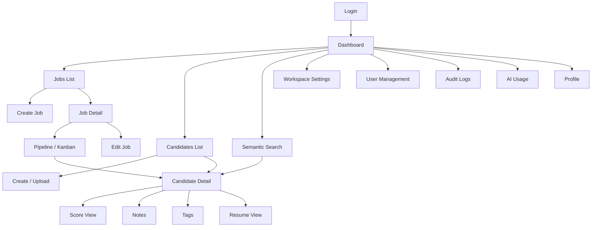
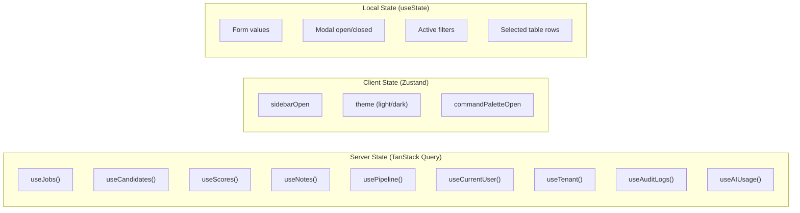

# Hiron UI/UX Design Specification

> **Document Type**: UI/UX Design System & Screen Specification  
> **Version**: 1.0  
> **Date**: July 28, 2026  
> **Status**: Draft — Awaiting Founder Review  
> **Framework**: Next.js 15 (App Router) + Tailwind CSS + shadcn/ui  
> **Governing Documents**: Frozen Architecture, Engineering Guidelines, Database Design, API Contract

---

## 1. Design Philosophy

### Core Principles

| #   | Principle                             | Meaning                                                                                                                                                                             |
| --- | ------------------------------------- | ----------------------------------------------------------------------------------------------------------------------------------------------------------------------------------- |
| 1   | **Data-dense, not overwhelming**      | Recruiters process hundreds of candidates daily. Show maximum information with minimum visual noise. Think Bloomberg Terminal for hiring — information-rich, scannable, actionable. |
| 2   | **AI is the assistant, not the boss** | AI scores and explanations are prominent but never presented as final decisions. Every AI output has a confidence indicator and a "why" link. Humans always have the final say.     |
| 3   | **Speed equals trust**                | If the UI feels slow, recruiters won't trust it. Optimistic updates, skeleton loaders, and perceived performance matter as much as actual performance.                              |
| 4   | **Progressive disclosure**            | Show the summary first, details on demand. A candidate card shows the score; clicking reveals the full breakdown. A job list shows status; expanding shows pipeline metrics.        |
| 5   | **Consistent vocabulary**             | The same concept uses the same word everywhere. "Score" is always "Score" (not "rating" or "match"). "Stage" is always "Stage" (not "step" or "phase").                             |
| 6   | **Accessible by default**             | WCAG 2.2 AA compliance is not optional. Every interactive element has keyboard access, ARIA labels, and sufficient contrast.                                                        |

### Design Personality

| Attribute        | Expression                                                                               |
| ---------------- | ---------------------------------------------------------------------------------------- |
| **Professional** | Clean layouts, restrained color usage, business-appropriate typography                   |
| **Intelligent**  | AI insights are woven into every view — not a separate "AI tab" but part of the workflow |
| **Trustworthy**  | Confidence indicators on AI outputs, audit trails visible, explainable scores            |
| **Efficient**    | Keyboard shortcuts for power users, bulk actions, minimal clicks to common tasks         |

---

## 2. Design System

### Technology Mapping

| Design Concept    | Implementation                          |
| ----------------- | --------------------------------------- |
| Component library | shadcn/ui (Radix primitives + Tailwind) |
| Styling           | Tailwind CSS utility classes            |
| Icons             | Lucide React                            |
| Charts            | Recharts                                |
| Drag & drop       | @dnd-kit (Kanban)                       |
| Date picker       | shadcn/ui DatePicker (Radix + date-fns) |
| Rich text         | Tiptap (for notes with @mentions)       |
| File upload       | react-dropzone                          |
| State (server)    | TanStack Query                          |
| State (client)    | Zustand (sidebar, theme, modals)        |

### Component Hierarchy

```
App Shell
├── Sidebar Navigation
│   ├── Logo
│   ├── Nav Links (Dashboard, Jobs, Candidates, Search, Settings)
│   ├── Tenant Switcher (future)
│   └── User Menu (profile, logout)
├── Top Bar
│   ├── Breadcrumbs
│   ├── Global Search (Cmd+K)
│   └── Notifications Bell
└── Main Content Area
    ├── Page Header (title, description, actions)
    ├── Page Content (varies per screen)
    └── Modals / Sheets / Toasts (overlay layer)
```

---

## 3. Color Palette

### Semantic Colors

| Token                  | Light Mode           | Dark Mode            | Usage                                 |
| ---------------------- | -------------------- | -------------------- | ------------------------------------- |
| `--background`         | `hsl(0, 0%, 100%)`   | `hsl(224, 71%, 4%)`  | Page background                       |
| `--foreground`         | `hsl(224, 71%, 4%)`  | `hsl(210, 20%, 98%)` | Primary text                          |
| `--card`               | `hsl(0, 0%, 100%)`   | `hsl(224, 71%, 4%)`  | Card backgrounds                      |
| `--card-foreground`    | `hsl(224, 71%, 4%)`  | `hsl(210, 20%, 98%)` | Card text                             |
| `--primary`            | `hsl(262, 83%, 58%)` | `hsl(263, 70%, 50%)` | Primary buttons, links, active states |
| `--primary-foreground` | `hsl(210, 20%, 98%)` | `hsl(210, 20%, 98%)` | Text on primary backgrounds           |
| `--secondary`          | `hsl(220, 14%, 96%)` | `hsl(215, 27%, 17%)` | Secondary buttons, subtle backgrounds |
| `--muted`              | `hsl(220, 14%, 96%)` | `hsl(215, 27%, 17%)` | Muted backgrounds, disabled states    |
| `--muted-foreground`   | `hsl(220, 9%, 46%)`  | `hsl(217, 10%, 65%)` | Placeholder text, secondary labels    |
| `--accent`             | `hsl(220, 14%, 96%)` | `hsl(215, 27%, 17%)` | Hover states, selected items          |
| `--destructive`        | `hsl(0, 84%, 60%)`   | `hsl(0, 62%, 30%)`   | Delete buttons, error states          |
| `--border`             | `hsl(220, 13%, 91%)` | `hsl(215, 27%, 17%)` | Borders, dividers                     |
| `--ring`               | `hsl(262, 83%, 58%)` | `hsl(263, 70%, 50%)` | Focus rings                           |

### AI-Specific Colors

| Token                    | Value                | Usage                           |
| ------------------------ | -------------------- | ------------------------------- |
| `--ai-score-high`        | `hsl(142, 71%, 45%)` | Scores 80–100                   |
| `--ai-score-medium`      | `hsl(38, 92%, 50%)`  | Scores 50–79                    |
| `--ai-score-low`         | `hsl(0, 84%, 60%)`   | Scores 0–49                     |
| `--ai-confidence-high`   | `hsl(142, 71%, 45%)` | Confidence 0.8–1.0              |
| `--ai-confidence-medium` | `hsl(38, 92%, 50%)`  | Confidence 0.5–0.79             |
| `--ai-confidence-low`    | `hsl(0, 84%, 60%)`   | Confidence 0.0–0.49             |
| `--ai-badge`             | `hsl(262, 83%, 58%)` | AI-generated content indicators |

### Pipeline Stage Colors

| Stage Type          | Color                | Usage                                |
| ------------------- | -------------------- | ------------------------------------ |
| Active stages       | `hsl(220, 70%, 50%)` | Applied, Screening, Interview, Offer |
| Hired (terminal)    | `hsl(142, 71%, 45%)` | Successful outcome                   |
| Rejected (terminal) | `hsl(0, 84%, 60%)`   | Rejected outcome                     |

---

## 4. Typography

### Font Stack

| Usage                 | Font           | Fallback                             | Source       |
| --------------------- | -------------- | ------------------------------------ | ------------ |
| Primary (UI)          | Inter          | system-ui, -apple-system, sans-serif | Google Fonts |
| Monospace (code, IDs) | JetBrains Mono | ui-monospace, monospace              | Google Fonts |

### Type Scale

| Token        | Size             | Weight         | Line Height | Usage                               |
| ------------ | ---------------- | -------------- | ----------- | ----------------------------------- |
| `heading-1`  | 30px / 1.875rem  | 700 (Bold)     | 1.2         | Page titles                         |
| `heading-2`  | 24px / 1.5rem    | 600 (Semibold) | 1.3         | Section titles                      |
| `heading-3`  | 20px / 1.25rem   | 600 (Semibold) | 1.4         | Card titles                         |
| `heading-4`  | 16px / 1rem      | 600 (Semibold) | 1.4         | Subsection titles                   |
| `body-large` | 16px / 1rem      | 400 (Regular)  | 1.6         | Primary body text                   |
| `body`       | 14px / 0.875rem  | 400 (Regular)  | 1.5         | Default body text                   |
| `body-small` | 13px / 0.8125rem | 400 (Regular)  | 1.5         | Secondary text, table cells         |
| `caption`    | 12px / 0.75rem   | 500 (Medium)   | 1.4         | Labels, timestamps, badges          |
| `overline`   | 11px / 0.6875rem | 600 (Semibold) | 1.3         | Section overlines, uppercase labels |
| `mono`       | 13px / 0.8125rem | 400 (Regular)  | 1.4         | UUIDs, technical values             |

### Typography Rules

- Maximum line length: 72 characters for body text (readability)
- Headings never wrap to more than 2 lines
- Numbers in data tables use tabular figures (`font-variant-numeric: tabular-nums`)
- Scores always use `heading-3` weight for visual prominence

---

## 5. Spacing System

### Base Unit: 4px

| Token      | Value | Usage                           |
| ---------- | ----- | ------------------------------- |
| `space-0`  | 0px   | Reset                           |
| `space-1`  | 4px   | Tight inline spacing            |
| `space-2`  | 8px   | Icon-to-text gap, compact lists |
| `space-3`  | 12px  | Form field internal padding     |
| `space-4`  | 16px  | Default component padding       |
| `space-5`  | 20px  | Card padding                    |
| `space-6`  | 24px  | Section gaps                    |
| `space-8`  | 32px  | Page section spacing            |
| `space-10` | 40px  | Major section gaps              |
| `space-12` | 48px  | Page top/bottom padding         |
| `space-16` | 64px  | Large layout gaps               |

### Spacing Rules

- Card internal padding: `space-5` (20px)
- Gap between cards in a grid: `space-4` (16px)
- Gap between form fields: `space-4` (16px)
- Page header to content: `space-6` (24px)
- Sidebar width: 256px (collapsed: 64px)

---

## 6. Iconography

### Icon Library: Lucide React

| Category   | Icons                                                                    | Usage                |
| ---------- | ------------------------------------------------------------------------ | -------------------- |
| Navigation | `LayoutDashboard`, `Briefcase`, `Users`, `Search`, `Settings`, `LogOut`  | Sidebar navigation   |
| Actions    | `Plus`, `Pencil`, `Trash2`, `Archive`, `Download`, `Upload`, `RefreshCw` | Action buttons       |
| Status     | `CheckCircle2`, `XCircle`, `AlertTriangle`, `Clock`, `Loader2`           | Status indicators    |
| AI         | `Sparkles`, `Brain`, `Zap`, `Target`                                     | AI-related features  |
| Pipeline   | `GitBranch`, `ArrowRight`, `MoveRight`, `ThumbsUp`, `ThumbsDown`         | Pipeline actions     |
| Data       | `FileText`, `Mail`, `Phone`, `MapPin`, `Building2`, `GraduationCap`      | Candidate/job fields |

### Icon Rules

- Size: 16px for inline, 20px for buttons, 24px for navigation
- Stroke width: 1.5px (Lucide default)
- Color: Inherit from parent text color unless semantically colored (status icons)
- Always paired with text labels in navigation (no icon-only nav items)
- Icon-only buttons must have `aria-label`

---

## 7. Elevation & Shadows

| Token       | Value                                                       | Usage                     |
| ----------- | ----------------------------------------------------------- | ------------------------- |
| `shadow-sm` | `0 1px 2px rgba(0,0,0,0.05)`                                | Subtle cards, form inputs |
| `shadow-md` | `0 4px 6px rgba(0,0,0,0.07), 0 2px 4px rgba(0,0,0,0.06)`    | Elevated cards, dropdowns |
| `shadow-lg` | `0 10px 15px rgba(0,0,0,0.10), 0 4px 6px rgba(0,0,0,0.05)`  | Modals, popovers          |
| `shadow-xl` | `0 20px 25px rgba(0,0,0,0.10), 0 8px 10px rgba(0,0,0,0.04)` | Command palette           |

### Elevation Rules

- Cards on background: `shadow-sm`
- Dropdowns and popovers: `shadow-md`
- Modals and dialogs: `shadow-lg`
- Command palette (Cmd+K): `shadow-xl`
- Dark mode: Shadows are less visible — use border instead (`border` token)

---

## 8. Border Radius

| Token         | Value  | Usage                          |
| ------------- | ------ | ------------------------------ |
| `radius-sm`   | 4px    | Small elements (badges, chips) |
| `radius-md`   | 6px    | Buttons, inputs, cards         |
| `radius-lg`   | 8px    | Modals, large cards            |
| `radius-xl`   | 12px   | Score cards, AI panels         |
| `radius-full` | 9999px | Avatars, circular buttons      |

---

## 9. Grid System

### Layout Grid

| Breakpoint            | Columns | Gutter | Margin                             |
| --------------------- | ------- | ------ | ---------------------------------- |
| Mobile (< 640px)      | 4       | 16px   | 16px                               |
| Tablet (640–1024px)   | 8       | 20px   | 24px                               |
| Desktop (1024–1440px) | 12      | 24px   | 32px                               |
| Wide (> 1440px)       | 12      | 24px   | auto (max-width: 1440px, centered) |

### Content Width

| Context                  | Max Width             |
| ------------------------ | --------------------- |
| Full page (with sidebar) | `calc(100vw - 256px)` |
| Content column           | 1200px                |
| Form column              | 640px                 |
| Narrow dialog            | 480px                 |
| Wide dialog              | 720px                 |
| Full-width table         | 100% of content area  |

---

## 10. Responsive Breakpoints

| Token    | Value    | Tailwind | Target                             |
| -------- | -------- | -------- | ---------------------------------- |
| `mobile` | < 640px  | Default  | Phones                             |
| `sm`     | ≥ 640px  | `sm:`    | Large phones, small tablets        |
| `md`     | ≥ 768px  | `md:`    | Tablets (portrait)                 |
| `lg`     | ≥ 1024px | `lg:`    | Tablets (landscape), small laptops |
| `xl`     | ≥ 1280px | `xl:`    | Standard desktops                  |
| `2xl`    | ≥ 1536px | `2xl:`   | Wide screens                       |

### Responsive Strategy

| Pattern      | Mobile                  | Tablet                           | Desktop                       |
| ------------ | ----------------------- | -------------------------------- | ----------------------------- |
| Sidebar      | Hidden (hamburger menu) | Collapsed (icons only, 64px)     | Expanded (256px)              |
| Data tables  | Card list view          | Scrollable table                 | Full table                    |
| Kanban board | Single column (swipe)   | 3 visible columns                | All columns                   |
| Forms        | Full width, stacked     | 2-column where appropriate       | 2-column with sidebar preview |
| Score card   | Stacked layout          | Side-by-side score + explanation | Full width with all panels    |
| Filters      | Bottom sheet            | Side panel                       | Inline above table            |

---

## 11. Accessibility (WCAG 2.2 AA)

### Requirements

| Standard                 | Implementation                                                                                                                  |
| ------------------------ | ------------------------------------------------------------------------------------------------------------------------------- |
| **Color contrast**       | All text meets 4.5:1 ratio (AA). Large text: 3:1. UI components: 3:1 against background.                                        |
| **Keyboard navigation**  | Every interactive element reachable via Tab. Focus order follows visual order. Visible focus ring (`--ring` color, 2px offset). |
| **Screen readers**       | All images have `alt` text. Icons have `aria-label`. Dynamic content uses `aria-live` regions.                                  |
| **Focus management**     | Modals trap focus. Closing returns focus to trigger element. Page navigation announces new page title.                          |
| **Motion**               | Respect `prefers-reduced-motion`. Disable animations when set. Score gauge animation skipped.                                   |
| **Target size**          | All click/touch targets are at least 44×44px.                                                                                   |
| **Error identification** | Form errors use both color AND icon AND text. Never color alone.                                                                |
| **Labels**               | All form inputs have visible labels (no placeholder-only inputs).                                                               |

### ARIA Patterns

| Component    | ARIA Pattern                                                          |
| ------------ | --------------------------------------------------------------------- |
| Sidebar      | `navigation` landmark with `aria-label="Main navigation"`             |
| Kanban board | `aria-roledescription="kanban board"` with `aria-label` per column    |
| Score gauge  | `role="meter"` with `aria-valuenow`, `aria-valuemin`, `aria-valuemax` |
| Data table   | Standard `table` role with `aria-sort` on sortable columns            |
| Tabs         | `tablist` / `tab` / `tabpanel` pattern                                |
| Toast        | `role="status"` with `aria-live="polite"`                             |
| Modal        | `dialog` role with `aria-modal="true"`                                |
| Dropdown     | `combobox` or `listbox` depending on context                          |

---

## 12. Loading States

### Skeleton Loaders

Every component has a matching skeleton variant that shows the approximate shape of the content. Skeletons use a pulsing animation on `--muted` background.

| Component         | Skeleton Behavior                                   |
| ----------------- | --------------------------------------------------- |
| Data table        | 5 rows of animated gray bars matching column widths |
| Card grid         | Gray rectangles matching card dimensions            |
| Score card        | Circle skeleton (gauge) + bar skeletons (breakdown) |
| Candidate profile | Avatar circle + name bar + detail bars              |
| Kanban column     | 3 card skeletons per column                         |
| Chart             | Gray rectangle with subtle pulse                    |

### Loading Button State

Active action buttons show a `Loader2` spinner replacing the icon. Text changes to contextual label ("Scoring..." / "Uploading..." / "Saving..."). Button is disabled during loading.

### Full-Page Loading

Used only on initial app load (before shell renders). Centered Hiron logo with subtle pulse animation. Max duration: 3 seconds before showing an error.

---

## 13. Empty States

Every list/table/grid has a purpose-built empty state.

### Empty State Pattern

```
┌─────────────────────────────────────┐
│                                     │
│          [Illustration/Icon]        │
│                                     │
│         Primary Message             │
│    Secondary helpful description    │
│                                     │
│         [ Action Button ]           │
│                                     │
└─────────────────────────────────────┘
```

### Empty States per Screen

| Screen                      | Icon            | Primary Message                   | Action                       |
| --------------------------- | --------------- | --------------------------------- | ---------------------------- |
| Jobs list                   | `Briefcase`     | No jobs yet                       | "Create your first job"      |
| Candidates list             | `Users`         | No candidates in your pool        | "Upload resumes"             |
| Pipeline (no candidates)    | `GitBranch`     | No candidates in this pipeline    | "Add candidates to this job" |
| Score (not scored)          | `Sparkles`      | This candidate hasn't been scored | "Score now"                  |
| Notes (empty)               | `MessageSquare` | No notes on this candidate        | "Add a note"                 |
| Search results (no matches) | `Search`        | No candidates match your search   | "Try different keywords"     |
| Audit logs (empty)          | `ScrollText`    | No activity recorded yet          | — (informational)            |

---

## 14. Error States

### Inline Errors (Form Fields)

- Red border on the input (`--destructive`)
- Error icon (AlertTriangle) + error text below the input
- Error text uses `caption` size in `--destructive` color
- Input receives `aria-invalid="true"` and `aria-describedby` pointing to error text

### Page-Level Errors

```
┌─────────────────────────────────────┐
│                                     │
│          [AlertTriangle icon]       │
│                                     │
│    Something went wrong             │
│    We couldn't load your data.      │
│    This has been reported.          │
│                                     │
│    [ Try Again ]  [ Go Home ]       │
│                                     │
└─────────────────────────────────────┘
```

### API Error Handling

| API Error Code                   | UI Behavior                                                                     |
| -------------------------------- | ------------------------------------------------------------------------------- |
| `VALIDATION_ERROR` (422)         | Highlight specific fields, show per-field error messages                        |
| `AUTHENTICATION_REQUIRED` (401)  | Redirect to login. Show toast: "Session expired. Please log in again."          |
| `INSUFFICIENT_PERMISSIONS` (403) | Show inline error: "You don't have permission for this action."                 |
| `RESOURCE_NOT_FOUND` (404)       | Show 404 page with navigation options                                           |
| `RESOURCE_CONFLICT` (409)        | Show toast: "This [entity] already exists."                                     |
| `RATE_LIMIT_EXCEEDED` (429)      | Show toast: "Slow down! Try again in [N] seconds."                              |
| `AI_SERVICE_UNAVAILABLE` (503)   | Show inline banner: "AI scoring is temporarily unavailable. Your data is safe." |
| `INTERNAL_ERROR` (500)           | Show generic error page. Log to Sentry.                                         |

---

## 15. Toast & Notification Patterns

### Toast Position

Bottom-right corner. Stacks vertically (newest on top). Max 3 visible toasts.

### Toast Types

| Type        | Icon                      | Background  | Duration                      | Example                                    |
| ----------- | ------------------------- | ----------- | ----------------------------- | ------------------------------------------ |
| Success     | `CheckCircle2`            | Green tint  | 4 seconds                     | "Job created successfully"                 |
| Error       | `XCircle`                 | Red tint    | 8 seconds (or manual dismiss) | "Failed to save changes"                   |
| Warning     | `AlertTriangle`           | Amber tint  | 6 seconds                     | "Resume parsing took longer than expected" |
| Info        | `Info`                    | Blue tint   | 5 seconds                     | "Score recalculated with latest prompt"    |
| AI Progress | `Sparkles` + progress bar | Purple tint | Until complete                | "Scoring 23 of 47 candidates..."           |

### Toast Anatomy

```
┌──────────────────────────────────────┐
│ [Icon]  Title                    [X] │
│         Description text             │
│         ████████░░░░ 48%  (if prog)  │
└──────────────────────────────────────┘
```

---

## 16. Modal Guidelines

### Modal Sizes

| Size   | Width            | Usage                                         |
| ------ | ---------------- | --------------------------------------------- |
| Small  | 400px            | Confirmations, simple forms (delete, archive) |
| Medium | 560px            | Create/edit forms, score details              |
| Large  | 720px            | Complex forms, full score explanation         |
| Full   | 90vw, max 1200px | Bulk upload, full candidate comparison        |

### Modal Rules

- Always have a close button (X) in top-right
- Close on Escape key press
- Close on backdrop click (except for unsaved form changes — show confirmation)
- Trap focus inside the modal
- Return focus to the trigger element on close
- Destructive actions (delete, archive) require explicit confirmation: "Are you sure? This cannot be undone."
- Long modals scroll internally (modal header stays fixed)

---

## 17. Forms & Validation

### Form Layout

```
┌──────────────────────────────────────┐
│ Form Title                           │
│                                      │
│ Label *                              │
│ ┌──────────────────────────────────┐ │
│ │ Input value                      │ │
│ └──────────────────────────────────┘ │
│ Helper text (optional)               │
│                                      │
│ Label                                │
│ ┌──────────────────────────────────┐ │
│ │ Textarea value                   │ │
│ │                                  │ │
│ └──────────────────────────────────┘ │
│ 0/10000 characters                   │
│                                      │
│            [ Cancel ] [ Save ]       │
└──────────────────────────────────────┘
```

### Validation Strategy

| Timing      | What                            | How                                                                  |
| ----------- | ------------------------------- | -------------------------------------------------------------------- |
| On blur     | Field-level validation          | Validate when user leaves a field. Show error immediately.           |
| On submit   | Full form validation            | Validate all fields. Scroll to first error. Focus the errored field. |
| Real-time   | Character count, format preview | Show counter for text areas. Show email format feedback.             |
| Server-side | Uniqueness, business rules      | Show server error after submission (e.g., "Email already exists").   |

### Required Field Indicator

Required fields are marked with a red asterisk (`*`) after the label. The form header includes the text: "Fields marked with * are required."

### Form Button Placement

- Primary action (Save/Create) on the right
- Secondary action (Cancel) on the left of primary
- Destructive actions (Delete) on the far left, separated by spacing
- Buttons are right-aligned in the form footer

---

## 18. Tables

### Table Anatomy

```
┌──────────────────────────────────────────────────────────┐
│ [Checkbox] Name ▲          Skills        Score   Actions │
├──────────────────────────────────────────────────────────┤
│ [☐] Jane Smith        Python, Go, SQL    92 ●    ⋯ menu │
│ [☐] Bob Johnson       React, TypeScript  78 ●    ⋯ menu │
│ [☐] Alice Chen        Java, Spring       64 ●    ⋯ menu │
├──────────────────────────────────────────────────────────┤
│ Showing 1–20 of 1,250        [ < ]  Page 1 of 63  [ > ] │
└──────────────────────────────────────────────────────────┘
```

### Table Features

| Feature           | Implementation                                                                            |
| ----------------- | ----------------------------------------------------------------------------------------- |
| **Sorting**       | Click column header to sort. Arrow indicator shows direction.                             |
| **Row selection** | Checkbox column. Header checkbox selects all on page.                                     |
| **Bulk actions**  | Bar appears above table when rows selected: "3 selected — [Score] [Add to Job] [Archive]" |
| **Row actions**   | Three-dot menu (⋯) with contextual actions                                                |
| **Row click**     | Click row navigates to detail page. Action menu and checkbox don't trigger navigation.    |
| **Column width**  | Fixed widths for checkbox, score, actions. Flexible for text columns.                     |
| **Sticky header** | Table header sticks on scroll                                                             |
| **Mobile**        | Switch to card layout (one card per row)                                                  |

---

## 19. Search Components

### Global Search (Cmd+K)

Command palette style — appears as a centered overlay.

```
┌───────────────────────────────────────┐
│ 🔍 Search candidates, jobs, or type  │
│    a command...                       │
├───────────────────────────────────────┤
│ Recent                               │
│   Jane Smith             Candidate   │
│   Sr. Backend Engineer   Job         │
│                                      │
│ Commands                             │
│   Create new job         ⌘N          │
│   Upload resumes         ⌘U          │
│   Search candidates      ⌘/          │
└───────────────────────────────────────┘
```

### Inline Search

Search input above tables. Debounced (300ms). Shows result count while typing. Clears with X button.

### Semantic Search

Dedicated page with a large input field, AI badge, and structured results with relevance scores.

---

## 20. Filters

### Filter Bar (Above Table)

```
┌────────────────────────────────────────────────────────────┐
│ 🔍 Search...  │ Status ▾ │ Skills ▾ │ Experience ▾ │ ✕ Clear│
└────────────────────────────────────────────────────────────┘
```

### Filter Behavior

| Pattern       | Implementation                                                   |
| ------------- | ---------------------------------------------------------------- |
| Single select | Dropdown with radio buttons (Status: Open / Closed / Draft)      |
| Multi select  | Dropdown with checkboxes (Skills: Python, Go, PostgreSQL)        |
| Range         | Two inputs — Min / Max (Experience: 3–8 years)                   |
| Boolean       | Toggle switch (Shortlisted: Yes/No)                              |
| Date range    | Date picker with presets ("Last 7 days", "Last 30 days", custom) |

### Active Filters

Active filters show as removable chips below the filter bar:

```
Active: [Status: Open ✕] [Skills: Python ✕] [Exp: 5+ years ✕]    Clear all
```

---

## 21. Pagination

### Cursor-Based Pagination UI

The user sees a simplified interface that hides the cursor implementation:

```
Showing 1–20 of 1,250 candidates    [← Previous]  [Next →]
```

### Pagination Rules

- "Previous" disabled on first page
- "Next" disabled when `hasMore: false`
- `totalCount` shown only when available (first page load)
- Page size selector: 10 / 20 / 50 / 100
- Default page size: 20
- Loading indicator replaces content during page transition (not overlay)

---

## 22. AI-Specific UI Patterns

### Score Display

```
┌─────────────────────────────────────────────────┐
│                                                 │
│     ┌─────┐                                     │
│     │     │   92 / 100                          │
│     │     │   Strong Match                      │
│     │     │   ⚡ High Confidence (0.87)          │
│     └─────┘                                     │
│     Gauge                                       │
│                                                 │
│   Skills        ████████████░░  85%             │
│   Experience    ██████████████  95%             │
│   Education     ████████████░░  90%             │
│                                                 │
│   Matched: Python, PostgreSQL, Docker, K8s      │
│   Missing: FastAPI, Redis                       │
│                                                 │
│   [View Full Explanation]                       │
│                                                 │
│   ✨ Scored by GPT-4o • Prompt v2.0.0           │
│      July 28, 2026 at 12:00 PM                  │
│                                                 │
└─────────────────────────────────────────────────┘
```

### AI Badge

All AI-generated content shows a small `✨ AI` badge to distinguish it from human-entered data. Uses `--ai-badge` color.

### Confidence Indicators

| Level             | Badge                | Color | Tooltip                                           |
| ----------------- | -------------------- | ----- | ------------------------------------------------- |
| High (0.8–1.0)    | `⚡ High Confidence` | Green | "Complete resume data, consistent scoring output" |
| Medium (0.5–0.79) | `⚠️ Limited Data`    | Amber | "Partial resume or ambiguous job description"     |
| Low (0.0–0.49)    | `⚠️ Review Manually` | Red   | "Incomplete resume, scoring may be unreliable"    |

### AI Explanation Panel

Expandable panel below the score card. Shows the LLM-generated explanation as formatted prose. Includes a "Report Issue" link for incorrect scores.

### AI Provenance Footer

Every AI output shows a subtle footer: `✨ Scored by gpt-4o-2024-08-06 • Prompt v2.0.0 • July 28, 2026`

---

## 23. File Upload UX

### Drag-and-Drop Zone

```
┌ ─ ─ ─ ─ ─ ─ ─ ─ ─ ─ ─ ─ ─ ─ ─ ─ ─ ─ ─ ─ ┐
│                                               │
│    ↑  Drag & drop resumes here                │
│       or click to browse                      │
│                                               │
│    PDF, DOCX, TXT • Max 10 MB per file        │
│    Up to 500 files for bulk upload             │
│                                               │
└ ─ ─ ─ ─ ─ ─ ─ ─ ─ ─ ─ ─ ─ ─ ─ ─ ─ ─ ─ ─ ┘
```

### Upload States

| State            | Visual                                                                       |
| ---------------- | ---------------------------------------------------------------------------- |
| **Default**      | Dashed border, upload icon, instructional text                               |
| **Drag over**    | Border becomes solid primary color, background tints primary                 |
| **Uploading**    | File name + progress bar + percentage                                        |
| **Processing**   | File name + spinner + "Parsing..."                                           |
| **Complete**     | File name + green check + "Parsed" + link to candidate                       |
| **Failed**       | File name + red X + error message + "Retry" link                             |
| **Invalid file** | Shake animation + error toast: "Only PDF, DOCX, and TXT files are supported" |

### Bulk Upload Progress

```
┌──────────────────────────────────────────┐
│ Uploading 47 resumes                     │
│ ██████████████████░░░░░░░░  34/47 (72%)  │
│                                          │
│ ✓ jane_smith.pdf       Parsed            │
│ ✓ bob_johnson.docx     Parsed            │
│ ⟳ alice_chen.pdf       Parsing...        │
│ ○ dave_wilson.pdf      Queued            │
│ ✕ photo.jpg            Unsupported type  │
│                                          │
│ [ Cancel Remaining ]                     │
└──────────────────────────────────────────┘
```

---

## 24. Keyboard Shortcuts

| Shortcut       | Action                                             | Context           |
| -------------- | -------------------------------------------------- | ----------------- |
| `Cmd/Ctrl + K` | Open global search / command palette               | Global            |
| `Cmd/Ctrl + N` | Create new (context-aware: new job, new candidate) | Global            |
| `Cmd/Ctrl + U` | Open upload dialog                                 | Global            |
| `Escape`       | Close modal / popover / command palette            | Overlay open      |
| `J` / `K`      | Navigate down / up in lists                        | Table / list view |
| `Enter`        | Open selected item                                 | Table / list view |
| `S`            | Score selected candidate                           | Candidate detail  |
| `M`            | Move to next stage                                 | Pipeline view     |
| `N`            | Add note                                           | Candidate detail  |
| `?`            | Show keyboard shortcuts overlay                    | Global            |

### Keyboard Shortcut Overlay

Triggered by `?`. Shows a modal with all shortcuts organized by context.

---

## 25. Navigation Structure

### Sidebar Navigation

```
┌─────────────────────┐
│  [Hiron Logo]       │
│                     │
│  📊 Dashboard       │
│  💼 Jobs            │
│  👥 Candidates      │
│  🔍 Search          │
│                     │
│  ─── Settings ───   │
│  ⚙️  Workspace      │
│  👤 Team            │
│  📋 Audit Log       │
│  📈 AI Usage        │
│                     │
│  ─── Account ───    │
│  [Avatar] Jane S.   │
│  Profile            │
│  Log out            │
└─────────────────────┘
```

### Navigation Flow



### URL Structure (Next.js App Router)

| Route                       | Page                  |
| --------------------------- | --------------------- |
| `/login`                    | Login                 |
| `/forgot-password`          | Forgot password       |
| `/`                         | Dashboard             |
| `/jobs`                     | Jobs list             |
| `/jobs/new`                 | Create job            |
| `/jobs/[jobId]`             | Job detail + pipeline |
| `/jobs/[jobId]/edit`        | Edit job              |
| `/jobs/[jobId]/pipeline`    | Kanban view           |
| `/candidates`               | Candidates list       |
| `/candidates/new`           | Create candidate      |
| `/candidates/upload`        | Upload resumes        |
| `/candidates/[candidateId]` | Candidate detail      |
| `/search`                   | Semantic search       |
| `/settings`                 | Workspace settings    |
| `/settings/team`            | User management       |
| `/settings/audit-log`       | Audit logs            |
| `/settings/ai-usage`        | AI usage analytics    |
| `/profile`                  | Current user profile  |

---

# Screen Specifications

---

## Screen: Login

### Purpose

Authenticate the user. Entry point for all users. Must feel premium and trustworthy.

### ASCII Wireframe

```
┌──────────────────────────────────────────────────────────────┐
│                                                              │
│                    [Hiron Logo + Tagline]                     │
│                 "Hiring Intelligence Platform"               │
│                                                              │
│              ┌─────────────────────────────┐                 │
│              │                             │                 │
│              │  Email *                    │                 │
│              │  ┌───────────────────────┐  │                 │
│              │  │ jane@acme.com         │  │                 │
│              │  └───────────────────────┘  │                 │
│              │                             │                 │
│              │  Password *                │                 │
│              │  ┌───────────────────────┐  │                 │
│              │  │ ••••••••••••   [👁]   │  │                 │
│              │  └───────────────────────┘  │                 │
│              │  [Forgot password?]         │                 │
│              │                             │                 │
│              │  [ Sign In ─────────────── ]│                 │
│              │                             │                 │
│              │  ──── or continue with ──── │                 │
│              │                             │                 │
│              │  [ G  Sign in with Google ] │                 │
│              │                             │                 │
│              └─────────────────────────────┘                 │
│                                                              │
│              Don't have an account? Contact sales            │
│                                                              │
└──────────────────────────────────────────────────────────────┘
```

### Layout

Centered card on a gradient background (`--primary` to dark). No sidebar or navigation. Full-page layout.

### Components

- Logo + tagline
- Email input (text, autofocus)
- Password input (password toggle visibility)
- "Forgot password?" link
- Primary sign-in button (full width)
- Divider with "or continue with"
- Google OAuth button
- Contact sales link

### API Endpoints

- `POST /api/v1/auth/login` — email/password auth
- Google OAuth flow (redirect-based)

### User Actions

1. Enter email → Tab → Enter password → Enter (submit)
2. Click "Forgot password?" → navigate to forgot password page
3. Click "Sign in with Google" → OAuth redirect flow

### States

- **Empty**: Default form state
- **Loading**: "Sign In" button shows spinner, disabled
- **Error (invalid credentials)**: Red toast: "Invalid email or password". Clear password field. Focus email.
- **Error (tenant inactive)**: Red toast: "Your account has been deactivated. Contact your administrator."
- **Error (rate limited)**: Red toast: "Too many login attempts. Try again in 60 seconds."
- **Success**: Redirect to Dashboard

### Validation

- Email: Required, valid email format (on blur)
- Password: Required, non-empty (on submit)

### Permissions

- Public (no auth required)

### Responsive Behavior

- **Mobile**: Card takes full width with padding. Logo smaller.
- **Tablet**: Card centered, 420px wide.
- **Desktop**: Card centered, 420px wide. Background pattern visible.

### Accessibility

- `autofocus` on email input
- Password visibility toggle has `aria-label="Show password"` / `"Hide password"`
- Form has `role="form"` with `aria-label="Sign in"`
- Error messages linked to inputs via `aria-describedby`

---

## Screen: Forgot Password

### Purpose

Allow users to reset their password via email link.

### ASCII Wireframe

```
┌──────────────────────────────────────────┐
│          [Hiron Logo]                    │
│                                          │
│    Reset your password                   │
│    Enter your email and we'll send       │
│    you a reset link.                     │
│                                          │
│    Email *                               │
│    ┌──────────────────────────────────┐  │
│    │ jane@acme.com                    │  │
│    └──────────────────────────────────┘  │
│                                          │
│    [ Send Reset Link ─────────────── ]   │
│                                          │
│    [← Back to login]                     │
└──────────────────────────────────────────┘
```

### States

- **Success**: Show confirmation: "Check your email. We sent a reset link to jane@acme.com." (Don't reveal if email exists — security best practice)
- **Error**: Generic message regardless of whether email exists

---

## Screen: Dashboard

### Purpose

Landing page after login. Overview of recruiting activity — open jobs, pipeline health, recent activity, and key metrics.

### ASCII Wireframe

```
┌─────────────────────────────────────────────────────────────────┐
│ Dashboard                                          July 28, 2026│
│                                                                 │
│ ┌──────────┐ ┌──────────┐ ┌──────────┐ ┌──────────┐            │
│ │ Open Jobs│ │Candidates│ │ Scored   │ │ Hired    │            │
│ │    12    │ │  1,250   │ │   847    │ │    23    │            │
│ │ +2 week  │ │ +125 wk  │ │ +89 wk  │ │ +5 week  │            │
│ └──────────┘ └──────────┘ └──────────┘ └──────────┘            │
│                                                                 │
│ ┌─────────────────────────────────┐ ┌─────────────────────────┐ │
│ │ Pipeline Overview               │ │ Recent Activity         │ │
│ │                                 │ │                         │ │
│ │ Sr. Backend Eng     47 cands    │ │ Jane scored Bob for     │ │
│ │ ████████████████░░  Pipeline    │ │ Sr. Backend Eng (92)    │ │
│ │                                 │ │ 5 min ago               │ │
│ │ Product Manager     23 cands    │ │                         │ │
│ │ ██████████░░░░░░░  Pipeline    │ │ 3 resumes uploaded      │ │
│ │                                 │ │ for Data Engineer       │ │
│ │ Data Engineer       12 cands    │ │ 1 hour ago              │ │
│ │ ████░░░░░░░░░░░░░  Pipeline    │ │                         │ │
│ │                                 │ │ Bob moved to Interview  │ │
│ │ [View all jobs →]               │ │ for PM role             │ │
│ └─────────────────────────────────┘ │ 2 hours ago             │ │
│                                     │                         │ │
│                                     │ [View all activity →]   │ │
│                                     └─────────────────────────┘ │
└─────────────────────────────────────────────────────────────────┘
```

### Layout

- 4-column metric cards at top
- 2-column layout below: Pipeline Overview (left, wider) + Recent Activity (right, narrower)

### Components

- MetricCard (4x): icon, value, label, trend indicator
- PipelineOverview: list of open jobs with candidate counts and mini progress bars
- RecentActivity: chronological feed of actions

### API Endpoints

- `GET /api/v1/jobs?status=open&limit=5` — Pipeline overview
- `GET /api/v1/audit-logs?limit=10` — Recent activity
- Metrics: derived from jobs + candidates + scores counts

### States

- **Empty (new tenant)**: Welcome screen with onboarding steps: "1. Create your first job → 2. Upload resumes → 3. Let AI score candidates"
- **Loading**: Skeleton for all cards and lists
- **Error**: Error banner at top, retry button

### Responsive Behavior

- **Mobile**: Metric cards 2×2 grid. Pipeline and Activity stack vertically.
- **Tablet**: Metric cards in a row. Pipeline and Activity side by side.
- **Desktop**: Full layout as wireframed.

---

## Screen: Jobs List

### Purpose

View and manage all job descriptions. Primary starting point for the recruiting workflow.

### ASCII Wireframe

```
┌──────────────────────────────────────────────────────────────┐
│ Jobs                                        [ + Create Job ] │
│                                                              │
│ 🔍 Search jobs...  │ Status: All ▾ │ Dept: All ▾ │          │
│                                                              │
│ ┌──────────────────────────────────────────────────────────┐ │
│ │ Title ▲               Dept      Candidates  Status  ⋯  │ │
│ ├──────────────────────────────────────────────────────────┤ │
│ │ Sr. Backend Engineer  Eng       47          🟢 Open  ⋯  │ │
│ │ Product Manager       Product   23          🟢 Open  ⋯  │ │
│ │ Data Engineer         Eng       12          🟡 Draft ⋯  │ │
│ │ UX Designer           Design     0          ⚪ Closed ⋯  │ │
│ ├──────────────────────────────────────────────────────────┤ │
│ │ Showing 1-4 of 4                                        │ │
│ └──────────────────────────────────────────────────────────┘ │
└──────────────────────────────────────────────────────────────┘
```

### API Endpoints

- `GET /api/v1/jobs` with query params for filters, sort, pagination

### User Actions

- Click row → navigate to `/jobs/[jobId]`
- Click "Create Job" → navigate to `/jobs/new`
- Three-dot menu: Edit, Open/Close, Archive
- Sort by column headers
- Filter by status, department
- Search by title/description

### States

- **Empty**: "No jobs yet. Create your first job to start evaluating candidates." + Create button
- **Loading**: 4-row skeleton table
- **Filtered empty**: "No jobs match your filters." + Clear filters link

### Permissions

- All roles can view
- `org_admin`, `recruiter` see "Create Job" button and edit actions
- `hiring_manager` sees read-only list

---

## Screen: Create Job

### Purpose

Create a new job description. Form-focused screen with live preview.

### ASCII Wireframe

```
┌──────────────────────────────────────────────────────────────────┐
│ ← Back to Jobs                                                   │
│                                                                   │
│ Create New Job                                                    │
│                                                                   │
│ ┌────────────────────────────┐ ┌──────────────────────────────┐  │
│ │ Title *                    │ │ Preview                      │  │
│ │ ┌────────────────────────┐ │ │                              │  │
│ │ │ Senior Backend Engineer│ │ │ Senior Backend Engineer      │  │
│ │ └────────────────────────┘ │ │ Engineering • Remote         │  │
│ │                            │ │ Full-time • 5–10 years       │  │
│ │ Department                 │ │                              │  │
│ │ ┌────────────────────────┐ │ │ Required: Python, FastAPI,   │  │
│ │ │ Engineering         ▾  │ │ │ PostgreSQL                   │  │
│ │ └────────────────────────┘ │ │                              │  │
│ │                            │ │ Preferred: Docker, K8s       │  │
│ │ Location                   │ │                              │  │
│ │ ┌────────────────────────┐ │ └──────────────────────────────┘  │
│ │ │ Remote                 │ │                                   │
│ │ └────────────────────────┘ │                                   │
│ │                            │                                   │
│ │ Description *              │                                   │
│ │ ┌────────────────────────┐ │                                   │
│ │ │ We are looking for...  │ │                                   │
│ │ │                        │ │                                   │
│ │ └────────────────────────┘ │                                   │
│ │ 0/10000                    │                                   │
│ │                            │                                   │
│ │ Required Skills            │                                   │
│ │ [Python][FastAPI][+Add]    │                                   │
│ │                            │                                   │
│ │ [ Cancel ]  [ Save Draft ] │                                   │
│ │             [ Save & Open ]│                                   │
│ └────────────────────────────┘                                   │
└──────────────────────────────────────────────────────────────────┘
```

### Layout

Two-column on desktop: form (left), live preview (right). Stacked on mobile.

### API Endpoints

- `POST /api/v1/jobs`

### Validation

- Title: required, 1–200 chars
- Description: required, 1–10,000 chars
- Experience range: max >= min
- Skills: each 1–100 chars, max 50

### Permissions

- `org_admin`, `recruiter` only

---

## Screen: Job Detail

### Purpose

Full view of a job: description, pipeline summary, candidates, and scores. Hub page for a specific role.

### ASCII Wireframe

```
┌──────────────────────────────────────────────────────────────────────┐
│ ← Jobs                                                               │
│                                                                       │
│ Senior Backend Engineer              🟢 Open    [ Edit ] [ ⋯ More ] │
│ Engineering • Remote • Full-time                                      │
│ Posted July 20, 2026 • 47 candidates                                  │
│                                                                       │
│ ┌──────┐ ┌──────────┐ ┌──────────┐ ┌──────────┐                     │
│ │Kanban│ │Candidates│ │  Scores  │ │  Details │                     │
│ └──────┘ └──────────┘ └──────────┘ └──────────┘                     │
│                                                                       │
│ [Tab Content: Kanban / Candidate List / Score Rankings / JD Details]  │
│                                                                       │
└──────────────────────────────────────────────────────────────────────┘
```

### Tabs

1. **Kanban**: Pipeline Kanban board (see Pipeline screen)
2. **Candidates**: Table of candidates for this job with scores
3. **Scores**: Ranked list by fit score
4. **Details**: Full JD text, extracted requirements, skills

### API Endpoints

- `GET /api/v1/jobs/{jobId}`
- `GET /api/v1/jobs/{jobId}/candidates` (per tab)

---

## Screen: Candidates List

### Purpose

Browse the entire candidate pool with search, filtering, and bulk actions.

### ASCII Wireframe

```
┌────────────────────────────────────────────────────────────────────┐
│ Candidates                                  [ Upload ] [ + Add ]  │
│                                                                    │
│ 🔍 Search...  │Skills ▾│ Exp ▾│ Location ▾│ Source ▾│ Tag ▾│     │
│ Active: [Python ✕] [5+ years ✕]                     Clear all     │
│                                                                    │
│ ┌────────────────────────────────────────────────────────────────┐ │
│ │[☐] Name            Title            Skills       Exp   Tags ⋯│ │
│ ├────────────────────────────────────────────────────────────────┤ │
│ │[☐] Jane Smith      Sr. SWE @ Stripe Python,Go   8yr  🏷️2  ⋯│ │
│ │[☐] Bob Johnson     SWE II @ Google   React,TS    5yr  🏷️1  ⋯│ │
│ │[☐] Alice Chen      Lead @ Meta       Java,K8s   12yr  🏷️3  ⋯│ │
│ ├────────────────────────────────────────────────────────────────┤ │
│ │ Showing 1-20 of 1,250     10|[20]|50|100   [<Prev] [Next>]   │ │
│ └────────────────────────────────────────────────────────────────┘ │
│                                                                    │
│ 2 selected: [ Score for Job ▾ ] [ Add to Job ▾ ] [ Archive ]     │
└────────────────────────────────────────────────────────────────────┘
```

### API Endpoints

- `GET /api/v1/candidates` with filters, sort, pagination
- Bulk actions: `POST /api/v1/jobs/{jobId}/candidates` (add to job)

### Permissions

- `hiring_manager`: sees only shortlisted candidates (reduced view)

---

## Screen: Candidate Detail

### Purpose

Complete candidate profile — resume, scores across jobs, notes, tags, pipeline status. The most information-dense screen.

### ASCII Wireframe

```
┌──────────────────────────────────────────────────────────────────────┐
│ ← Candidates                                                         │
│                                                                       │
│ ┌──────────────────────┐ ┌─────────────────────────────────────────┐ │
│ │ 👤 Jane Smith        │ │ ┌───────┐┌─────────┐┌──────┐┌───────┐ │ │
│ │ Sr. SWE @ Stripe     │ │ │Profile││  Scores ││ Notes││ Tags  │ │ │
│ │ San Francisco, CA    │ │ └───────┘└─────────┘└──────┘└───────┘ │ │
│ │ jane@example.com     │ │                                       │ │
│ │ +1-555-0123          │ │ [Tab Content]                         │ │
│ │ 🔗 LinkedIn          │ │                                       │ │
│ │ 8 years experience   │ │ Profile Tab:                         │ │
│ │                      │ │ ┌─────────────────────────────────┐   │ │
│ │ Skills:              │ │ │ Resume                          │   │ │
│ │ [Python][Go][PG]     │ │ │ ✓ Parsed (94% confidence)      │   │ │
│ │ [K8s][Docker]        │ │ │ jane_smith_resume.pdf           │   │ │
│ │                      │ │ │ [View] [Download]               │   │ │
│ │ Tags:                │ │ └─────────────────────────────────┘   │ │
│ │ [strong-hire]        │ │                                       │ │
│ │ [backend]            │ │ ┌─────────────────────────────────┐   │ │
│ │                      │ │ │ Experience                      │   │ │
│ │ Source: Upload       │ │ │ Sr. SWE @ Stripe (2022–Present)│   │ │
│ │ Added: Jul 20, 2026  │ │ │ SWE @ Datadog (2019–2022)     │   │ │
│ │                      │ │ └─────────────────────────────────┘   │ │
│ │ Jobs:                │ │                                       │ │
│ │ Sr. Backend Eng      │ │ ┌─────────────────────────────────┐   │ │
│ │  → Interview (92)    │ │ │ Education                       │   │ │
│ │ Data Engineer        │ │ │ B.S. CS — UC Berkeley (2019)   │   │ │
│ │  → Applied (—)       │ │ └─────────────────────────────────┘   │ │
│ └──────────────────────┘ └─────────────────────────────────────────┘ │
└──────────────────────────────────────────────────────────────────────┘
```

### Layout

Two-column: fixed sidebar (candidate summary) + tabbed content area. Sidebar collapses to top bar on mobile.

### Tabs

1. **Profile**: Parsed resume data (experience, education, certifications)
2. **Scores**: Scores across all jobs the candidate is in
3. **Notes**: Chronological notes feed with add form
4. **Tags**: Tag management

### API Endpoints

- `GET /api/v1/candidates/{candidateId}`
- `GET /api/v1/candidates/{candidateId}/notes`
- `GET /api/v1/candidates/{candidateId}/tags`

### User Actions

- View/download resume
- Score for a job (opens job selector → triggers scoring)
- Add/remove tags
- Add note
- View score explanations
- Navigate to associated jobs

### States

- **Loading**: Skeleton on sidebar + tab content
- **Error**: Error banner in content area
- **No resume**: "No resume uploaded" + Upload button in resume section
- **No scores**: "Not scored for any job yet" + "Score Now" button

### Permissions

- `hiring_manager`: read-only, sees only shortlisted candidate data. No edit/tag/score actions.

### Responsive Behavior

- **Mobile**: Sidebar becomes a collapsible header card. Tabs become a scrollable horizontal pill bar.
- **Tablet**: Sidebar narrower (200px). Tabs full width.
- **Desktop**: Full two-column layout.

---

## Screen: Resume Upload

### Purpose

Upload single or bulk resumes. Optionally associate with a job.

### ASCII Wireframe

```
┌────────────────────────────────────────────────────────────┐
│ ← Candidates                                               │
│                                                             │
│ Upload Resumes                                              │
│                                                             │
│ Associate with job (optional):                              │
│ ┌────────────────────────────────────────────┐              │
│ │ Select a job...                         ▾  │              │
│ └────────────────────────────────────────────┘              │
│                                                             │
│ ┌ ─ ─ ─ ─ ─ ─ ─ ─ ─ ─ ─ ─ ─ ─ ─ ─ ─ ─ ─ ┐              │
│ │                                           │              │
│ │   ↑  Drag & drop resumes here             │              │
│ │      or click to browse                   │              │
│ │                                           │              │
│ │   PDF, DOCX, TXT • Max 10 MB per file    │              │
│ │   Up to 500 files for bulk upload         │              │
│ │                                           │              │
│ └ ─ ─ ─ ─ ─ ─ ─ ─ ─ ─ ─ ─ ─ ─ ─ ─ ─ ─ ─ ┘              │
│                                                             │
│ Uploaded Files:                                             │
│ ┌────────────────────────────────────────────────────────┐  │
│ │ ✓ jane_smith.pdf          Parsed → View candidate      │  │
│ │ ⟳ bob_johnson.docx        Parsing...                   │  │
│ │ ✕ invalid.jpg             Unsupported file type         │  │
│ └────────────────────────────────────────────────────────┘  │
└────────────────────────────────────────────────────────────┘
```

### API Endpoints

- `POST /api/v1/resumes/upload` (single)
- `POST /api/v1/resumes/bulk-upload` (multiple)
- `GET /api/v1/resumes/{resumeId}/status` (polling)

---

## Screen: AI Scoring

### Purpose

View the full AI score for a candidate-job pair. Includes the score gauge, dimension breakdown, explanation, skill analysis, and AI provenance.

### ASCII Wireframe

```
┌──────────────────────────────────────────────────────────────────────┐
│ Scoring: Jane Smith → Senior Backend Engineer                        │
│                                                                       │
│ ┌──────────────────────────┐ ┌─────────────────────────────────────┐ │
│ │                          │ │ Breakdown                           │ │
│ │     ┌──────────┐         │ │                                     │ │
│ │     │          │         │ │ Skills (40%)       ████████░░  85%  │ │
│ │     │    92    │         │ │ Experience (35%)   ██████████  95%  │ │
│ │     │          │         │ │ Education (25%)    █████████░  90%  │ │
│ │     └──────────┘         │ │                                     │ │
│ │     Strong Match         │ │ ─────────────────────────────────── │ │
│ │     ⚡ High Conf (0.87)  │ │                                     │ │
│ │                          │ │ ✅ Matched Skills                    │ │
│ │  [Re-score] [History]    │ │ Python, PostgreSQL, Docker, K8s,   │ │
│ │                          │ │ Go, gRPC, REST APIs                │ │
│ └──────────────────────────┘ │                                     │ │
│                               │ ❌ Missing Skills                   │ │
│                               │ FastAPI, Redis                     │ │
│                               └─────────────────────────────────────┘ │
│                                                                       │
│ ┌──────────────────────────────────────────────────────────────────┐  │
│ │ ✨ AI Explanation                                                │  │
│ │                                                                  │  │
│ │ Jane Smith is a strong match for the Senior Backend Engineer     │  │
│ │ role. Her 8 years of backend experience at Stripe and Datadog   │  │
│ │ demonstrate deep expertise in distributed systems...            │  │
│ │                                                                  │  │
│ │ [Read more]                                                      │  │
│ │                                                                  │  │
│ │ ✨ gpt-4o-2024-08-06 • Prompt v2.0.0 • July 28, 2026 12:00 PM  │  │
│ └──────────────────────────────────────────────────────────────────┘  │
└──────────────────────────────────────────────────────────────────────┘
```

### API Endpoints

- `GET /api/v1/jobs/{jobId}/candidates/{candidateId}/score`
- `GET /api/v1/scores/{scoreId}/explanation`
- `POST /api/v1/jobs/{jobId}/candidates/{candidateId}/score` (re-score)
- `GET /api/v1/jobs/{jobId}/candidates/{candidateId}/scores/history`

### User Actions

- Re-score (triggers new AI scoring)
- View score history (expandable panel showing previous scores with prompt/model versions)
- "Report Issue" (flags score for review)

### States

- **Not scored**: "Score Now" button prominent
- **Scoring in progress**: Animated spinner with "Analyzing resume against job requirements..."
- **Scored**: Full display as wireframed
- **Low confidence**: Amber warning banner: "⚠️ Limited data. Score may be less reliable."
- **Scoring failed**: Error with retry button

---

## Screen: Semantic Search

### Purpose

Natural language search across the candidate pool using AI embeddings.

### ASCII Wireframe

```
┌──────────────────────────────────────────────────────────────────┐
│ ✨ Semantic Search                                               │
│                                                                   │
│ ┌──────────────────────────────────────────────────────────────┐ │
│ │ Find candidates using natural language...                    │ │
│ │                                                              │ │
│ │ "Senior backend engineers with fintech experience who       │ │
│ │  know Python and have led teams"                            │ │
│ │                                                    [Search] │ │
│ └──────────────────────────────────────────────────────────────┘ │
│                                                                   │
│ Filters (optional):                                               │
│ [Exp: 5+ yrs ✕] [Location: San Francisco ✕]     [+ Add Filter]  │
│                                                                   │
│ 15 results • Searched 1,250 candidates in 1.2s                   │
│                                                                   │
│ ┌────────────────────────────────────────────────────────────┐   │
│ │ 94% match   Jane Smith                                     │   │
│ │             Sr. SWE @ Stripe • 8yr • Python, Go, PG       │   │
│ │             "8 years backend, fintech at Stripe..."        │   │
│ ├────────────────────────────────────────────────────────────┤   │
│ │ 87% match   Alice Chen                                     │   │
│ │             Lead Eng @ Plaid • 12yr • Python, Java, K8s   │   │
│ │             "Led 15-person backend team at fintech..."     │   │
│ ├────────────────────────────────────────────────────────────┤   │
│ │ 82% match   Carlos Rodriguez                               │   │
│ │             SWE III @ Square • 6yr • Python, Go            │   │
│ │             "Payments infrastructure, Python expertise..." │   │
│ └────────────────────────────────────────────────────────────┘   │
│                                                                   │
│ [Save this search]                                                │
└──────────────────────────────────────────────────────────────────┘
```

### API Endpoints

- `POST /api/v1/search/candidates`
- `POST /api/v1/saved-searches` (save)

### States

- **Empty**: Placeholder text with example queries: "Try: 'Python developers with ML experience' or 'Project managers with agile certification'"
- **Loading**: Skeleton result cards with pulsing animation
- **No results**: "No candidates match your search. Try broader terms or adjust your filters."
- **Results**: Ranked cards with relevance score, candidate summary, and match highlights

---

## Screen: Pipeline (Kanban)

### Purpose

Kanban board for a specific job. Drag-and-drop candidates between stages. The core operational view for recruiters.

### ASCII Wireframe

```
┌──────────────────────────────────────────────────────────────────────────┐
│ Sr. Backend Engineer — Pipeline                     [+ Add Candidate]   │
│                                                                          │
│ ┌──────────┐ ┌──────────┐ ┌──────────┐ ┌──────────┐ ┌──────────┐      │
│ │ Applied  │ │Screening │ │Interview │ │  Offer   │ │  Hired   │      │
│ │   (20)   │ │   (15)   │ │    (8)   │ │    (3)   │ │    (1)   │      │
│ ├──────────┤ ├──────────┤ ├──────────┤ ├──────────┤ ├──────────┤      │
│ │┌────────┐│ │┌────────┐│ │┌────────┐│ │┌────────┐│ │┌────────┐│      │
│ ││J.Smith ││ ││B.Johns ││ ││A.Chen  ││ ││D.Wilson││ ││E.Brown ││      │
│ ││SWE@Str ││ ││SWE@Goo ││ ││Lead@Me ││ ││PM@MSFT ││ ││SE@Amzn ││      │
│ ││ 92 ⚡  ││ ││ 78 ⚡  ││ ││ 85 ⚡  ││ ││ 71 ⚠  ││ ││ 88 ⚡  ││      │
│ │└────────┘│ │└────────┘│ │└────────┘│ │└────────┘│ │└────────┘│      │
│ │┌────────┐│ │┌────────┐│ │┌────────┐│ │          │ │          │      │
│ ││M.Patel ││ ││C.Rodri ││ ││F.Kumar ││ │          │ │          │      │
│ ││FE@Uber ││ ││SWE@Sqr ││ ││SE@Flip ││ │          │ │          │      │
│ ││ 64 ⚠  ││ ││ 82 ⚡  ││ ││ 69 ⚠  ││ │          │ │          │      │
│ │└────────┘│ │└────────┘│ │└────────┘│ │          │ │          │      │
│ │  ...     │ │          │ │          │ │          │ │          │      │
│ └──────────┘ └──────────┘ └──────────┘ └──────────┘ └──────────┘      │
└──────────────────────────────────────────────────────────────────────────┘
```

### Components

- KanbanColumn: header (stage name + count), droppable area, card list
- CandidateCard: name, current title, score badge with confidence, quick actions
- Drag handle on cards for drag-and-drop

### API Endpoints

- `GET /api/v1/jobs/{jobId}` (includes pipeline stages with candidate counts)
- `GET /api/v1/jobs/{jobId}/candidates?sort=fitScore:desc` (candidates per stage)
- `POST /api/v1/pipeline/move` (on drag-and-drop)

### User Actions

- **Drag card** between columns → triggers `POST /pipeline/move`
- **Click card** → navigate to candidate detail
- **Right-click / long-press card** → context menu: Score, Shortlist, Reject, Add Note
- **Click column header** → sort candidates within column

### States

- **Empty pipeline**: "Add candidates to start building your pipeline" + button
- **Loading**: Skeleton columns with 2 card skeletons each
- **Drag in progress**: Source card faded (opacity 0.5), target column highlighted with primary border

### Move Confirmation

When dragging to "Rejected" stage → modal asks for rejection reason (optional).

### Responsive Behavior

- **Mobile**: Single column visible. Horizontal swipe or dropdown to switch stages.
- **Tablet**: 3 columns visible. Horizontal scroll for remaining.
- **Desktop**: All columns visible (up to 6). Scroll if more.

### Accessibility

- Cards have `role="button"` with `aria-label` describing the candidate
- Keyboard: Arrow keys to navigate between cards, Enter to open, Space to pick up for move
- Screen reader: Announces "Jane Smith, score 92, in Applied stage. Press Space to move."

---

## Screen: Tenant Settings

### Purpose

Configure workspace-level settings. Org admin only.

### ASCII Wireframe

```
┌──────────────────────────────────────────────────────┐
│ Workspace Settings                                    │
│                                                       │
│ ┌─────────────┐ ┌──────────────────────────────────┐ │
│ │ General     │ │ Organization Name                │ │
│ │ Pipeline    │ │ ┌──────────────────────────────┐  │ │
│ │ Billing     │ │ │ Acme Corp                    │  │ │
│ │             │ │ └──────────────────────────────┘  │ │
│ │             │ │                                   │ │
│ │             │ │ Workspace URL                     │ │
│ │             │ │ acme-corp.hiron.ai                │ │
│ │             │ │                                   │ │
│ │             │ │ Plan: Professional                │ │
│ │             │ │ Seats: 5 / 10 used                │ │
│ │             │ │                                   │ │
│ │             │ │            [ Save Changes ]       │ │
│ └─────────────┘ └──────────────────────────────────┘ │
└──────────────────────────────────────────────────────┘
```

### Sub-sections (via sidebar tabs)

1. **General**: Org name, plan info
2. **Pipeline**: Default pipeline stages (reorderable list)
3. **Billing**: Current plan, usage, upgrade CTA

### API Endpoints

- `GET /api/v1/tenant`
- `PATCH /api/v1/tenant`
- `PATCH /api/v1/tenant/settings`

### Permissions

- `org_admin` only. Other roles redirected to dashboard with toast: "You don't have permission to access settings."

---

## Screen: User Management

### Purpose

Manage team members — invite, role changes, deactivate.

### ASCII Wireframe

```
┌──────────────────────────────────────────────────────────────┐
│ Team                                         [ Invite User ] │
│                                                              │
│ ┌──────────────────────────────────────────────────────────┐ │
│ │ Name            Email               Role        Status ⋯│ │
│ ├──────────────────────────────────────────────────────────┤ │
│ │ Jane Smith      jane@acme.com       Admin       Active ⋯│ │
│ │ Bob Johnson     bob@acme.com        Recruiter   Active ⋯│ │
│ │ Alice Chen      alice@acme.com      HM          Active ⋯│ │
│ │ Dave Wilson     dave@acme.com       Recruiter   Inactive⋯│ │
│ └──────────────────────────────────────────────────────────┘ │
└──────────────────────────────────────────────────────────────┘
```

### API Endpoints

- `GET /api/v1/users`
- `POST /api/v1/users/invite`
- `PATCH /api/v1/users/{userId}`
- `POST /api/v1/users/{userId}/deactivate`
- `POST /api/v1/users/{userId}/reactivate`

### Permissions

- `org_admin` only for invite, role change, deactivate actions
- All roles can view the team list

---

## Screen: Audit Logs

### Purpose

Browsable, filterable audit trail. Compliance feature for org admins.

### ASCII Wireframe

```
┌──────────────────────────────────────────────────────────────────┐
│ Audit Log                                                        │
│                                                                   │
│ Entity: All ▾ │ Action: All ▾ │ User: All ▾ │ Date Range ▾ │   │
│                                                                   │
│ ┌──────────────────────────────────────────────────────────────┐ │
│ │ Jul 28 12:00  Jane Smith  scored  Jane Smith → Sr. BE (92)  │ │
│ │ Jul 28 11:45  Jane Smith  moved   Bob Johnson → Interview   │ │
│ │ Jul 28 11:30  Bob Johnson created note on Alice Chen        │ │
│ │ Jul 28 11:00  Jane Smith  uploaded 3 resumes                │ │
│ │ Jul 28 10:30  Jane Smith  created job: Data Engineer        │ │
│ └──────────────────────────────────────────────────────────────┘ │
│                                                                   │
│ Showing 1-20        [< Previous] [Next >]                        │
└──────────────────────────────────────────────────────────────────┘
```

### API Endpoints

- `GET /api/v1/audit-logs` with filters

### Permissions

- `org_admin`: full access
- `recruiter`: own actions only

---

## Screen: AI Usage Analytics

### Purpose

Track AI API costs, token usage, and operation metrics. Org admin feature for cost management.

### ASCII Wireframe

```
┌──────────────────────────────────────────────────────────────────┐
│ AI Usage                                      Period: 30 days ▾ │
│                                                                   │
│ ┌──────────┐ ┌──────────┐ ┌──────────┐ ┌──────────┐             │
│ │Total Cost│ │ Tokens   │ │Operations│ │Cache Hit │             │
│ │  $45.67  │ │  1.52M   │ │  3,420   │ │   38%    │             │
│ └──────────┘ └──────────┘ └──────────┘ └──────────┘             │
│                                                                   │
│ ┌──────────────────────────────────────────────────────────────┐ │
│ │ Daily Cost ($)                                               │ │
│ │ $5 ┤     ╭╮                                                  │ │
│ │    ┤   ╭╯╰╮  ╭╮                                             │ │
│ │ $3 ┤ ╭╯   ╰╮╯╰╮╭╮                                          │ │
│ │    ┤╯      ╰╯  ╰╯╰─                                        │ │
│ │ $0 ┼──────────────────                                       │ │
│ │    Jul 1              Jul 28                                 │ │
│ └──────────────────────────────────────────────────────────────┘ │
│                                                                   │
│ By Operation:                                                     │
│ ┌────────────────────────────────────────────────────────────┐   │
│ │ Operation          Count    Cost      Avg Latency          │   │
│ │ Candidate Scoring  2,100    $35.40    3,200ms              │   │
│ │ Embedding Gen      1,200    $2.40     450ms                │   │
│ │ Resume Parsing     120      $7.87     2,800ms              │   │
│ └────────────────────────────────────────────────────────────┘   │
└──────────────────────────────────────────────────────────────────┘
```

### API Endpoints

- `GET /api/v1/ai-usage/summary?period=30d&groupBy=day`

### Permissions

- `org_admin` only

---

## Screen: Profile

### Purpose

View and edit the current user's profile.

### ASCII Wireframe

```
┌──────────────────────────────────────────────────────────┐
│ My Profile                                                │
│                                                           │
│ ┌──────┐  Jane Smith                                     │
│ │Avatar│  jane@acme.com                                  │
│ └──────┘  Recruiter @ Acme Corp                          │
│                                                           │
│ Full Name                                                 │
│ ┌──────────────────────────────────────┐                 │
│ │ Jane Smith                           │                 │
│ └──────────────────────────────────────┘                 │
│                                                           │
│ Email (read-only)                                         │
│ jane@acme.com                                             │
│                                                           │
│ [ Change Password ]                                       │
│                                                           │
│                              [ Save Changes ]             │
└──────────────────────────────────────────────────────────┘
```

### API Endpoints

- `GET /api/v1/auth/me`
- `PATCH /api/v1/users/{userId}` (self-update)

---

## State Management Diagram



**Rule** (per Engineering Guidelines §4.4):

- All API data → TanStack Query (never Zustand or useState)
- Cross-cutting UI state → Zustand (max 3–4 stores)
- Component-specific UI → useState

---

## Design Token Summary

| Category    | Tokens                                                     | Source |
| ----------- | ---------------------------------------------------------- | ------ |
| Colors      | 15 semantic + 7 AI + 3 pipeline                            | §3     |
| Typography  | 10 sizes                                                   | §4     |
| Spacing     | 12 values (4px base)                                       | §5     |
| Shadows     | 4 levels                                                   | §7     |
| Radii       | 5 values                                                   | §8     |
| Breakpoints | 6 values                                                   | §10    |
| Z-index     | `dropdown: 50`, `modal: 100`, `toast: 150`, `tooltip: 200` | —      |
| Transitions | `duration: 150ms`, `easing: cubic-bezier(0.4, 0, 0.2, 1)`  | —      |
