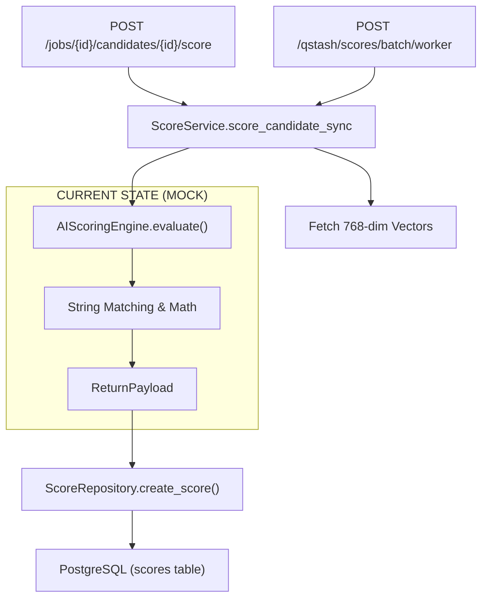

# Phase 8: AI Scoring Architecture Audit Report

## 1. Phase 8 Roadmap Requirements
**Objective:** Implement the core AI feature — scoring candidates against job descriptions using LLM evaluation with structured output.
**Key Features:**
- Score a single candidate synchronously.
- Batch score candidates asynchronously (via QStash).
- Return Score breakdown (skills, experience, education), explanation, confidence, skills gap analysis, and provenance.
- Track score history and manage `is_current` flags.
- Record AI usage telemetry with token breakdowns.

## 2. Existing Implementation Inventory
A significant portion of Phase 8 has been pre-implemented structurally, but the core LLM integration is a mock heuristic.

**Fully Implemented:**
- **Database Layer**: `scores` and `batch_score_jobs` tables are fully migrated and configured with proper constraints. ORM models (`models.py`) are strictly typed.
- **API Endpoints**: All 5 SCORE endpoints (`router.py`) are implemented, enforcing RBAC (`org_admin`, `recruiter`).
- **Data Transfer Objects**: `schemas.py` defines all API request/response payloads (`ScoreResponse`, `BatchScoreResponse`, etc.).
- **Business Logic Orchestration**: `service.py` manages 24h idempotency caching, candidate-job associations, history retrieval, and QStash batch enqueueing.
- **Worker Infrastructure**: QStash Coordinator (`/qstash/scores/batch/coordinator`) and Worker (`/qstash/scores/batch/worker`) endpoints are fully implemented in `webhooks/router.py` with fan-out logic and atomicity.
- **Vector Retrieval**: The engine receives the 768-dimensional candidate and job vectors successfully.

**Missing/Mocked:**
- **AI Scoring Engine**: `apps/api/hiron/scores/engine.py` is entirely heuristic/algorithmic. It constructs the `_llm_messages` array using `PromptBuilder`, but never sends it to an LLM. It calculates scores based on naive exact-string matching.
- **AI Usage Telemetry**: `service.py` and `webhooks/router.py` do NOT record `ai_usage_logs` when a score is generated.
- **Pydantic Validation Model**: `AIGeneratedScore` (designed in the Phase 21 POC to validate Gemini's JSON response) is completely missing from `schemas.py`.

## 3. Architecture Diagram / Current Flow

## 4. Missing Implementation
- **Gemini REST API Integration**: `AIScoringEngine` must be updated to make an `httpx.post` request to `generativelanguage.googleapis.com/v1beta/models/{model}:generateContent`.
- **Structured JSON Schema**: Introduce `AIGeneratedScore` into `schemas.py` and pass it to Gemini via `responseSchema`, or manually validate the returned JSON.
- **Telemetry Integration**: Inject `AIUsageService.record_ai_usage()` into the scoring flow (ideally within `score_candidate_sync` or via the engine payload).

## 5. Dependencies
- **Phase 7 (Complete)**: Depends on 768-dimensional `gemini-embedding-2` vectors.
- **Phase 9**: No direct dependency; Semantic Search operates independently on embeddings.

## 6. Gemini / Provider Requirements (Phase 21 Constraints)
- **Model**: `models/gemini-2.5-flash` (discovered as the functioning model in the POC).
- **Execution**: REST API (`v1beta`) using `generateContent` with `responseMimeType: "application/json"`.
- **Latency**: Must enforce a **7.5-second timeout** on the `httpx.post` request to prevent Vercel Serverless Function timeout limits.
- **Tokens**: `promptTokenCount` maps to `input_tokens`; `candidatesTokenCount` maps to `output_tokens`.

## 7. Database / Schema Requirements
- No database migrations are required. The tables are already correctly defined.

## 8. QStash / Worker Requirements
- Fully implemented. The existing `webhooks/router.py` already handles 429 Quota/5xx retries and terminal failures.

## 9. Telemetry Requirements
- Must record an `AIUsageLog` using `generate_candidate_score` as the operation.
- Token counts and latency must be passed into `record_ai_usage` and committed in the same transaction boundary.

## 10. Failure / Retry Semantics
- **429 / 5xx / Timeout**: Raise `httpx.HTTPStatusError` or `httpx.TimeoutException` so the QStash webhook translates it to HTTP 429/503 for native retry.
- **400 / 401 / 403 / 404 (Terminal)**: Catch and return a terminal failure to QStash (HTTP 200 Ack) to prevent infinite loops.
- **Malformed JSON (ValidationError)**: Catch and return terminal failure to QStash (HTTP 200 Ack).

## 11. Idempotency Strategy
- **24-Hour Cache**: Already implemented in `ScoreService`.
- **Database Writes**: Already implemented via atomic Array updates (`claim_batch_score_worker_success`).

## 12. Security / Tenant Isolation
- **RBAC**: Implemented (only `org_admin` or `recruiter` can score).
- **Tenancy**: Implemented (job, candidate, and score records are all cross-validated against the JWT's `tenant_id`).
- **Prompt Injection Security**: Enforced via `PromptBuilder`.

## 13. Test Coverage
- The module has 90%+ test coverage (`test_scores_api.py`, `test_score_service.py`, `test_scores_coordinator.py`, `test_scores_webhook.py`).
- *Constraint*: These tests currently assert against the heuristic mock engine. When the engine is connected to the real Gemini API, these tests will require `respx` or `unittest.mock` to mock the HTTP responses.

## 14. Production-Readiness Assessment
- The architecture is structurally production-ready. 
- The missing piece is replacing the heuristic mock with the actual Gemini API call and hooking up telemetry. 

## 15. Open Questions / Blockers
- **Telemetry Transaction**: `AIUsageService` functions require `session.commit()`. Since `service.py` is called synchronously by API endpoints and asynchronously by QStash, the telemetry insertion must be attached to the existing `session` before the router/webhook issues the final `commit()`.

## 16. Recommended Smallest Implementation Slice
1. **Schema Update**: Add `AIGeneratedScore` to `schemas.py`.
2. **Engine Update**: Modify `AIScoringEngine.evaluate()` in `engine.py` to call Gemini via `httpx` and validate the JSON.
3. **Telemetry Hook**: Update `score_candidate_sync()` in `service.py` to call `AIUsageService.record_ai_usage()`.
4. **Test Mocks**: Update `test_scoring_engine.py` and `test_score_service.py` to mock `httpx` calls.

## 17. Acceptance Criteria for that Slice
- [ ] Scoring engine calls Gemini REST API (`gemini-2.5-flash`).
- [ ] Returns valid `ScoreData` JSON matching the Pydantic schema.
- [ ] 7.5s `httpx` timeout is enforced.
- [ ] Valid `ai_usage_logs` record is inserted with cost, tokens, and latency.
- [ ] Existing QStash worker and batch coordinator tests pass with the new mocked engine.

## 18. Exact Files That Need Modification
- `apps/api/hiron/scores/schemas.py` (Add `AIGeneratedScore`)
- `apps/api/hiron/scores/engine.py` (Implement Gemini HTTP call)
- `apps/api/hiron/scores/service.py` (Implement telemetry logging)
- `apps/api/tests/test_scoring_engine.py` (Mock HTTP)
- `apps/api/tests/test_score_service.py` (Mock HTTP)
