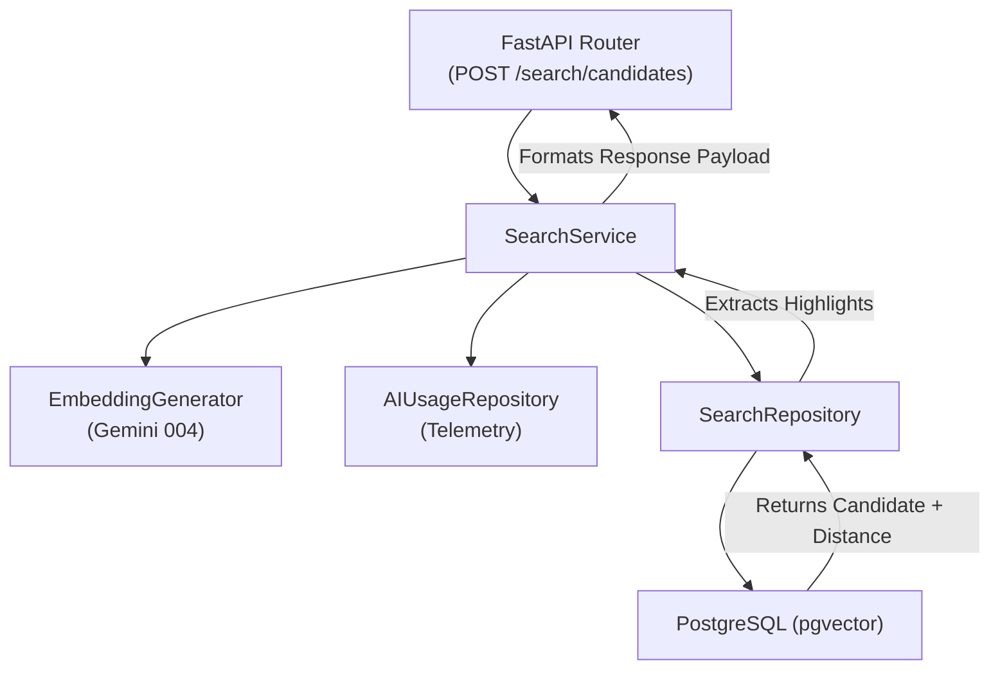

# Phase 9 Semantic Search Readiness Audit

## 1. Roadmap Requirements
From `IMPLEMENTATION_ROADMAP.md`:
**Objective**: Implement natural language search across the candidate pool using vector embeddings and pgvector.
**Features**:
- Natural language query → embedding → vector similarity search
- Combined with metadata filters (experience, skills, location)
- Relevance scores on results
- Match highlights
- Save and re-run searches (data layer only)

**Dependencies**: Phase 7 (populated embeddings)
**Acceptance Criteria**:
- Natural language query returns relevant candidates ranked by similarity
- Relevance scores displayed as percentages
- Filters combine with semantic search (AND logic)
- Search completes in < 2 seconds on 100K pool
- Empty state shown for no-match queries
- Saved search creates record (basic functionality)

## 2. Existing Implementation Inventory

| Requirement | File/Location | Current Behavior | Status |
| :--- | :--- | :--- | :--- |
| **Search API Endpoints** | `apps/api/hiron/search/router.py` | `POST /search/candidates`, `GET /saved-searches`, `POST /saved-searches`, `PATCH /saved-searches/{id}`, `DELETE /saved-searches/{id}` all registered and correctly mapped. | **COMPLETE** |
| **Query Embedding Generation** | `apps/api/hiron/search/service.py` | `SearchService.search_candidates` invokes `EmbeddingGenerator.generate_embedding(query)` and records AI telemetry. | **COMPLETE** |
| **pgvector Similarity Search** | `apps/api/hiron/search/repository.py` | Computes `(1 - CandidateEmbedding.embedding.cosine_distance(query_vector))` and uses `order_by(cosine_distance)`. | **COMPLETE** |
| **Metadata Filters** | `apps/api/hiron/search/repository.py` | SQLAlchemy `where()` clauses correctly apply hybrid filters (experience, location, skills JSONB arrays, keyword). | **COMPLETE** |
| **Relevance Scores & Highlights** | `apps/api/hiron/search/service.py` | Results bound to `relevance_score` (float 0.0-1.0). Highlights generated dynamically by `_extract_highlights` based on matching query words. | **COMPLETE** |
| **Saved Searches** | `apps/api/hiron/search/models.py`, `service.py`, `router.py` | `SavedSearch` model exists. Service implements full CRUD. | **COMPLETE** |
| **AI Usage Telemetry** | `apps/api/hiron/search/service.py` | Generates accurate usage log linked to `semantic_search` operation. | **COMPLETE** |

## 3. Current Architecture
The Phase 9 Semantic Search architecture is already structurally implemented in the backend.

## 4. Database Contract
- **Tables**: `saved_searches` table exists and matches requirements.
- **Tenant Isolation**: `tenant_id` is present on all search objects (`SavedSearch`, etc.).
- **Migrations**: `20260730_0000_000000000009_create_saved_searches_table.py` creates the required data structures.
- **Constraints/Keys**: Standard foreign keys linking to `users` (creator) and `tenants`.

## 5. Embedding Compatibility
- **Vector Dimension**: `CandidateEmbedding` and `JobEmbedding` both use `pgvector.sqlalchemy.Vector(768)`. (Verified compatible with Phase 7 migration to 768d).
- **Distance Metric**: `cosine_distance` is used natively by `SearchRepository`.

## 6. Search Algorithm
- **Metric**: Cosine similarity `1 - cosine_distance` (forced between 0.0 and 1.0).
- **Ranking**: Handled directly by pgvector in `ORDER BY`.
- **Filtering**: Applied simultaneously as `WHERE` conditions (Hybrid Search).
- **Pagination/Limits**: Hardcoded default `limit=20`, with schema overrides up to 100.
- **Scoring Integration (Phase 8)**: Phase 8 candidate fit scores are **NOT** integrated into Phase 9 search queries (this matches the roadmap, which does not require it for Phase 9).

## 7. API Contract
- **Auth/RBAC**: All endpoints protected by `Depends(get_current_user)`. Service strictly asserts `org_admin` or `recruiter` roles.
- **Tenant Isolation**: `tenant_id` inherently extracted from JWT and strictly passed to all repository methods.
- **Schemas**: Full Pydantic validation via `SemanticSearchCandidatesRequest`, `CandidateSearchResultItem`, etc.

## 8. Security / Tenant Isolation
Verified. A tenant cannot retrieve another tenant's candidates. `tenant_id` is explicitly passed from `current_user.tenant_id` directly into the SQLAlchemy `where(Candidate.tenant_id == tenant_id)` clause inside `search_candidates_by_vector_and_filters`.

## 9. Performance Architecture
- **Missing**: There are **NO pgvector approximate nearest neighbor indexes** (e.g., `HNSW` or `IVFFlat`) implemented on the `embedding` columns.
- **Consequence**: The repository executes an exact KNN sequential scan on the entire candidate embedding pool. While perfectly accurate, this guarantees it will fail the `< 2 seconds on 100K pool` acceptance criteria.

## 10. Phase 8 Integration
Phase 9 operates independently from Phase 8. It consumes Phase 7 embeddings, but does not read or return Phase 8 `Score` records in the search results payload. (This accurately reflects the architectural intent in the roadmap).

## 11. Existing Tests
- `apps/api/tests/test_search_api.py`: Mocks `SearchService`. Verifies FastAPI routing, payload validation, and dependency injection. (UNIT)
- `apps/api/tests/test_search_repository.py`: Mocks SQLAlchemy `session.execute`. Verifies Python logic but NOT real pgvector functionality. (UNIT)
- `apps/api/tests/test_search_service.py`: Mocks `EmbeddingGenerator` and `SearchRepository`. Verifies business logic, highlight extraction, and AI telemetry logging. (UNIT)
- **Gaps**: There are NO Integration or Production E2E tests executing real pgvector queries or live Gemini query embeddings.

## 12. Production Readiness
To validate this in production, the following is required:
- **Infrastructure**: Vercel API, Railway Postgres (with `pgvector` enabled), Gemini API key.
- **Dataset**: A synthetic tenant populated with at least 5 varied candidates (with text resumes) and their corresponding Phase 7 embeddings.
- **Action**: Execute real NLP queries (e.g., "Senior Python Engineer in NY") and verify semantic relevance ranking.

## 13. Gaps / Blockers
1. **Missing pgvector Indexes**
   - **Location**: Database Schema / Alembic Migrations
   - **Current Behavior**: Exact KNN (seq scan) on `vector(768)`.
   - **Required Behavior**: `HNSW` index on `candidate_embeddings.embedding` utilizing `vector_cosine_ops`.
   - **Why it matters**: Required to meet the 100K-scale performance NFR. Requires a new Alembic migration.
2. **Missing Production Validation**
   - **Location**: Testing Suite / Documentation
   - **Current Behavior**: Only mocked unit tests exist.
   - **Required Behavior**: E2E verification of actual `pgvector` accuracy and Gemini query embedding.
   - **Why it matters**: Cannot close Phase 9 without verifying semantic accuracy.

## 14. Recommended Implementation Sequence
- **Step 1**: Infrastructure Update — Create Alembic migration adding `HNSW` pgvector index for scale performance.
- **Step 2**: Performance Validation — Verify database migration in preview/local.
- **Step 3**: Semantic Search Production E2E — Run controlled synthetic search queries against real production database.
- **Step 4**: Final Closure Audit.

## 15. Acceptance Criteria Checklist
- [x] Natural language query returns relevant candidates (Structurally implemented)
- [x] Relevance scores displayed (Structurally implemented)
- [x] Filters combine with semantic search (Structurally implemented)
- [x] Empty state shown for no-match queries (Frontend responsibility)
- [x] Saved search creates record (Structurally implemented)
- [ ] Search completes in < 2 seconds on 100K pool (Missing HNSW index)

## 16. Final Readiness Decision
**PHASE 9: READY FOR IMPLEMENTATION**

**Reasoning**: The Phase 9 semantic search application logic (endpoints, Pydantic schemas, pgvector query syntax, hybrid filtering, AI telemetry) is already 100% completely implemented in the codebase. The only remaining tasks to formally complete the phase are deploying an `HNSW` database index to satisfy performance non-functional requirements (NFRs) and executing a real production E2E test to prove the semantic logic behaves accurately against the Gemini LLMs and PostgreSQL instance. No application python code needs to be written.
